# Time Series Forecasting

### Problem Statement: You are an analyst in the IJK shoe company and you are expected to forecast the sales of the pairs of shoes for the upcoming 12 months from where the data ends. The data for the pair of shoe sales have been given to you from January 1980 to July 1995.


```python
#Importing Liabraries
import numpy as np
import pandas as pd
import matplotlib.pyplot as plt

from statsmodels.tsa.seasonal import seasonal_decompose
```


```python
#Load the data
df1 = pd.read_csv('/Users/swanandmarathe/Downloads/Shoesales.csv')
```


```python
df1.head()
```


<div>
<style scoped>
    .dataframe tbody tr th:only-of-type {
        vertical-align: middle;
    }

    .dataframe tbody tr th {
        vertical-align: top;
    }

    .dataframe thead th {
        text-align: right;
    }
</style>
<table border="1" class="dataframe">
  <thead>
    <tr style="text-align: right;">
      <th></th>
      <th>YearMonth</th>
      <th>Shoe_Sales</th>
    </tr>
  </thead>
  <tbody>
    <tr>
      <th>0</th>
      <td>1980-01</td>
      <td>85</td>
    </tr>
    <tr>
      <th>1</th>
      <td>1980-02</td>
      <td>89</td>
    </tr>
    <tr>
      <th>2</th>
      <td>1980-03</td>
      <td>109</td>
    </tr>
    <tr>
      <th>3</th>
      <td>1980-04</td>
      <td>95</td>
    </tr>
    <tr>
      <th>4</th>
      <td>1980-05</td>
      <td>91</td>
    </tr>
  </tbody>
</table>
</div>


```python
df1.isnull().sum()
```


    YearMonth     0
    Shoe_Sales    0
    dtype: int64


```python
df1.dtypes
```


    YearMonth     object
    Shoe_Sales     int64
    dtype: object


```python
df1.info()
```

    <class 'pandas.core.frame.DataFrame'>
    RangeIndex: 187 entries, 0 to 186
    Data columns (total 2 columns):
     #   Column      Non-Null Count  Dtype 
    ---  ------      --------------  ----- 
     0   YearMonth   187 non-null    object
     1   Shoe_Sales  187 non-null    int64 
    dtypes: int64(1), object(1)
    memory usage: 3.0+ KB


```python
#Parse date in YYYY-MM-DD Format
df1 = pd.read_csv('/Users/swanandmarathe/Downloads/Shoesales1.csv', parse_dates = ['YearMonth'], index_col = 'YearMonth')
```


```python
df1.head()
```


<div>
<style scoped>
    .dataframe tbody tr th:only-of-type {
        vertical-align: middle;
    }

    .dataframe tbody tr th {
        vertical-align: top;
    }

    .dataframe thead th {
        text-align: right;
    }
</style>
<table border="1" class="dataframe">
  <thead>
    <tr style="text-align: right;">
      <th></th>
      <th>Shoe_Sales</th>
    </tr>
    <tr>
      <th>YearMonth</th>
      <th></th>
    </tr>
  </thead>
  <tbody>
    <tr>
      <th>1980-01-01</th>
      <td>85</td>
    </tr>
    <tr>
      <th>1980-02-01</th>
      <td>89</td>
    </tr>
    <tr>
      <th>1980-03-01</th>
      <td>109</td>
    </tr>
    <tr>
      <th>1980-04-01</th>
      <td>95</td>
    </tr>
    <tr>
      <th>1980-05-01</th>
      <td>91</td>
    </tr>
  </tbody>
</table>
</div>


```python
df1.tail()
```


<div>
<style scoped>
    .dataframe tbody tr th:only-of-type {
        vertical-align: middle;
    }

    .dataframe tbody tr th {
        vertical-align: top;
    }

    .dataframe thead th {
        text-align: right;
    }
</style>
<table border="1" class="dataframe">
  <thead>
    <tr style="text-align: right;">
      <th></th>
      <th>Shoe_Sales</th>
    </tr>
    <tr>
      <th>YearMonth</th>
      <th></th>
    </tr>
  </thead>
  <tbody>
    <tr>
      <th>1995-03-01</th>
      <td>188</td>
    </tr>
    <tr>
      <th>1995-04-01</th>
      <td>195</td>
    </tr>
    <tr>
      <th>1995-05-01</th>
      <td>189</td>
    </tr>
    <tr>
      <th>1995-06-01</th>
      <td>220</td>
    </tr>
    <tr>
      <th>1995-07-01</th>
      <td>274</td>
    </tr>
  </tbody>
</table>
</div>


### Let's have a look at Pivot table for total sale across the months of years.


```python
yearly_sales_across_months = pd.pivot_table(df1, values = 'Shoe_Sales', columns = df1.index.month, 
                                        index = df1.index.year)

yearly_sales_across_months
```


<div>
<style scoped>
    .dataframe tbody tr th:only-of-type {
        vertical-align: middle;
    }

    .dataframe tbody tr th {
        vertical-align: top;
    }

    .dataframe thead th {
        text-align: right;
    }
</style>
<table border="1" class="dataframe">
  <thead>
    <tr style="text-align: right;">
      <th>YearMonth</th>
      <th>1</th>
      <th>2</th>
      <th>3</th>
      <th>4</th>
      <th>5</th>
      <th>6</th>
      <th>7</th>
      <th>8</th>
      <th>9</th>
      <th>10</th>
      <th>11</th>
      <th>12</th>
    </tr>
    <tr>
      <th>YearMonth</th>
      <th></th>
      <th></th>
      <th></th>
      <th></th>
      <th></th>
      <th></th>
      <th></th>
      <th></th>
      <th></th>
      <th></th>
      <th></th>
      <th></th>
    </tr>
  </thead>
  <tbody>
    <tr>
      <th>1980</th>
      <td>85.0</td>
      <td>89.0</td>
      <td>109.0</td>
      <td>95.0</td>
      <td>91.0</td>
      <td>95.0</td>
      <td>96.0</td>
      <td>128.0</td>
      <td>124.0</td>
      <td>111.0</td>
      <td>178.0</td>
      <td>140.0</td>
    </tr>
    <tr>
      <th>1981</th>
      <td>150.0</td>
      <td>132.0</td>
      <td>155.0</td>
      <td>132.0</td>
      <td>91.0</td>
      <td>94.0</td>
      <td>109.0</td>
      <td>155.0</td>
      <td>123.0</td>
      <td>130.0</td>
      <td>150.0</td>
      <td>163.0</td>
    </tr>
    <tr>
      <th>1982</th>
      <td>101.0</td>
      <td>123.0</td>
      <td>127.0</td>
      <td>112.0</td>
      <td>108.0</td>
      <td>116.0</td>
      <td>153.0</td>
      <td>163.0</td>
      <td>128.0</td>
      <td>142.0</td>
      <td>170.0</td>
      <td>214.0</td>
    </tr>
    <tr>
      <th>1983</th>
      <td>134.0</td>
      <td>122.0</td>
      <td>142.0</td>
      <td>156.0</td>
      <td>145.0</td>
      <td>169.0</td>
      <td>134.0</td>
      <td>165.0</td>
      <td>156.0</td>
      <td>111.0</td>
      <td>165.0</td>
      <td>197.0</td>
    </tr>
    <tr>
      <th>1984</th>
      <td>124.0</td>
      <td>124.0</td>
      <td>139.0</td>
      <td>137.0</td>
      <td>127.0</td>
      <td>134.0</td>
      <td>136.0</td>
      <td>171.0</td>
      <td>112.0</td>
      <td>110.0</td>
      <td>147.0</td>
      <td>196.0</td>
    </tr>
    <tr>
      <th>1985</th>
      <td>112.0</td>
      <td>118.0</td>
      <td>125.0</td>
      <td>122.0</td>
      <td>120.0</td>
      <td>118.0</td>
      <td>281.0</td>
      <td>344.0</td>
      <td>366.0</td>
      <td>362.0</td>
      <td>580.0</td>
      <td>523.0</td>
    </tr>
    <tr>
      <th>1986</th>
      <td>348.0</td>
      <td>246.0</td>
      <td>197.0</td>
      <td>306.0</td>
      <td>279.0</td>
      <td>280.0</td>
      <td>358.0</td>
      <td>431.0</td>
      <td>448.0</td>
      <td>433.0</td>
      <td>504.0</td>
      <td>579.0</td>
    </tr>
    <tr>
      <th>1987</th>
      <td>384.0</td>
      <td>335.0</td>
      <td>320.0</td>
      <td>496.0</td>
      <td>448.0</td>
      <td>377.0</td>
      <td>523.0</td>
      <td>468.0</td>
      <td>428.0</td>
      <td>520.0</td>
      <td>493.0</td>
      <td>662.0</td>
    </tr>
    <tr>
      <th>1988</th>
      <td>304.0</td>
      <td>308.0</td>
      <td>313.0</td>
      <td>328.0</td>
      <td>354.0</td>
      <td>338.0</td>
      <td>483.0</td>
      <td>355.0</td>
      <td>439.0</td>
      <td>290.0</td>
      <td>352.0</td>
      <td>454.0</td>
    </tr>
    <tr>
      <th>1989</th>
      <td>306.0</td>
      <td>303.0</td>
      <td>344.0</td>
      <td>254.0</td>
      <td>309.0</td>
      <td>310.0</td>
      <td>379.0</td>
      <td>294.0</td>
      <td>356.0</td>
      <td>318.0</td>
      <td>405.0</td>
      <td>545.0</td>
    </tr>
    <tr>
      <th>1990</th>
      <td>268.0</td>
      <td>243.0</td>
      <td>273.0</td>
      <td>273.0</td>
      <td>236.0</td>
      <td>222.0</td>
      <td>302.0</td>
      <td>285.0</td>
      <td>309.0</td>
      <td>322.0</td>
      <td>362.0</td>
      <td>471.0</td>
    </tr>
    <tr>
      <th>1991</th>
      <td>198.0</td>
      <td>253.0</td>
      <td>173.0</td>
      <td>186.0</td>
      <td>185.0</td>
      <td>105.0</td>
      <td>228.0</td>
      <td>214.0</td>
      <td>189.0</td>
      <td>270.0</td>
      <td>277.0</td>
      <td>378.0</td>
    </tr>
    <tr>
      <th>1992</th>
      <td>185.0</td>
      <td>182.0</td>
      <td>258.0</td>
      <td>179.0</td>
      <td>197.0</td>
      <td>168.0</td>
      <td>250.0</td>
      <td>211.0</td>
      <td>260.0</td>
      <td>234.0</td>
      <td>305.0</td>
      <td>347.0</td>
    </tr>
    <tr>
      <th>1993</th>
      <td>203.0</td>
      <td>217.0</td>
      <td>227.0</td>
      <td>242.0</td>
      <td>185.0</td>
      <td>175.0</td>
      <td>252.0</td>
      <td>319.0</td>
      <td>202.0</td>
      <td>254.0</td>
      <td>336.0</td>
      <td>431.0</td>
    </tr>
    <tr>
      <th>1994</th>
      <td>150.0</td>
      <td>280.0</td>
      <td>187.0</td>
      <td>279.0</td>
      <td>193.0</td>
      <td>227.0</td>
      <td>225.0</td>
      <td>205.0</td>
      <td>259.0</td>
      <td>254.0</td>
      <td>275.0</td>
      <td>394.0</td>
    </tr>
    <tr>
      <th>1995</th>
      <td>159.0</td>
      <td>230.0</td>
      <td>188.0</td>
      <td>195.0</td>
      <td>189.0</td>
      <td>220.0</td>
      <td>274.0</td>
      <td>NaN</td>
      <td>NaN</td>
      <td>NaN</td>
      <td>NaN</td>
      <td>NaN</td>
    </tr>
  </tbody>
</table>
</div>


```python
fig, ax = plt.subplots(figsize=(22,10))
yearly_sales_across_months.plot(ax=ax)
plt.grid();
```


    
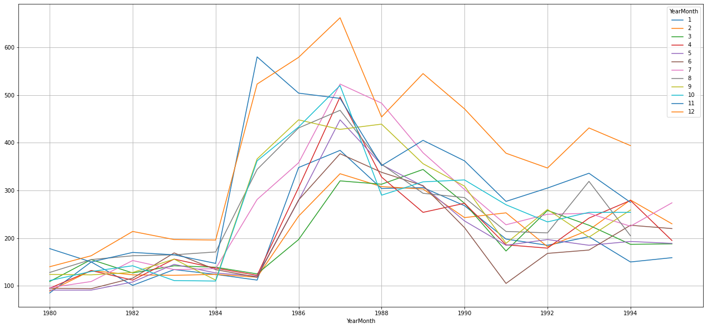
    


### Before heading to forecasting, First we need to check the trend and seasonality.


```python
#Decompose the time series additively
df1_add_decompose = seasonal_decompose(df1, model = 'additive')
```


```python
df1_add_decompose.plot()
plt.show()
```


    
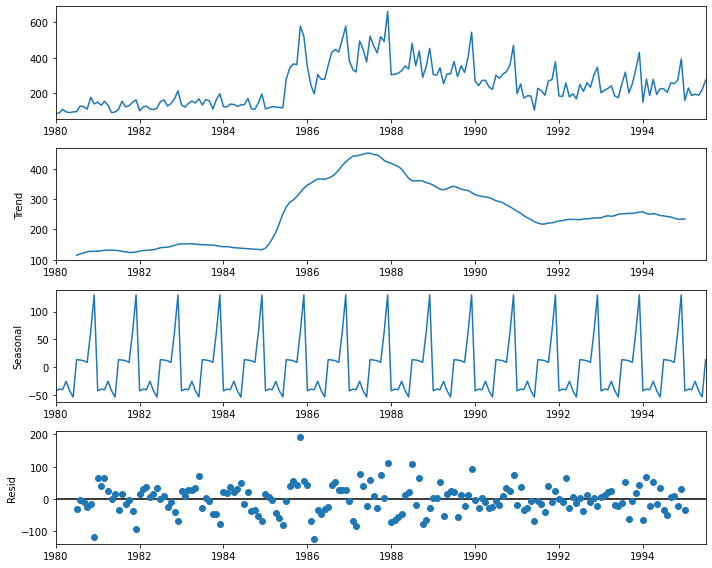
    


```python
##Decompose the time series multiplicatively
df1_mul_decompose = seasonal_decompose(df1, model = "multiplicative")
df1_mul_decompose.plot()
plt.show()
```


    
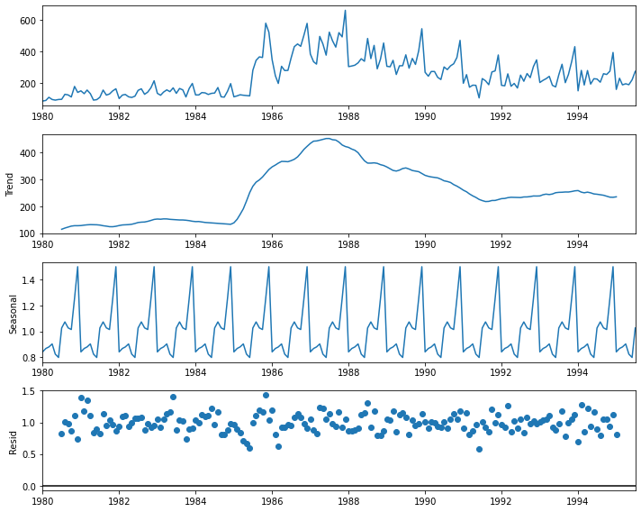
    


### Break the data into train and test datasets.


```python
train             = df1[df1.index<'1991'] 
test              = df1[df1.index>'1991']
```


```python
print('Training Data')
display(train)
print('Test Data')
display(test)
```

    Training Data


<div>
<style scoped>
    .dataframe tbody tr th:only-of-type {
        vertical-align: middle;
    }

    .dataframe tbody tr th {
        vertical-align: top;
    }

    .dataframe thead th {
        text-align: right;
    }
</style>
<table border="1" class="dataframe">
  <thead>
    <tr style="text-align: right;">
      <th></th>
      <th>Shoe_Sales</th>
    </tr>
    <tr>
      <th>YearMonth</th>
      <th></th>
    </tr>
  </thead>
  <tbody>
    <tr>
      <th>1980-01-01</th>
      <td>85</td>
    </tr>
    <tr>
      <th>1980-02-01</th>
      <td>89</td>
    </tr>
    <tr>
      <th>1980-03-01</th>
      <td>109</td>
    </tr>
    <tr>
      <th>1980-04-01</th>
      <td>95</td>
    </tr>
    <tr>
      <th>1980-05-01</th>
      <td>91</td>
    </tr>
    <tr>
      <th>...</th>
      <td>...</td>
    </tr>
    <tr>
      <th>1990-08-01</th>
      <td>285</td>
    </tr>
    <tr>
      <th>1990-09-01</th>
      <td>309</td>
    </tr>
    <tr>
      <th>1990-10-01</th>
      <td>322</td>
    </tr>
    <tr>
      <th>1990-11-01</th>
      <td>362</td>
    </tr>
    <tr>
      <th>1990-12-01</th>
      <td>471</td>
    </tr>
  </tbody>
</table>
<p>132 rows × 1 columns</p>
</div>


    Test Data


<div>
<style scoped>
    .dataframe tbody tr th:only-of-type {
        vertical-align: middle;
    }

    .dataframe tbody tr th {
        vertical-align: top;
    }

    .dataframe thead th {
        text-align: right;
    }
</style>
<table border="1" class="dataframe">
  <thead>
    <tr style="text-align: right;">
      <th></th>
      <th>Shoe_Sales</th>
    </tr>
    <tr>
      <th>YearMonth</th>
      <th></th>
    </tr>
  </thead>
  <tbody>
    <tr>
      <th>1991-02-01</th>
      <td>253</td>
    </tr>
    <tr>
      <th>1991-03-01</th>
      <td>173</td>
    </tr>
    <tr>
      <th>1991-04-01</th>
      <td>186</td>
    </tr>
    <tr>
      <th>1991-05-01</th>
      <td>185</td>
    </tr>
    <tr>
      <th>1991-06-01</th>
      <td>105</td>
    </tr>
    <tr>
      <th>1991-07-01</th>
      <td>228</td>
    </tr>
    <tr>
      <th>1991-08-01</th>
      <td>214</td>
    </tr>
    <tr>
      <th>1991-09-01</th>
      <td>189</td>
    </tr>
    <tr>
      <th>1991-10-01</th>
      <td>270</td>
    </tr>
    <tr>
      <th>1991-11-01</th>
      <td>277</td>
    </tr>
    <tr>
      <th>1991-12-01</th>
      <td>378</td>
    </tr>
    <tr>
      <th>1992-01-01</th>
      <td>185</td>
    </tr>
    <tr>
      <th>1992-02-01</th>
      <td>182</td>
    </tr>
    <tr>
      <th>1992-03-01</th>
      <td>258</td>
    </tr>
    <tr>
      <th>1992-04-01</th>
      <td>179</td>
    </tr>
    <tr>
      <th>1992-05-01</th>
      <td>197</td>
    </tr>
    <tr>
      <th>1992-06-01</th>
      <td>168</td>
    </tr>
    <tr>
      <th>1992-07-01</th>
      <td>250</td>
    </tr>
    <tr>
      <th>1992-08-01</th>
      <td>211</td>
    </tr>
    <tr>
      <th>1992-09-01</th>
      <td>260</td>
    </tr>
    <tr>
      <th>1992-10-01</th>
      <td>234</td>
    </tr>
    <tr>
      <th>1992-11-01</th>
      <td>305</td>
    </tr>
    <tr>
      <th>1992-12-01</th>
      <td>347</td>
    </tr>
    <tr>
      <th>1993-01-01</th>
      <td>203</td>
    </tr>
    <tr>
      <th>1993-02-01</th>
      <td>217</td>
    </tr>
    <tr>
      <th>1993-03-01</th>
      <td>227</td>
    </tr>
    <tr>
      <th>1993-04-01</th>
      <td>242</td>
    </tr>
    <tr>
      <th>1993-05-01</th>
      <td>185</td>
    </tr>
    <tr>
      <th>1993-06-01</th>
      <td>175</td>
    </tr>
    <tr>
      <th>1993-07-01</th>
      <td>252</td>
    </tr>
    <tr>
      <th>1993-08-01</th>
      <td>319</td>
    </tr>
    <tr>
      <th>1993-09-01</th>
      <td>202</td>
    </tr>
    <tr>
      <th>1993-10-01</th>
      <td>254</td>
    </tr>
    <tr>
      <th>1993-11-01</th>
      <td>336</td>
    </tr>
    <tr>
      <th>1993-12-01</th>
      <td>431</td>
    </tr>
    <tr>
      <th>1994-01-01</th>
      <td>150</td>
    </tr>
    <tr>
      <th>1994-02-01</th>
      <td>280</td>
    </tr>
    <tr>
      <th>1994-03-01</th>
      <td>187</td>
    </tr>
    <tr>
      <th>1994-04-01</th>
      <td>279</td>
    </tr>
    <tr>
      <th>1994-05-01</th>
      <td>193</td>
    </tr>
    <tr>
      <th>1994-06-01</th>
      <td>227</td>
    </tr>
    <tr>
      <th>1994-07-01</th>
      <td>225</td>
    </tr>
    <tr>
      <th>1994-08-01</th>
      <td>205</td>
    </tr>
    <tr>
      <th>1994-09-01</th>
      <td>259</td>
    </tr>
    <tr>
      <th>1994-10-01</th>
      <td>254</td>
    </tr>
    <tr>
      <th>1994-11-01</th>
      <td>275</td>
    </tr>
    <tr>
      <th>1994-12-01</th>
      <td>394</td>
    </tr>
    <tr>
      <th>1995-01-01</th>
      <td>159</td>
    </tr>
    <tr>
      <th>1995-02-01</th>
      <td>230</td>
    </tr>
    <tr>
      <th>1995-03-01</th>
      <td>188</td>
    </tr>
    <tr>
      <th>1995-04-01</th>
      <td>195</td>
    </tr>
    <tr>
      <th>1995-05-01</th>
      <td>189</td>
    </tr>
    <tr>
      <th>1995-06-01</th>
      <td>220</td>
    </tr>
    <tr>
      <th>1995-07-01</th>
      <td>274</td>
    </tr>
  </tbody>
</table>
</div>


```python
train.info()
test.info()
```

    <class 'pandas.core.frame.DataFrame'>
    DatetimeIndex: 132 entries, 1980-01-01 to 1990-12-01
    Data columns (total 1 columns):
     #   Column      Non-Null Count  Dtype
    ---  ------      --------------  -----
     0   Shoe_Sales  132 non-null    int64
    dtypes: int64(1)
    memory usage: 2.1 KB
    <class 'pandas.core.frame.DataFrame'>
    DatetimeIndex: 54 entries, 1991-02-01 to 1995-07-01
    Data columns (total 1 columns):
     #   Column      Non-Null Count  Dtype
    ---  ------      --------------  -----
     0   Shoe_Sales  54 non-null     int64
    dtypes: int64(1)
    memory usage: 864.0 bytes


```python
train['Shoe_Sales'].plot(figsize=(13,5), fontsize=14)
test['Shoe_Sales'].plot(figsize=(13,5), fontsize=14)
plt.grid()
plt.legend(['Training Data','Test Data'])
plt.show()
```


    
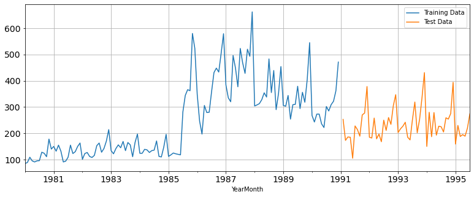
    


### Linear Regression Model


```python
from sklearn.linear_model import LinearRegression
!pip install numpy matplotlib scikit-learn
```

    Requirement already satisfied: numpy in ./opt/anaconda3/lib/python3.9/site-packages (1.21.5)
    Requirement already satisfied: matplotlib in ./opt/anaconda3/lib/python3.9/site-packages (3.5.1)
    Requirement already satisfied: scikit-learn in ./opt/anaconda3/lib/python3.9/site-packages (1.0.2)
    Requirement already satisfied: packaging>=20.0 in ./opt/anaconda3/lib/python3.9/site-packages (from matplotlib) (21.3)
    Requirement already satisfied: cycler>=0.10 in ./opt/anaconda3/lib/python3.9/site-packages (from matplotlib) (0.11.0)
    Requirement already satisfied: kiwisolver>=1.0.1 in ./opt/anaconda3/lib/python3.9/site-packages (from matplotlib) (1.3.2)
    Requirement already satisfied: pyparsing>=2.2.1 in ./opt/anaconda3/lib/python3.9/site-packages (from matplotlib) (3.0.4)
    Requirement already satisfied: fonttools>=4.22.0 in ./opt/anaconda3/lib/python3.9/site-packages (from matplotlib) (4.25.0)
    Requirement already satisfied: pillow>=6.2.0 in ./opt/anaconda3/lib/python3.9/site-packages (from matplotlib) (9.0.1)
    Requirement already satisfied: python-dateutil>=2.7 in ./opt/anaconda3/lib/python3.9/site-packages (from matplotlib) (2.8.2)
    Requirement already satisfied: joblib>=0.11 in ./opt/anaconda3/lib/python3.9/site-packages (from scikit-learn) (1.2.0)
    Requirement already satisfied: threadpoolctl>=2.0.0 in ./opt/anaconda3/lib/python3.9/site-packages (from scikit-learn) (2.2.0)
    Requirement already satisfied: scipy>=1.1.0 in ./opt/anaconda3/lib/python3.9/site-packages (from scikit-learn) (1.7.3)
    Requirement already satisfied: six>=1.5 in ./opt/anaconda3/lib/python3.9/site-packages (from python-dateutil>=2.7->matplotlib) (1.16.0)


```python
train_time = [i+1 for i in range(len(train))]
test_time = [i+133 for i in range(len(test))]
```


```python
train['Time'] = train_time
test['Time'] = test_time
```

    /var/folders/d0/7px_g2bn4_n3k51xjtl4w5jr0000gn/T/ipykernel_57697/555558576.py:1: SettingWithCopyWarning: 
    A value is trying to be set on a copy of a slice from a DataFrame.
    Try using .loc[row_indexer,col_indexer] = value instead
    
    See the caveats in the documentation: https://pandas.pydata.org/pandas-docs/stable/user_guide/indexing.html#returning-a-view-versus-a-copy
      train['Time'] = train_time
    /var/folders/d0/7px_g2bn4_n3k51xjtl4w5jr0000gn/T/ipykernel_57697/555558576.py:2: SettingWithCopyWarning: 
    A value is trying to be set on a copy of a slice from a DataFrame.
    Try using .loc[row_indexer,col_indexer] = value instead
    
    See the caveats in the documentation: https://pandas.pydata.org/pandas-docs/stable/user_guide/indexing.html#returning-a-view-versus-a-copy
      test['Time'] = test_time


```python
X_train = train[['Time']]
y_train = train['Shoe_Sales']
X_test = test[['Time']]
y_test = test['Shoe_Sales']
```


```python
model = LinearRegression()
model.fit(X_train, y_train)
```


    LinearRegression()


```python
y_pred = model.predict(X_test)
```


```python
from sklearn.metrics import mean_squared_error
rmse = mean_squared_error(test['Shoe_Sales'], y_pred, squared=False)
print('RMSE:', rmse)
```

    RMSE: 264.51679449469304


```python
train_dates = pd.to_datetime(train.index)
plt.plot(train_dates, train['Shoe_Sales'], label='Train')
test_dates = pd.to_datetime(test.index)
plt.plot(test_dates, test['Shoe_Sales'], label='Test')
plt.plot(test_dates, y_pred, label='Predicted')
plt.xlabel('YearMonth')
plt.ylabel('Shoe_Sales')
plt.title('Test vs Predicted Shoe Sales')
plt.legend()
plt.show()
```


    
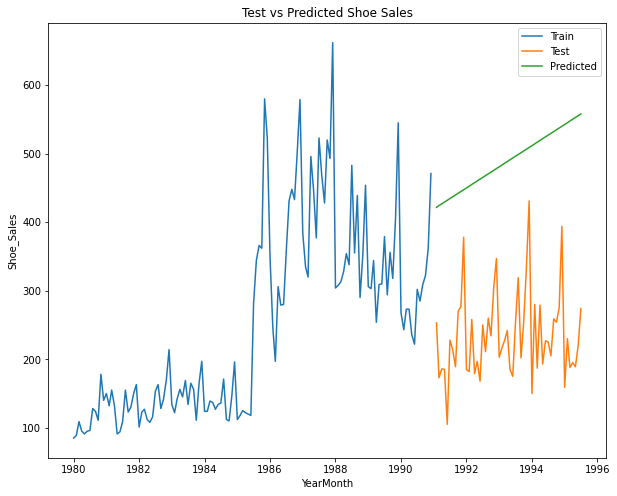
    


### Above models predicts the trend of sales.

### Naive Forecast


```python
y_naive = np.array([train.iloc[-1]['Shoe_Sales']] * len(test))
naive_rmse = mean_squared_error(test['Shoe_Sales'], y_naive, squared=False)
print("Naive Forecast RMSE:", naive_rmse)
```

    Naive Forecast RMSE: 244.57506611051537


```python
train_dates = pd.to_datetime(train.index)
plt.plot(train_dates, train['Shoe_Sales'], label='Train')
plt.plot(test.index, test['Shoe_Sales'], label='Actual')
plt.plot(test.index, y_naive, label='Naive Forecast')
plt.xlabel('Time')
plt.ylabel('Shoe_sales')
plt.title('Actual vs Predicted Shoe Sales')
plt.legend()
plt.show()
```


    

    


### Above Model Predicts the seasonality of Sales

### Lets perform the smoothening techniques to reduce Noise and enhance forecasting accuracy.

### Simple Average Smoothening


```python
train_mean = train['Shoe_Sales'].mean()
y_pred = [train_mean] * len(test)
rmse = mean_squared_error(test['Shoe_Sales'], y_pred, squared=False)
print(f"RMSE: {rmse}")
```

    RMSE: 64.17671978300159


```python
train_dates = pd.to_datetime(train.index)
plt.plot(train_dates, train['Shoe_Sales'], label='Train')
plt.plot(test.index, test['Shoe_Sales'], label='Actual')
plt.plot(test.index, y_pred, label='Predicted')
plt.xlabel('YearMonth')
plt.ylabel('Shoe_sales')
plt.title('Actual vs Predicted Shoe Sales')
plt.legend()
plt.show()
```


    
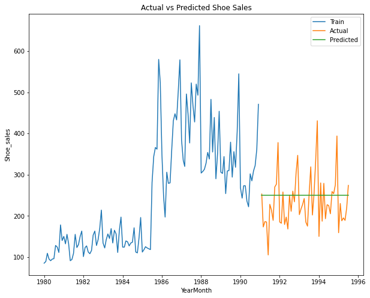
    


### Simple Exponential Smoothening


```python
import statsmodels.tools.eval_measures as      em
from   sklearn.metrics                 import  mean_squared_error
from   statsmodels.tsa.api             import ExponentialSmoothing, SimpleExpSmoothing, Holt
from   IPython.display                 import display
from   pylab                           import rcParams
```


```python
train             = df1[df1.index<'1991'] 
test              = df1[df1.index>'1991']
```


```python
# create class
model_SES = SimpleExpSmoothing(train,initialization_method='estimated')
```

    /Users/swanandmarathe/opt/anaconda3/lib/python3.9/site-packages/statsmodels/tsa/base/tsa_model.py:471: ValueWarning: No frequency information was provided, so inferred frequency MS will be used.
      self._init_dates(dates, freq)


```python
model_SES_autofit = model_SES.fit(optimized=True)
```


```python
model_SES_autofit.params
```


    {'smoothing_level': 0.6050492326837619,
     'smoothing_trend': nan,
     'smoothing_seasonal': nan,
     'damping_trend': nan,
     'initial_level': 88.82984937541246,
     'initial_trend': nan,
     'initial_seasons': array([], dtype=float64),
     'use_boxcox': False,
     'lamda': None,
     'remove_bias': False}


```python
SES_predict = model_SES_autofit.forecast(steps=len(test))
SES_predict
```


    1991-01-01    420.229858
    1991-02-01    420.229858
    1991-03-01    420.229858
    1991-04-01    420.229858
    1991-05-01    420.229858
    1991-06-01    420.229858
    1991-07-01    420.229858
    1991-08-01    420.229858
    1991-09-01    420.229858
    1991-10-01    420.229858
    1991-11-01    420.229858
    1991-12-01    420.229858
    1992-01-01    420.229858
    1992-02-01    420.229858
    1992-03-01    420.229858
    1992-04-01    420.229858
    1992-05-01    420.229858
    1992-06-01    420.229858
    1992-07-01    420.229858
    1992-08-01    420.229858
    1992-09-01    420.229858
    1992-10-01    420.229858
    1992-11-01    420.229858
    1992-12-01    420.229858
    1993-01-01    420.229858
    1993-02-01    420.229858
    1993-03-01    420.229858
    1993-04-01    420.229858
    1993-05-01    420.229858
    1993-06-01    420.229858
    1993-07-01    420.229858
    1993-08-01    420.229858
    1993-09-01    420.229858
    1993-10-01    420.229858
    1993-11-01    420.229858
    1993-12-01    420.229858
    1994-01-01    420.229858
    1994-02-01    420.229858
    1994-03-01    420.229858
    1994-04-01    420.229858
    1994-05-01    420.229858
    1994-06-01    420.229858
    1994-07-01    420.229858
    1994-08-01    420.229858
    1994-09-01    420.229858
    1994-10-01    420.229858
    1994-11-01    420.229858
    1994-12-01    420.229858
    1995-01-01    420.229858
    1995-02-01    420.229858
    1995-03-01    420.229858
    1995-04-01    420.229858
    1995-05-01    420.229858
    1995-06-01    420.229858
    Freq: MS, dtype: float64


```python
plt.plot(train, label='Train')
plt.plot(test, label='Test')

plt.plot(SES_predict, label='Alpha =0.6 Simple Exponential Smoothing predictions on Test Set')

plt.legend(loc='best')
plt.grid()
plt.title('Alpha = 0.6 Predictions');
```


    
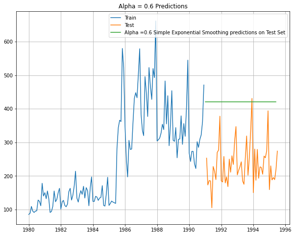
    


```python
print('SES RMSE:',mean_squared_error(test.values,SES_predict.values,squared=False))
```

    SES RMSE: 195.89449221296132


### Double Exponential Smoothing


```python
# Initializing the Double Exponential Smoothing Model
model_DES = Holt(train,initialization_method='estimated')
# Fitting the model
model_DES = model_DES.fit()

print('')
print('==Holt model Exponential Smoothing Estimated Parameters ==')
print('')
print(model_DES.params)
```

    
    ==Holt model Exponential Smoothing Estimated Parameters ==
    
    {'smoothing_level': 0.5944005376702972, 'smoothing_trend': 0.00027974296093176854, 'smoothing_seasonal': nan, 'damping_trend': nan, 'initial_level': 82.93344201266473, 'initial_trend': 3.306823239177916, 'initial_seasons': array([], dtype=float64), 'use_boxcox': False, 'lamda': None, 'remove_bias': False}


    /Users/swanandmarathe/opt/anaconda3/lib/python3.9/site-packages/statsmodels/tsa/base/tsa_model.py:471: ValueWarning: No frequency information was provided, so inferred frequency MS will be used.
      self._init_dates(dates, freq)


```python
# Forecasting using this model for the duration of the test set
DES_predict =  model_DES.forecast(len(test))
DES_predict
```


    1991-01-01    424.077851
    1991-02-01    427.357602
    1991-03-01    430.637352
    1991-04-01    433.917103
    1991-05-01    437.196854
    1991-06-01    440.476605
    1991-07-01    443.756356
    1991-08-01    447.036107
    1991-09-01    450.315858
    1991-10-01    453.595609
    1991-11-01    456.875360
    1991-12-01    460.155111
    1992-01-01    463.434862
    1992-02-01    466.714613
    1992-03-01    469.994364
    1992-04-01    473.274115
    1992-05-01    476.553866
    1992-06-01    479.833617
    1992-07-01    483.113368
    1992-08-01    486.393119
    1992-09-01    489.672870
    1992-10-01    492.952621
    1992-11-01    496.232372
    1992-12-01    499.512123
    1993-01-01    502.791874
    1993-02-01    506.071625
    1993-03-01    509.351376
    1993-04-01    512.631127
    1993-05-01    515.910878
    1993-06-01    519.190629
    1993-07-01    522.470380
    1993-08-01    525.750131
    1993-09-01    529.029882
    1993-10-01    532.309633
    1993-11-01    535.589384
    1993-12-01    538.869135
    1994-01-01    542.148886
    1994-02-01    545.428637
    1994-03-01    548.708388
    1994-04-01    551.988139
    1994-05-01    555.267890
    1994-06-01    558.547641
    1994-07-01    561.827392
    1994-08-01    565.107143
    1994-09-01    568.386894
    1994-10-01    571.666645
    1994-11-01    574.946396
    1994-12-01    578.226147
    1995-01-01    581.505898
    1995-02-01    584.785649
    1995-03-01    588.065400
    1995-04-01    591.345150
    1995-05-01    594.624901
    1995-06-01    597.904652
    Freq: MS, dtype: float64


```python
## Plotting the Training data, Test data and the forecasted values

plt.plot(train, label='Train')
plt.plot(test, label='Test')

plt.plot(SES_predict, label='Alpha=0.6:Simple Exponential Smoothing predictions on Test Set')
plt.plot(DES_predict, label='Alpha=0.59,Beta=0.00028:Double Exponential Smoothing predictions on Test Set')

plt.legend(loc='best')
plt.grid()
plt.title('Simple and Double Exponential Smoothing Predictions');
```


    
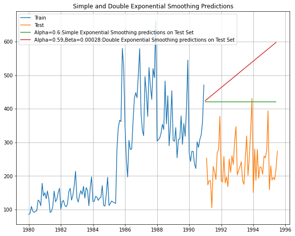
    


```python
print('DES RMSE:',mean_squared_error(test.values,DES_predict.values,squared=False))
```

    DES RMSE: 286.4090482471201


### Triple Exponential Smoothening using Holt Winter's linear method with additive errors


```python
model_TES = ExponentialSmoothing(train,trend='additive',seasonal='additive',initialization_method='estimated')
# Fitting the model
model_TES = model_TES.fit()

print('')
print('==Holt Winters model Exponential Smoothing Estimated Parameters ==')
print('')
print(model_TES.params)
```

    
    ==Holt Winters model Exponential Smoothing Estimated Parameters ==
    
    {'smoothing_level': 0.5707142857142857, 'smoothing_trend': 0.0001, 'smoothing_seasonal': 0.29372180451127816, 'damping_trend': nan, 'initial_level': 116.47499999999994, 'initial_trend': 1.6939393939394014, 'initial_seasons': array([-11.20138889, -14.06597222,   1.11111111,  -5.25347222,
           -21.42013889, -11.18055556, -10.83680556,  18.14236111,
            -2.53472222, -12.53472222,  28.90277778,  40.87152778]), 'use_boxcox': False, 'lamda': None, 'remove_bias': False}


    /Users/swanandmarathe/opt/anaconda3/lib/python3.9/site-packages/statsmodels/tsa/base/tsa_model.py:471: ValueWarning: No frequency information was provided, so inferred frequency MS will be used.
      self._init_dates(dates, freq)


```python
# Forecasting using this model for the duration of the test set
TES_predict =  model_TES.forecast(len(test))
TES_predict
```


    1991-01-01    219.083658
    1991-02-01    213.816321
    1991-03-01    246.658224
    1991-04-01    267.260236
    1991-05-01    287.719744
    1991-06-01    286.532259
    1991-07-01    380.493545
    1991-08-01    339.555860
    1991-09-01    372.342545
    1991-10-01    344.012031
    1991-11-01    392.660570
    1991-12-01    483.619562
    1992-01-01    239.374793
    1992-02-01    234.107456
    1992-03-01    266.949358
    1992-04-01    287.551371
    1992-05-01    308.010879
    1992-06-01    306.823393
    1992-07-01    400.784679
    1992-08-01    359.846995
    1992-09-01    392.633680
    1992-10-01    364.303165
    1992-11-01    412.951705
    1992-12-01    503.910697
    1993-01-01    259.665928
    1993-02-01    254.398590
    1993-03-01    287.240493
    1993-04-01    307.842506
    1993-05-01    328.302014
    1993-06-01    327.114528
    1993-07-01    421.075814
    1993-08-01    380.138129
    1993-09-01    412.924815
    1993-10-01    384.594300
    1993-11-01    433.242840
    1993-12-01    524.201832
    1994-01-01    279.957063
    1994-02-01    274.689725
    1994-03-01    307.531628
    1994-04-01    328.133640
    1994-05-01    348.593148
    1994-06-01    347.405663
    1994-07-01    441.366949
    1994-08-01    400.429264
    1994-09-01    433.215949
    1994-10-01    404.885435
    1994-11-01    453.533974
    1994-12-01    544.492967
    1995-01-01    300.248197
    1995-02-01    294.980860
    1995-03-01    327.822762
    1995-04-01    348.424775
    1995-05-01    368.884283
    1995-06-01    367.696797
    Freq: MS, dtype: float64


```python
## Plotting the Training data, Test data and the forecasted values

plt.plot(train, label='Train')
plt.plot(test, label='Test')

plt.plot(SES_predict, label='Alpha=0.6:Simple Exponential Smoothing predictions on Test Set')
plt.plot(DES_predict, label='Alpha=0.59,Beta=0.00028:Double Exponential Smoothing predictions on Test Set')
plt.plot(TES_predict, label='Alpha=0.57,Beta=0.0,Gamma=0.3:Triple Exponential Smoothing predictions(Additive) on Test Set')

plt.legend(loc='best')
plt.grid()
plt.title('Simple,Double and Triple Exponential Smoothing Predictions');
```


    
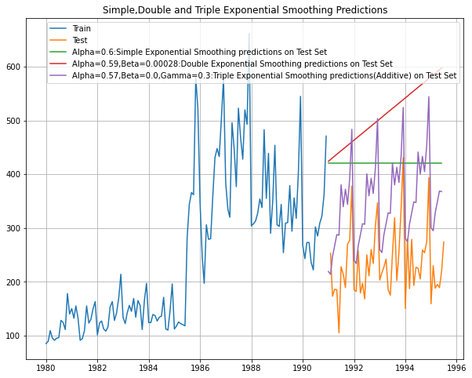
    


```python
print('TES RMSE:',mean_squared_error(test.values,TES_predict.values,squared=False))
```

    TES RMSE: 142.69827463627703


### Triple Exponential Smoothening using Multiplicative Model


```python
model_TES_am = ExponentialSmoothing(train,trend='add',seasonal='multiplicative',initialization_method='estimated')
# Fitting the model
model_TES_am = model_TES_am.fit()

print('')
print('==Holt Winters model Exponential Smoothing Estimated Parameters ==')
print('')
print(model_TES_am.params)
```

    
    ==Holt Winters model Exponential Smoothing Estimated Parameters ==
    
    {'smoothing_level': 0.5760758722416331, 'smoothing_trend': 0.00020158222674751197, 'smoothing_seasonal': 0.19824618620522388, 'damping_trend': nan, 'initial_level': 115.41068444621222, 'initial_trend': 0.2516415654000806, 'initial_seasons': array([1.07646256, 1.03143855, 1.25089992, 1.4385812 , 1.33081085,
           1.10018363, 1.20865787, 1.51191258, 1.75044286, 1.4767594 ,
           1.77782552, 1.96556386]), 'use_boxcox': False, 'lamda': None, 'remove_bias': False}


    /Users/swanandmarathe/opt/anaconda3/lib/python3.9/site-packages/statsmodels/tsa/base/tsa_model.py:471: ValueWarning: No frequency information was provided, so inferred frequency MS will be used.
      self._init_dates(dates, freq)


```python
TES_predict_am =  model_TES_am.forecast(len(test))
TES_predict_am
```


    1991-01-01    261.748076
    1991-02-01    243.581488
    1991-03-01    257.762317
    1991-04-01    271.961576
    1991-05-01    269.017988
    1991-06-01    258.639916
    1991-07-01    341.532999
    1991-08-01    318.156470
    1991-09-01    342.614044
    1991-10-01    317.202701
    1991-11-01    379.361339
    1991-12-01    470.201904
    1992-01-01    265.629417
    1992-02-01    247.188988
    1992-03-01    261.575132
    1992-04-01    275.979474
    1992-05-01    272.987511
    1992-06-01    262.451617
    1992-07-01    346.560162
    1992-08-01    322.833807
    1992-09-01    347.644777
    1992-10-01    321.854617
    1992-11-01    384.918049
    1992-12-01    477.080807
    1993-01-01    269.510759
    1993-02-01    250.796488
    1993-03-01    265.387947
    1993-04-01    279.997372
    1993-05-01    276.957034
    1993-06-01    266.263318
    1993-07-01    351.587325
    1993-08-01    327.511144
    1993-09-01    352.675511
    1993-10-01    326.506534
    1993-11-01    390.474758
    1993-12-01    483.959711
    1994-01-01    273.392100
    1994-02-01    254.403987
    1994-03-01    269.200763
    1994-04-01    284.015270
    1994-05-01    280.926557
    1994-06-01    270.075020
    1994-07-01    356.614487
    1994-08-01    332.188480
    1994-09-01    357.706244
    1994-10-01    331.158451
    1994-11-01    396.031468
    1994-12-01    490.838614
    1995-01-01    277.273442
    1995-02-01    258.011487
    1995-03-01    273.013578
    1995-04-01    288.033168
    1995-05-01    284.896080
    1995-06-01    273.886721
    Freq: MS, dtype: float64


### Following plot shows result of all the Smoothening Models.


```python
## Plotting the Training data, Test data and the forecasted values

plt.plot(train, label='Train')
plt.plot(test, label='Test')

plt.plot(SES_predict, label='Alpha=0.6:Simple Exponential Smoothing predictions on Test Set')
plt.plot(DES_predict, label='Alpha=0.59,Beta=0.00028:Double Exponential Smoothing predictions on Test Set')
plt.plot(TES_predict, label='Alpha=0.57,Beta=0.0,Gamma=0.3:Triple Exponential Smoothing predictions(Additive) on Test Set')
plt.plot(TES_predict_am, label='Alpha=0.57,Beta=0.0002,Gamma=0.19:Triple Exponential Smoothing predictions(Multicative) on Test Set')

plt.legend(loc='best')
plt.grid()
plt.title('Simple,Double and Triple Exponential Smoothing Predictions');
```


    
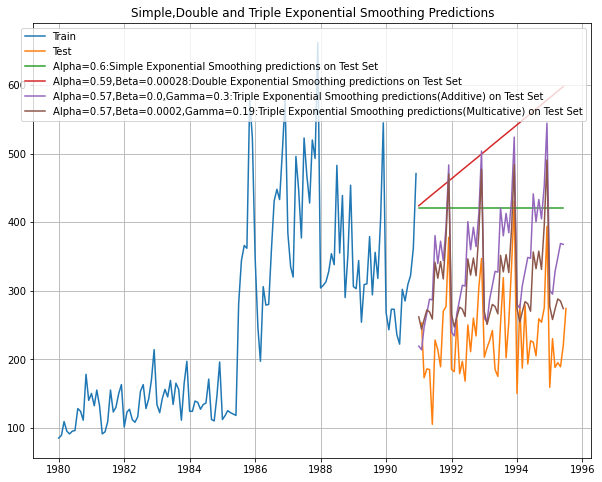
    


```python
print('TES_am RMSE :',mean_squared_error(test.values,TES_predict_am.values,squared=False))
```

    TES_am RMSE : 111.47523803794569


```python

```

### Problem Statement: You are an analyst in the RST soft drink company and you are expected to forecast the sales of the production of the soft drink for the upcoming 12 months from where the data ends. The data for the production of soft drink has been given to you from January 1980 to July 1995.


```python
#Load the Data
df2 = df1 = pd.read_csv('/Users/swanandmarathe/Downloads/SoftDrink.csv', parse_dates = ['YearMonth'], index_col = 'YearMonth')
```


```python
df2.head()
```


<div>
<style scoped>
    .dataframe tbody tr th:only-of-type {
        vertical-align: middle;
    }

    .dataframe tbody tr th {
        vertical-align: top;
    }

    .dataframe thead th {
        text-align: right;
    }
</style>
<table border="1" class="dataframe">
  <thead>
    <tr style="text-align: right;">
      <th></th>
      <th>SoftDrinkProduction</th>
    </tr>
    <tr>
      <th>YearMonth</th>
      <th></th>
    </tr>
  </thead>
  <tbody>
    <tr>
      <th>1980-01-01</th>
      <td>1954</td>
    </tr>
    <tr>
      <th>1980-02-01</th>
      <td>2302</td>
    </tr>
    <tr>
      <th>1980-03-01</th>
      <td>3054</td>
    </tr>
    <tr>
      <th>1980-04-01</th>
      <td>2414</td>
    </tr>
    <tr>
      <th>1980-05-01</th>
      <td>2226</td>
    </tr>
  </tbody>
</table>
</div>


```python
from pylab import rcParams
rcParams['figure.figsize'] = 20,8
```


```python
df2.plot()
plt.grid();
```


    
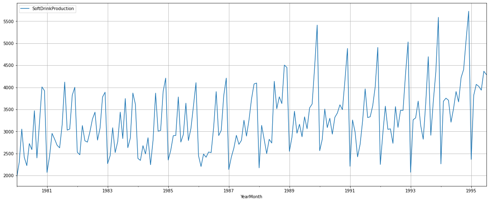
    


### Let us first run stationarity test on time series to understand the trend and seasonality.


```python
from statsmodels.tsa.stattools import adfuller
def test_stationarity(timeseries):
    
    #Determing rolling statistics
    rolmean = timeseries.rolling(window=7).mean() #determining the rolling mean
    rolstd = timeseries.rolling(window=7).std()   #determining the rolling standard deviation

    #Plot rolling statistics:
    orig = plt.plot(timeseries, color='blue',label='Original')
    mean = plt.plot(rolmean, color='red', label='Rolling Mean')
    std = plt.plot(rolstd, color='black', label = 'Rolling Std')
    plt.legend(loc='best')
    plt.title('Rolling Mean & Standard Deviation')
    plt.show(block=False) ## You plot will stay open - will be seen always
    
    #Perform Dickey-Fuller test:
    print ('Results of Dickey-Fuller Test:')
    dftest = adfuller(timeseries, autolag='AIC')
    dfoutput = pd.Series(dftest[0:4], index=['Test Statistic','p-value','#Lags Used','Number of Observations Used'])
    for key,value in dftest[4].items():
        dfoutput['Critical Value (%s)'%key] = value
    print (dfoutput,'\n')
```


```python
test_stationarity(df2['SoftDrinkProduction'])
```


    
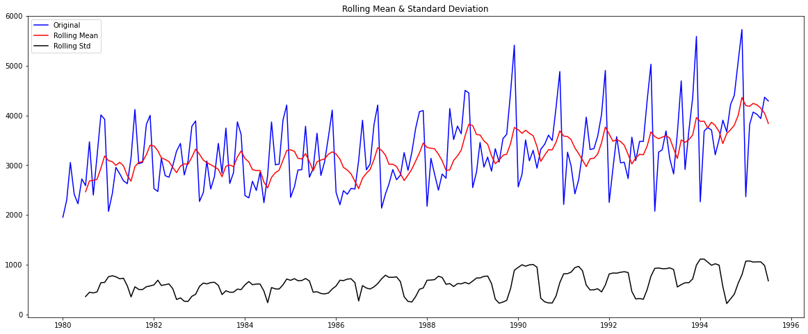
    


    Results of Dickey-Fuller Test:
    Test Statistic                   1.098734
    p-value                          0.995206
    #Lags Used                      12.000000
    Number of Observations Used    174.000000
    Critical Value (1%)             -3.468502
    Critical Value (5%)             -2.878298
    Critical Value (10%)            -2.575704
    dtype: float64 
    


```python
test_stationarity(df2['SoftDrinkProduction'].diff().dropna())
```


    
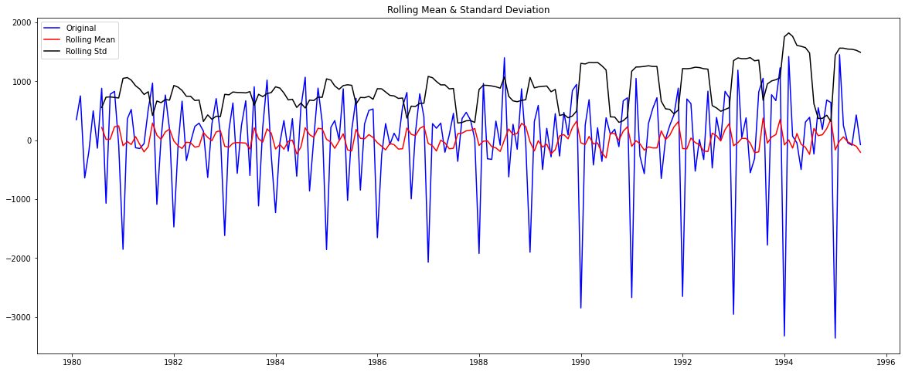
    


    Results of Dickey-Fuller Test:
    Test Statistic                -9.313527e+00
    p-value                        1.033701e-15
    #Lags Used                     1.100000e+01
    Number of Observations Used    1.740000e+02
    Critical Value (1%)           -3.468502e+00
    Critical Value (5%)           -2.878298e+00
    Critical Value (10%)          -2.575704e+00
    dtype: float64 
    


### Before heading to forecasting, We need to run autocorrelation.


```python
from statsmodels.graphics.tsaplots import plot_acf, plot_pacf
```


```python
plot_acf(df2['SoftDrinkProduction'],lags=50)
plot_acf(df2['SoftDrinkProduction'].diff().dropna(),lags=50,title='Differenced Data Autocorrelation')
plt.show()
```


    
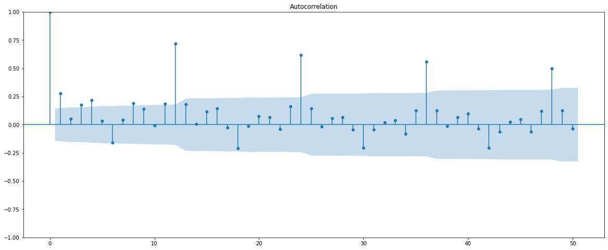
    


    
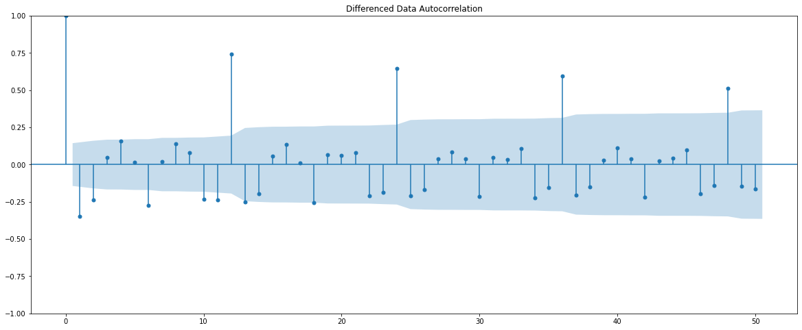
    


```python
plot_pacf(df2['SoftDrinkProduction'],lags=50)
plot_pacf(df2['SoftDrinkProduction'].diff().dropna(),lags=50,title='Differenced Data Partial Autocorrelation')
plt.show()
```

    /Users/swanandmarathe/opt/anaconda3/lib/python3.9/site-packages/statsmodels/graphics/tsaplots.py:348: FutureWarning: The default method 'yw' can produce PACF values outside of the [-1,1] interval. After 0.13, the default will change tounadjusted Yule-Walker ('ywm'). You can use this method now by setting method='ywm'.
      warnings.warn(
    /Users/swanandmarathe/opt/anaconda3/lib/python3.9/site-packages/statsmodels/graphics/tsaplots.py:348: FutureWarning: The default method 'yw' can produce PACF values outside of the [-1,1] interval. After 0.13, the default will change tounadjusted Yule-Walker ('ywm'). You can use this method now by setting method='ywm'.
      warnings.warn(


    
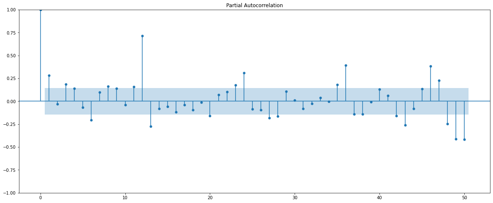
    


    
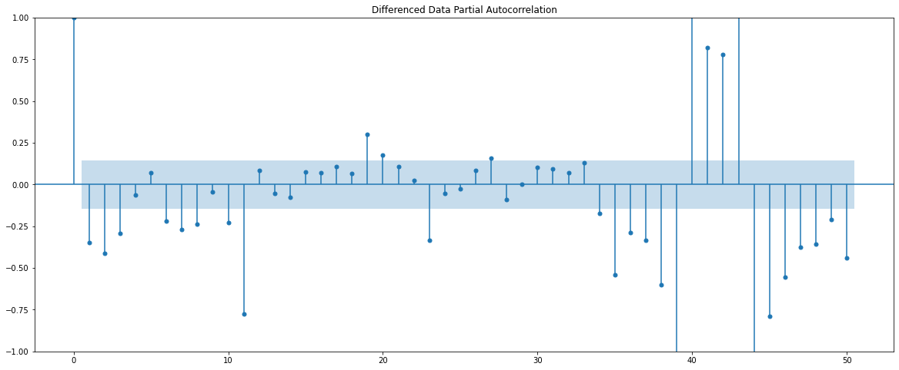
    


### Lets divide data into train and test datasets.


```python
df2.index.year.unique()
```


    Int64Index([1980, 1981, 1982, 1983, 1984, 1985, 1986, 1987, 1988, 1989, 1990,
                1991, 1992, 1993, 1994, 1995],
               dtype='int64', name='YearMonth')


```python
train=df2[df2.index.year < 1993]
test=df2[df2.index.year >= 1993]
```


```python
from IPython.display import display
```


```python
print('First few rows of Training Data')
display(train.head())
print('Last few rows of Training Data')
display(train.tail())
print('First few rows of Test Data')
display(test.head())
print('Last few rows of Test Data')
display(test.tail())
```

    First few rows of Training Data


<div>
<style scoped>
    .dataframe tbody tr th:only-of-type {
        vertical-align: middle;
    }

    .dataframe tbody tr th {
        vertical-align: top;
    }

    .dataframe thead th {
        text-align: right;
    }
</style>
<table border="1" class="dataframe">
  <thead>
    <tr style="text-align: right;">
      <th></th>
      <th>SoftDrinkProduction</th>
    </tr>
    <tr>
      <th>YearMonth</th>
      <th></th>
    </tr>
  </thead>
  <tbody>
    <tr>
      <th>1980-01-01</th>
      <td>1954</td>
    </tr>
    <tr>
      <th>1980-02-01</th>
      <td>2302</td>
    </tr>
    <tr>
      <th>1980-03-01</th>
      <td>3054</td>
    </tr>
    <tr>
      <th>1980-04-01</th>
      <td>2414</td>
    </tr>
    <tr>
      <th>1980-05-01</th>
      <td>2226</td>
    </tr>
  </tbody>
</table>
</div>


    Last few rows of Training Data


<div>
<style scoped>
    .dataframe tbody tr th:only-of-type {
        vertical-align: middle;
    }

    .dataframe tbody tr th {
        vertical-align: top;
    }

    .dataframe thead th {
        text-align: right;
    }
</style>
<table border="1" class="dataframe">
  <thead>
    <tr style="text-align: right;">
      <th></th>
      <th>SoftDrinkProduction</th>
    </tr>
    <tr>
      <th>YearMonth</th>
      <th></th>
    </tr>
  </thead>
  <tbody>
    <tr>
      <th>1992-08-01</th>
      <td>3092</td>
    </tr>
    <tr>
      <th>1992-09-01</th>
      <td>3478</td>
    </tr>
    <tr>
      <th>1992-10-01</th>
      <td>3478</td>
    </tr>
    <tr>
      <th>1992-11-01</th>
      <td>4308</td>
    </tr>
    <tr>
      <th>1992-12-01</th>
      <td>5029</td>
    </tr>
  </tbody>
</table>
</div>


    First few rows of Test Data


<div>
<style scoped>
    .dataframe tbody tr th:only-of-type {
        vertical-align: middle;
    }

    .dataframe tbody tr th {
        vertical-align: top;
    }

    .dataframe thead th {
        text-align: right;
    }
</style>
<table border="1" class="dataframe">
  <thead>
    <tr style="text-align: right;">
      <th></th>
      <th>SoftDrinkProduction</th>
    </tr>
    <tr>
      <th>YearMonth</th>
      <th></th>
    </tr>
  </thead>
  <tbody>
    <tr>
      <th>1993-01-01</th>
      <td>2075</td>
    </tr>
    <tr>
      <th>1993-02-01</th>
      <td>3264</td>
    </tr>
    <tr>
      <th>1993-03-01</th>
      <td>3308</td>
    </tr>
    <tr>
      <th>1993-04-01</th>
      <td>3688</td>
    </tr>
    <tr>
      <th>1993-05-01</th>
      <td>3136</td>
    </tr>
  </tbody>
</table>
</div>


    Last few rows of Test Data


<div>
<style scoped>
    .dataframe tbody tr th:only-of-type {
        vertical-align: middle;
    }

    .dataframe tbody tr th {
        vertical-align: top;
    }

    .dataframe thead th {
        text-align: right;
    }
</style>
<table border="1" class="dataframe">
  <thead>
    <tr style="text-align: right;">
      <th></th>
      <th>SoftDrinkProduction</th>
    </tr>
    <tr>
      <th>YearMonth</th>
      <th></th>
    </tr>
  </thead>
  <tbody>
    <tr>
      <th>1995-03-01</th>
      <td>4067</td>
    </tr>
    <tr>
      <th>1995-04-01</th>
      <td>4022</td>
    </tr>
    <tr>
      <th>1995-05-01</th>
      <td>3937</td>
    </tr>
    <tr>
      <th>1995-06-01</th>
      <td>4365</td>
    </tr>
    <tr>
      <th>1995-07-01</th>
      <td>4290</td>
    </tr>
  </tbody>
</table>
</div>


```python
print(train.shape)
print(test.shape)
```

    (156, 1)
    (31, 1)


```python
test_stationarity(train['SoftDrinkProduction'])
```


    
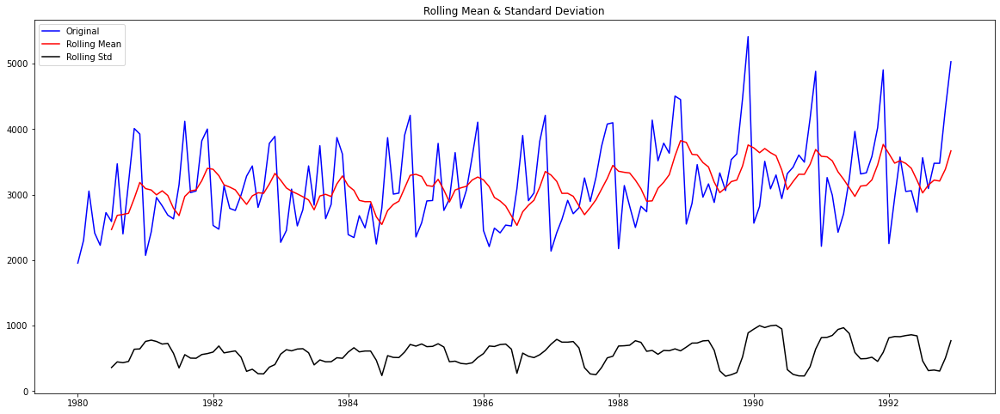
    


    Results of Dickey-Fuller Test:
    Test Statistic                  -1.436441
    p-value                          0.564686
    #Lags Used                      12.000000
    Number of Observations Used    143.000000
    Critical Value (1%)             -3.476927
    Critical Value (5%)             -2.881973
    Critical Value (10%)            -2.577665
    dtype: float64 
    


```python
test_stationarity(train['SoftDrinkProduction'].diff().dropna())
```


    
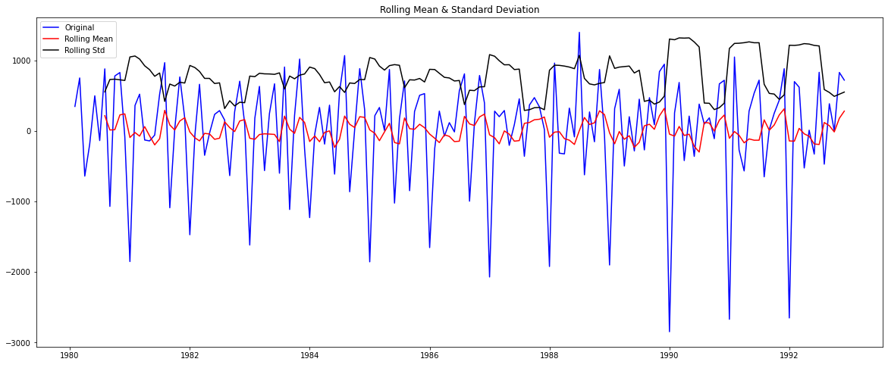
    


    Results of Dickey-Fuller Test:
    Test Statistic                -7.900743e+00
    p-value                        4.191815e-12
    #Lags Used                     1.100000e+01
    Number of Observations Used    1.430000e+02
    Critical Value (1%)           -3.476927e+00
    Critical Value (5%)           -2.881973e+00
    Critical Value (10%)          -2.577665e+00
    dtype: float64 
    


### SARIMA Modelling


```python
import itertools
p = q = range(0, 4)
d= range(1,2)
D = range(0,1)
pdq = list(itertools.product(p, d, q))
PDQ = [(x[0], x[1], x[2], 6) for x in list(itertools.product(p, D, q))]
print('Examples of the parameter combinations for the Model are')
for i in range(1,len(pdq)):
    print('Model: {}{}'.format(pdq[i], PDQ[i]))
```

    Examples of the parameter combinations for the Model are
    Model: (0, 1, 1)(0, 0, 1, 6)
    Model: (0, 1, 2)(0, 0, 2, 6)
    Model: (0, 1, 3)(0, 0, 3, 6)
    Model: (1, 1, 0)(1, 0, 0, 6)
    Model: (1, 1, 1)(1, 0, 1, 6)
    Model: (1, 1, 2)(1, 0, 2, 6)
    Model: (1, 1, 3)(1, 0, 3, 6)
    Model: (2, 1, 0)(2, 0, 0, 6)
    Model: (2, 1, 1)(2, 0, 1, 6)
    Model: (2, 1, 2)(2, 0, 2, 6)
    Model: (2, 1, 3)(2, 0, 3, 6)
    Model: (3, 1, 0)(3, 0, 0, 6)
    Model: (3, 1, 1)(3, 0, 1, 6)
    Model: (3, 1, 2)(3, 0, 2, 6)
    Model: (3, 1, 3)(3, 0, 3, 6)


```python
SARIMA_AIC = pd.DataFrame(columns=['param','seasonal', 'AIC'])
SARIMA_AIC
```


<div>
<style scoped>
    .dataframe tbody tr th:only-of-type {
        vertical-align: middle;
    }

    .dataframe tbody tr th {
        vertical-align: top;
    }

    .dataframe thead th {
        text-align: right;
    }
</style>
<table border="1" class="dataframe">
  <thead>
    <tr style="text-align: right;">
      <th></th>
      <th>param</th>
      <th>seasonal</th>
      <th>AIC</th>
    </tr>
  </thead>
  <tbody>
  </tbody>
</table>
</div>


```python
import statsmodels.api as sm

for param in pdq:
    for param_seasonal in PDQ:
        SARIMA_model = sm.tsa.statespace.SARIMAX(train['SoftDrinkProduction'].values,
                                            order=param,
                                            seasonal_order=param_seasonal,
                                            enforce_stationarity=False,
                                            enforce_invertibility=False)
            
        results_SARIMA = SARIMA_model.fit(maxiter=1000)
        print('SARIMA{}x{} - AIC:{}'.format(param, param_seasonal, results_SARIMA.aic))
        SARIMA_AIC = SARIMA_AIC.append({'param':param,'seasonal':param_seasonal ,'AIC': results_SARIMA.aic}, ignore_index=True)
```

    RUNNING THE L-BFGS-B CODE
    
               * * *
    
    Machine precision = 2.220D-16
     N =            1     M =           10
    
    At X0         0 variables are exactly at the bounds
    
    At iterate    0    f=  7.96901D+00    |proj g|=  1.49341D-05
    
               * * *
    
    Tit   = total number of iterations
    Tnf   = total number of function evaluations
    Tnint = total number of segments explored during Cauchy searches
    Skip  = number of BFGS updates skipped
    Nact  = number of active bounds at final generalized Cauchy point
    Projg = norm of the final projected gradient
    F     = final function value
    
               * * *
    
       N    Tit     Tnf  Tnint  Skip  Nact     Projg        F
        1      2      3      1     0     0   1.648D-07   7.969D+00
      F =   7.9689802437475734     
    
    CONVERGENCE: NORM_OF_PROJECTED_GRADIENT_<=_PGTOL            
    SARIMA(0, 1, 0)x(0, 0, 0, 6) - AIC:2488.321836049243
    RUNNING THE L-BFGS-B CODE
    
               * * *
    
    Machine precision = 2.220D-16
     N =            2     M =           10
    
    At X0         0 variables are exactly at the bounds
    
    At iterate    0    f=  7.65338D+00    |proj g|=  1.72399D-01
    
               * * *
    
    Tit   = total number of iterations
    Tnf   = total number of function evaluations
    Tnint = total number of segments explored during Cauchy searches
    Skip  = number of BFGS updates skipped
    Nact  = number of active bounds at final generalized Cauchy point
    Projg = norm of the final projected gradient
    F     = final function value
    
               * * *
    
       N    Tit     Tnf  Tnint  Skip  Nact     Projg        F
        2      3      6      1     0     0   3.552D-05   7.647D+00
      F =   7.6473469267325234     
    
    CONVERGENCE: REL_REDUCTION_OF_F_<=_FACTR*EPSMCH             
    SARIMA(0, 1, 0)x(0, 0, 1, 6) - AIC:2389.9722411405473
    RUNNING THE L-BFGS-B CODE
    
               * * *
    
    Machine precision = 2.220D-16
     N =            3     M =           10
    
    At X0         0 variables are exactly at the bounds
    
    At iterate    0    f=  7.15811D+00    |proj g|=  9.71112D-02
    
    At iterate    5    f=  7.15315D+00    |proj g|=  1.59046D-03
    
    At iterate   10    f=  7.15266D+00    |proj g|=  2.32633D-02
    
    At iterate   15    f=  7.12138D+00    |proj g|=  1.45452D-01
    
    At iterate   20    f=  7.08569D+00    |proj g|=  2.83795D-03
    
               * * *
    
    Tit   = total number of iterations
    Tnf   = total number of function evaluations
    Tnint = total number of segments explored during Cauchy searches
    Skip  = number of BFGS updates skipped
    Nact  = number of active bounds at final generalized Cauchy point
    Projg = norm of the final projected gradient
    F     = final function value
    
               * * *
    
       N    Tit     Tnf  Tnint  Skip  Nact     Projg        F
        3     23     25      1     0     0   9.695D-07   7.086D+00
      F =   7.0856799694357093     
    
    CONVERGENCE: NORM_OF_PROJECTED_GRADIENT_<=_PGTOL            


     This problem is unconstrained.
    /var/folders/d0/7px_g2bn4_n3k51xjtl4w5jr0000gn/T/ipykernel_57697/1717218130.py:13: FutureWarning: The frame.append method is deprecated and will be removed from pandas in a future version. Use pandas.concat instead.
      SARIMA_AIC = SARIMA_AIC.append({'param':param,'seasonal':param_seasonal ,'AIC': results_SARIMA.aic}, ignore_index=True)
     This problem is unconstrained.
    /var/folders/d0/7px_g2bn4_n3k51xjtl4w5jr0000gn/T/ipykernel_57697/1717218130.py:13: FutureWarning: The frame.append method is deprecated and will be removed from pandas in a future version. Use pandas.concat instead.
      SARIMA_AIC = SARIMA_AIC.append({'param':param,'seasonal':param_seasonal ,'AIC': results_SARIMA.aic}, ignore_index=True)
     This problem is unconstrained.


    SARIMA(0, 1, 0)x(0, 0, 2, 6) - AIC:2216.7321504639413
    RUNNING THE L-BFGS-B CODE
    
               * * *
    
    Machine precision = 2.220D-16
     N =            4     M =           10
    
    At X0         0 variables are exactly at the bounds
    
    At iterate    0    f=  6.87053D+00    |proj g|=  8.45566D-02
    
    At iterate    5    f=  6.86254D+00    |proj g|=  9.68566D-04
    
    At iterate   10    f=  6.86252D+00    |proj g|=  2.39353D-03
    
    At iterate   15    f=  6.86040D+00    |proj g|=  3.57793D-02
    
    At iterate   20    f=  6.80492D+00    |proj g|=  1.47249D-01
    
    At iterate   25    f=  6.78981D+00    |proj g|=  1.20026D-04
    
               * * *
    
    Tit   = total number of iterations
    Tnf   = total number of function evaluations
    Tnint = total number of segments explored during Cauchy searches
    Skip  = number of BFGS updates skipped
    Nact  = number of active bounds at final generalized Cauchy point
    Projg = norm of the final projected gradient
    F     = final function value
    
               * * *
    
       N    Tit     Tnf  Tnint  Skip  Nact     Projg        F
        4     26     29      1     0     0   1.111D-05   6.790D+00
      F =   6.7898058118624434     
    
    CONVERGENCE: REL_REDUCTION_OF_F_<=_FACTR*EPSMCH             


    /var/folders/d0/7px_g2bn4_n3k51xjtl4w5jr0000gn/T/ipykernel_57697/1717218130.py:13: FutureWarning: The frame.append method is deprecated and will be removed from pandas in a future version. Use pandas.concat instead.
      SARIMA_AIC = SARIMA_AIC.append({'param':param,'seasonal':param_seasonal ,'AIC': results_SARIMA.aic}, ignore_index=True)
     This problem is unconstrained.


    SARIMA(0, 1, 0)x(0, 0, 3, 6) - AIC:2126.4194133010824
    RUNNING THE L-BFGS-B CODE
    
               * * *
    
    Machine precision = 2.220D-16
     N =            2     M =           10
    
    At X0         0 variables are exactly at the bounds
    
    At iterate    0    f=  7.66959D+00    |proj g|=  5.24967D-06
    
               * * *
    
    Tit   = total number of iterations
    Tnf   = total number of function evaluations
    Tnint = total number of segments explored during Cauchy searches
    Skip  = number of BFGS updates skipped
    Nact  = number of active bounds at final generalized Cauchy point
    Projg = norm of the final projected gradient
    F     = final function value
    
               * * *
    
       N    Tit     Tnf  Tnint  Skip  Nact     Projg        F
        2      0      1      0     0     0   5.250D-06   7.670D+00
      F =   7.6695905892834135     
    
    CONVERGENCE: NORM_OF_PROJECTED_GRADIENT_<=_PGTOL            
    SARIMA(0, 1, 0)x(1, 0, 0, 6) - AIC:2396.912263856425
    RUNNING THE L-BFGS-B CODE
    
               * * *
    
    Machine precision = 2.220D-16
     N =            3     M =           10
    
    At X0         0 variables are exactly at the bounds
    
    At iterate    0    f=  7.59974D+00    |proj g|=  2.13260D-01
    
    At iterate    5    f=  7.45026D+00    |proj g|=  1.86177D-02
    
    At iterate   10    f=  7.45023D+00    |proj g|=  1.25195D-03
    
    At iterate   15    f=  7.45012D+00    |proj g|=  2.11816D-02
    
    At iterate   20    f=  7.44256D+00    |proj g|=  1.48183D-01
    
    At iterate   25    f=  7.40342D+00    |proj g|=  2.11021D-03
    
               * * *
    
    Tit   = total number of iterations
    Tnf   = total number of function evaluations
    Tnint = total number of segments explored during Cauchy searches
    Skip  = number of BFGS updates skipped
    Nact  = number of active bounds at final generalized Cauchy point
    Projg = norm of the final projected gradient
    F     = final function value
    
               * * *
    
       N    Tit     Tnf  Tnint  Skip  Nact     Projg        F
        3     28     43      1     0     0   3.476D-06   7.403D+00
      F =   7.4034231167201936     
    
    CONVERGENCE: NORM_OF_PROJECTED_GRADIENT_<=_PGTOL            


    /var/folders/d0/7px_g2bn4_n3k51xjtl4w5jr0000gn/T/ipykernel_57697/1717218130.py:13: FutureWarning: The frame.append method is deprecated and will be removed from pandas in a future version. Use pandas.concat instead.
      SARIMA_AIC = SARIMA_AIC.append({'param':param,'seasonal':param_seasonal ,'AIC': results_SARIMA.aic}, ignore_index=True)
     This problem is unconstrained.
    /var/folders/d0/7px_g2bn4_n3k51xjtl4w5jr0000gn/T/ipykernel_57697/1717218130.py:13: FutureWarning: The frame.append method is deprecated and will be removed from pandas in a future version. Use pandas.concat instead.
      SARIMA_AIC = SARIMA_AIC.append({'param':param,'seasonal':param_seasonal ,'AIC': results_SARIMA.aic}, ignore_index=True)
     This problem is unconstrained.


    SARIMA(0, 1, 0)x(1, 0, 1, 6) - AIC:2315.8680124167004
    RUNNING THE L-BFGS-B CODE
    
               * * *
    
    Machine precision = 2.220D-16
     N =            4     M =           10
    
    At X0         0 variables are exactly at the bounds
    
    At iterate    0    f=  7.13137D+00    |proj g|=  1.37002D-01
    
    At iterate    5    f=  7.10378D+00    |proj g|=  8.65236D-02
    
    At iterate   10    f=  7.08800D+00    |proj g|=  3.23788D-02
    
    At iterate   15    f=  7.08679D+00    |proj g|=  6.22505D-04
    
    At iterate   20    f=  7.08636D+00    |proj g|=  2.39951D-02
    
    At iterate   25    f=  7.02826D+00    |proj g|=  3.36221D-01
    
    At iterate   30    f=  6.99343D+00    |proj g|=  1.02185D-02
    
               * * *
    
    Tit   = total number of iterations
    Tnf   = total number of function evaluations
    Tnint = total number of segments explored during Cauchy searches
    Skip  = number of BFGS updates skipped
    Nact  = number of active bounds at final generalized Cauchy point
    Projg = norm of the final projected gradient
    F     = final function value
    
               * * *
    
       N    Tit     Tnf  Tnint  Skip  Nact     Projg        F
        4     33     43      1     0     0   1.174D-05   6.993D+00
      F =   6.9933894099671514     
    
    CONVERGENCE: REL_REDUCTION_OF_F_<=_FACTR*EPSMCH             


    /var/folders/d0/7px_g2bn4_n3k51xjtl4w5jr0000gn/T/ipykernel_57697/1717218130.py:13: FutureWarning: The frame.append method is deprecated and will be removed from pandas in a future version. Use pandas.concat instead.
      SARIMA_AIC = SARIMA_AIC.append({'param':param,'seasonal':param_seasonal ,'AIC': results_SARIMA.aic}, ignore_index=True)
     This problem is unconstrained.


    SARIMA(0, 1, 0)x(1, 0, 2, 6) - AIC:2189.9374959097513
    RUNNING THE L-BFGS-B CODE
    
               * * *
    
    Machine precision = 2.220D-16
     N =            5     M =           10
    
    At X0         0 variables are exactly at the bounds
    
    At iterate    0    f=  6.85291D+00    |proj g|=  2.16592D-01
    
    At iterate    5    f=  6.77670D+00    |proj g|=  1.68420D-01
    
    At iterate   10    f=  6.76330D+00    |proj g|=  6.69135D-04
    
    At iterate   15    f=  6.76320D+00    |proj g|=  5.49264D-03
    
    At iterate   20    f=  6.75047D+00    |proj g|=  7.01494D-02


    /var/folders/d0/7px_g2bn4_n3k51xjtl4w5jr0000gn/T/ipykernel_57697/1717218130.py:13: FutureWarning: The frame.append method is deprecated and will be removed from pandas in a future version. Use pandas.concat instead.
      SARIMA_AIC = SARIMA_AIC.append({'param':param,'seasonal':param_seasonal ,'AIC': results_SARIMA.aic}, ignore_index=True)
     This problem is unconstrained.


    
    At iterate   25    f=  6.65465D+00    |proj g|=  5.00939D-01
    
    At iterate   30    f=  6.63906D+00    |proj g|=  2.85305D-03
    
    At iterate   35    f=  6.63905D+00    |proj g|=  4.41860D-06
    
               * * *
    
    Tit   = total number of iterations
    Tnf   = total number of function evaluations
    Tnint = total number of segments explored during Cauchy searches
    Skip  = number of BFGS updates skipped
    Nact  = number of active bounds at final generalized Cauchy point
    Projg = norm of the final projected gradient
    F     = final function value
    
               * * *
    
       N    Tit     Tnf  Tnint  Skip  Nact     Projg        F
        5     35     49      1     0     0   4.419D-06   6.639D+00
      F =   6.6390523994053892     
    
    CONVERGENCE: NORM_OF_PROJECTED_GRADIENT_<=_PGTOL            
    SARIMA(0, 1, 0)x(1, 0, 3, 6) - AIC:2081.3843486144815
    RUNNING THE L-BFGS-B CODE
    
               * * *
    
    Machine precision = 2.220D-16
     N =            3     M =           10
    
    At X0         0 variables are exactly at the bounds
    
    At iterate    0    f=  6.88110D+00    |proj g|=  1.47184D-05
    
               * * *
    
    Tit   = total number of iterations
    Tnf   = total number of function evaluations
    Tnint = total number of segments explored during Cauchy searches
    Skip  = number of BFGS updates skipped
    Nact  = number of active bounds at final generalized Cauchy point
    Projg = norm of the final projected gradient
    F     = final function value
    
               * * *
    
       N    Tit     Tnf  Tnint  Skip  Nact     Projg        F
        3      1     12      1     0     0   1.470D-05   6.881D+00
      F =   6.8810975535349872     
    
    CONVERGENCE: REL_REDUCTION_OF_F_<=_FACTR*EPSMCH             
    SARIMA(0, 1, 0)x(2, 0, 0, 6) - AIC:2152.902436702916
    RUNNING THE L-BFGS-B CODE
    
               * * *
    
    Machine precision = 2.220D-16
     N =            4     M =           10
    
    At X0         0 variables are exactly at the bounds
    
    At iterate    0    f=  6.87816D+00    |proj g|=  3.97797D-02
    
    At iterate    5    f=  6.87742D+00    |proj g|=  5.80664D-05
    
               * * *
    
    Tit   = total number of iterations
    Tnf   = total number of function evaluations
    Tnint = total number of segments explored during Cauchy searches
    Skip  = number of BFGS updates skipped
    Nact  = number of active bounds at final generalized Cauchy point
    Projg = norm of the final projected gradient
    F     = final function value
    
               * * *
    
       N    Tit     Tnf  Tnint  Skip  Nact     Projg        F
        4      6     10      1     0     0   3.816D-05   6.877D+00
      F =   6.8774204755779307     
    
    CONVERGENCE: REL_REDUCTION_OF_F_<=_FACTR*EPSMCH             
    SARIMA(0, 1, 0)x(2, 0, 1, 6) - AIC:2153.7551883803144
    RUNNING THE L-BFGS-B CODE
    
               * * *
    
    Machine precision = 2.220D-16
     N =            5     M =           10
    
    At X0         0 variables are exactly at the bounds
    
    At iterate    0    f=  6.78193D+00    |proj g|=  2.77633D-01


    /var/folders/d0/7px_g2bn4_n3k51xjtl4w5jr0000gn/T/ipykernel_57697/1717218130.py:13: FutureWarning: The frame.append method is deprecated and will be removed from pandas in a future version. Use pandas.concat instead.
      SARIMA_AIC = SARIMA_AIC.append({'param':param,'seasonal':param_seasonal ,'AIC': results_SARIMA.aic}, ignore_index=True)
     This problem is unconstrained.
    
     Warning:  more than 10 function and gradient
       evaluations in the last line search.  Termination
       may possibly be caused by a bad search direction.
    /var/folders/d0/7px_g2bn4_n3k51xjtl4w5jr0000gn/T/ipykernel_57697/1717218130.py:13: FutureWarning: The frame.append method is deprecated and will be removed from pandas in a future version. Use pandas.concat instead.
      SARIMA_AIC = SARIMA_AIC.append({'param':param,'seasonal':param_seasonal ,'AIC': results_SARIMA.aic}, ignore_index=True)
     This problem is unconstrained.
    /var/folders/d0/7px_g2bn4_n3k51xjtl4w5jr0000gn/T/ipykernel_57697/1717218130.py:13: FutureWarning: The frame.append method is deprecated and will be removed from pandas in a future version. Use pandas.concat instead.
      SARIMA_AIC = SARIMA_AIC.append({'param':param,'seasonal':param_seasonal ,'AIC': results_SARIMA.aic}, ignore_index=True)
     This problem is unconstrained.


    
    At iterate    5    f=  6.76775D+00    |proj g|=  3.83433D-02
    
    At iterate   10    f=  6.76755D+00    |proj g|=  7.64608D-04
    
    At iterate   15    f=  6.76754D+00    |proj g|=  5.88333D-03
    
    At iterate   20    f=  6.76700D+00    |proj g|=  7.35918D-02
    
    At iterate   25    f=  6.75917D+00    |proj g|=  1.61416D-01
    
    At iterate   30    f=  6.75775D+00    |proj g|=  1.82169D-04
    
               * * *
    
    Tit   = total number of iterations
    Tnf   = total number of function evaluations
    Tnint = total number of segments explored during Cauchy searches
    Skip  = number of BFGS updates skipped
    Nact  = number of active bounds at final generalized Cauchy point
    Projg = norm of the final projected gradient
    F     = final function value
    
               * * *
    
       N    Tit     Tnf  Tnint  Skip  Nact     Projg        F
        5     32     35      1     0     0   2.414D-05   6.758D+00
      F =   6.7577483989276477     
    
    CONVERGENCE: REL_REDUCTION_OF_F_<=_FACTR*EPSMCH             
    SARIMA(0, 1, 0)x(2, 0, 2, 6) - AIC:2118.417500465426
    RUNNING THE L-BFGS-B CODE
    
               * * *
    
    Machine precision = 2.220D-16
     N =            6     M =           10
    
    At X0         0 variables are exactly at the bounds
    
    At iterate    0    f=  6.51566D+00    |proj g|=  1.23984D-01
    
    At iterate    5    f=  6.48762D+00    |proj g|=  2.51661D-02
    
    At iterate   10    f=  6.48681D+00    |proj g|=  3.11794D-04
    
    At iterate   15    f=  6.48680D+00    |proj g|=  4.60335D-03
    
    At iterate   20    f=  6.48591D+00    |proj g|=  6.36169D-02


    /var/folders/d0/7px_g2bn4_n3k51xjtl4w5jr0000gn/T/ipykernel_57697/1717218130.py:13: FutureWarning: The frame.append method is deprecated and will be removed from pandas in a future version. Use pandas.concat instead.
      SARIMA_AIC = SARIMA_AIC.append({'param':param,'seasonal':param_seasonal ,'AIC': results_SARIMA.aic}, ignore_index=True)
     This problem is unconstrained.


    
    At iterate   25    f=  6.48076D+00    |proj g|=  1.60743D-02
    
    At iterate   30    f=  6.48065D+00    |proj g|=  8.07247D-05
    
               * * *
    
    Tit   = total number of iterations
    Tnf   = total number of function evaluations
    Tnint = total number of segments explored during Cauchy searches
    Skip  = number of BFGS updates skipped
    Nact  = number of active bounds at final generalized Cauchy point
    Projg = norm of the final projected gradient
    F     = final function value
    
               * * *
    
       N    Tit     Tnf  Tnint  Skip  Nact     Projg        F
        6     31     36      1     0     0   7.660D-05   6.481D+00
      F =   6.4806543122955143     
    
    CONVERGENCE: REL_REDUCTION_OF_F_<=_FACTR*EPSMCH             
    SARIMA(0, 1, 0)x(2, 0, 3, 6) - AIC:2033.9641454362004
    RUNNING THE L-BFGS-B CODE
    
               * * *
    
    Machine precision = 2.220D-16
     N =            4     M =           10
    
    At X0         0 variables are exactly at the bounds
    
    At iterate    0    f=  6.59900D+00    |proj g|=  1.34153D-05
    
               * * *
    
    Tit   = total number of iterations
    Tnf   = total number of function evaluations
    Tnint = total number of segments explored during Cauchy searches
    Skip  = number of BFGS updates skipped
    Nact  = number of active bounds at final generalized Cauchy point
    Projg = norm of the final projected gradient
    F     = final function value
    
               * * *
    
       N    Tit     Tnf  Tnint  Skip  Nact     Projg        F
        4      1     11      1     0     0   1.339D-05   6.599D+00
      F =   6.5989962663645017     
    
    CONVERGENCE: REL_REDUCTION_OF_F_<=_FACTR*EPSMCH             
    SARIMA(0, 1, 0)x(3, 0, 0, 6) - AIC:2066.8868351057245
    RUNNING THE L-BFGS-B CODE
    
               * * *
    
    Machine precision = 2.220D-16
     N =            5     M =           10
    
    At X0         0 variables are exactly at the bounds
    
    At iterate    0    f=  6.59861D+00    |proj g|=  6.88148D-02
    
    At iterate    5    f=  6.59717D+00    |proj g|=  3.73972D-02
    
    At iterate   10    f=  6.58239D+00    |proj g|=  1.61678D-01
    
    At iterate   15    f=  6.57960D+00    |proj g|=  1.33214D-02


    /var/folders/d0/7px_g2bn4_n3k51xjtl4w5jr0000gn/T/ipykernel_57697/1717218130.py:13: FutureWarning: The frame.append method is deprecated and will be removed from pandas in a future version. Use pandas.concat instead.
      SARIMA_AIC = SARIMA_AIC.append({'param':param,'seasonal':param_seasonal ,'AIC': results_SARIMA.aic}, ignore_index=True)
     This problem is unconstrained.
    /var/folders/d0/7px_g2bn4_n3k51xjtl4w5jr0000gn/T/ipykernel_57697/1717218130.py:13: FutureWarning: The frame.append method is deprecated and will be removed from pandas in a future version. Use pandas.concat instead.
      SARIMA_AIC = SARIMA_AIC.append({'param':param,'seasonal':param_seasonal ,'AIC': results_SARIMA.aic}, ignore_index=True)
     This problem is unconstrained.


    
               * * *
    
    Tit   = total number of iterations
    Tnf   = total number of function evaluations
    Tnint = total number of segments explored during Cauchy searches
    Skip  = number of BFGS updates skipped
    Nact  = number of active bounds at final generalized Cauchy point
    Projg = norm of the final projected gradient
    F     = final function value
    
               * * *
    
       N    Tit     Tnf  Tnint  Skip  Nact     Projg        F
        5     18     24      1     0     0   1.559D-04   6.580D+00
      F =   6.5795933427829167     
    
    CONVERGENCE: REL_REDUCTION_OF_F_<=_FACTR*EPSMCH             
    SARIMA(0, 1, 0)x(3, 0, 1, 6) - AIC:2062.83312294827
    RUNNING THE L-BFGS-B CODE
    
               * * *
    
    Machine precision = 2.220D-16
     N =            6     M =           10
    
    At X0         0 variables are exactly at the bounds
    
    At iterate    0    f=  6.54563D+00    |proj g|=  2.74231D-01
    
    At iterate    5    f=  6.53218D+00    |proj g|=  9.29359D-03
    
    At iterate   10    f=  6.53208D+00    |proj g|=  8.08684D-03
    
    At iterate   15    f=  6.53205D+00    |proj g|=  3.68747D-04
    
    At iterate   20    f=  6.53201D+00    |proj g|=  9.88580D-03


    /var/folders/d0/7px_g2bn4_n3k51xjtl4w5jr0000gn/T/ipykernel_57697/1717218130.py:13: FutureWarning: The frame.append method is deprecated and will be removed from pandas in a future version. Use pandas.concat instead.
      SARIMA_AIC = SARIMA_AIC.append({'param':param,'seasonal':param_seasonal ,'AIC': results_SARIMA.aic}, ignore_index=True)
     This problem is unconstrained.


    
    At iterate   25    f=  6.52986D+00    |proj g|=  5.59478D-02
    
    At iterate   30    f=  6.52315D+00    |proj g|=  6.04119D-03
    
    At iterate   35    f=  6.52309D+00    |proj g|=  2.57570D-04
    
               * * *
    
    Tit   = total number of iterations
    Tnf   = total number of function evaluations
    Tnint = total number of segments explored during Cauchy searches
    Skip  = number of BFGS updates skipped
    Nact  = number of active bounds at final generalized Cauchy point
    Projg = norm of the final projected gradient
    F     = final function value
    
               * * *
    
       N    Tit     Tnf  Tnint  Skip  Nact     Projg        F
        6     36     40      1     0     0   7.246D-05   6.523D+00
      F =   6.5230898227932750     
    
    CONVERGENCE: REL_REDUCTION_OF_F_<=_FACTR*EPSMCH             
    SARIMA(0, 1, 0)x(3, 0, 2, 6) - AIC:2047.204024711502
    RUNNING THE L-BFGS-B CODE
    
               * * *
    
    Machine precision = 2.220D-16
     N =            7     M =           10
    
    At X0         0 variables are exactly at the bounds
    
    At iterate    0    f=  6.51377D+00    |proj g|=  1.31491D-01
    
    At iterate    5    f=  6.48880D+00    |proj g|=  5.41024D-02
    
    At iterate   10    f=  6.48636D+00    |proj g|=  2.33960D-03
    
    At iterate   15    f=  6.48625D+00    |proj g|=  7.54086D-03


    /var/folders/d0/7px_g2bn4_n3k51xjtl4w5jr0000gn/T/ipykernel_57697/1717218130.py:13: FutureWarning: The frame.append method is deprecated and will be removed from pandas in a future version. Use pandas.concat instead.
      SARIMA_AIC = SARIMA_AIC.append({'param':param,'seasonal':param_seasonal ,'AIC': results_SARIMA.aic}, ignore_index=True)
     This problem is unconstrained.


    
    At iterate   20    f=  6.48622D+00    |proj g|=  5.37504D-04
    
    At iterate   25    f=  6.48609D+00    |proj g|=  2.04099D-02
    
    At iterate   30    f=  6.48391D+00    |proj g|=  7.44303D-02
    
    At iterate   35    f=  6.48005D+00    |proj g|=  9.12561D-04
    
    At iterate   40    f=  6.48005D+00    |proj g|=  5.80291D-06
    
               * * *
    
    Tit   = total number of iterations
    Tnf   = total number of function evaluations
    Tnint = total number of segments explored during Cauchy searches
    Skip  = number of BFGS updates skipped
    Nact  = number of active bounds at final generalized Cauchy point
    Projg = norm of the final projected gradient
    F     = final function value
    
               * * *
    
       N    Tit     Tnf  Tnint  Skip  Nact     Projg        F
        7     40     47      1     0     0   5.803D-06   6.480D+00
      F =   6.4800458664026923     
    
    CONVERGENCE: NORM_OF_PROJECTED_GRADIENT_<=_PGTOL            
    SARIMA(0, 1, 0)x(3, 0, 3, 6) - AIC:2035.7743103176401
    RUNNING THE L-BFGS-B CODE
    
               * * *
    
    Machine precision = 2.220D-16
     N =            2     M =           10
    
    At X0         0 variables are exactly at the bounds
    
    At iterate    0    f=  7.80691D+00    |proj g|=  1.54045D-01
    
    At iterate    5    f=  7.74698D+00    |proj g|=  4.67214D-04
    
               * * *
    
    Tit   = total number of iterations
    Tnf   = total number of function evaluations
    Tnint = total number of segments explored during Cauchy searches
    Skip  = number of BFGS updates skipped
    Nact  = number of active bounds at final generalized Cauchy point
    Projg = norm of the final projected gradient
    F     = final function value
    
               * * *
    
       N    Tit     Tnf  Tnint  Skip  Nact     Projg        F
        2      7     15      1     0     0   2.387D-04   7.747D+00
      F =   7.7469787857494703     
    
    CONVERGENCE: REL_REDUCTION_OF_F_<=_FACTR*EPSMCH             
    SARIMA(0, 1, 1)x(0, 0, 0, 6) - AIC:2421.0573811538347
    RUNNING THE L-BFGS-B CODE
    
               * * *
    
    Machine precision = 2.220D-16
     N =            3     M =           10
    
    At X0         0 variables are exactly at the bounds
    
    At iterate    0    f=  7.48511D+00    |proj g|=  1.75638D-01
    
    At iterate    5    f=  7.41622D+00    |proj g|=  1.47472D-03
    
    At iterate   10    f=  7.41621D+00    |proj g|=  7.93332D-03
    
    At iterate   15    f=  7.41544D+00    |proj g|=  8.62708D-02
    
    At iterate   20    f=  7.40625D+00    |proj g|=  1.68982D-01
    
    At iterate   25    f=  7.40160D+00    |proj g|=  5.41814D-05
    
               * * *
    
    Tit   = total number of iterations
    Tnf   = total number of function evaluations
    Tnint = total number of segments explored during Cauchy searches
    Skip  = number of BFGS updates skipped
    Nact  = number of active bounds at final generalized Cauchy point
    Projg = norm of the final projected gradient
    F     = final function value
    
               * * *
    
       N    Tit     Tnf  Tnint  Skip  Nact     Projg        F
        3     26     36      1     0     0   4.684D-05   7.402D+00
      F =   7.4016007675181754     
    
    CONVERGENCE: REL_REDUCTION_OF_F_<=_FACTR*EPSMCH             


    /var/folders/d0/7px_g2bn4_n3k51xjtl4w5jr0000gn/T/ipykernel_57697/1717218130.py:13: FutureWarning: The frame.append method is deprecated and will be removed from pandas in a future version. Use pandas.concat instead.
      SARIMA_AIC = SARIMA_AIC.append({'param':param,'seasonal':param_seasonal ,'AIC': results_SARIMA.aic}, ignore_index=True)
     This problem is unconstrained.
    /var/folders/d0/7px_g2bn4_n3k51xjtl4w5jr0000gn/T/ipykernel_57697/1717218130.py:13: FutureWarning: The frame.append method is deprecated and will be removed from pandas in a future version. Use pandas.concat instead.
      SARIMA_AIC = SARIMA_AIC.append({'param':param,'seasonal':param_seasonal ,'AIC': results_SARIMA.aic}, ignore_index=True)
     This problem is unconstrained.


    SARIMA(0, 1, 1)x(0, 0, 1, 6) - AIC:2315.2994394656707
    RUNNING THE L-BFGS-B CODE
    
               * * *
    
    Machine precision = 2.220D-16
     N =            4     M =           10
    
    At X0         0 variables are exactly at the bounds
    
    At iterate    0    f=  7.01480D+00    |proj g|=  8.23083D-02
    
    At iterate    5    f=  6.98166D+00    |proj g|=  1.18038D-02
    
    At iterate   10    f=  6.98164D+00    |proj g|=  2.12136D-03
    
    At iterate   15    f=  6.98143D+00    |proj g|=  1.28059D-02
    
    At iterate   20    f=  6.95893D+00    |proj g|=  3.30985D-01
    
    At iterate   25    f=  6.87875D+00    |proj g|=  1.56777D-02
    
               * * *
    
    Tit   = total number of iterations
    Tnf   = total number of function evaluations
    Tnint = total number of segments explored during Cauchy searches
    Skip  = number of BFGS updates skipped
    Nact  = number of active bounds at final generalized Cauchy point
    Projg = norm of the final projected gradient
    F     = final function value
    
               * * *
    
       N    Tit     Tnf  Tnint  Skip  Nact     Projg        F
        4     28     38      1     0     0   9.499D-06   6.879D+00
      F =   6.8786778005339810     
    
    CONVERGENCE: NORM_OF_PROJECTED_GRADIENT_<=_PGTOL            


    /var/folders/d0/7px_g2bn4_n3k51xjtl4w5jr0000gn/T/ipykernel_57697/1717218130.py:13: FutureWarning: The frame.append method is deprecated and will be removed from pandas in a future version. Use pandas.concat instead.
      SARIMA_AIC = SARIMA_AIC.append({'param':param,'seasonal':param_seasonal ,'AIC': results_SARIMA.aic}, ignore_index=True)
     This problem is unconstrained.


    SARIMA(0, 1, 1)x(0, 0, 2, 6) - AIC:2154.147473766602
    RUNNING THE L-BFGS-B CODE
    
               * * *
    
    Machine precision = 2.220D-16
     N =            5     M =           10
    
    At X0         0 variables are exactly at the bounds
    
    At iterate    0    f=  6.72723D+00    |proj g|=  1.25055D-01
    
    At iterate    5    f=  6.68636D+00    |proj g|=  2.92308D-02
    
    At iterate   10    f=  6.68537D+00    |proj g|=  6.45983D-04
    
    At iterate   15    f=  6.68523D+00    |proj g|=  9.09976D-03
    
    At iterate   20    f=  6.66958D+00    |proj g|=  9.94979D-02


    /var/folders/d0/7px_g2bn4_n3k51xjtl4w5jr0000gn/T/ipykernel_57697/1717218130.py:13: FutureWarning: The frame.append method is deprecated and will be removed from pandas in a future version. Use pandas.concat instead.
      SARIMA_AIC = SARIMA_AIC.append({'param':param,'seasonal':param_seasonal ,'AIC': results_SARIMA.aic}, ignore_index=True)
     This problem is unconstrained.


    
    At iterate   25    f=  6.60359D+00    |proj g|=  1.60735D-01
    
    At iterate   30    f=  6.58794D+00    |proj g|=  3.46776D-03
    
               * * *
    
    Tit   = total number of iterations
    Tnf   = total number of function evaluations
    Tnint = total number of segments explored during Cauchy searches
    Skip  = number of BFGS updates skipped
    Nact  = number of active bounds at final generalized Cauchy point
    Projg = norm of the final projected gradient
    F     = final function value
    
               * * *
    
       N    Tit     Tnf  Tnint  Skip  Nact     Projg        F
        5     33     39      1     0     0   1.609D-05   6.588D+00
      F =   6.5879293874025233     
    
    CONVERGENCE: REL_REDUCTION_OF_F_<=_FACTR*EPSMCH             
    SARIMA(0, 1, 1)x(0, 0, 3, 6) - AIC:2065.4339688695873
    RUNNING THE L-BFGS-B CODE
    
               * * *
    
    Machine precision = 2.220D-16
     N =            3     M =           10
    
    At X0         0 variables are exactly at the bounds
    
    At iterate    0    f=  7.55088D+00    |proj g|=  1.80745D-01
    
    At iterate    5    f=  7.48266D+00    |proj g|=  3.53130D-03
    
    At iterate   10    f=  7.48265D+00    |proj g|=  3.49016D-03
    
    At iterate   15    f=  7.48211D+00    |proj g|=  6.23833D-02
    
    At iterate   20    f=  7.45709D+00    |proj g|=  2.04246D-01
    
    At iterate   25    f=  7.45440D+00    |proj g|=  1.86599D-05
    
               * * *
    
    Tit   = total number of iterations
    Tnf   = total number of function evaluations
    Tnint = total number of segments explored during Cauchy searches
    Skip  = number of BFGS updates skipped
    Nact  = number of active bounds at final generalized Cauchy point
    Projg = norm of the final projected gradient
    F     = final function value
    
               * * *
    
       N    Tit     Tnf  Tnint  Skip  Nact     Projg        F
        3     26     33      1     0     0   3.638D-06   7.454D+00
      F =   7.4544039904271084     
    
    CONVERGENCE: NORM_OF_PROJECTED_GRADIENT_<=_PGTOL            
    SARIMA(0, 1, 1)x(1, 0, 0, 6) - AIC:2331.774045013258
    RUNNING THE L-BFGS-B CODE
    
               * * *
    
    Machine precision = 2.220D-16
     N =            4     M =           10
    
    At X0         0 variables are exactly at the bounds
    
    At iterate    0    f=  7.43766D+00    |proj g|=  2.34211D-01
    
    At iterate    5    f=  7.30957D+00    |proj g|=  2.12637D-01
    
    At iterate   10    f=  7.24622D+00    |proj g|=  5.09219D-02
    
    At iterate   15    f=  7.24585D+00    |proj g|=  8.17760D-04
    
    At iterate   20    f=  7.24570D+00    |proj g|=  2.40381D-02
    
    At iterate   25    f=  7.23811D+00    |proj g|=  1.41460D-01
    
    At iterate   30    f=  7.10234D+00    |proj g|=  6.64211D-01


    /var/folders/d0/7px_g2bn4_n3k51xjtl4w5jr0000gn/T/ipykernel_57697/1717218130.py:13: FutureWarning: The frame.append method is deprecated and will be removed from pandas in a future version. Use pandas.concat instead.
      SARIMA_AIC = SARIMA_AIC.append({'param':param,'seasonal':param_seasonal ,'AIC': results_SARIMA.aic}, ignore_index=True)
     This problem is unconstrained.
    /var/folders/d0/7px_g2bn4_n3k51xjtl4w5jr0000gn/T/ipykernel_57697/1717218130.py:13: FutureWarning: The frame.append method is deprecated and will be removed from pandas in a future version. Use pandas.concat instead.
      SARIMA_AIC = SARIMA_AIC.append({'param':param,'seasonal':param_seasonal ,'AIC': results_SARIMA.aic}, ignore_index=True)
     This problem is unconstrained.


    
    At iterate   35    f=  7.08219D+00    |proj g|=  1.78178D-02
    
    At iterate   40    f=  7.08217D+00    |proj g|=  6.94538D-06
    
               * * *
    
    Tit   = total number of iterations
    Tnf   = total number of function evaluations
    Tnint = total number of segments explored during Cauchy searches
    Skip  = number of BFGS updates skipped
    Nact  = number of active bounds at final generalized Cauchy point
    Projg = norm of the final projected gradient
    F     = final function value
    
               * * *
    
       N    Tit     Tnf  Tnint  Skip  Nact     Projg        F
        4     40     55      1     0     0   6.945D-06   7.082D+00
      F =   7.0821737386896491     
    
    CONVERGENCE: NORM_OF_PROJECTED_GRADIENT_<=_PGTOL            
    SARIMA(0, 1, 1)x(1, 0, 1, 6) - AIC:2217.6382064711706


    /var/folders/d0/7px_g2bn4_n3k51xjtl4w5jr0000gn/T/ipykernel_57697/1717218130.py:13: FutureWarning: The frame.append method is deprecated and will be removed from pandas in a future version. Use pandas.concat instead.
      SARIMA_AIC = SARIMA_AIC.append({'param':param,'seasonal':param_seasonal ,'AIC': results_SARIMA.aic}, ignore_index=True)
     This problem is unconstrained.


    RUNNING THE L-BFGS-B CODE
    
               * * *
    
    Machine precision = 2.220D-16
     N =            5     M =           10
    
    At X0         0 variables are exactly at the bounds
    
    At iterate    0    f=  7.00217D+00    |proj g|=  1.04009D-01
    
    At iterate    5    f=  6.95936D+00    |proj g|=  5.70280D-02
    
    At iterate   10    f=  6.93332D+00    |proj g|=  3.34392D-01
    
    At iterate   15    f=  6.91675D+00    |proj g|=  4.18044D-02
    
    At iterate   20    f=  6.91603D+00    |proj g|=  8.69449D-04
    
    At iterate   25    f=  6.91598D+00    |proj g|=  1.36554D-02
    
    At iterate   30    f=  6.90855D+00    |proj g|=  2.00095D-01
    
    At iterate   35    f=  6.76365D+00    |proj g|=  2.82712D-01
    
    At iterate   40    f=  6.70225D+00    |proj g|=  5.95367D-02
    
    At iterate   45    f=  6.70191D+00    |proj g|=  9.17045D-04
    
               * * *
    
    Tit   = total number of iterations
    Tnf   = total number of function evaluations
    Tnint = total number of segments explored during Cauchy searches
    Skip  = number of BFGS updates skipped
    Nact  = number of active bounds at final generalized Cauchy point
    Projg = norm of the final projected gradient
    F     = final function value
    
               * * *
    
       N    Tit     Tnf  Tnint  Skip  Nact     Projg        F
        5     47     64      1     0     0   9.517D-06   6.702D+00
      F =   6.7019073215412703     
    
    CONVERGENCE: NORM_OF_PROJECTED_GRADIENT_<=_PGTOL            
    SARIMA(0, 1, 1)x(1, 0, 2, 6) - AIC:2100.9950843208762
    RUNNING THE L-BFGS-B CODE
    
               * * *
    
    Machine precision = 2.220D-16
     N =            6     M =           10
    
    At X0         0 variables are exactly at the bounds
    
    At iterate    0    f=  6.73222D+00    |proj g|=  2.46814D-01
    
    At iterate    5    f=  6.65020D+00    |proj g|=  5.77794D-02
    
    At iterate   10    f=  6.61256D+00    |proj g|=  2.22217D-02


    /var/folders/d0/7px_g2bn4_n3k51xjtl4w5jr0000gn/T/ipykernel_57697/1717218130.py:13: FutureWarning: The frame.append method is deprecated and will be removed from pandas in a future version. Use pandas.concat instead.
      SARIMA_AIC = SARIMA_AIC.append({'param':param,'seasonal':param_seasonal ,'AIC': results_SARIMA.aic}, ignore_index=True)
     This problem is unconstrained.


    
    At iterate   15    f=  6.61101D+00    |proj g|=  8.57405D-04
    
    At iterate   20    f=  6.61068D+00    |proj g|=  2.09764D-02
    
    At iterate   25    f=  6.59159D+00    |proj g|=  1.58354D-01
    
    At iterate   30    f=  6.47717D+00    |proj g|=  1.55819D-01
    
    At iterate   35    f=  6.39634D+00    |proj g|=  2.09488D-01
    
    At iterate   40    f=  6.38581D+00    |proj g|=  7.54708D-03
    
               * * *
    
    Tit   = total number of iterations
    Tnf   = total number of function evaluations
    Tnint = total number of segments explored during Cauchy searches
    Skip  = number of BFGS updates skipped
    Nact  = number of active bounds at final generalized Cauchy point
    Projg = norm of the final projected gradient
    F     = final function value
    
               * * *
    
       N    Tit     Tnf  Tnint  Skip  Nact     Projg        F
        6     43     63      1     0     0   9.284D-06   6.386D+00
      F =   6.3858073286512784     
    
    CONVERGENCE: NORM_OF_PROJECTED_GRADIENT_<=_PGTOL            
    SARIMA(0, 1, 1)x(1, 0, 3, 6) - AIC:2004.3718865391988
    RUNNING THE L-BFGS-B CODE
    
               * * *
    
    Machine precision = 2.220D-16
     N =            4     M =           10
    
    At X0         0 variables are exactly at the bounds
    
    At iterate    0    f=  6.99770D+00    |proj g|=  4.64919D-02
    
    At iterate    5    f=  6.98702D+00    |proj g|=  1.07721D-02
    
    At iterate   10    f=  6.98683D+00    |proj g|=  2.49776D-03
    
    At iterate   15    f=  6.98251D+00    |proj g|=  6.40239D-02
    
    At iterate   20    f=  6.74955D+00    |proj g|=  3.65724D-01
    
    At iterate   25    f=  6.71687D+00    |proj g|=  3.12768D-03
    
               * * *
    
    Tit   = total number of iterations
    Tnf   = total number of function evaluations
    Tnint = total number of segments explored during Cauchy searches
    Skip  = number of BFGS updates skipped
    Nact  = number of active bounds at final generalized Cauchy point
    Projg = norm of the final projected gradient
    F     = final function value
    
               * * *
    
       N    Tit     Tnf  Tnint  Skip  Nact     Projg        F
        4     29     36      1     0     0   7.088D-06   6.717D+00
      F =   6.7168653684840596     
    
    CONVERGENCE: NORM_OF_PROJECTED_GRADIENT_<=_PGTOL            


    /var/folders/d0/7px_g2bn4_n3k51xjtl4w5jr0000gn/T/ipykernel_57697/1717218130.py:13: FutureWarning: The frame.append method is deprecated and will be removed from pandas in a future version. Use pandas.concat instead.
      SARIMA_AIC = SARIMA_AIC.append({'param':param,'seasonal':param_seasonal ,'AIC': results_SARIMA.aic}, ignore_index=True)
     This problem is unconstrained.


    SARIMA(0, 1, 1)x(2, 0, 0, 6) - AIC:2103.6619949670267
    RUNNING THE L-BFGS-B CODE
    
               * * *
    
    Machine precision = 2.220D-16
     N =            5     M =           10
    
    At X0         0 variables are exactly at the bounds
    
    At iterate    0    f=  6.99621D+00    |proj g|=  4.54329D-02
    
    At iterate    5    f=  6.98699D+00    |proj g|=  1.85149D-03
    
    At iterate   10    f=  6.98656D+00    |proj g|=  1.18276D-02
    
    At iterate   15    f=  6.98620D+00    |proj g|=  3.33826D-03
    
    At iterate   20    f=  6.98611D+00    |proj g|=  7.61864D-03
    
    At iterate   25    f=  6.97907D+00    |proj g|=  7.46902D-02
    
    At iterate   30    f=  6.94380D+00    |proj g|=  1.56526D-01


    /var/folders/d0/7px_g2bn4_n3k51xjtl4w5jr0000gn/T/ipykernel_57697/1717218130.py:13: FutureWarning: The frame.append method is deprecated and will be removed from pandas in a future version. Use pandas.concat instead.
      SARIMA_AIC = SARIMA_AIC.append({'param':param,'seasonal':param_seasonal ,'AIC': results_SARIMA.aic}, ignore_index=True)
     This problem is unconstrained.


    
    At iterate   35    f=  6.72758D+00    |proj g|=  1.53189D-01
    
    At iterate   40    f=  6.71828D+00    |proj g|=  4.46576D-03
    
    At iterate   45    f=  6.71260D+00    |proj g|=  2.41002D-01
    
    At iterate   50    f=  6.70780D+00    |proj g|=  4.54863D-03
    
               * * *
    
    Tit   = total number of iterations
    Tnf   = total number of function evaluations
    Tnint = total number of segments explored during Cauchy searches
    Skip  = number of BFGS updates skipped
    Nact  = number of active bounds at final generalized Cauchy point
    Projg = norm of the final projected gradient
    F     = final function value
    
               * * *
    
       N    Tit     Tnf  Tnint  Skip  Nact     Projg        F
        5     54     80      1     0     0   9.572D-06   6.708D+00
      F =   6.7077932042692074     
    
    CONVERGENCE: NORM_OF_PROJECTED_GRADIENT_<=_PGTOL            
    SARIMA(0, 1, 1)x(2, 0, 1, 6) - AIC:2102.8314797319927
    RUNNING THE L-BFGS-B CODE
    
               * * *
    
    Machine precision = 2.220D-16
     N =            6     M =           10
    
    At X0         0 variables are exactly at the bounds
    
    At iterate    0    f=  6.88004D+00    |proj g|=  1.00506D-01
    
    At iterate    5    f=  6.86329D+00    |proj g|=  1.31709D-02
    
    At iterate   10    f=  6.86309D+00    |proj g|=  1.00792D-03
    
    At iterate   15    f=  6.86284D+00    |proj g|=  8.40504D-03
    
    At iterate   20    f=  6.84705D+00    |proj g|=  5.69893D-02
    
    At iterate   25    f=  6.66692D+00    |proj g|=  3.29156D-01


    /var/folders/d0/7px_g2bn4_n3k51xjtl4w5jr0000gn/T/ipykernel_57697/1717218130.py:13: FutureWarning: The frame.append method is deprecated and will be removed from pandas in a future version. Use pandas.concat instead.
      SARIMA_AIC = SARIMA_AIC.append({'param':param,'seasonal':param_seasonal ,'AIC': results_SARIMA.aic}, ignore_index=True)
     This problem is unconstrained.


    
    At iterate   30    f=  6.57357D+00    |proj g|=  5.55072D-01
    
    At iterate   35    f=  6.51271D+00    |proj g|=  3.24084D-01
    
    At iterate   40    f=  6.50176D+00    |proj g|=  8.08370D-03
    
    At iterate   45    f=  6.50172D+00    |proj g|=  1.26125D-04
    
               * * *
    
    Tit   = total number of iterations
    Tnf   = total number of function evaluations
    Tnint = total number of segments explored during Cauchy searches
    Skip  = number of BFGS updates skipped
    Nact  = number of active bounds at final generalized Cauchy point
    Projg = norm of the final projected gradient
    F     = final function value
    
               * * *
    
       N    Tit     Tnf  Tnint  Skip  Nact     Projg        F
        6     46     56      1     0     0   1.266D-05   6.502D+00
      F =   6.5017209638341509     
    
    CONVERGENCE: REL_REDUCTION_OF_F_<=_FACTR*EPSMCH             
    SARIMA(0, 1, 1)x(2, 0, 2, 6) - AIC:2040.536940716255
    RUNNING THE L-BFGS-B CODE
    
               * * *
    
    Machine precision = 2.220D-16
     N =            7     M =           10
    
    At X0         0 variables are exactly at the bounds
    
    At iterate    0    f=  6.59216D+00    |proj g|=  5.50422D-02
    
    At iterate    5    f=  6.57340D+00    |proj g|=  3.27775D-03
    
    At iterate   10    f=  6.57330D+00    |proj g|=  1.42953D-03
    
    At iterate   15    f=  6.57028D+00    |proj g|=  3.11455D-02


    /var/folders/d0/7px_g2bn4_n3k51xjtl4w5jr0000gn/T/ipykernel_57697/1717218130.py:13: FutureWarning: The frame.append method is deprecated and will be removed from pandas in a future version. Use pandas.concat instead.
      SARIMA_AIC = SARIMA_AIC.append({'param':param,'seasonal':param_seasonal ,'AIC': results_SARIMA.aic}, ignore_index=True)
     This problem is unconstrained.


    
    At iterate   20    f=  6.45092D+00    |proj g|=  9.68293D-02
    
    At iterate   25    f=  6.29170D+00    |proj g|=  1.64679D-01
    
    At iterate   30    f=  6.23323D+00    |proj g|=  1.55841D-02
    
    At iterate   35    f=  6.23306D+00    |proj g|=  3.06204D-04
    
               * * *
    
    Tit   = total number of iterations
    Tnf   = total number of function evaluations
    Tnint = total number of segments explored during Cauchy searches
    Skip  = number of BFGS updates skipped
    Nact  = number of active bounds at final generalized Cauchy point
    Projg = norm of the final projected gradient
    F     = final function value
    
               * * *
    
       N    Tit     Tnf  Tnint  Skip  Nact     Projg        F
        7     36     56      1     0     0   6.082D-05   6.233D+00
      F =   6.2330596534884677     
    
    CONVERGENCE: REL_REDUCTION_OF_F_<=_FACTR*EPSMCH             
    SARIMA(0, 1, 1)x(2, 0, 3, 6) - AIC:1958.714611888402
    RUNNING THE L-BFGS-B CODE
    
               * * *
    
    Machine precision = 2.220D-16
     N =            5     M =           10
    
    At X0         0 variables are exactly at the bounds
    
    At iterate    0    f=  6.70452D+00    |proj g|=  5.35862D-02
    
    At iterate    5    f=  6.69133D+00    |proj g|=  3.99415D-03
    
    At iterate   10    f=  6.69118D+00    |proj g|=  9.69847D-03
    
    At iterate   15    f=  6.67746D+00    |proj g|=  1.28597D-01
    
    At iterate   20    f=  6.45718D+00    |proj g|=  9.36842D-02
    
    At iterate   25    f=  6.44258D+00    |proj g|=  1.72383D-02


    /var/folders/d0/7px_g2bn4_n3k51xjtl4w5jr0000gn/T/ipykernel_57697/1717218130.py:13: FutureWarning: The frame.append method is deprecated and will be removed from pandas in a future version. Use pandas.concat instead.
      SARIMA_AIC = SARIMA_AIC.append({'param':param,'seasonal':param_seasonal ,'AIC': results_SARIMA.aic}, ignore_index=True)
     This problem is unconstrained.


    
    At iterate   30    f=  6.44228D+00    |proj g|=  1.25832D-05
    
               * * *
    
    Tit   = total number of iterations
    Tnf   = total number of function evaluations
    Tnint = total number of segments explored during Cauchy searches
    Skip  = number of BFGS updates skipped
    Nact  = number of active bounds at final generalized Cauchy point
    Projg = norm of the final projected gradient
    F     = final function value
    
               * * *
    
       N    Tit     Tnf  Tnint  Skip  Nact     Projg        F
        5     30     39      1     0     0   1.258D-05   6.442D+00
      F =   6.4422840854590460     
    
    CONVERGENCE: REL_REDUCTION_OF_F_<=_FACTR*EPSMCH             
    SARIMA(0, 1, 1)x(3, 0, 0, 6) - AIC:2019.9926346632224
    RUNNING THE L-BFGS-B CODE
    
               * * *
    
    Machine precision = 2.220D-16
     N =            6     M =           10
    
    At X0         0 variables are exactly at the bounds
    
    At iterate    0    f=  6.70427D+00    |proj g|=  5.39659D-02
    
    At iterate    5    f=  6.69159D+00    |proj g|=  2.94655D-03
    
    At iterate   10    f=  6.69083D+00    |proj g|=  1.31891D-02
    
    At iterate   15    f=  6.68932D+00    |proj g|=  3.92573D-03
    
    At iterate   20    f=  6.68889D+00    |proj g|=  2.35992D-02


    /var/folders/d0/7px_g2bn4_n3k51xjtl4w5jr0000gn/T/ipykernel_57697/1717218130.py:13: FutureWarning: The frame.append method is deprecated and will be removed from pandas in a future version. Use pandas.concat instead.
      SARIMA_AIC = SARIMA_AIC.append({'param':param,'seasonal':param_seasonal ,'AIC': results_SARIMA.aic}, ignore_index=True)
     This problem is unconstrained.


    
    At iterate   25    f=  6.63992D+00    |proj g|=  3.45236D-01
    
    At iterate   30    f=  6.40518D+00    |proj g|=  5.37573D-02
    
    At iterate   35    f=  6.40452D+00    |proj g|=  2.42806D-03
    
    At iterate   40    f=  6.40452D+00    |proj g|=  6.44117D-04
    
               * * *
    
    Tit   = total number of iterations
    Tnf   = total number of function evaluations
    Tnint = total number of segments explored during Cauchy searches
    Skip  = number of BFGS updates skipped
    Nact  = number of active bounds at final generalized Cauchy point
    Projg = norm of the final projected gradient
    F     = final function value
    
               * * *
    
       N    Tit     Tnf  Tnint  Skip  Nact     Projg        F
        6     41     52      1     0     0   1.479D-04   6.405D+00
      F =   6.4045155303625858     
    
    CONVERGENCE: REL_REDUCTION_OF_F_<=_FACTR*EPSMCH             
    SARIMA(0, 1, 1)x(3, 0, 1, 6) - AIC:2010.2088454731268
    RUNNING THE L-BFGS-B CODE
    
               * * *
    
    Machine precision = 2.220D-16
     N =            7     M =           10
    
    At X0         0 variables are exactly at the bounds
    
    At iterate    0    f=  6.68524D+00    |proj g|=  9.51647D-02
    
    At iterate    5    f=  6.67067D+00    |proj g|=  3.39333D-02
    
    At iterate   10    f=  6.67003D+00    |proj g|=  3.26128D-03
    
    At iterate   15    f=  6.66996D+00    |proj g|=  2.46047D-03
    
    At iterate   20    f=  6.66903D+00    |proj g|=  2.83981D-02


    /var/folders/d0/7px_g2bn4_n3k51xjtl4w5jr0000gn/T/ipykernel_57697/1717218130.py:13: FutureWarning: The frame.append method is deprecated and will be removed from pandas in a future version. Use pandas.concat instead.
      SARIMA_AIC = SARIMA_AIC.append({'param':param,'seasonal':param_seasonal ,'AIC': results_SARIMA.aic}, ignore_index=True)
     This problem is unconstrained.


    
    At iterate   25    f=  6.60401D+00    |proj g|=  2.27223D-01
    
    At iterate   30    f=  6.45878D+00    |proj g|=  1.63057D-01
    
    At iterate   35    f=  6.37940D+00    |proj g|=  2.19959D-01
    
    At iterate   40    f=  6.32096D+00    |proj g|=  4.75463D-02
    
    At iterate   45    f=  6.32023D+00    |proj g|=  9.38921D-04
    
               * * *
    
    Tit   = total number of iterations
    Tnf   = total number of function evaluations
    Tnint = total number of segments explored during Cauchy searches
    Skip  = number of BFGS updates skipped
    Nact  = number of active bounds at final generalized Cauchy point
    Projg = norm of the final projected gradient
    F     = final function value
    
               * * *
    
       N    Tit     Tnf  Tnint  Skip  Nact     Projg        F
        7     48     69      1     0     0   6.833D-05   6.320D+00
      F =   6.3202264282473033     
    
    CONVERGENCE: REL_REDUCTION_OF_F_<=_FACTR*EPSMCH             
    SARIMA(0, 1, 1)x(3, 0, 2, 6) - AIC:1985.9106456131587
    RUNNING THE L-BFGS-B CODE
    
               * * *
    
    Machine precision = 2.220D-16
     N =            8     M =           10
    
    At X0         0 variables are exactly at the bounds
    
    At iterate    0    f=  6.59172D+00    |proj g|=  5.43690D-02
    
    At iterate    5    f=  6.57344D+00    |proj g|=  5.13953D-03
    
    At iterate   10    f=  6.57330D+00    |proj g|=  2.73982D-03
    
    At iterate   15    f=  6.57264D+00    |proj g|=  2.90596D-02


    /var/folders/d0/7px_g2bn4_n3k51xjtl4w5jr0000gn/T/ipykernel_57697/1717218130.py:13: FutureWarning: The frame.append method is deprecated and will be removed from pandas in a future version. Use pandas.concat instead.
      SARIMA_AIC = SARIMA_AIC.append({'param':param,'seasonal':param_seasonal ,'AIC': results_SARIMA.aic}, ignore_index=True)
     This problem is unconstrained.


    
    At iterate   20    f=  6.57062D+00    |proj g|=  9.95645D-03
    
    At iterate   25    f=  6.56166D+00    |proj g|=  6.24712D-02
    
    At iterate   30    f=  6.38271D+00    |proj g|=  2.35088D-01
    
    At iterate   35    f=  6.27030D+00    |proj g|=  8.79339D-02
    
    At iterate   40    f=  6.24008D+00    |proj g|=  5.49479D-02
    
    At iterate   45    f=  6.23358D+00    |proj g|=  8.17582D-02
    
    At iterate   50    f=  6.23272D+00    |proj g|=  5.03821D-03
    
    At iterate   55    f=  6.23271D+00    |proj g|=  1.57913D-04
    
               * * *
    
    Tit   = total number of iterations
    Tnf   = total number of function evaluations
    Tnint = total number of segments explored during Cauchy searches
    Skip  = number of BFGS updates skipped
    Nact  = number of active bounds at final generalized Cauchy point
    Projg = norm of the final projected gradient
    F     = final function value
    
               * * *
    
       N    Tit     Tnf  Tnint  Skip  Nact     Projg        F
        8     56     67      1     0     0   6.876D-05   6.233D+00
      F =   6.2327098037741742     
    
    CONVERGENCE: REL_REDUCTION_OF_F_<=_FACTR*EPSMCH             
    SARIMA(0, 1, 1)x(3, 0, 3, 6) - AIC:1960.6054587775423
    RUNNING THE L-BFGS-B CODE
    
               * * *
    
    Machine precision = 2.220D-16
     N =            3     M =           10
    
    At X0         0 variables are exactly at the bounds
    
    At iterate    0    f=  7.68948D+00    |proj g|=  1.96184D-01
    
    At iterate    5    f=  7.66060D+00    |proj g|=  3.19973D-02
    
               * * *
    
    Tit   = total number of iterations
    Tnf   = total number of function evaluations
    Tnint = total number of segments explored during Cauchy searches
    Skip  = number of BFGS updates skipped
    Nact  = number of active bounds at final generalized Cauchy point
    Projg = norm of the final projected gradient
    F     = final function value
    
               * * *
    
       N    Tit     Tnf  Tnint  Skip  Nact     Projg        F
        3      8     13      1     0     0   2.674D-04   7.661D+00
      F =   7.6605190351044001     
    
    CONVERGENCE: REL_REDUCTION_OF_F_<=_FACTR*EPSMCH             
    SARIMA(0, 1, 2)x(0, 0, 0, 6) - AIC:2396.0819389525727
    RUNNING THE L-BFGS-B CODE
    
               * * *
    
    Machine precision = 2.220D-16
     N =            4     M =           10
    
    At X0         0 variables are exactly at the bounds
    
    At iterate    0    f=  7.36685D+00    |proj g|=  1.90476D-01
    
    At iterate    5    f=  7.34042D+00    |proj g|=  2.75257D-02
    
    At iterate   10    f=  7.34001D+00    |proj g|=  3.09336D-04
    
    At iterate   15    f=  7.33999D+00    |proj g|=  7.15171D-03
    
    At iterate   20    f=  7.33720D+00    |proj g|=  8.69801D-02
    
    At iterate   25    f=  7.32576D+00    |proj g|=  1.00762D-02
    
               * * *
    
    Tit   = total number of iterations
    Tnf   = total number of function evaluations
    Tnint = total number of segments explored during Cauchy searches
    Skip  = number of BFGS updates skipped
    Nact  = number of active bounds at final generalized Cauchy point
    Projg = norm of the final projected gradient
    F     = final function value
    
               * * *
    
       N    Tit     Tnf  Tnint  Skip  Nact     Projg        F
        4     28     31      1     0     0   5.650D-06   7.326D+00
      F =   7.3257331007151425     
    
    CONVERGENCE: NORM_OF_PROJECTED_GRADIENT_<=_PGTOL            


    /var/folders/d0/7px_g2bn4_n3k51xjtl4w5jr0000gn/T/ipykernel_57697/1717218130.py:13: FutureWarning: The frame.append method is deprecated and will be removed from pandas in a future version. Use pandas.concat instead.
      SARIMA_AIC = SARIMA_AIC.append({'param':param,'seasonal':param_seasonal ,'AIC': results_SARIMA.aic}, ignore_index=True)
     This problem is unconstrained.
    /var/folders/d0/7px_g2bn4_n3k51xjtl4w5jr0000gn/T/ipykernel_57697/1717218130.py:13: FutureWarning: The frame.append method is deprecated and will be removed from pandas in a future version. Use pandas.concat instead.
      SARIMA_AIC = SARIMA_AIC.append({'param':param,'seasonal':param_seasonal ,'AIC': results_SARIMA.aic}, ignore_index=True)
     This problem is unconstrained.


    SARIMA(0, 1, 2)x(0, 0, 1, 6) - AIC:2293.6287274231245
    RUNNING THE L-BFGS-B CODE
    
               * * *
    
    Machine precision = 2.220D-16
     N =            5     M =           10
    
    At X0         0 variables are exactly at the bounds
    
    At iterate    0    f=  6.91880D+00    |proj g|=  9.95434D-02
    
    At iterate    5    f=  6.90171D+00    |proj g|=  5.34350D-03
    
    At iterate   10    f=  6.90162D+00    |proj g|=  7.09237D-04
    
    At iterate   15    f=  6.90161D+00    |proj g|=  6.58941D-03
    
    At iterate   20    f=  6.90104D+00    |proj g|=  2.09804D-02
    
    At iterate   25    f=  6.87328D+00    |proj g|=  3.51464D-01
    
    At iterate   30    f=  6.79212D+00    |proj g|=  6.96439D-03
    
               * * *
    
    Tit   = total number of iterations
    Tnf   = total number of function evaluations
    Tnint = total number of segments explored during Cauchy searches
    Skip  = number of BFGS updates skipped
    Nact  = number of active bounds at final generalized Cauchy point
    Projg = norm of the final projected gradient
    F     = final function value
    
               * * *
    
       N    Tit     Tnf  Tnint  Skip  Nact     Projg        F
        5     34     41      1     0     0   1.160D-06   6.792D+00
      F =   6.7921082285650138     
    
    CONVERGENCE: NORM_OF_PROJECTED_GRADIENT_<=_PGTOL            


    /var/folders/d0/7px_g2bn4_n3k51xjtl4w5jr0000gn/T/ipykernel_57697/1717218130.py:13: FutureWarning: The frame.append method is deprecated and will be removed from pandas in a future version. Use pandas.concat instead.
      SARIMA_AIC = SARIMA_AIC.append({'param':param,'seasonal':param_seasonal ,'AIC': results_SARIMA.aic}, ignore_index=True)
     This problem is unconstrained.


    SARIMA(0, 1, 2)x(0, 0, 2, 6) - AIC:2129.1377673122843
    RUNNING THE L-BFGS-B CODE
    
               * * *
    
    Machine precision = 2.220D-16
     N =            6     M =           10
    
    At X0         0 variables are exactly at the bounds
    
    At iterate    0    f=  6.62772D+00    |proj g|=  9.91799D-02
    
    At iterate    5    f=  6.60664D+00    |proj g|=  7.89326D-03
    
    At iterate   10    f=  6.60652D+00    |proj g|=  6.79502D-04
    
    At iterate   15    f=  6.60633D+00    |proj g|=  2.30033D-02


    /var/folders/d0/7px_g2bn4_n3k51xjtl4w5jr0000gn/T/ipykernel_57697/1717218130.py:13: FutureWarning: The frame.append method is deprecated and will be removed from pandas in a future version. Use pandas.concat instead.
      SARIMA_AIC = SARIMA_AIC.append({'param':param,'seasonal':param_seasonal ,'AIC': results_SARIMA.aic}, ignore_index=True)
     This problem is unconstrained.


    
    At iterate   20    f=  6.58047D+00    |proj g|=  1.24280D-01
    
    At iterate   25    f=  6.50196D+00    |proj g|=  9.22568D-02
    
    At iterate   30    f=  6.50120D+00    |proj g|=  2.77936D-03
    
    At iterate   35    f=  6.50119D+00    |proj g|=  3.07203D-05
    
               * * *
    
    Tit   = total number of iterations
    Tnf   = total number of function evaluations
    Tnint = total number of segments explored during Cauchy searches
    Skip  = number of BFGS updates skipped
    Nact  = number of active bounds at final generalized Cauchy point
    Projg = norm of the final projected gradient
    F     = final function value
    
               * * *
    
       N    Tit     Tnf  Tnint  Skip  Nact     Projg        F
        6     35     41      1     0     0   3.072D-05   6.501D+00
      F =   6.5011935095957840     
    
    CONVERGENCE: REL_REDUCTION_OF_F_<=_FACTR*EPSMCH             
    SARIMA(0, 1, 2)x(0, 0, 3, 6) - AIC:2040.3723749938845
    RUNNING THE L-BFGS-B CODE
    
               * * *
    
    Machine precision = 2.220D-16
     N =            4     M =           10
    
    At X0         0 variables are exactly at the bounds
    
    At iterate    0    f=  7.48672D+00    |proj g|=  1.84162D-01
    
    At iterate    5    f=  7.46433D+00    |proj g|=  9.92733D-03
    
    At iterate   10    f=  7.46425D+00    |proj g|=  1.53673D-03
    
    At iterate   15    f=  7.46398D+00    |proj g|=  2.56924D-02
    
    At iterate   20    f=  7.44552D+00    |proj g|=  2.46359D-01
    
    At iterate   25    f=  7.44012D+00    |proj g|=  2.02472D-04
    
               * * *
    
    Tit   = total number of iterations
    Tnf   = total number of function evaluations
    Tnint = total number of segments explored during Cauchy searches
    Skip  = number of BFGS updates skipped
    Nact  = number of active bounds at final generalized Cauchy point
    Projg = norm of the final projected gradient
    F     = final function value
    
               * * *
    
       N    Tit     Tnf  Tnint  Skip  Nact     Projg        F
        4     26     31      1     0     0   8.996D-07   7.440D+00
      F =   7.4401190431632038     
    
    CONVERGENCE: NORM_OF_PROJECTED_GRADIENT_<=_PGTOL            
    SARIMA(0, 1, 2)x(1, 0, 0, 6) - AIC:2329.3171414669196
    RUNNING THE L-BFGS-B CODE
    
               * * *
    
    Machine precision = 2.220D-16
     N =            5     M =           10
    
    At X0         0 variables are exactly at the bounds
    
    At iterate    0    f=  7.32517D+00    |proj g|=  2.16160D-01
    
    At iterate    5    f=  7.18439D+00    |proj g|=  1.19217D-01
    
    At iterate   10    f=  7.18223D+00    |proj g|=  2.67984D-02
    
    At iterate   15    f=  7.18131D+00    |proj g|=  1.19539D-03


    /var/folders/d0/7px_g2bn4_n3k51xjtl4w5jr0000gn/T/ipykernel_57697/1717218130.py:13: FutureWarning: The frame.append method is deprecated and will be removed from pandas in a future version. Use pandas.concat instead.
      SARIMA_AIC = SARIMA_AIC.append({'param':param,'seasonal':param_seasonal ,'AIC': results_SARIMA.aic}, ignore_index=True)
     This problem is unconstrained.
    /var/folders/d0/7px_g2bn4_n3k51xjtl4w5jr0000gn/T/ipykernel_57697/1717218130.py:13: FutureWarning: The frame.append method is deprecated and will be removed from pandas in a future version. Use pandas.concat instead.
      SARIMA_AIC = SARIMA_AIC.append({'param':param,'seasonal':param_seasonal ,'AIC': results_SARIMA.aic}, ignore_index=True)
     This problem is unconstrained.


    
    At iterate   20    f=  7.18127D+00    |proj g|=  1.72551D-02
    
    At iterate   25    f=  7.17642D+00    |proj g|=  2.25369D-01
    
    At iterate   30    f=  7.11844D+00    |proj g|=  4.53770D-01
    
    At iterate   35    f=  7.04132D+00    |proj g|=  1.77399D-01
    
    At iterate   40    f=  7.03651D+00    |proj g|=  5.97937D-04
    
               * * *
    
    Tit   = total number of iterations
    Tnf   = total number of function evaluations
    Tnint = total number of segments explored during Cauchy searches
    Skip  = number of BFGS updates skipped
    Nact  = number of active bounds at final generalized Cauchy point
    Projg = norm of the final projected gradient
    F     = final function value
    
               * * *
    
       N    Tit     Tnf  Tnint  Skip  Nact     Projg        F
        5     42     60      1     0     0   2.467D-05   7.037D+00
      F =   7.0365138706544936     
    
    CONVERGENCE: REL_REDUCTION_OF_F_<=_FACTR*EPSMCH             
    SARIMA(0, 1, 2)x(1, 0, 1, 6) - AIC:2205.392327644202
    RUNNING THE L-BFGS-B CODE
    
               * * *
    
    Machine precision = 2.220D-16
     N =            6     M =           10
    
    At X0         0 variables are exactly at the bounds
    
    At iterate    0    f=  6.90741D+00    |proj g|=  1.02892D-01
    
    At iterate    5    f=  6.88422D+00    |proj g|=  3.18996D-02
    
    At iterate   10    f=  6.86404D+00    |proj g|=  1.06298D-01
    
    At iterate   15    f=  6.84699D+00    |proj g|=  3.61371D-02
    
    At iterate   20    f=  6.84657D+00    |proj g|=  3.38794D-03
    
    At iterate   25    f=  6.84653D+00    |proj g|=  6.02860D-03


    /var/folders/d0/7px_g2bn4_n3k51xjtl4w5jr0000gn/T/ipykernel_57697/1717218130.py:13: FutureWarning: The frame.append method is deprecated and will be removed from pandas in a future version. Use pandas.concat instead.
      SARIMA_AIC = SARIMA_AIC.append({'param':param,'seasonal':param_seasonal ,'AIC': results_SARIMA.aic}, ignore_index=True)
     This problem is unconstrained.


    
    At iterate   30    f=  6.84357D+00    |proj g|=  1.67792D-01
    
    At iterate   35    f=  6.74706D+00    |proj g|=  2.55527D-01
    
    At iterate   40    f=  6.66938D+00    |proj g|=  2.77654D-01
    
    At iterate   45    f=  6.64885D+00    |proj g|=  7.37857D-03
    
    At iterate   50    f=  6.64880D+00    |proj g|=  1.20148D-04
    
               * * *
    
    Tit   = total number of iterations
    Tnf   = total number of function evaluations
    Tnint = total number of segments explored during Cauchy searches
    Skip  = number of BFGS updates skipped
    Nact  = number of active bounds at final generalized Cauchy point
    Projg = norm of the final projected gradient
    F     = final function value
    
               * * *
    
       N    Tit     Tnf  Tnint  Skip  Nact     Projg        F
        6     51     70      1     0     0   3.428D-05   6.649D+00
      F =   6.6488034195649091     
    
    CONVERGENCE: REL_REDUCTION_OF_F_<=_FACTR*EPSMCH             
    SARIMA(0, 1, 2)x(1, 0, 2, 6) - AIC:2086.4266669042518
    RUNNING THE L-BFGS-B CODE
    
               * * *
    
    Machine precision = 2.220D-16
     N =            7     M =           10
    
    At X0         0 variables are exactly at the bounds
    
    At iterate    0    f=  6.63099D+00    |proj g|=  1.99615D-01
    
    At iterate    5    f=  6.56416D+00    |proj g|=  9.60771D-02
    
    At iterate   10    f=  6.54516D+00    |proj g|=  6.34895D-02


    /var/folders/d0/7px_g2bn4_n3k51xjtl4w5jr0000gn/T/ipykernel_57697/1717218130.py:13: FutureWarning: The frame.append method is deprecated and will be removed from pandas in a future version. Use pandas.concat instead.
      SARIMA_AIC = SARIMA_AIC.append({'param':param,'seasonal':param_seasonal ,'AIC': results_SARIMA.aic}, ignore_index=True)
     This problem is unconstrained.


    
    At iterate   15    f=  6.54198D+00    |proj g|=  9.72200D-03
    
    At iterate   20    f=  6.54182D+00    |proj g|=  3.98559D-03
    
    At iterate   25    f=  6.54180D+00    |proj g|=  4.26593D-03
    
    At iterate   30    f=  6.54070D+00    |proj g|=  4.01445D-02
    
    At iterate   35    f=  6.51782D+00    |proj g|=  1.00061D-01
    
    At iterate   40    f=  6.45157D+00    |proj g|=  1.91106D-01
    
    At iterate   45    f=  6.33405D+00    |proj g|=  1.14619D-01
    
    At iterate   50    f=  6.33078D+00    |proj g|=  7.47659D-03
    
    At iterate   55    f=  6.33064D+00    |proj g|=  2.93568D-04
    
               * * *
    
    Tit   = total number of iterations
    Tnf   = total number of function evaluations
    Tnint = total number of segments explored during Cauchy searches
    Skip  = number of BFGS updates skipped
    Nact  = number of active bounds at final generalized Cauchy point
    Projg = norm of the final projected gradient
    F     = final function value
    
               * * *
    
       N    Tit     Tnf  Tnint  Skip  Nact     Projg        F
        7     56     71      1     0     0   4.373D-05   6.331D+00
      F =   6.3306389405047341     
    
    CONVERGENCE: REL_REDUCTION_OF_F_<=_FACTR*EPSMCH             
    SARIMA(0, 1, 2)x(1, 0, 3, 6) - AIC:1989.159349437477
    RUNNING THE L-BFGS-B CODE
    
               * * *
    
    Machine precision = 2.220D-16
     N =            5     M =           10
    
    At X0         0 variables are exactly at the bounds
    
    At iterate    0    f=  6.96304D+00    |proj g|=  4.21735D-02
    
    At iterate    5    f=  6.95974D+00    |proj g|=  2.19969D-03
    
    At iterate   10    f=  6.95961D+00    |proj g|=  7.22973D-03
    
    At iterate   15    f=  6.94599D+00    |proj g|=  1.03769D-01
    
    At iterate   20    f=  6.71902D+00    |proj g|=  2.18774D-01
    
    At iterate   25    f=  6.68432D+00    |proj g|=  1.98580D-02
    
    At iterate   30    f=  6.68409D+00    |proj g|=  9.86119D-05
    
               * * *
    
    Tit   = total number of iterations
    Tnf   = total number of function evaluations
    Tnint = total number of segments explored during Cauchy searches
    Skip  = number of BFGS updates skipped
    Nact  = number of active bounds at final generalized Cauchy point
    Projg = norm of the final projected gradient
    F     = final function value
    
               * * *
    
       N    Tit     Tnf  Tnint  Skip  Nact     Projg        F
        5     31     37      1     0     0   6.089D-06   6.684D+00
      F =   6.6840895658684776     
    
    CONVERGENCE: NORM_OF_PROJECTED_GRADIENT_<=_PGTOL            


    /var/folders/d0/7px_g2bn4_n3k51xjtl4w5jr0000gn/T/ipykernel_57697/1717218130.py:13: FutureWarning: The frame.append method is deprecated and will be removed from pandas in a future version. Use pandas.concat instead.
      SARIMA_AIC = SARIMA_AIC.append({'param':param,'seasonal':param_seasonal ,'AIC': results_SARIMA.aic}, ignore_index=True)
     This problem is unconstrained.


    SARIMA(0, 1, 2)x(2, 0, 0, 6) - AIC:2095.435944550965
    RUNNING THE L-BFGS-B CODE
    
               * * *
    
    Machine precision = 2.220D-16
     N =            6     M =           10
    
    At X0         0 variables are exactly at the bounds
    
    At iterate    0    f=  6.96334D+00    |proj g|=  3.72160D-02
    
    At iterate    5    f=  6.95985D+00    |proj g|=  4.96409D-03
    
    At iterate   10    f=  6.95926D+00    |proj g|=  9.78374D-04
    
    At iterate   15    f=  6.95897D+00    |proj g|=  1.45960D-02
    
    At iterate   20    f=  6.91740D+00    |proj g|=  2.86710D-01
    
    At iterate   25    f=  6.76007D+00    |proj g|=  1.93144D-01
    
    At iterate   30    f=  6.68408D+00    |proj g|=  1.35811D-02


    /var/folders/d0/7px_g2bn4_n3k51xjtl4w5jr0000gn/T/ipykernel_57697/1717218130.py:13: FutureWarning: The frame.append method is deprecated and will be removed from pandas in a future version. Use pandas.concat instead.
      SARIMA_AIC = SARIMA_AIC.append({'param':param,'seasonal':param_seasonal ,'AIC': results_SARIMA.aic}, ignore_index=True)
     This problem is unconstrained.


    
    At iterate   35    f=  6.68203D+00    |proj g|=  4.06047D-03
    
               * * *
    
    Tit   = total number of iterations
    Tnf   = total number of function evaluations
    Tnint = total number of segments explored during Cauchy searches
    Skip  = number of BFGS updates skipped
    Nact  = number of active bounds at final generalized Cauchy point
    Projg = norm of the final projected gradient
    F     = final function value
    
               * * *
    
       N    Tit     Tnf  Tnint  Skip  Nact     Projg        F
        6     39     47      1     0     0   2.265D-05   6.682D+00
      F =   6.6820257074684246     
    
    CONVERGENCE: REL_REDUCTION_OF_F_<=_FACTR*EPSMCH             
    SARIMA(0, 1, 2)x(2, 0, 1, 6) - AIC:2096.7920207301486


    /var/folders/d0/7px_g2bn4_n3k51xjtl4w5jr0000gn/T/ipykernel_57697/1717218130.py:13: FutureWarning: The frame.append method is deprecated and will be removed from pandas in a future version. Use pandas.concat instead.
      SARIMA_AIC = SARIMA_AIC.append({'param':param,'seasonal':param_seasonal ,'AIC': results_SARIMA.aic}, ignore_index=True)
     This problem is unconstrained.


    RUNNING THE L-BFGS-B CODE
    
               * * *
    
    Machine precision = 2.220D-16
     N =            7     M =           10
    
    At X0         0 variables are exactly at the bounds
    
    At iterate    0    f=  6.80192D+00    |proj g|=  8.74132D-02
    
    At iterate    5    f=  6.79441D+00    |proj g|=  2.86711D-02
    
    At iterate   10    f=  6.79384D+00    |proj g|=  1.08471D-03
    
    At iterate   15    f=  6.79372D+00    |proj g|=  8.01165D-03
    
    At iterate   20    f=  6.78504D+00    |proj g|=  7.47571D-02
    
    At iterate   25    f=  6.55504D+00    |proj g|=  4.47209D-01
    
    At iterate   30    f=  6.46305D+00    |proj g|=  1.61384D-01
    
    At iterate   35    f=  6.45359D+00    |proj g|=  2.71730D-03
    
               * * *
    
    Tit   = total number of iterations
    Tnf   = total number of function evaluations
    Tnint = total number of segments explored during Cauchy searches
    Skip  = number of BFGS updates skipped
    Nact  = number of active bounds at final generalized Cauchy point
    Projg = norm of the final projected gradient
    F     = final function value
    
               * * *
    
       N    Tit     Tnf  Tnint  Skip  Nact     Projg        F
        7     38     47      1     0     0   7.105D-05   6.454D+00
      F =   6.4535898853215219     
    
    CONVERGENCE: REL_REDUCTION_OF_F_<=_FACTR*EPSMCH             
    SARIMA(0, 1, 2)x(2, 0, 2, 6) - AIC:2027.5200442203147
    RUNNING THE L-BFGS-B CODE
    
               * * *
    
    Machine precision = 2.220D-16
     N =            8     M =           10
    
    At X0         0 variables are exactly at the bounds
    
    At iterate    0    f=  6.51418D+00    |proj g|=  4.55078D-02
    
    At iterate    5    f=  6.50340D+00    |proj g|=  6.98594D-03
    
    At iterate   10    f=  6.50291D+00    |proj g|=  9.71897D-04
    
    At iterate   15    f=  6.50259D+00    |proj g|=  1.87014D-02


    /var/folders/d0/7px_g2bn4_n3k51xjtl4w5jr0000gn/T/ipykernel_57697/1717218130.py:13: FutureWarning: The frame.append method is deprecated and will be removed from pandas in a future version. Use pandas.concat instead.
      SARIMA_AIC = SARIMA_AIC.append({'param':param,'seasonal':param_seasonal ,'AIC': results_SARIMA.aic}, ignore_index=True)
     This problem is unconstrained.


    
    At iterate   20    f=  6.47352D+00    |proj g|=  1.14416D-01
    
    At iterate   25    f=  6.25261D+00    |proj g|=  1.00121D-01
    
    At iterate   30    f=  6.18813D+00    |proj g|=  8.72259D-02
    
    At iterate   35    f=  6.17793D+00    |proj g|=  1.82568D-02
    
    At iterate   40    f=  6.17779D+00    |proj g|=  4.18665D-04
    
               * * *
    
    Tit   = total number of iterations
    Tnf   = total number of function evaluations
    Tnint = total number of segments explored during Cauchy searches
    Skip  = number of BFGS updates skipped
    Nact  = number of active bounds at final generalized Cauchy point
    Projg = norm of the final projected gradient
    F     = final function value
    
               * * *
    
       N    Tit     Tnf  Tnint  Skip  Nact     Projg        F
        8     43     61      1     0     0   4.842D-05   6.178D+00
      F =   6.1777878487761271     
    
    CONVERGENCE: REL_REDUCTION_OF_F_<=_FACTR*EPSMCH             
    SARIMA(0, 1, 2)x(2, 0, 3, 6) - AIC:1943.4698088181517
    RUNNING THE L-BFGS-B CODE
    
               * * *
    
    Machine precision = 2.220D-16
     N =            6     M =           10
    
    At X0         0 variables are exactly at the bounds
    
    At iterate    0    f=  6.67089D+00    |proj g|=  4.81321D-02
    
    At iterate    5    f=  6.66599D+00    |proj g|=  3.32651D-03
    
    At iterate   10    f=  6.66595D+00    |proj g|=  3.75197D-03
    
    At iterate   15    f=  6.66320D+00    |proj g|=  4.78266D-02
    
    At iterate   20    f=  6.56829D+00    |proj g|=  3.59349D-01
    
    At iterate   25    f=  6.40949D+00    |proj g|=  2.05945D-02


    /var/folders/d0/7px_g2bn4_n3k51xjtl4w5jr0000gn/T/ipykernel_57697/1717218130.py:13: FutureWarning: The frame.append method is deprecated and will be removed from pandas in a future version. Use pandas.concat instead.
      SARIMA_AIC = SARIMA_AIC.append({'param':param,'seasonal':param_seasonal ,'AIC': results_SARIMA.aic}, ignore_index=True)
     This problem is unconstrained.


    
    At iterate   30    f=  6.40924D+00    |proj g|=  6.55219D-04
    
               * * *
    
    Tit   = total number of iterations
    Tnf   = total number of function evaluations
    Tnint = total number of segments explored during Cauchy searches
    Skip  = number of BFGS updates skipped
    Nact  = number of active bounds at final generalized Cauchy point
    Projg = norm of the final projected gradient
    F     = final function value
    
               * * *
    
       N    Tit     Tnf  Tnint  Skip  Nact     Projg        F
        6     33     38      1     0     0   7.302D-06   6.409D+00
      F =   6.4092435566537214     
    
    CONVERGENCE: NORM_OF_PROJECTED_GRADIENT_<=_PGTOL            
    SARIMA(0, 1, 2)x(3, 0, 0, 6) - AIC:2011.6839896759611


    /var/folders/d0/7px_g2bn4_n3k51xjtl4w5jr0000gn/T/ipykernel_57697/1717218130.py:13: FutureWarning: The frame.append method is deprecated and will be removed from pandas in a future version. Use pandas.concat instead.
      SARIMA_AIC = SARIMA_AIC.append({'param':param,'seasonal':param_seasonal ,'AIC': results_SARIMA.aic}, ignore_index=True)
     This problem is unconstrained.


    RUNNING THE L-BFGS-B CODE
    
               * * *
    
    Machine precision = 2.220D-16
     N =            7     M =           10
    
    At X0         0 variables are exactly at the bounds
    
    At iterate    0    f=  6.67098D+00    |proj g|=  4.68202D-02
    
    At iterate    5    f=  6.66667D+00    |proj g|=  5.04937D-03
    
    At iterate   10    f=  6.66542D+00    |proj g|=  2.88930D-02
    
    At iterate   15    f=  6.66286D+00    |proj g|=  7.26034D-03
    
    At iterate   20    f=  6.66274D+00    |proj g|=  1.52051D-03
    
    At iterate   25    f=  6.65552D+00    |proj g|=  5.76678D-02
    
    At iterate   30    f=  6.58948D+00    |proj g|=  1.59902D-01
    
    At iterate   35    f=  6.41744D+00    |proj g|=  1.48367D-01
    
    At iterate   40    f=  6.39207D+00    |proj g|=  1.19075D-02
    
    At iterate   45    f=  6.39199D+00    |proj g|=  6.28705D-04
    
               * * *
    
    Tit   = total number of iterations
    Tnf   = total number of function evaluations
    Tnint = total number of segments explored during Cauchy searches
    Skip  = number of BFGS updates skipped
    Nact  = number of active bounds at final generalized Cauchy point
    Projg = norm of the final projected gradient
    F     = final function value
    
               * * *
    
       N    Tit     Tnf  Tnint  Skip  Nact     Projg        F
        7     47     65      1     0     0   6.303D-06   6.392D+00
      F =   6.3919923598204056     
    
    CONVERGENCE: NORM_OF_PROJECTED_GRADIENT_<=_PGTOL            
    SARIMA(0, 1, 2)x(3, 0, 1, 6) - AIC:2008.3016162639665
    RUNNING THE L-BFGS-B CODE
    
               * * *
    
    Machine precision = 2.220D-16
     N =            8     M =           10
    
    At X0         0 variables are exactly at the bounds
    
    At iterate    0    f=  6.65675D+00    |proj g|=  8.50816D-02
    
    At iterate    5    f=  6.64964D+00    |proj g|=  1.17521D-02
    
    At iterate   10    f=  6.64918D+00    |proj g|=  9.92529D-04
    
    At iterate   15    f=  6.64910D+00    |proj g|=  3.84138D-03


    /var/folders/d0/7px_g2bn4_n3k51xjtl4w5jr0000gn/T/ipykernel_57697/1717218130.py:13: FutureWarning: The frame.append method is deprecated and will be removed from pandas in a future version. Use pandas.concat instead.
      SARIMA_AIC = SARIMA_AIC.append({'param':param,'seasonal':param_seasonal ,'AIC': results_SARIMA.aic}, ignore_index=True)
     This problem is unconstrained.


    
    At iterate   20    f=  6.64854D+00    |proj g|=  7.05866D-03
    
    At iterate   25    f=  6.62909D+00    |proj g|=  6.21329D-02
    
    At iterate   30    f=  6.55591D+00    |proj g|=  1.92354D-01
    
    At iterate   35    f=  6.36547D+00    |proj g|=  5.27528D-01
    
    At iterate   40    f=  6.31595D+00    |proj g|=  2.13418D-02
    
    At iterate   45    f=  6.31558D+00    |proj g|=  7.92750D-04
    
               * * *
    
    Tit   = total number of iterations
    Tnf   = total number of function evaluations
    Tnint = total number of segments explored during Cauchy searches
    Skip  = number of BFGS updates skipped
    Nact  = number of active bounds at final generalized Cauchy point
    Projg = norm of the final projected gradient
    F     = final function value
    
               * * *
    
       N    Tit     Tnf  Tnint  Skip  Nact     Projg        F
        8     48     67      1     0     0   2.941D-05   6.316D+00
      F =   6.3155830296239399     
    
    CONVERGENCE: REL_REDUCTION_OF_F_<=_FACTR*EPSMCH             
    SARIMA(0, 1, 2)x(3, 0, 2, 6) - AIC:1986.4619052426692
    RUNNING THE L-BFGS-B CODE
    
               * * *
    
    Machine precision = 2.220D-16
     N =            9     M =           10
    
    At X0         0 variables are exactly at the bounds
    
    At iterate    0    f=  6.51381D+00    |proj g|=  4.50790D-02
    
    At iterate    5    f=  6.50352D+00    |proj g|=  9.26586D-03
    
    At iterate   10    f=  6.50287D+00    |proj g|=  1.03436D-03


    /var/folders/d0/7px_g2bn4_n3k51xjtl4w5jr0000gn/T/ipykernel_57697/1717218130.py:13: FutureWarning: The frame.append method is deprecated and will be removed from pandas in a future version. Use pandas.concat instead.
      SARIMA_AIC = SARIMA_AIC.append({'param':param,'seasonal':param_seasonal ,'AIC': results_SARIMA.aic}, ignore_index=True)
     This problem is unconstrained.


    
    At iterate   15    f=  6.50284D+00    |proj g|=  2.82854D-03
    
    At iterate   20    f=  6.50203D+00    |proj g|=  3.61506D-02
    
    At iterate   25    f=  6.50079D+00    |proj g|=  1.49707D-02
    
    At iterate   30    f=  6.48432D+00    |proj g|=  5.35522D-02
    
    At iterate   35    f=  6.46998D+00    |proj g|=  9.08670D-02
    
    At iterate   40    f=  6.43126D+00    |proj g|=  1.44333D-01
    
    At iterate   45    f=  6.41891D+00    |proj g|=  3.85992D-02
    
    At iterate   50    f=  6.40968D+00    |proj g|=  2.79978D-01
    
    At iterate   55    f=  6.33735D+00    |proj g|=  1.16566D+00
    
    At iterate   60    f=  6.19647D+00    |proj g|=  4.95901D-01
    
    At iterate   65    f=  6.17975D+00    |proj g|=  2.55814D-02
    
    At iterate   70    f=  6.17823D+00    |proj g|=  2.14629D-02
    
    At iterate   75    f=  6.17791D+00    |proj g|=  1.17958D-02
    
    At iterate   80    f=  6.17779D+00    |proj g|=  7.59965D-04
    
               * * *
    
    Tit   = total number of iterations
    Tnf   = total number of function evaluations
    Tnint = total number of segments explored during Cauchy searches
    Skip  = number of BFGS updates skipped
    Nact  = number of active bounds at final generalized Cauchy point
    Projg = norm of the final projected gradient
    F     = final function value
    
               * * *
    
       N    Tit     Tnf  Tnint  Skip  Nact     Projg        F
        9     84    107      1     0     0   1.111D-04   6.178D+00
      F =   6.1777902875577633     
    
    CONVERGENCE: REL_REDUCTION_OF_F_<=_FACTR*EPSMCH             
    SARIMA(0, 1, 2)x(3, 0, 3, 6) - AIC:1945.470569718022
    RUNNING THE L-BFGS-B CODE
    
               * * *
    
    Machine precision = 2.220D-16
     N =            4     M =           10
    
    At X0         0 variables are exactly at the bounds
    
    At iterate    0    f=  7.65497D+00    |proj g|=  2.71378D-01
    
    At iterate    5    f=  7.59934D+00    |proj g|=  6.10949D-03
    
    At iterate   10    f=  7.59933D+00    |proj g|=  2.11549D-04
    
    At iterate   15    f=  7.59918D+00    |proj g|=  1.25845D-02
    
    At iterate   20    f=  7.59614D+00    |proj g|=  2.35155D-02
    
               * * *
    
    Tit   = total number of iterations
    Tnf   = total number of function evaluations
    Tnint = total number of segments explored during Cauchy searches
    Skip  = number of BFGS updates skipped
    Nact  = number of active bounds at final generalized Cauchy point
    Projg = norm of the final projected gradient
    F     = final function value
    
               * * *
    
       N    Tit     Tnf  Tnint  Skip  Nact     Projg        F
        4     24     30      1     0     0   5.425D-05   7.596D+00
      F =   7.5957525611555434     
    
    CONVERGENCE: REL_REDUCTION_OF_F_<=_FACTR*EPSMCH             
    SARIMA(0, 1, 3)x(0, 0, 0, 6) - AIC:2377.8747990805296
    RUNNING THE L-BFGS-B CODE
    
               * * *
    
    Machine precision = 2.220D-16
     N =            5     M =           10
    
    At X0         0 variables are exactly at the bounds
    
    At iterate    0    f=  7.31437D+00    |proj g|=  2.03426D-01
    
    At iterate    5    f=  7.26815D+00    |proj g|=  3.49654D-03
    
    At iterate   10    f=  7.26814D+00    |proj g|=  6.62092D-04
    
    At iterate   15    f=  7.26814D+00    |proj g|=  3.72695D-03
    
    At iterate   20    f=  7.26795D+00    |proj g|=  3.99386D-02
    
    At iterate   25    f=  7.26388D+00    |proj g|=  1.47616D-01


    /var/folders/d0/7px_g2bn4_n3k51xjtl4w5jr0000gn/T/ipykernel_57697/1717218130.py:13: FutureWarning: The frame.append method is deprecated and will be removed from pandas in a future version. Use pandas.concat instead.
      SARIMA_AIC = SARIMA_AIC.append({'param':param,'seasonal':param_seasonal ,'AIC': results_SARIMA.aic}, ignore_index=True)
     This problem is unconstrained.
    /var/folders/d0/7px_g2bn4_n3k51xjtl4w5jr0000gn/T/ipykernel_57697/1717218130.py:13: FutureWarning: The frame.append method is deprecated and will be removed from pandas in a future version. Use pandas.concat instead.
      SARIMA_AIC = SARIMA_AIC.append({'param':param,'seasonal':param_seasonal ,'AIC': results_SARIMA.aic}, ignore_index=True)
     This problem is unconstrained.


    
    At iterate   30    f=  7.25955D+00    |proj g|=  2.17245D-02
    
    At iterate   35    f=  7.25937D+00    |proj g|=  9.84848D-06
    
               * * *
    
    Tit   = total number of iterations
    Tnf   = total number of function evaluations
    Tnint = total number of segments explored during Cauchy searches
    Skip  = number of BFGS updates skipped
    Nact  = number of active bounds at final generalized Cauchy point
    Projg = norm of the final projected gradient
    F     = final function value
    
               * * *
    
       N    Tit     Tnf  Tnint  Skip  Nact     Projg        F
        5     35     40      1     0     0   9.848D-06   7.259D+00
      F =   7.2593721194422915     
    
    CONVERGENCE: NORM_OF_PROJECTED_GRADIENT_<=_PGTOL            
    SARIMA(0, 1, 3)x(0, 0, 1, 6) - AIC:2274.924101265995
    RUNNING THE L-BFGS-B CODE
    
               * * *
    
    Machine precision = 2.220D-16
     N =            6     M =           10
    
    At X0         0 variables are exactly at the bounds
    
    At iterate    0    f=  6.85935D+00    |proj g|=  1.36505D-01


    /var/folders/d0/7px_g2bn4_n3k51xjtl4w5jr0000gn/T/ipykernel_57697/1717218130.py:13: FutureWarning: The frame.append method is deprecated and will be removed from pandas in a future version. Use pandas.concat instead.
      SARIMA_AIC = SARIMA_AIC.append({'param':param,'seasonal':param_seasonal ,'AIC': results_SARIMA.aic}, ignore_index=True)
     This problem is unconstrained.


    
    At iterate    5    f=  6.82931D+00    |proj g|=  2.16558D-02
    
    At iterate   10    f=  6.82901D+00    |proj g|=  6.83782D-04
    
    At iterate   15    f=  6.82898D+00    |proj g|=  4.15737D-03
    
    At iterate   20    f=  6.82678D+00    |proj g|=  4.10355D-02
    
    At iterate   25    f=  6.76079D+00    |proj g|=  8.91441D-02
    
    At iterate   30    f=  6.74034D+00    |proj g|=  7.71692D-03
    
               * * *
    
    Tit   = total number of iterations
    Tnf   = total number of function evaluations
    Tnint = total number of segments explored during Cauchy searches
    Skip  = number of BFGS updates skipped
    Nact  = number of active bounds at final generalized Cauchy point
    Projg = norm of the final projected gradient
    F     = final function value
    
               * * *
    
       N    Tit     Tnf  Tnint  Skip  Nact     Projg        F
        6     34     44      1     0     0   4.156D-05   6.740D+00
      F =   6.7403175616608770     
    
    CONVERGENCE: REL_REDUCTION_OF_F_<=_FACTR*EPSMCH             
    SARIMA(0, 1, 3)x(0, 0, 2, 6) - AIC:2114.9790792381937


    /var/folders/d0/7px_g2bn4_n3k51xjtl4w5jr0000gn/T/ipykernel_57697/1717218130.py:13: FutureWarning: The frame.append method is deprecated and will be removed from pandas in a future version. Use pandas.concat instead.
      SARIMA_AIC = SARIMA_AIC.append({'param':param,'seasonal':param_seasonal ,'AIC': results_SARIMA.aic}, ignore_index=True)
     This problem is unconstrained.


    RUNNING THE L-BFGS-B CODE
    
               * * *
    
    Machine precision = 2.220D-16
     N =            7     M =           10
    
    At X0         0 variables are exactly at the bounds
    
    At iterate    0    f=  6.57010D+00    |proj g|=  1.45766D-01
    
    At iterate    5    f=  6.53561D+00    |proj g|=  3.73343D-02
    
    At iterate   10    f=  6.53471D+00    |proj g|=  9.63557D-04
    
    At iterate   15    f=  6.53470D+00    |proj g|=  3.36518D-03
    
    At iterate   20    f=  6.53441D+00    |proj g|=  9.52849D-03
    
    At iterate   25    f=  6.49866D+00    |proj g|=  2.21235D-01
    
    At iterate   30    f=  6.44880D+00    |proj g|=  2.44944D-02
    
    At iterate   35    f=  6.44858D+00    |proj g|=  3.75185D-04
    
               * * *
    
    Tit   = total number of iterations
    Tnf   = total number of function evaluations
    Tnint = total number of segments explored during Cauchy searches
    Skip  = number of BFGS updates skipped
    Nact  = number of active bounds at final generalized Cauchy point
    Projg = norm of the final projected gradient
    F     = final function value
    
               * * *
    
       N    Tit     Tnf  Tnint  Skip  Nact     Projg        F
        7     38     43      1     0     0   8.287D-05   6.449D+00
      F =   6.4485837501106920     
    
    CONVERGENCE: REL_REDUCTION_OF_F_<=_FACTR*EPSMCH             
    SARIMA(0, 1, 3)x(0, 0, 3, 6) - AIC:2025.9581300345358
    RUNNING THE L-BFGS-B CODE
    
               * * *
    
    Machine precision = 2.220D-16
     N =            5     M =           10
    
    At X0         0 variables are exactly at the bounds
    
    At iterate    0    f=  7.47961D+00    |proj g|=  1.89640D-01
    
    At iterate    5    f=  7.43580D+00    |proj g|=  7.87105D-03
    
    At iterate   10    f=  7.43573D+00    |proj g|=  1.52142D-03
    
    At iterate   15    f=  7.43551D+00    |proj g|=  2.06019D-02
    
    At iterate   20    f=  7.42797D+00    |proj g|=  1.41472D-01
    
    At iterate   25    f=  7.41682D+00    |proj g|=  3.13470D-03
    
               * * *
    
    Tit   = total number of iterations
    Tnf   = total number of function evaluations
    Tnint = total number of segments explored during Cauchy searches
    Skip  = number of BFGS updates skipped
    Nact  = number of active bounds at final generalized Cauchy point
    Projg = norm of the final projected gradient
    F     = final function value
    
               * * *
    
       N    Tit     Tnf  Tnint  Skip  Nact     Projg        F
        5     29     33      1     0     0   1.037D-05   7.417D+00
      F =   7.4168126965864003     
    
    CONVERGENCE: REL_REDUCTION_OF_F_<=_FACTR*EPSMCH             
    SARIMA(0, 1, 3)x(1, 0, 0, 6) - AIC:2324.045561334957
    RUNNING THE L-BFGS-B CODE
    
               * * *
    
    Machine precision = 2.220D-16
     N =            6     M =           10
    
    At X0         0 variables are exactly at the bounds
    
    At iterate    0    f=  7.26938D+00    |proj g|=  2.79591D-01
    
    At iterate    5    f=  7.10244D+00    |proj g|=  2.51228D-01
    
    At iterate   10    f=  7.09183D+00    |proj g|=  2.59161D-02
    
    At iterate   15    f=  7.09161D+00    |proj g|=  3.74544D-03


    /var/folders/d0/7px_g2bn4_n3k51xjtl4w5jr0000gn/T/ipykernel_57697/1717218130.py:13: FutureWarning: The frame.append method is deprecated and will be removed from pandas in a future version. Use pandas.concat instead.
      SARIMA_AIC = SARIMA_AIC.append({'param':param,'seasonal':param_seasonal ,'AIC': results_SARIMA.aic}, ignore_index=True)
     This problem is unconstrained.
    /var/folders/d0/7px_g2bn4_n3k51xjtl4w5jr0000gn/T/ipykernel_57697/1717218130.py:13: FutureWarning: The frame.append method is deprecated and will be removed from pandas in a future version. Use pandas.concat instead.
      SARIMA_AIC = SARIMA_AIC.append({'param':param,'seasonal':param_seasonal ,'AIC': results_SARIMA.aic}, ignore_index=True)
     This problem is unconstrained.


    
    At iterate   20    f=  7.09159D+00    |proj g|=  4.95226D-03
    
    At iterate   25    f=  7.09028D+00    |proj g|=  1.14007D-01
    
    At iterate   30    f=  7.02646D+00    |proj g|=  2.86108D-01
    
    At iterate   35    f=  6.95590D+00    |proj g|=  8.66687D-02
    
    At iterate   40    f=  6.95565D+00    |proj g|=  7.36185D-04
    
               * * *
    
    Tit   = total number of iterations
    Tnf   = total number of function evaluations
    Tnint = total number of segments explored during Cauchy searches
    Skip  = number of BFGS updates skipped
    Nact  = number of active bounds at final generalized Cauchy point
    Projg = norm of the final projected gradient
    F     = final function value
    
               * * *
    
       N    Tit     Tnf  Tnint  Skip  Nact     Projg        F
        6     41     52      1     0     0   2.670D-04   6.956D+00
      F =   6.9556547261579249     
    
    CONVERGENCE: REL_REDUCTION_OF_F_<=_FACTR*EPSMCH             
    SARIMA(0, 1, 3)x(1, 0, 1, 6) - AIC:2182.1642745612726


    /var/folders/d0/7px_g2bn4_n3k51xjtl4w5jr0000gn/T/ipykernel_57697/1717218130.py:13: FutureWarning: The frame.append method is deprecated and will be removed from pandas in a future version. Use pandas.concat instead.
      SARIMA_AIC = SARIMA_AIC.append({'param':param,'seasonal':param_seasonal ,'AIC': results_SARIMA.aic}, ignore_index=True)
     This problem is unconstrained.


    RUNNING THE L-BFGS-B CODE
    
               * * *
    
    Machine precision = 2.220D-16
     N =            7     M =           10
    
    At X0         0 variables are exactly at the bounds
    
    At iterate    0    f=  6.84380D+00    |proj g|=  1.26833D-01
    
    At iterate    5    f=  6.80973D+00    |proj g|=  2.69950D-02
    
    At iterate   10    f=  6.77843D+00    |proj g|=  8.88223D-02
    
    At iterate   15    f=  6.76356D+00    |proj g|=  5.58387D-02
    
    At iterate   20    f=  6.75961D+00    |proj g|=  1.75770D-02
    
    At iterate   25    f=  6.75943D+00    |proj g|=  7.14083D-03
    
    At iterate   30    f=  6.75942D+00    |proj g|=  1.76761D-03
    
    At iterate   35    f=  6.75897D+00    |proj g|=  4.00439D-02
    
    At iterate   40    f=  6.72167D+00    |proj g|=  1.08072D-01
    
    At iterate   45    f=  6.66918D+00    |proj g|=  8.17939D-02
    
    At iterate   50    f=  6.58682D+00    |proj g|=  1.21135D-01
    
    At iterate   55    f=  6.57259D+00    |proj g|=  2.06949D-02
    
    At iterate   60    f=  6.57090D+00    |proj g|=  1.23165D-03
    
               * * *
    
    Tit   = total number of iterations
    Tnf   = total number of function evaluations
    Tnint = total number of segments explored during Cauchy searches
    Skip  = number of BFGS updates skipped
    Nact  = number of active bounds at final generalized Cauchy point
    Projg = norm of the final projected gradient
    F     = final function value
    
               * * *
    
       N    Tit     Tnf  Tnint  Skip  Nact     Projg        F
        7     62     86      1     0     0   8.262D-06   6.571D+00
      F =   6.5708959408150580     
    
    CONVERGENCE: NORM_OF_PROJECTED_GRADIENT_<=_PGTOL            
    SARIMA(0, 1, 3)x(1, 0, 2, 6) - AIC:2064.119533534298
    RUNNING THE L-BFGS-B CODE
    
               * * *
    
    Machine precision = 2.220D-16
     N =            8     M =           10
    
    At X0         0 variables are exactly at the bounds
    
    At iterate    0    f=  6.57478D+00    |proj g|=  2.38397D-01
    
    At iterate    5    f=  6.50804D+00    |proj g|=  5.52928D-02


    /var/folders/d0/7px_g2bn4_n3k51xjtl4w5jr0000gn/T/ipykernel_57697/1717218130.py:13: FutureWarning: The frame.append method is deprecated and will be removed from pandas in a future version. Use pandas.concat instead.
      SARIMA_AIC = SARIMA_AIC.append({'param':param,'seasonal':param_seasonal ,'AIC': results_SARIMA.aic}, ignore_index=True)
     This problem is unconstrained.


    
    At iterate   10    f=  6.46906D+00    |proj g|=  6.23008D-02
    
    At iterate   15    f=  6.46366D+00    |proj g|=  7.92489D-03
    
    At iterate   20    f=  6.46337D+00    |proj g|=  1.36929D-03
    
    At iterate   25    f=  6.46319D+00    |proj g|=  2.69154D-03
    
    At iterate   30    f=  6.44597D+00    |proj g|=  8.72078D-02
    
    At iterate   35    f=  6.32585D+00    |proj g|=  5.25117D-01
    
    At iterate   40    f=  6.27644D+00    |proj g|=  1.23701D-01
    
    At iterate   45    f=  6.27380D+00    |proj g|=  2.02496D-02
    
    At iterate   50    f=  6.27369D+00    |proj g|=  1.48101D-03
    
    At iterate   55    f=  6.27369D+00    |proj g|=  7.80172D-04
    
               * * *
    
    Tit   = total number of iterations
    Tnf   = total number of function evaluations
    Tnint = total number of segments explored during Cauchy searches
    Skip  = number of BFGS updates skipped
    Nact  = number of active bounds at final generalized Cauchy point
    Projg = norm of the final projected gradient
    F     = final function value
    
               * * *
    
       N    Tit     Tnf  Tnint  Skip  Nact     Projg        F
        8     57     77      1     0     0   5.810D-05   6.274D+00
      F =   6.2736868638440679     
    
    CONVERGENCE: REL_REDUCTION_OF_F_<=_FACTR*EPSMCH             
    SARIMA(0, 1, 3)x(1, 0, 3, 6) - AIC:1973.3903015193491
    RUNNING THE L-BFGS-B CODE
    
               * * *
    
    Machine precision = 2.220D-16
     N =            6     M =           10
    
    At X0         0 variables are exactly at the bounds
    
    At iterate    0    f=  6.94027D+00    |proj g|=  7.79489D-02
    
    At iterate    5    f=  6.92936D+00    |proj g|=  6.44355D-03
    
    At iterate   10    f=  6.92909D+00    |proj g|=  1.01049D-03
    
    At iterate   15    f=  6.92789D+00    |proj g|=  1.68103D-02
    
    At iterate   20    f=  6.79561D+00    |proj g|=  3.56500D-01
    
    At iterate   25    f=  6.68480D+00    |proj g|=  2.18953D-02
    
    At iterate   30    f=  6.68409D+00    |proj g|=  2.07809D-04
    
               * * *
    
    Tit   = total number of iterations
    Tnf   = total number of function evaluations
    Tnint = total number of segments explored during Cauchy searches
    Skip  = number of BFGS updates skipped
    Nact  = number of active bounds at final generalized Cauchy point
    Projg = norm of the final projected gradient
    F     = final function value
    
               * * *
    
       N    Tit     Tnf  Tnint  Skip  Nact     Projg        F
        6     32     40      1     0     0   6.624D-06   6.684D+00
      F =   6.6840850363841104     
    
    CONVERGENCE: NORM_OF_PROJECTED_GRADIENT_<=_PGTOL            


    /var/folders/d0/7px_g2bn4_n3k51xjtl4w5jr0000gn/T/ipykernel_57697/1717218130.py:13: FutureWarning: The frame.append method is deprecated and will be removed from pandas in a future version. Use pandas.concat instead.
      SARIMA_AIC = SARIMA_AIC.append({'param':param,'seasonal':param_seasonal ,'AIC': results_SARIMA.aic}, ignore_index=True)
     This problem is unconstrained.


    SARIMA(0, 1, 3)x(2, 0, 0, 6) - AIC:2097.4345313518425
    RUNNING THE L-BFGS-B CODE
    
               * * *
    
    Machine precision = 2.220D-16
     N =            7     M =           10
    
    At X0         0 variables are exactly at the bounds
    
    At iterate    0    f=  6.94130D+00    |proj g|=  8.15920D-02
    
    At iterate    5    f=  6.92939D+00    |proj g|=  1.30212D-02
    
    At iterate   10    f=  6.92823D+00    |proj g|=  1.27081D-03
    
    At iterate   15    f=  6.92816D+00    |proj g|=  3.07989D-03
    
    At iterate   20    f=  6.92321D+00    |proj g|=  7.57620D-02
    
    At iterate   25    f=  6.78211D+00    |proj g|=  2.58532D-01
    


    /var/folders/d0/7px_g2bn4_n3k51xjtl4w5jr0000gn/T/ipykernel_57697/1717218130.py:13: FutureWarning: The frame.append method is deprecated and will be removed from pandas in a future version. Use pandas.concat instead.
      SARIMA_AIC = SARIMA_AIC.append({'param':param,'seasonal':param_seasonal ,'AIC': results_SARIMA.aic}, ignore_index=True)
     This problem is unconstrained.


    At iterate   30    f=  6.70584D+00    |proj g|=  3.08914D-01
    
    At iterate   35    f=  6.68096D+00    |proj g|=  3.52667D-02
    
    At iterate   40    f=  6.68025D+00    |proj g|=  2.98521D-03
    
               * * *
    
    Tit   = total number of iterations
    Tnf   = total number of function evaluations
    Tnint = total number of segments explored during Cauchy searches
    Skip  = number of BFGS updates skipped
    Nact  = number of active bounds at final generalized Cauchy point
    Projg = norm of the final projected gradient
    F     = final function value
    
               * * *
    
       N    Tit     Tnf  Tnint  Skip  Nact     Projg        F
        7     44     50      1     0     0   7.103D-06   6.680D+00
      F =   6.6802527064085684     
    
    CONVERGENCE: NORM_OF_PROJECTED_GRADIENT_<=_PGTOL            
    SARIMA(0, 1, 3)x(2, 0, 1, 6) - AIC:2098.2388443994732
    RUNNING THE L-BFGS-B CODE
    
               * * *
    
    Machine precision = 2.220D-16
     N =            8     M =           10
    
    At X0         0 variables are exactly at the bounds
    
    At iterate    0    f=  6.72592D+00    |proj g|=  8.11660D-02
    
    At iterate    5    f=  6.71413D+00    |proj g|=  3.13739D-02
    
    At iterate   10    f=  6.71373D+00    |proj g|=  1.27736D-03
    
    At iterate   15    f=  6.71322D+00    |proj g|=  1.43478D-02
    


    /var/folders/d0/7px_g2bn4_n3k51xjtl4w5jr0000gn/T/ipykernel_57697/1717218130.py:13: FutureWarning: The frame.append method is deprecated and will be removed from pandas in a future version. Use pandas.concat instead.
      SARIMA_AIC = SARIMA_AIC.append({'param':param,'seasonal':param_seasonal ,'AIC': results_SARIMA.aic}, ignore_index=True)
     This problem is unconstrained.


    At iterate   20    f=  6.67543D+00    |proj g|=  8.29501D-02
    
    At iterate   25    f=  6.51739D+00    |proj g|=  1.81331D-01
    
    At iterate   30    f=  6.44203D+00    |proj g|=  7.24325D-02
    
    At iterate   35    f=  6.41129D+00    |proj g|=  6.97636D-02
    
    At iterate   40    f=  6.40986D+00    |proj g|=  1.37350D-03
    
               * * *
    
    Tit   = total number of iterations
    Tnf   = total number of function evaluations
    Tnint = total number of segments explored during Cauchy searches
    Skip  = number of BFGS updates skipped
    Nact  = number of active bounds at final generalized Cauchy point
    Projg = norm of the final projected gradient
    F     = final function value
    
               * * *
    
       N    Tit     Tnf  Tnint  Skip  Nact     Projg        F
        8     44     55      1     0     0   5.762D-05   6.410D+00
      F =   6.4098531312944633     
    
    CONVERGENCE: REL_REDUCTION_OF_F_<=_FACTR*EPSMCH             
    SARIMA(0, 1, 3)x(2, 0, 2, 6) - AIC:2015.8741769638725
    RUNNING THE L-BFGS-B CODE
    
               * * *
    
    Machine precision = 2.220D-16
     N =            9     M =           10
    
    At X0         0 variables are exactly at the bounds
    
    At iterate    0    f=  6.44254D+00    |proj g|=  7.46782D-02
    
    At iterate    5    f=  6.42473D+00    |proj g|=  1.87036D-02
    
    At iterate   10    f=  6.42414D+00    |proj g|=  9.83477D-04


    /var/folders/d0/7px_g2bn4_n3k51xjtl4w5jr0000gn/T/ipykernel_57697/1717218130.py:13: FutureWarning: The frame.append method is deprecated and will be removed from pandas in a future version. Use pandas.concat instead.
      SARIMA_AIC = SARIMA_AIC.append({'param':param,'seasonal':param_seasonal ,'AIC': results_SARIMA.aic}, ignore_index=True)
     This problem is unconstrained.


    
    At iterate   15    f=  6.42409D+00    |proj g|=  5.72820D-03
    
    At iterate   20    f=  6.42118D+00    |proj g|=  2.43946D-02
    
    At iterate   25    f=  6.33691D+00    |proj g|=  3.73660D-01
    
    At iterate   30    f=  6.22249D+00    |proj g|=  1.01824D-01
    
    At iterate   35    f=  6.20185D+00    |proj g|=  1.21491D-01
    
    At iterate   40    f=  6.14692D+00    |proj g|=  2.52804D-01
    
    At iterate   45    f=  6.13303D+00    |proj g|=  6.14679D-02
    
    At iterate   50    f=  6.13184D+00    |proj g|=  6.06780D-03
    
    At iterate   55    f=  6.13170D+00    |proj g|=  1.08691D-03
    
               * * *
    
    Tit   = total number of iterations
    Tnf   = total number of function evaluations
    Tnint = total number of segments explored during Cauchy searches
    Skip  = number of BFGS updates skipped
    Nact  = number of active bounds at final generalized Cauchy point
    Projg = norm of the final projected gradient
    F     = final function value
    
               * * *
    
       N    Tit     Tnf  Tnint  Skip  Nact     Projg        F
        9     59     74      1     0     0   1.320D-04   6.132D+00
      F =   6.1316946653206879     
    
    CONVERGENCE: REL_REDUCTION_OF_F_<=_FACTR*EPSMCH             
    SARIMA(0, 1, 3)x(2, 0, 3, 6) - AIC:1931.0887355800546
    RUNNING THE L-BFGS-B CODE
    
               * * *
    
    Machine precision = 2.220D-16
     N =            7     M =           10
    
    At X0         0 variables are exactly at the bounds
    
    At iterate    0    f=  6.64853D+00    |proj g|=  6.94291D-02
    
    At iterate    5    f=  6.63674D+00    |proj g|=  6.38481D-03
    
    At iterate   10    f=  6.63663D+00    |proj g|=  1.36243D-03
    
    At iterate   15    f=  6.63524D+00    |proj g|=  2.14273D-02
    
    At iterate   20    f=  6.53147D+00    |proj g|=  3.75413D-01


    /var/folders/d0/7px_g2bn4_n3k51xjtl4w5jr0000gn/T/ipykernel_57697/1717218130.py:13: FutureWarning: The frame.append method is deprecated and will be removed from pandas in a future version. Use pandas.concat instead.
      SARIMA_AIC = SARIMA_AIC.append({'param':param,'seasonal':param_seasonal ,'AIC': results_SARIMA.aic}, ignore_index=True)
     This problem is unconstrained.


    
    At iterate   25    f=  6.43612D+00    |proj g|=  4.28314D-02
    
    At iterate   30    f=  6.42926D+00    |proj g|=  1.42400D-01
    
    At iterate   35    f=  6.41043D+00    |proj g|=  3.57859D-02
    
    At iterate   40    f=  6.40916D+00    |proj g|=  1.55483D-03
    
    At iterate   45    f=  6.40916D+00    |proj g|=  6.09361D-06
    
               * * *
    
    Tit   = total number of iterations
    Tnf   = total number of function evaluations
    Tnint = total number of segments explored during Cauchy searches
    Skip  = number of BFGS updates skipped
    Nact  = number of active bounds at final generalized Cauchy point
    Projg = norm of the final projected gradient
    F     = final function value
    
               * * *
    
       N    Tit     Tnf  Tnint  Skip  Nact     Projg        F
        7     45     57      1     0     0   6.094D-06   6.409D+00
      F =   6.4091571111611731     
    
    CONVERGENCE: NORM_OF_PROJECTED_GRADIENT_<=_PGTOL            
    SARIMA(0, 1, 3)x(3, 0, 0, 6) - AIC:2013.657018682286
    RUNNING THE L-BFGS-B CODE
    
               * * *
    
    Machine precision = 2.220D-16
     N =            8     M =           10
    
    At X0         0 variables are exactly at the bounds
    
    At iterate    0    f=  6.64870D+00    |proj g|=  7.06958D-02
    
    At iterate    5    f=  6.63759D+00    |proj g|=  1.39965D-02
    
    At iterate   10    f=  6.63720D+00    |proj g|=  5.50818D-03


    /var/folders/d0/7px_g2bn4_n3k51xjtl4w5jr0000gn/T/ipykernel_57697/1717218130.py:13: FutureWarning: The frame.append method is deprecated and will be removed from pandas in a future version. Use pandas.concat instead.
      SARIMA_AIC = SARIMA_AIC.append({'param':param,'seasonal':param_seasonal ,'AIC': results_SARIMA.aic}, ignore_index=True)
     This problem is unconstrained.


    
    At iterate   15    f=  6.63326D+00    |proj g|=  1.73618D-02
    
    At iterate   20    f=  6.63253D+00    |proj g|=  1.52198D-03
    
    At iterate   25    f=  6.63250D+00    |proj g|=  4.65742D-03
    
    At iterate   30    f=  6.63199D+00    |proj g|=  8.72379D-03
    
    At iterate   35    f=  6.62367D+00    |proj g|=  5.08873D-02
    
    At iterate   40    f=  6.52872D+00    |proj g|=  3.46245D-01
    
    At iterate   45    f=  6.39121D+00    |proj g|=  4.15631D-02
    
    At iterate   50    f=  6.38908D+00    |proj g|=  1.11603D-03
    
               * * *
    
    Tit   = total number of iterations
    Tnf   = total number of function evaluations
    Tnint = total number of segments explored during Cauchy searches
    Skip  = number of BFGS updates skipped
    Nact  = number of active bounds at final generalized Cauchy point
    Projg = norm of the final projected gradient
    F     = final function value
    
               * * *
    
       N    Tit     Tnf  Tnint  Skip  Nact     Projg        F
        8     54     77      1     0     0   3.906D-04   6.389D+00
      F =   6.3890747702066930     
    
    CONVERGENCE: REL_REDUCTION_OF_F_<=_FACTR*EPSMCH             
    SARIMA(0, 1, 3)x(3, 0, 1, 6) - AIC:2009.3913283044883
    RUNNING THE L-BFGS-B CODE
    
               * * *
    
    Machine precision = 2.220D-16
     N =            9     M =           10
    
    At X0         0 variables are exactly at the bounds
    
    At iterate    0    f=  6.62921D+00    |proj g|=  8.14976D-02
    
    At iterate    5    f=  6.61763D+00    |proj g|=  1.29207D-02
    
    At iterate   10    f=  6.61721D+00    |proj g|=  1.13454D-03
    
    At iterate   15    f=  6.61706D+00    |proj g|=  2.95855D-03


    /var/folders/d0/7px_g2bn4_n3k51xjtl4w5jr0000gn/T/ipykernel_57697/1717218130.py:13: FutureWarning: The frame.append method is deprecated and will be removed from pandas in a future version. Use pandas.concat instead.
      SARIMA_AIC = SARIMA_AIC.append({'param':param,'seasonal':param_seasonal ,'AIC': results_SARIMA.aic}, ignore_index=True)
     This problem is unconstrained.


    
    At iterate   20    f=  6.61360D+00    |proj g|=  3.30881D-02
    
    At iterate   25    f=  6.46417D+00    |proj g|=  1.31993D+00
    
    At iterate   30    f=  6.40293D+00    |proj g|=  9.48205D-02
    
    At iterate   35    f=  6.36795D+00    |proj g|=  1.85454D-01
    
    At iterate   40    f=  6.31568D+00    |proj g|=  5.42923D-02
    
    At iterate   45    f=  6.31296D+00    |proj g|=  1.41394D-02
    
    At iterate   50    f=  6.31267D+00    |proj g|=  2.78999D-03
    
    At iterate   55    f=  6.31267D+00    |proj g|=  1.44262D-04
    
               * * *
    
    Tit   = total number of iterations
    Tnf   = total number of function evaluations
    Tnint = total number of segments explored during Cauchy searches
    Skip  = number of BFGS updates skipped
    Nact  = number of active bounds at final generalized Cauchy point
    Projg = norm of the final projected gradient
    F     = final function value
    
               * * *
    
       N    Tit     Tnf  Tnint  Skip  Nact     Projg        F
        9     56     70      1     0     0   1.077D-04   6.313D+00
      F =   6.3126687626901168     
    
    CONVERGENCE: REL_REDUCTION_OF_F_<=_FACTR*EPSMCH             
    SARIMA(0, 1, 3)x(3, 0, 2, 6) - AIC:1987.5526539593163
    RUNNING THE L-BFGS-B CODE
    
               * * *
    
    Machine precision = 2.220D-16
     N =           10     M =           10
    
    At X0         0 variables are exactly at the bounds
    
    At iterate    0    f=  6.44225D+00    |proj g|=  7.39910D-02
    
    At iterate    5    f=  6.42489D+00    |proj g|=  4.84235D-02
    
    At iterate   10    f=  6.42412D+00    |proj g|=  1.83649D-03


    /var/folders/d0/7px_g2bn4_n3k51xjtl4w5jr0000gn/T/ipykernel_57697/1717218130.py:13: FutureWarning: The frame.append method is deprecated and will be removed from pandas in a future version. Use pandas.concat instead.
      SARIMA_AIC = SARIMA_AIC.append({'param':param,'seasonal':param_seasonal ,'AIC': results_SARIMA.aic}, ignore_index=True)
     This problem is unconstrained.


    
    At iterate   15    f=  6.42408D+00    |proj g|=  4.51601D-03
    
    At iterate   20    f=  6.42235D+00    |proj g|=  2.00420D-02
    
    At iterate   25    f=  6.41579D+00    |proj g|=  2.14409D-02
    
    At iterate   30    f=  6.38535D+00    |proj g|=  1.08779D-01
    
    At iterate   35    f=  6.18165D+00    |proj g|=  4.27254D-01
    
    At iterate   40    f=  6.13484D+00    |proj g|=  9.02106D-02
    
    At iterate   45    f=  6.13173D+00    |proj g|=  4.16344D-03
    
    At iterate   50    f=  6.13168D+00    |proj g|=  1.95972D-04
    
               * * *
    
    Tit   = total number of iterations
    Tnf   = total number of function evaluations
    Tnint = total number of segments explored during Cauchy searches
    Skip  = number of BFGS updates skipped
    Nact  = number of active bounds at final generalized Cauchy point
    Projg = norm of the final projected gradient
    F     = final function value
    
               * * *
    
       N    Tit     Tnf  Tnint  Skip  Nact     Projg        F
       10     52     61      1     0     0   1.390D-04   6.132D+00
      F =   6.1316811518033481     
    
    CONVERGENCE: REL_REDUCTION_OF_F_<=_FACTR*EPSMCH             
    SARIMA(0, 1, 3)x(3, 0, 3, 6) - AIC:1933.0845193626446
    RUNNING THE L-BFGS-B CODE
    
               * * *
    
    Machine precision = 2.220D-16
     N =            2     M =           10
    
    At X0         0 variables are exactly at the bounds
    
    At iterate    0    f=  7.92750D+00    |proj g|=  5.34559D-06
    
               * * *
    
    Tit   = total number of iterations
    Tnf   = total number of function evaluations
    Tnint = total number of segments explored during Cauchy searches
    Skip  = number of BFGS updates skipped
    Nact  = number of active bounds at final generalized Cauchy point
    Projg = norm of the final projected gradient
    F     = final function value
    
               * * *
    
       N    Tit     Tnf  Tnint  Skip  Nact     Projg        F
        2      0      1      0     0     0   5.346D-06   7.927D+00
      F =   7.9274991443862133     
    
    CONVERGENCE: NORM_OF_PROJECTED_GRADIENT_<=_PGTOL            
    SARIMA(1, 1, 0)x(0, 0, 0, 6) - AIC:2477.3797330484986
    RUNNING THE L-BFGS-B CODE
    
               * * *
    
    Machine precision = 2.220D-16
     N =            3     M =           10
    
    At X0         0 variables are exactly at the bounds
    
    At iterate    0    f=  7.60730D+00    |proj g|=  1.42068D-01
    
    At iterate    5    f=  7.60309D+00    |proj g|=  4.14275D-05
    
               * * *
    
    Tit   = total number of iterations
    Tnf   = total number of function evaluations
    Tnint = total number of segments explored during Cauchy searches
    Skip  = number of BFGS updates skipped
    Nact  = number of active bounds at final generalized Cauchy point
    Projg = norm of the final projected gradient
    F     = final function value
    
               * * *
    
       N    Tit     Tnf  Tnint  Skip  Nact     Projg        F
        3      5      8      1     0     0   4.143D-05   7.603D+00
      F =   7.6030939488423401     
    
    CONVERGENCE: REL_REDUCTION_OF_F_<=_FACTR*EPSMCH             
    SARIMA(1, 1, 0)x(0, 0, 1, 6) - AIC:2378.16531203881
    RUNNING THE L-BFGS-B CODE
    
               * * *
    
    Machine precision = 2.220D-16
     N =            4     M =           10
    
    At X0         0 variables are exactly at the bounds
    
    At iterate    0    f=  7.11810D+00    |proj g|=  8.23738D-02
    
    At iterate    5    f=  7.11455D+00    |proj g|=  5.38269D-04


    /var/folders/d0/7px_g2bn4_n3k51xjtl4w5jr0000gn/T/ipykernel_57697/1717218130.py:13: FutureWarning: The frame.append method is deprecated and will be removed from pandas in a future version. Use pandas.concat instead.
      SARIMA_AIC = SARIMA_AIC.append({'param':param,'seasonal':param_seasonal ,'AIC': results_SARIMA.aic}, ignore_index=True)
     This problem is unconstrained.
    /var/folders/d0/7px_g2bn4_n3k51xjtl4w5jr0000gn/T/ipykernel_57697/1717218130.py:13: FutureWarning: The frame.append method is deprecated and will be removed from pandas in a future version. Use pandas.concat instead.
      SARIMA_AIC = SARIMA_AIC.append({'param':param,'seasonal':param_seasonal ,'AIC': results_SARIMA.aic}, ignore_index=True)
     This problem is unconstrained.
    /var/folders/d0/7px_g2bn4_n3k51xjtl4w5jr0000gn/T/ipykernel_57697/1717218130.py:13: FutureWarning: The frame.append method is deprecated and will be removed from pandas in a future version. Use pandas.concat instead.
      SARIMA_AIC = SARIMA_AIC.append({'param':param,'seasonal':param_seasonal ,'AIC': results_SARIMA.aic}, ignore_index=True)
     This problem is unconstrained.


    
    At iterate   10    f=  7.11445D+00    |proj g|=  6.93750D-03
    
    At iterate   15    f=  7.10116D+00    |proj g|=  1.00957D-01
    
    At iterate   20    f=  7.05048D+00    |proj g|=  6.68844D-03
    
               * * *
    
    Tit   = total number of iterations
    Tnf   = total number of function evaluations
    Tnint = total number of segments explored during Cauchy searches
    Skip  = number of BFGS updates skipped
    Nact  = number of active bounds at final generalized Cauchy point
    Projg = norm of the final projected gradient
    F     = final function value
    
               * * *
    
       N    Tit     Tnf  Tnint  Skip  Nact     Projg        F
        4     24     27      1     0     0   5.994D-07   7.050D+00
      F =   7.0504288603951153     
    
    CONVERGENCE: NORM_OF_PROJECTED_GRADIENT_<=_PGTOL            
    SARIMA(1, 1, 0)x(0, 0, 2, 6) - AIC:2207.733804443276
    RUNNING THE L-BFGS-B CODE
    
               * * *
    
    Machine precision = 2.220D-16
     N =            5     M =           10
    
    At X0         0 variables are exactly at the bounds
    
    At iterate    0    f=  6.82720D+00    |proj g|=  1.14943D-01
    
    At iterate    5    f=  6.81521D+00    |proj g|=  1.12253D-03
    
    At iterate   10    f=  6.81520D+00    |proj g|=  2.21178D-03
    
    At iterate   15    f=  6.81359D+00    |proj g|=  3.19870D-02
    
    At iterate   20    f=  6.76849D+00    |proj g|=  1.32618D-01
    
    At iterate   25    f=  6.75295D+00    |proj g|=  2.46433D-04
    
               * * *
    
    Tit   = total number of iterations
    Tnf   = total number of function evaluations
    Tnint = total number of segments explored during Cauchy searches
    Skip  = number of BFGS updates skipped
    Nact  = number of active bounds at final generalized Cauchy point
    Projg = norm of the final projected gradient
    F     = final function value
    
               * * *
    
       N    Tit     Tnf  Tnint  Skip  Nact     Projg        F
        5     27     31      1     0     0   5.716D-06   6.753D+00
      F =   6.7529473632844859     
    
    CONVERGENCE: NORM_OF_PROJECTED_GRADIENT_<=_PGTOL            


    /var/folders/d0/7px_g2bn4_n3k51xjtl4w5jr0000gn/T/ipykernel_57697/1717218130.py:13: FutureWarning: The frame.append method is deprecated and will be removed from pandas in a future version. Use pandas.concat instead.
      SARIMA_AIC = SARIMA_AIC.append({'param':param,'seasonal':param_seasonal ,'AIC': results_SARIMA.aic}, ignore_index=True)
     This problem is unconstrained.


    SARIMA(1, 1, 0)x(0, 0, 3, 6) - AIC:2116.9195773447595
    RUNNING THE L-BFGS-B CODE
    
               * * *
    
    Machine precision = 2.220D-16
     N =            3     M =           10
    
    At X0         0 variables are exactly at the bounds
    
    At iterate    0    f=  7.56812D+00    |proj g|=  3.29814D-02
    
    At iterate    5    f=  7.56689D+00    |proj g|=  3.84888D-04
    
    At iterate   10    f=  7.56685D+00    |proj g|=  6.38482D-03
    
    At iterate   15    f=  7.56464D+00    |proj g|=  2.95565D-02
    
               * * *
    
    Tit   = total number of iterations
    Tnf   = total number of function evaluations
    Tnint = total number of segments explored during Cauchy searches
    Skip  = number of BFGS updates skipped
    Nact  = number of active bounds at final generalized Cauchy point
    Projg = norm of the final projected gradient
    F     = final function value
    
               * * *
    
       N    Tit     Tnf  Tnint  Skip  Nact     Projg        F
        3     19     21      1     0     0   4.040D-06   7.564D+00
      F =   7.5638448147877559     
    
    CONVERGENCE: NORM_OF_PROJECTED_GRADIENT_<=_PGTOL            
    SARIMA(1, 1, 0)x(1, 0, 0, 6) - AIC:2365.91958221378
    RUNNING THE L-BFGS-B CODE
    
               * * *
    
    Machine precision = 2.220D-16
     N =            4     M =           10
    
    At X0         0 variables are exactly at the bounds
    
    At iterate    0    f=  7.55689D+00    |proj g|=  2.21723D-01
    
    At iterate    5    f=  7.41476D+00    |proj g|=  3.96478D-02
    
    At iterate   10    f=  7.41375D+00    |proj g|=  6.01849D-04
    
    At iterate   15    f=  7.41369D+00    |proj g|=  1.31636D-02
    
    At iterate   20    f=  7.40467D+00    |proj g|=  2.16325D-01
    
    At iterate   25    f=  7.33254D+00    |proj g|=  9.66973D-02
    
    At iterate   30    f=  7.33186D+00    |proj g|=  2.61019D-05
    
               * * *
    
    Tit   = total number of iterations
    Tnf   = total number of function evaluations
    Tnint = total number of segments explored during Cauchy searches
    Skip  = number of BFGS updates skipped
    Nact  = number of active bounds at final generalized Cauchy point
    Projg = norm of the final projected gradient
    F     = final function value
    
               * * *
    
       N    Tit     Tnf  Tnint  Skip  Nact     Projg        F
        4     30     44      1     0     0   2.610D-05   7.332D+00
      F =   7.3318574787444755     
    
    CONVERGENCE: REL_REDUCTION_OF_F_<=_FACTR*EPSMCH             


    /var/folders/d0/7px_g2bn4_n3k51xjtl4w5jr0000gn/T/ipykernel_57697/1717218130.py:13: FutureWarning: The frame.append method is deprecated and will be removed from pandas in a future version. Use pandas.concat instead.
      SARIMA_AIC = SARIMA_AIC.append({'param':param,'seasonal':param_seasonal ,'AIC': results_SARIMA.aic}, ignore_index=True)
     This problem is unconstrained.
    /var/folders/d0/7px_g2bn4_n3k51xjtl4w5jr0000gn/T/ipykernel_57697/1717218130.py:13: FutureWarning: The frame.append method is deprecated and will be removed from pandas in a future version. Use pandas.concat instead.
      SARIMA_AIC = SARIMA_AIC.append({'param':param,'seasonal':param_seasonal ,'AIC': results_SARIMA.aic}, ignore_index=True)
     This problem is unconstrained.


    SARIMA(1, 1, 0)x(1, 0, 1, 6) - AIC:2295.5395333682764
    RUNNING THE L-BFGS-B CODE
    
               * * *
    
    Machine precision = 2.220D-16
     N =            5     M =           10
    
    At X0         0 variables are exactly at the bounds
    
    At iterate    0    f=  7.10739D+00    |proj g|=  1.17058D-01
    
    At iterate    5    f=  7.07900D+00    |proj g|=  1.49534D-01
    
    At iterate   10    f=  7.06181D+00    |proj g|=  1.96124D-02
    
    At iterate   15    f=  7.06158D+00    |proj g|=  6.92897D-04
    
    At iterate   20    f=  7.06141D+00    |proj g|=  1.11293D-02
    
    At iterate   25    f=  7.05020D+00    |proj g|=  4.07272D-01
    
    At iterate   30    f=  6.94149D+00    |proj g|=  1.07440D-01
    
    At iterate   35    f=  6.93658D+00    |proj g|=  2.52721D-03
    
               * * *
    
    Tit   = total number of iterations
    Tnf   = total number of function evaluations
    Tnint = total number of segments explored during Cauchy searches
    Skip  = number of BFGS updates skipped
    Nact  = number of active bounds at final generalized Cauchy point
    Projg = norm of the final projected gradient
    F     = final function value
    
               * * *
    
       N    Tit     Tnf  Tnint  Skip  Nact     Projg        F
        5     39     45      1     0     0   8.817D-06   6.937D+00
      F =   6.9365711125500349     
    
    CONVERGENCE: NORM_OF_PROJECTED_GRADIENT_<=_PGTOL            


    /var/folders/d0/7px_g2bn4_n3k51xjtl4w5jr0000gn/T/ipykernel_57697/1717218130.py:13: FutureWarning: The frame.append method is deprecated and will be removed from pandas in a future version. Use pandas.concat instead.
      SARIMA_AIC = SARIMA_AIC.append({'param':param,'seasonal':param_seasonal ,'AIC': results_SARIMA.aic}, ignore_index=True)
     This problem is unconstrained.


    SARIMA(1, 1, 0)x(1, 0, 2, 6) - AIC:2174.210187115611
    RUNNING THE L-BFGS-B CODE
    
               * * *
    
    Machine precision = 2.220D-16
     N =            6     M =           10
    
    At X0         0 variables are exactly at the bounds
    
    At iterate    0    f=  6.83230D+00    |proj g|=  2.34788D-01
    
    At iterate    5    f=  6.74507D+00    |proj g|=  5.93296D-02
    
    At iterate   10    f=  6.74119D+00    |proj g|=  2.61590D-03
    
    At iterate   15    f=  6.74116D+00    |proj g|=  2.23571D-03


    /var/folders/d0/7px_g2bn4_n3k51xjtl4w5jr0000gn/T/ipykernel_57697/1717218130.py:13: FutureWarning: The frame.append method is deprecated and will be removed from pandas in a future version. Use pandas.concat instead.
      SARIMA_AIC = SARIMA_AIC.append({'param':param,'seasonal':param_seasonal ,'AIC': results_SARIMA.aic}, ignore_index=True)
     This problem is unconstrained.


    
    At iterate   20    f=  6.74045D+00    |proj g|=  3.31658D-02
    
    At iterate   25    f=  6.67170D+00    |proj g|=  5.78708D-01
    
    At iterate   30    f=  6.58697D+00    |proj g|=  7.59924D-02
    
    At iterate   35    f=  6.58675D+00    |proj g|=  3.58023D-04
    
               * * *
    
    Tit   = total number of iterations
    Tnf   = total number of function evaluations
    Tnint = total number of segments explored during Cauchy searches
    Skip  = number of BFGS updates skipped
    Nact  = number of active bounds at final generalized Cauchy point
    Projg = norm of the final projected gradient
    F     = final function value
    
               * * *
    
       N    Tit     Tnf  Tnint  Skip  Nact     Projg        F
        6     36     50      1     0     0   5.099D-05   6.587D+00
      F =   6.5867463391288430     
    
    CONVERGENCE: REL_REDUCTION_OF_F_<=_FACTR*EPSMCH             
    SARIMA(1, 1, 0)x(1, 0, 3, 6) - AIC:2067.064857808199
    RUNNING THE L-BFGS-B CODE
    
               * * *
    
    Machine precision = 2.220D-16
     N =            4     M =           10
    
    At X0         0 variables are exactly at the bounds
    
    At iterate    0    f=  6.99917D+00    |proj g|=  1.09016D-02
    
    At iterate    5    f=  6.99896D+00    |proj g|=  2.83962D-03
    
    At iterate   10    f=  6.99627D+00    |proj g|=  5.80440D-02
    
    At iterate   15    f=  6.83343D+00    |proj g|=  4.18359D-01
    
    At iterate   20    f=  6.78713D+00    |proj g|=  7.56589D-03
    
               * * *
    
    Tit   = total number of iterations
    Tnf   = total number of function evaluations
    Tnint = total number of segments explored during Cauchy searches
    Skip  = number of BFGS updates skipped
    Nact  = number of active bounds at final generalized Cauchy point
    Projg = norm of the final projected gradient
    F     = final function value
    
               * * *
    
       N    Tit     Tnf  Tnint  Skip  Nact     Projg        F
        4     23     27      1     0     0   3.534D-05   6.787D+00
      F =   6.7870968831553116     
    
    CONVERGENCE: REL_REDUCTION_OF_F_<=_FACTR*EPSMCH             
    SARIMA(1, 1, 0)x(2, 0, 0, 6) - AIC:2125.5742275444572
    RUNNING THE L-BFGS-B CODE
    
               * * *
    
    Machine precision = 2.220D-16
     N =            5     M =           10
    
    At X0         0 variables are exactly at the bounds
    
    At iterate    0    f=  6.99770D+00    |proj g|=  1.42786D-02
    
    At iterate    5    f=  6.99631D+00    |proj g|=  1.60894D-02
    
    At iterate   10    f=  6.99616D+00    |proj g|=  1.55131D-03
    
    At iterate   15    f=  6.99504D+00    |proj g|=  2.64001D-02
    
    At iterate   20    f=  6.94208D+00    |proj g|=  1.72582D-01


    /var/folders/d0/7px_g2bn4_n3k51xjtl4w5jr0000gn/T/ipykernel_57697/1717218130.py:13: FutureWarning: The frame.append method is deprecated and will be removed from pandas in a future version. Use pandas.concat instead.
      SARIMA_AIC = SARIMA_AIC.append({'param':param,'seasonal':param_seasonal ,'AIC': results_SARIMA.aic}, ignore_index=True)
     This problem is unconstrained.
    /var/folders/d0/7px_g2bn4_n3k51xjtl4w5jr0000gn/T/ipykernel_57697/1717218130.py:13: FutureWarning: The frame.append method is deprecated and will be removed from pandas in a future version. Use pandas.concat instead.
      SARIMA_AIC = SARIMA_AIC.append({'param':param,'seasonal':param_seasonal ,'AIC': results_SARIMA.aic}, ignore_index=True)
     This problem is unconstrained.


    
    At iterate   25    f=  6.78476D+00    |proj g|=  1.36419D-01
    
    At iterate   30    f=  6.77686D+00    |proj g|=  6.38312D-03
    
               * * *
    
    Tit   = total number of iterations
    Tnf   = total number of function evaluations
    Tnint = total number of segments explored during Cauchy searches
    Skip  = number of BFGS updates skipped
    Nact  = number of active bounds at final generalized Cauchy point
    Projg = norm of the final projected gradient
    F     = final function value
    
               * * *
    
       N    Tit     Tnf  Tnint  Skip  Nact     Projg        F
        5     34     39      1     0     0   4.534D-07   6.777D+00
      F =   6.7768327095093941     
    
    CONVERGENCE: NORM_OF_PROJECTED_GRADIENT_<=_PGTOL            
    SARIMA(1, 1, 0)x(2, 0, 1, 6) - AIC:2124.371805366931
    RUNNING THE L-BFGS-B CODE
    
               * * *
    
    Machine precision = 2.220D-16
     N =            6     M =           10
    
    At X0         0 variables are exactly at the bounds
    
    At iterate    0    f=  6.98153D+00    |proj g|=  1.02493D-01
    
    At iterate    5    f=  6.97602D+00    |proj g|=  5.76250D-03
    
    At iterate   10    f=  6.97598D+00    |proj g|=  9.10811D-04
    
    At iterate   15    f=  6.97528D+00    |proj g|=  2.17417D-02
    
    At iterate   20    f=  6.96086D+00    |proj g|=  1.33509D-01
    
    At iterate   25    f=  6.88025D+00    |proj g|=  1.97361D-01
    
    At iterate   30    f=  6.70365D+00    |proj g|=  6.76223D-01


    /var/folders/d0/7px_g2bn4_n3k51xjtl4w5jr0000gn/T/ipykernel_57697/1717218130.py:13: FutureWarning: The frame.append method is deprecated and will be removed from pandas in a future version. Use pandas.concat instead.
      SARIMA_AIC = SARIMA_AIC.append({'param':param,'seasonal':param_seasonal ,'AIC': results_SARIMA.aic}, ignore_index=True)
     This problem is unconstrained.


    
    At iterate   35    f=  6.68521D+00    |proj g|=  1.18009D-03
    
               * * *
    
    Tit   = total number of iterations
    Tnf   = total number of function evaluations
    Tnint = total number of segments explored during Cauchy searches
    Skip  = number of BFGS updates skipped
    Nact  = number of active bounds at final generalized Cauchy point
    Projg = norm of the final projected gradient
    F     = final function value
    
               * * *
    
       N    Tit     Tnf  Tnint  Skip  Nact     Projg        F
        6     38     45      1     0     0   2.093D-04   6.685D+00
      F =   6.6852057179344637     
    
    CONVERGENCE: REL_REDUCTION_OF_F_<=_FACTR*EPSMCH             
    SARIMA(1, 1, 0)x(2, 0, 2, 6) - AIC:2097.7841839955527
    RUNNING THE L-BFGS-B CODE
    
               * * *
    
    Machine precision = 2.220D-16
     N =            7     M =           10
    
    At X0         0 variables are exactly at the bounds
    
    At iterate    0    f=  6.68973D+00    |proj g|=  4.10862D-02
    
    At iterate    5    f=  6.68131D+00    |proj g|=  4.01450D-03
    
    At iterate   10    f=  6.68118D+00    |proj g|=  8.73817D-04
    
    At iterate   15    f=  6.68042D+00    |proj g|=  1.47437D-02
    
    At iterate   20    f=  6.60506D+00    |proj g|=  3.05103D-01


    /var/folders/d0/7px_g2bn4_n3k51xjtl4w5jr0000gn/T/ipykernel_57697/1717218130.py:13: FutureWarning: The frame.append method is deprecated and will be removed from pandas in a future version. Use pandas.concat instead.
      SARIMA_AIC = SARIMA_AIC.append({'param':param,'seasonal':param_seasonal ,'AIC': results_SARIMA.aic}, ignore_index=True)
     This problem is unconstrained.


    
    At iterate   25    f=  6.48277D+00    |proj g|=  1.54845D-01
    
    At iterate   30    f=  6.40271D+00    |proj g|=  1.23508D-01
    
    At iterate   35    f=  6.40049D+00    |proj g|=  1.25796D-03
    
    At iterate   40    f=  6.40049D+00    |proj g|=  3.42280D-05
    
               * * *
    
    Tit   = total number of iterations
    Tnf   = total number of function evaluations
    Tnint = total number of segments explored during Cauchy searches
    Skip  = number of BFGS updates skipped
    Nact  = number of active bounds at final generalized Cauchy point
    Projg = norm of the final projected gradient
    F     = final function value
    
               * * *
    
       N    Tit     Tnf  Tnint  Skip  Nact     Projg        F
        7     41     48      1     0     0   8.207D-06   6.400D+00
      F =   6.4004902783525059     
    
    CONVERGENCE: NORM_OF_PROJECTED_GRADIENT_<=_PGTOL            
    SARIMA(1, 1, 0)x(2, 0, 3, 6) - AIC:2010.9529668459818
    RUNNING THE L-BFGS-B CODE
    
               * * *
    
    Machine precision = 2.220D-16
     N =            5     M =           10
    
    At X0         0 variables are exactly at the bounds
    
    At iterate    0    f=  6.70497D+00    |proj g|=  1.16673D-02
    
    At iterate    5    f=  6.70466D+00    |proj g|=  7.96770D-04
    
    At iterate   10    f=  6.70421D+00    |proj g|=  8.76103D-03
    
    At iterate   15    f=  6.66600D+00    |proj g|=  9.01515D-02
    
    At iterate   20    f=  6.50480D+00    |proj g|=  7.35373D-03
    
               * * *
    
    Tit   = total number of iterations
    Tnf   = total number of function evaluations
    Tnint = total number of segments explored during Cauchy searches
    Skip  = number of BFGS updates skipped
    Nact  = number of active bounds at final generalized Cauchy point
    Projg = norm of the final projected gradient
    F     = final function value
    
               * * *
    
       N    Tit     Tnf  Tnint  Skip  Nact     Projg        F
        5     24     31      1     0     0   4.314D-06   6.505D+00
      F =   6.5047550880142699     
    
    CONVERGENCE: NORM_OF_PROJECTED_GRADIENT_<=_PGTOL            


    /var/folders/d0/7px_g2bn4_n3k51xjtl4w5jr0000gn/T/ipykernel_57697/1717218130.py:13: FutureWarning: The frame.append method is deprecated and will be removed from pandas in a future version. Use pandas.concat instead.
      SARIMA_AIC = SARIMA_AIC.append({'param':param,'seasonal':param_seasonal ,'AIC': results_SARIMA.aic}, ignore_index=True)
     This problem is unconstrained.


    SARIMA(1, 1, 0)x(3, 0, 0, 6) - AIC:2039.4835874604523
    RUNNING THE L-BFGS-B CODE
    
               * * *
    
    Machine precision = 2.220D-16
     N =            6     M =           10
    
    At X0         0 variables are exactly at the bounds
    
    At iterate    0    f=  6.70446D+00    |proj g|=  2.96232D-02
    
    At iterate    5    f=  6.70231D+00    |proj g|=  1.62648D-02
    
    At iterate   10    f=  6.70059D+00    |proj g|=  3.51288D-03
    
    At iterate   15    f=  6.70040D+00    |proj g|=  7.15528D-03
    
    At iterate   20    f=  6.67674D+00    |proj g|=  1.22101D-01


    /var/folders/d0/7px_g2bn4_n3k51xjtl4w5jr0000gn/T/ipykernel_57697/1717218130.py:13: FutureWarning: The frame.append method is deprecated and will be removed from pandas in a future version. Use pandas.concat instead.
      SARIMA_AIC = SARIMA_AIC.append({'param':param,'seasonal':param_seasonal ,'AIC': results_SARIMA.aic}, ignore_index=True)
     This problem is unconstrained.


    
    At iterate   25    f=  6.53227D+00    |proj g|=  1.71938D-01
    
    At iterate   30    f=  6.46862D+00    |proj g|=  5.02245D-02
    
    At iterate   35    f=  6.46849D+00    |proj g|=  2.73598D-04
    
               * * *
    
    Tit   = total number of iterations
    Tnf   = total number of function evaluations
    Tnint = total number of segments explored during Cauchy searches
    Skip  = number of BFGS updates skipped
    Nact  = number of active bounds at final generalized Cauchy point
    Projg = norm of the final projected gradient
    F     = final function value
    
               * * *
    
       N    Tit     Tnf  Tnint  Skip  Nact     Projg        F
        6     38     47      1     0     0   2.467D-04   6.468D+00
      F =   6.4684948666434510     
    
    CONVERGENCE: REL_REDUCTION_OF_F_<=_FACTR*EPSMCH             
    SARIMA(1, 1, 0)x(3, 0, 1, 6) - AIC:2030.1703983927566
    RUNNING THE L-BFGS-B CODE
    
               * * *
    
    Machine precision = 2.220D-16
     N =            7     M =           10
    
    At X0         0 variables are exactly at the bounds
    
    At iterate    0    f=  6.68701D+00    |proj g|=  9.58841D-02
    
    At iterate    5    f=  6.68143D+00    |proj g|=  1.26703D-02
    
    At iterate   10    f=  6.68129D+00    |proj g|=  4.60592D-03
    
    At iterate   15    f=  6.68122D+00    |proj g|=  4.13659D-03
    
    At iterate   20    f=  6.67886D+00    |proj g|=  4.71812D-02


    /var/folders/d0/7px_g2bn4_n3k51xjtl4w5jr0000gn/T/ipykernel_57697/1717218130.py:13: FutureWarning: The frame.append method is deprecated and will be removed from pandas in a future version. Use pandas.concat instead.
      SARIMA_AIC = SARIMA_AIC.append({'param':param,'seasonal':param_seasonal ,'AIC': results_SARIMA.aic}, ignore_index=True)
     This problem is unconstrained.


    
    At iterate   25    f=  6.61683D+00    |proj g|=  1.11332D-01
    
    At iterate   30    f=  6.56262D+00    |proj g|=  1.62365D-01
    
    At iterate   35    f=  6.41766D+00    |proj g|=  5.19262D-01
    
    At iterate   40    f=  6.40084D+00    |proj g|=  9.52375D-03
    
    At iterate   45    f=  6.40077D+00    |proj g|=  1.29878D-03
    
               * * *
    
    Tit   = total number of iterations
    Tnf   = total number of function evaluations
    Tnint = total number of segments explored during Cauchy searches
    Skip  = number of BFGS updates skipped
    Nact  = number of active bounds at final generalized Cauchy point
    Projg = norm of the final projected gradient
    F     = final function value
    
               * * *
    
       N    Tit     Tnf  Tnint  Skip  Nact     Projg        F
        7     48     64      1     0     0   1.620D-05   6.401D+00
      F =   6.4007666689539597     
    
    CONVERGENCE: REL_REDUCTION_OF_F_<=_FACTR*EPSMCH             
    SARIMA(1, 1, 0)x(3, 0, 2, 6) - AIC:2011.0392007136354
    RUNNING THE L-BFGS-B CODE
    
               * * *
    
    Machine precision = 2.220D-16
     N =            8     M =           10
    
    At X0         0 variables are exactly at the bounds
    
    At iterate    0    f=  6.68923D+00    |proj g|=  4.35200D-02
    
    At iterate    5    f=  6.68123D+00    |proj g|=  7.53656D-03
    
    At iterate   10    f=  6.68112D+00    |proj g|=  9.02792D-04
    
    At iterate   15    f=  6.68060D+00    |proj g|=  1.06371D-02
    


    /var/folders/d0/7px_g2bn4_n3k51xjtl4w5jr0000gn/T/ipykernel_57697/1717218130.py:13: FutureWarning: The frame.append method is deprecated and will be removed from pandas in a future version. Use pandas.concat instead.
      SARIMA_AIC = SARIMA_AIC.append({'param':param,'seasonal':param_seasonal ,'AIC': results_SARIMA.aic}, ignore_index=True)
     This problem is unconstrained.


    At iterate   20    f=  6.67842D+00    |proj g|=  2.14200D-02
    
    At iterate   25    f=  6.66624D+00    |proj g|=  1.32586D-01
    
    At iterate   30    f=  6.54179D+00    |proj g|=  9.04412D-02
    
    At iterate   35    f=  6.51809D+00    |proj g|=  2.46590D-01
    
    At iterate   40    f=  6.43473D+00    |proj g|=  5.76770D-01
    
    At iterate   45    f=  6.40959D+00    |proj g|=  6.27070D-02
    
    At iterate   50    f=  6.40071D+00    |proj g|=  1.41635D-02
    
    At iterate   55    f=  6.40047D+00    |proj g|=  4.22926D-04
    
               * * *
    
    Tit   = total number of iterations
    Tnf   = total number of function evaluations
    Tnint = total number of segments explored during Cauchy searches
    Skip  = number of BFGS updates skipped
    Nact  = number of active bounds at final generalized Cauchy point
    Projg = norm of the final projected gradient
    F     = final function value
    
               * * *
    
       N    Tit     Tnf  Tnint  Skip  Nact     Projg        F
        8     58     69      1     0     0   1.700D-05   6.400D+00
      F =   6.4004685386415598     
    
    CONVERGENCE: REL_REDUCTION_OF_F_<=_FACTR*EPSMCH             
    SARIMA(1, 1, 0)x(3, 0, 3, 6) - AIC:2012.9461840561667
    RUNNING THE L-BFGS-B CODE
    
               * * *
    
    Machine precision = 2.220D-16
     N =            3     M =           10
    
    At X0         0 variables are exactly at the bounds
    
    At iterate    0    f=  7.76051D+00    |proj g|=  2.88822D-01
    
    At iterate    5    f=  7.72229D+00    |proj g|=  4.41173D-02
    
               * * *
    
    Tit   = total number of iterations
    Tnf   = total number of function evaluations
    Tnint = total number of segments explored during Cauchy searches
    Skip  = number of BFGS updates skipped
    Nact  = number of active bounds at final generalized Cauchy point
    Projg = norm of the final projected gradient
    F     = final function value
    
               * * *
    
       N    Tit     Tnf  Tnint  Skip  Nact     Projg        F
        3      8     14      1     0     0   2.668D-04   7.722D+00
      F =   7.7218009922287392     
    
    CONVERGENCE: REL_REDUCTION_OF_F_<=_FACTR*EPSMCH             
    SARIMA(1, 1, 1)x(0, 0, 0, 6) - AIC:2415.2019095753667
    RUNNING THE L-BFGS-B CODE
    
               * * *
    
    Machine precision = 2.220D-16
     N =            4     M =           10
    
    At X0         0 variables are exactly at the bounds
    
    At iterate    0    f=  7.44011D+00    |proj g|=  2.79104D-01
    
    At iterate    5    f=  7.40049D+00    |proj g|=  4.96783D-02
    
    At iterate   10    f=  7.40014D+00    |proj g|=  3.12571D-04
    
    At iterate   15    f=  7.40014D+00    |proj g|=  7.33144D-03
    
    At iterate   20    f=  7.39974D+00    |proj g|=  7.51783D-02
    
    At iterate   25    f=  7.39036D+00    |proj g|=  2.23360D-01
    
    At iterate   30    f=  7.38527D+00    |proj g|=  1.04931D-03
    
               * * *
    
    Tit   = total number of iterations
    Tnf   = total number of function evaluations
    Tnint = total number of segments explored during Cauchy searches
    Skip  = number of BFGS updates skipped
    Nact  = number of active bounds at final generalized Cauchy point
    Projg = norm of the final projected gradient
    F     = final function value
    
               * * *
    
       N    Tit     Tnf  Tnint  Skip  Nact     Projg        F
        4     32     35      1     0     0   7.857D-06   7.385D+00
      F =   7.3852717480720997     
    
    CONVERGENCE: NORM_OF_PROJECTED_GRADIENT_<=_PGTOL            


    /var/folders/d0/7px_g2bn4_n3k51xjtl4w5jr0000gn/T/ipykernel_57697/1717218130.py:13: FutureWarning: The frame.append method is deprecated and will be removed from pandas in a future version. Use pandas.concat instead.
      SARIMA_AIC = SARIMA_AIC.append({'param':param,'seasonal':param_seasonal ,'AIC': results_SARIMA.aic}, ignore_index=True)
     This problem is unconstrained.
    /var/folders/d0/7px_g2bn4_n3k51xjtl4w5jr0000gn/T/ipykernel_57697/1717218130.py:13: FutureWarning: The frame.append method is deprecated and will be removed from pandas in a future version. Use pandas.concat instead.
      SARIMA_AIC = SARIMA_AIC.append({'param':param,'seasonal':param_seasonal ,'AIC': results_SARIMA.aic}, ignore_index=True)
     This problem is unconstrained.


    SARIMA(1, 1, 1)x(0, 0, 1, 6) - AIC:2312.204785398495
    RUNNING THE L-BFGS-B CODE
    
               * * *
    
    Machine precision = 2.220D-16
     N =            5     M =           10
    
    At X0         0 variables are exactly at the bounds
    
    At iterate    0    f=  6.98190D+00    |proj g|=  1.46119D-01
    
    At iterate    5    f=  6.96073D+00    |proj g|=  1.42331D-02
    
    At iterate   10    f=  6.96055D+00    |proj g|=  7.98437D-04
    
    At iterate   15    f=  6.95967D+00    |proj g|=  2.03707D-02
    
    At iterate   20    f=  6.88833D+00    |proj g|=  2.14842D-01
    
    At iterate   25    f=  6.85160D+00    |proj g|=  5.96432D-02
    
    At iterate   30    f=  6.84887D+00    |proj g|=  4.92120D-04
    
               * * *
    
    Tit   = total number of iterations
    Tnf   = total number of function evaluations
    Tnint = total number of segments explored during Cauchy searches
    Skip  = number of BFGS updates skipped
    Nact  = number of active bounds at final generalized Cauchy point
    Projg = norm of the final projected gradient
    F     = final function value
    
               * * *
    
       N    Tit     Tnf  Tnint  Skip  Nact     Projg        F
        5     31     41      1     0     0   5.670D-06   6.849D+00
      F =   6.8488704018431230     
    
    CONVERGENCE: NORM_OF_PROJECTED_GRADIENT_<=_PGTOL            


    /var/folders/d0/7px_g2bn4_n3k51xjtl4w5jr0000gn/T/ipykernel_57697/1717218130.py:13: FutureWarning: The frame.append method is deprecated and will be removed from pandas in a future version. Use pandas.concat instead.
      SARIMA_AIC = SARIMA_AIC.append({'param':param,'seasonal':param_seasonal ,'AIC': results_SARIMA.aic}, ignore_index=True)
     This problem is unconstrained.


    SARIMA(1, 1, 1)x(0, 0, 2, 6) - AIC:2146.8475653750543
    RUNNING THE L-BFGS-B CODE
    
               * * *
    
    Machine precision = 2.220D-16
     N =            6     M =           10
    
    At X0         0 variables are exactly at the bounds
    
    At iterate    0    f=  6.69298D+00    |proj g|=  1.38311D-01
    
    At iterate    5    f=  6.66653D+00    |proj g|=  1.59493D-02
    
    At iterate   10    f=  6.66648D+00    |proj g|=  7.97681D-04
    
    At iterate   15    f=  6.66587D+00    |proj g|=  1.97324D-02
    
    At iterate   20    f=  6.61334D+00    |proj g|=  2.25245D-01


    /var/folders/d0/7px_g2bn4_n3k51xjtl4w5jr0000gn/T/ipykernel_57697/1717218130.py:13: FutureWarning: The frame.append method is deprecated and will be removed from pandas in a future version. Use pandas.concat instead.
      SARIMA_AIC = SARIMA_AIC.append({'param':param,'seasonal':param_seasonal ,'AIC': results_SARIMA.aic}, ignore_index=True)
     This problem is unconstrained.


    
    At iterate   25    f=  6.56153D+00    |proj g|=  1.78757D-02
    
    At iterate   30    f=  6.56151D+00    |proj g|=  2.10076D-05
    
               * * *
    
    Tit   = total number of iterations
    Tnf   = total number of function evaluations
    Tnint = total number of segments explored during Cauchy searches
    Skip  = number of BFGS updates skipped
    Nact  = number of active bounds at final generalized Cauchy point
    Projg = norm of the final projected gradient
    F     = final function value
    
               * * *
    
       N    Tit     Tnf  Tnint  Skip  Nact     Projg        F
        6     30     34      1     0     0   2.101D-05   6.562D+00
      F =   6.5615127240559827     
    
    CONVERGENCE: REL_REDUCTION_OF_F_<=_FACTR*EPSMCH             
    SARIMA(1, 1, 1)x(0, 0, 3, 6) - AIC:2059.191969905467
    RUNNING THE L-BFGS-B CODE
    
               * * *
    
    Machine precision = 2.220D-16
     N =            4     M =           10
    
    At X0         0 variables are exactly at the bounds
    
    At iterate    0    f=  7.45447D+00    |proj g|=  2.66977D-01
    
    At iterate    5    f=  7.41320D+00    |proj g|=  4.01010D-03
    
    At iterate   10    f=  7.41319D+00    |proj g|=  2.81368D-03
    
    At iterate   15    f=  7.41307D+00    |proj g|=  3.75430D-02
    
    At iterate   20    f=  7.40627D+00    |proj g|=  1.83497D-01
    
    At iterate   25    f=  7.38506D+00    |proj g|=  5.00677D-02
    
    At iterate   30    f=  7.38491D+00    |proj g|=  6.08523D-04
    
               * * *
    
    Tit   = total number of iterations
    Tnf   = total number of function evaluations
    Tnint = total number of segments explored during Cauchy searches
    Skip  = number of BFGS updates skipped
    Nact  = number of active bounds at final generalized Cauchy point
    Projg = norm of the final projected gradient
    F     = final function value
    
               * * *
    
       N    Tit     Tnf  Tnint  Skip  Nact     Projg        F
        4     32     39      1     0     0   9.540D-06   7.385D+00
      F =   7.3849098572544500     
    
    CONVERGENCE: NORM_OF_PROJECTED_GRADIENT_<=_PGTOL            


    /var/folders/d0/7px_g2bn4_n3k51xjtl4w5jr0000gn/T/ipykernel_57697/1717218130.py:13: FutureWarning: The frame.append method is deprecated and will be removed from pandas in a future version. Use pandas.concat instead.
      SARIMA_AIC = SARIMA_AIC.append({'param':param,'seasonal':param_seasonal ,'AIC': results_SARIMA.aic}, ignore_index=True)
     This problem is unconstrained.


    SARIMA(1, 1, 1)x(1, 0, 0, 6) - AIC:2312.0918754633885
    RUNNING THE L-BFGS-B CODE
    
               * * *
    
    Machine precision = 2.220D-16
     N =            5     M =           10
    
    At X0         0 variables are exactly at the bounds
    
    At iterate    0    f=  7.39567D+00    |proj g|=  2.52946D-01
    
    At iterate    5    f=  7.27002D+00    |proj g|=  2.91129D-01
    
    At iterate   10    f=  7.23653D+00    |proj g|=  4.55319D-02
    
    At iterate   15    f=  7.23594D+00    |proj g|=  4.25422D-03
    
    At iterate   20    f=  7.23559D+00    |proj g|=  7.44388D-02
    
    At iterate   25    f=  7.18991D+00    |proj g|=  8.24029D-01
    
    At iterate   30    f=  7.08530D+00    |proj g|=  1.16568D-01
    
    At iterate   35    f=  7.08197D+00    |proj g|=  4.68336D-02
    
    At iterate   40    f=  7.08178D+00    |proj g|=  1.24094D-04
    
               * * *
    
    Tit   = total number of iterations
    Tnf   = total number of function evaluations
    Tnint = total number of segments explored during Cauchy searches
    Skip  = number of BFGS updates skipped
    Nact  = number of active bounds at final generalized Cauchy point
    Projg = norm of the final projected gradient
    F     = final function value
    
               * * *
    
       N    Tit     Tnf  Tnint  Skip  Nact     Projg        F
        5     41     50      1     0     0   1.184D-05   7.082D+00
      F =   7.0817763523673358     
    
    CONVERGENCE: REL_REDUCTION_OF_F_<=_FACTR*EPSMCH             


    /var/folders/d0/7px_g2bn4_n3k51xjtl4w5jr0000gn/T/ipykernel_57697/1717218130.py:13: FutureWarning: The frame.append method is deprecated and will be removed from pandas in a future version. Use pandas.concat instead.
      SARIMA_AIC = SARIMA_AIC.append({'param':param,'seasonal':param_seasonal ,'AIC': results_SARIMA.aic}, ignore_index=True)
     This problem is unconstrained.


    SARIMA(1, 1, 1)x(1, 0, 1, 6) - AIC:2219.514221938609
    RUNNING THE L-BFGS-B CODE
    
               * * *
    
    Machine precision = 2.220D-16
     N =            6     M =           10
    
    At X0         0 variables are exactly at the bounds
    
    At iterate    0    f=  6.97073D+00    |proj g|=  1.45389D-01
    
    At iterate    5    f=  6.94254D+00    |proj g|=  3.20169D-02
    
    At iterate   10    f=  6.92434D+00    |proj g|=  1.06216D-01
    
    At iterate   15    f=  6.90515D+00    |proj g|=  5.49216D-02
    


    /var/folders/d0/7px_g2bn4_n3k51xjtl4w5jr0000gn/T/ipykernel_57697/1717218130.py:13: FutureWarning: The frame.append method is deprecated and will be removed from pandas in a future version. Use pandas.concat instead.
      SARIMA_AIC = SARIMA_AIC.append({'param':param,'seasonal':param_seasonal ,'AIC': results_SARIMA.aic}, ignore_index=True)
     This problem is unconstrained.


    At iterate   20    f=  6.90439D+00    |proj g|=  2.00745D-03
    
    At iterate   25    f=  6.90436D+00    |proj g|=  5.98186D-03
    
    At iterate   30    f=  6.90266D+00    |proj g|=  7.00495D-02
    
    At iterate   35    f=  6.84879D+00    |proj g|=  1.25932D-01
    
    At iterate   40    f=  6.82953D+00    |proj g|=  7.80209D-02
    
    At iterate   45    f=  6.72528D+00    |proj g|=  2.46797D-01
    
    At iterate   50    f=  6.69871D+00    |proj g|=  4.80304D-02
    
    At iterate   55    f=  6.69858D+00    |proj g|=  1.51989D-04
    
               * * *
    
    Tit   = total number of iterations
    Tnf   = total number of function evaluations
    Tnint = total number of segments explored during Cauchy searches
    Skip  = number of BFGS updates skipped
    Nact  = number of active bounds at final generalized Cauchy point
    Projg = norm of the final projected gradient
    F     = final function value
    
               * * *
    
       N    Tit     Tnf  Tnint  Skip  Nact     Projg        F
        6     56     81      1     0     0   2.618D-06   6.699D+00
      F =   6.6985756524636413     
    
    CONVERGENCE: NORM_OF_PROJECTED_GRADIENT_<=_PGTOL            
    SARIMA(1, 1, 1)x(1, 0, 2, 6) - AIC:2101.955603568656
    RUNNING THE L-BFGS-B CODE
    
               * * *
    
    Machine precision = 2.220D-16
     N =            7     M =           10
    
    At X0         0 variables are exactly at the bounds
    
    At iterate    0    f=  6.69684D+00    |proj g|=  2.16715D-01
    
    At iterate    5    f=  6.61773D+00    |proj g|=  1.09508D-01
    
    At iterate   10    f=  6.60003D+00    |proj g|=  2.22794D-02


    /var/folders/d0/7px_g2bn4_n3k51xjtl4w5jr0000gn/T/ipykernel_57697/1717218130.py:13: FutureWarning: The frame.append method is deprecated and will be removed from pandas in a future version. Use pandas.concat instead.
      SARIMA_AIC = SARIMA_AIC.append({'param':param,'seasonal':param_seasonal ,'AIC': results_SARIMA.aic}, ignore_index=True)
     This problem is unconstrained.


    
    At iterate   15    f=  6.59837D+00    |proj g|=  8.66248D-04
    
    At iterate   20    f=  6.59824D+00    |proj g|=  8.32381D-03
    
    At iterate   25    f=  6.59023D+00    |proj g|=  3.11124D-02
    
    At iterate   30    f=  6.52041D+00    |proj g|=  1.16860D-01
    
    At iterate   35    f=  6.40137D+00    |proj g|=  2.73880D-01
    
    At iterate   40    f=  6.37838D+00    |proj g|=  3.08110D-02
    
    At iterate   45    f=  6.37832D+00    |proj g|=  4.49255D-04
    
               * * *
    
    Tit   = total number of iterations
    Tnf   = total number of function evaluations
    Tnint = total number of segments explored during Cauchy searches
    Skip  = number of BFGS updates skipped
    Nact  = number of active bounds at final generalized Cauchy point
    Projg = norm of the final projected gradient
    F     = final function value
    
               * * *
    
       N    Tit     Tnf  Tnint  Skip  Nact     Projg        F
        7     47     61      1     0     0   2.193D-04   6.378D+00
      F =   6.3783229700833921     
    
    CONVERGENCE: REL_REDUCTION_OF_F_<=_FACTR*EPSMCH             
    SARIMA(1, 1, 1)x(1, 0, 3, 6) - AIC:2004.0367666660184
    RUNNING THE L-BFGS-B CODE
    
               * * *
    
    Machine precision = 2.220D-16
     N =            5     M =           10
    
    At X0         0 variables are exactly at the bounds
    
    At iterate    0    f=  6.92496D+00    |proj g|=  7.01229D-02
    
    At iterate    5    f=  6.91683D+00    |proj g|=  3.66535D-03
    
    At iterate   10    f=  6.91675D+00    |proj g|=  6.65484D-03
    
    At iterate   15    f=  6.90974D+00    |proj g|=  5.47718D-02
    
    At iterate   20    f=  6.85041D+00    |proj g|=  4.09671D-02
      ys=-6.067E-02  -gs= 7.023E-02 BFGS update SKIPPED
    
    At iterate   25    f=  6.68734D+00    |proj g|=  2.45677D-01
    
    At iterate   30    f=  6.64413D+00    |proj g|=  1.88835D-02
    
               * * *
    
    Tit   = total number of iterations
    Tnf   = total number of function evaluations
    Tnint = total number of segments explored during Cauchy searches
    Skip  = number of BFGS updates skipped
    Nact  = number of active bounds at final generalized Cauchy point
    Projg = norm of the final projected gradient
    F     = final function value
    
               * * *
    
       N    Tit     Tnf  Tnint  Skip  Nact     Projg        F
        5     34     50      1     1     0   3.439D-05   6.644D+00
      F =   6.6439858522370034     
    
    CONVERGENCE: REL_REDUCTION_OF_F_<=_FACTR*EPSMCH             


    /var/folders/d0/7px_g2bn4_n3k51xjtl4w5jr0000gn/T/ipykernel_57697/1717218130.py:13: FutureWarning: The frame.append method is deprecated and will be removed from pandas in a future version. Use pandas.concat instead.
      SARIMA_AIC = SARIMA_AIC.append({'param':param,'seasonal':param_seasonal ,'AIC': results_SARIMA.aic}, ignore_index=True)
     This problem is unconstrained.


    SARIMA(1, 1, 1)x(2, 0, 0, 6) - AIC:2082.923585897945
    RUNNING THE L-BFGS-B CODE
    
               * * *
    
    Machine precision = 2.220D-16
     N =            6     M =           10
    
    At X0         0 variables are exactly at the bounds
    
    At iterate    0    f=  6.92443D+00    |proj g|=  6.54778D-02
    
    At iterate    5    f=  6.91720D+00    |proj g|=  4.65942D-03
    
    At iterate   10    f=  6.91645D+00    |proj g|=  9.63605D-04
    
    At iterate   15    f=  6.91633D+00    |proj g|=  7.85076D-03
    
    At iterate   20    f=  6.91003D+00    |proj g|=  6.72268D-02
    
    At iterate   25    f=  6.70832D+00    |proj g|=  2.21084D-01
    
    At iterate   30    f=  6.64402D+00    |proj g|=  1.33100D-02


    /var/folders/d0/7px_g2bn4_n3k51xjtl4w5jr0000gn/T/ipykernel_57697/1717218130.py:13: FutureWarning: The frame.append method is deprecated and will be removed from pandas in a future version. Use pandas.concat instead.
      SARIMA_AIC = SARIMA_AIC.append({'param':param,'seasonal':param_seasonal ,'AIC': results_SARIMA.aic}, ignore_index=True)
     This problem is unconstrained.


    
    At iterate   35    f=  6.64380D+00    |proj g|=  7.35009D-04
    
               * * *
    
    Tit   = total number of iterations
    Tnf   = total number of function evaluations
    Tnint = total number of segments explored during Cauchy searches
    Skip  = number of BFGS updates skipped
    Nact  = number of active bounds at final generalized Cauchy point
    Projg = norm of the final projected gradient
    F     = final function value
    
               * * *
    
       N    Tit     Tnf  Tnint  Skip  Nact     Projg        F
        6     37     42      1     0     0   8.169D-05   6.644D+00
      F =   6.6437969833838242     
    
    CONVERGENCE: REL_REDUCTION_OF_F_<=_FACTR*EPSMCH             
    SARIMA(1, 1, 1)x(2, 0, 1, 6) - AIC:2084.864658815753
    RUNNING THE L-BFGS-B CODE
    
               * * *
    
    Machine precision = 2.220D-16
     N =            7     M =           10
    
    At X0         0 variables are exactly at the bounds
    
    At iterate    0    f=  6.86146D+00    |proj g|=  9.64798D-02
    
    At iterate    5    f=  6.85089D+00    |proj g|=  2.61129D-02
    
    At iterate   10    f=  6.85047D+00    |proj g|=  1.07859D-03
    
    At iterate   15    f=  6.84976D+00    |proj g|=  1.36051D-02
    
    At iterate   20    f=  6.80860D+00    |proj g|=  2.27150D-01


    /var/folders/d0/7px_g2bn4_n3k51xjtl4w5jr0000gn/T/ipykernel_57697/1717218130.py:13: FutureWarning: The frame.append method is deprecated and will be removed from pandas in a future version. Use pandas.concat instead.
      SARIMA_AIC = SARIMA_AIC.append({'param':param,'seasonal':param_seasonal ,'AIC': results_SARIMA.aic}, ignore_index=True)
     This problem is unconstrained.


    
    At iterate   25    f=  6.59918D+00    |proj g|=  1.35889D-01
    
    At iterate   30    f=  6.50034D+00    |proj g|=  3.21379D-02
    
    At iterate   35    f=  6.49916D+00    |proj g|=  4.45913D-04
    
               * * *
    
    Tit   = total number of iterations
    Tnf   = total number of function evaluations
    Tnint = total number of segments explored during Cauchy searches
    Skip  = number of BFGS updates skipped
    Nact  = number of active bounds at final generalized Cauchy point
    Projg = norm of the final projected gradient
    F     = final function value
    
               * * *
    
       N    Tit     Tnf  Tnint  Skip  Nact     Projg        F
        7     37     49      1     0     0   2.039D-04   6.499D+00
      F =   6.4991643291863195     
    
    CONVERGENCE: REL_REDUCTION_OF_F_<=_FACTR*EPSMCH             
    SARIMA(1, 1, 1)x(2, 0, 2, 6) - AIC:2041.7392707061317
    RUNNING THE L-BFGS-B CODE
    
               * * *
    
    Machine precision = 2.220D-16
     N =            8     M =           10
    
    At X0         0 variables are exactly at the bounds
    
    At iterate    0    f=  6.57326D+00    |proj g|=  5.32945D-02
    
    At iterate    5    f=  6.56138D+00    |proj g|=  1.07196D-02
    
    At iterate   10    f=  6.56115D+00    |proj g|=  9.69695D-04


    /var/folders/d0/7px_g2bn4_n3k51xjtl4w5jr0000gn/T/ipykernel_57697/1717218130.py:13: FutureWarning: The frame.append method is deprecated and will be removed from pandas in a future version. Use pandas.concat instead.
      SARIMA_AIC = SARIMA_AIC.append({'param':param,'seasonal':param_seasonal ,'AIC': results_SARIMA.aic}, ignore_index=True)
     This problem is unconstrained.


    
    At iterate   15    f=  6.56092D+00    |proj g|=  1.03455D-02
    
    At iterate   20    f=  6.54278D+00    |proj g|=  7.73008D-02
    
    At iterate   25    f=  6.41276D+00    |proj g|=  1.09586D-01
    
    At iterate   30    f=  6.38333D+00    |proj g|=  8.76063D-02
    
    At iterate   35    f=  6.29510D+00    |proj g|=  1.96249D-01
    
    At iterate   40    f=  6.23506D+00    |proj g|=  6.54998D-02
    
    At iterate   45    f=  6.22997D+00    |proj g|=  9.98407D-03
    
    At iterate   50    f=  6.22991D+00    |proj g|=  3.99463D-04
    
               * * *
    
    Tit   = total number of iterations
    Tnf   = total number of function evaluations
    Tnint = total number of segments explored during Cauchy searches
    Skip  = number of BFGS updates skipped
    Nact  = number of active bounds at final generalized Cauchy point
    Projg = norm of the final projected gradient
    F     = final function value
    
               * * *
    
       N    Tit     Tnf  Tnint  Skip  Nact     Projg        F
        8     52     64      1     0     0   4.688D-05   6.230D+00
      F =   6.2299073128556390     
    
    CONVERGENCE: REL_REDUCTION_OF_F_<=_FACTR*EPSMCH             
    SARIMA(1, 1, 1)x(2, 0, 3, 6) - AIC:1959.7310816109593
    RUNNING THE L-BFGS-B CODE
    
               * * *
    
    Machine precision = 2.220D-16
     N =            6     M =           10
    
    At X0         0 variables are exactly at the bounds
    
    At iterate    0    f=  6.63416D+00    |proj g|=  6.36305D-02
    
    At iterate    5    f=  6.62735D+00    |proj g|=  2.07957D-03
    
    At iterate   10    f=  6.62730D+00    |proj g|=  2.20020D-03
    
    At iterate   15    f=  6.62405D+00    |proj g|=  3.19926D-02
    
    At iterate   20    f=  6.52286D+00    |proj g|=  1.17831D-01


    /var/folders/d0/7px_g2bn4_n3k51xjtl4w5jr0000gn/T/ipykernel_57697/1717218130.py:13: FutureWarning: The frame.append method is deprecated and will be removed from pandas in a future version. Use pandas.concat instead.
      SARIMA_AIC = SARIMA_AIC.append({'param':param,'seasonal':param_seasonal ,'AIC': results_SARIMA.aic}, ignore_index=True)
     This problem is unconstrained.


    
    At iterate   25    f=  6.38490D+00    |proj g|=  1.28615D-01
    
    At iterate   30    f=  6.37211D+00    |proj g|=  3.78187D-03
    
    At iterate   35    f=  6.37210D+00    |proj g|=  4.03575D-05
    
               * * *
    
    Tit   = total number of iterations
    Tnf   = total number of function evaluations
    Tnint = total number of segments explored during Cauchy searches
    Skip  = number of BFGS updates skipped
    Nact  = number of active bounds at final generalized Cauchy point
    Projg = norm of the final projected gradient
    F     = final function value
    
               * * *
    
       N    Tit     Tnf  Tnint  Skip  Nact     Projg        F
        6     35     44      1     0     0   4.036D-05   6.372D+00
      F =   6.3721008327666713     
    
    CONVERGENCE: REL_REDUCTION_OF_F_<=_FACTR*EPSMCH             
    SARIMA(1, 1, 1)x(3, 0, 0, 6) - AIC:2000.0954598232015
    RUNNING THE L-BFGS-B CODE
    
               * * *
    
    Machine precision = 2.220D-16
     N =            7     M =           10
    
    At X0         0 variables are exactly at the bounds
    
    At iterate    0    f=  6.63421D+00    |proj g|=  6.04108D-02
    
    At iterate    5    f=  6.62808D+00    |proj g|=  3.06510D-03
    
    At iterate   10    f=  6.62692D+00    |proj g|=  5.22791D-02
    
    At iterate   15    f=  6.62366D+00    |proj g|=  1.41027D-02


    /var/folders/d0/7px_g2bn4_n3k51xjtl4w5jr0000gn/T/ipykernel_57697/1717218130.py:13: FutureWarning: The frame.append method is deprecated and will be removed from pandas in a future version. Use pandas.concat instead.
      SARIMA_AIC = SARIMA_AIC.append({'param':param,'seasonal':param_seasonal ,'AIC': results_SARIMA.aic}, ignore_index=True)
     This problem is unconstrained.


    
    At iterate   20    f=  6.62298D+00    |proj g|=  1.72064D-03
    
    At iterate   25    f=  6.62289D+00    |proj g|=  9.29896D-03
    
    At iterate   30    f=  6.61976D+00    |proj g|=  6.93436D-02
    
    At iterate   35    f=  6.52730D+00    |proj g|=  4.74611D-01
    
    At iterate   40    f=  6.40662D+00    |proj g|=  2.50347D-01
    
    At iterate   45    f=  6.34925D+00    |proj g|=  7.25948D-02
    
    At iterate   50    f=  6.34099D+00    |proj g|=  7.09491D-03
    
    At iterate   55    f=  6.34097D+00    |proj g|=  3.64376D-04
    
               * * *
    
    Tit   = total number of iterations
    Tnf   = total number of function evaluations
    Tnint = total number of segments explored during Cauchy searches
    Skip  = number of BFGS updates skipped
    Nact  = number of active bounds at final generalized Cauchy point
    Projg = norm of the final projected gradient
    F     = final function value
    
               * * *
    
       N    Tit     Tnf  Tnint  Skip  Nact     Projg        F
        7     58     88      1     0     0   5.325D-05   6.341D+00
      F =   6.3409746379078973     
    
    CONVERGENCE: REL_REDUCTION_OF_F_<=_FACTR*EPSMCH             


    
     Warning:  more than 10 function and gradient
       evaluations in the last line search.  Termination
       may possibly be caused by a bad search direction.


    SARIMA(1, 1, 1)x(3, 0, 1, 6) - AIC:1992.384087027264
    RUNNING THE L-BFGS-B CODE
    
               * * *
    
    Machine precision = 2.220D-16
     N =            8     M =           10
    
    At X0         0 variables are exactly at the bounds
    
    At iterate    0    f=  6.61914D+00    |proj g|=  9.08081D-02
    
    At iterate    5    f=  6.60976D+00    |proj g|=  1.52781D-02
    
    At iterate   10    f=  6.60938D+00    |proj g|=  9.77138D-04
    
    At iterate   15    f=  6.60881D+00    |proj g|=  3.00620D-02


    /var/folders/d0/7px_g2bn4_n3k51xjtl4w5jr0000gn/T/ipykernel_57697/1717218130.py:13: FutureWarning: The frame.append method is deprecated and will be removed from pandas in a future version. Use pandas.concat instead.
      SARIMA_AIC = SARIMA_AIC.append({'param':param,'seasonal':param_seasonal ,'AIC': results_SARIMA.aic}, ignore_index=True)
     This problem is unconstrained.


    
    At iterate   20    f=  6.59997D+00    |proj g|=  3.01640D-02
    
    At iterate   25    f=  6.54785D+00    |proj g|=  7.32236D-02
    
    At iterate   30    f=  6.53515D+00    |proj g|=  7.13255D-02
    
    At iterate   35    f=  6.49301D+00    |proj g|=  5.57440D-01
    
    At iterate   40    f=  6.46429D+00    |proj g|=  2.81132D-01
    
    At iterate   45    f=  6.32936D+00    |proj g|=  3.56987D-01
    
    At iterate   50    f=  6.29053D+00    |proj g|=  1.75127D-01
    
    At iterate   55    f=  6.27680D+00    |proj g|=  1.42012D-02
    
               * * *
    
    Tit   = total number of iterations
    Tnf   = total number of function evaluations
    Tnint = total number of segments explored during Cauchy searches
    Skip  = number of BFGS updates skipped
    Nact  = number of active bounds at final generalized Cauchy point
    Projg = norm of the final projected gradient
    F     = final function value
    
               * * *
    
       N    Tit     Tnf  Tnint  Skip  Nact     Projg        F
        8     59     78      1     0     0   2.915D-04   6.277D+00
      F =   6.2767198004487703     
    
    CONVERGENCE: REL_REDUCTION_OF_F_<=_FACTR*EPSMCH             
    SARIMA(1, 1, 1)x(3, 0, 2, 6) - AIC:1974.3365777400163
    RUNNING THE L-BFGS-B CODE
    
               * * *
    
    Machine precision = 2.220D-16
     N =            9     M =           10
    
    At X0         0 variables are exactly at the bounds
    
    At iterate    0    f=  6.57282D+00    |proj g|=  5.28353D-02
    
    At iterate    5    f=  6.56194D+00    |proj g|=  1.48905D-02
    
    At iterate   10    f=  6.56111D+00    |proj g|=  9.69764D-04


    /var/folders/d0/7px_g2bn4_n3k51xjtl4w5jr0000gn/T/ipykernel_57697/1717218130.py:13: FutureWarning: The frame.append method is deprecated and will be removed from pandas in a future version. Use pandas.concat instead.
      SARIMA_AIC = SARIMA_AIC.append({'param':param,'seasonal':param_seasonal ,'AIC': results_SARIMA.aic}, ignore_index=True)
     This problem is unconstrained.


    
    At iterate   15    f=  6.56094D+00    |proj g|=  8.59571D-03
    
    At iterate   20    f=  6.56034D+00    |proj g|=  3.99726D-03
    
    At iterate   25    f=  6.53682D+00    |proj g|=  6.99074D-02
    
    At iterate   30    f=  6.26581D+00    |proj g|=  6.89664D-01
    
    At iterate   35    f=  6.23242D+00    |proj g|=  5.78326D-02
    
    At iterate   40    f=  6.22955D+00    |proj g|=  1.39541D-02
    
    At iterate   45    f=  6.22941D+00    |proj g|=  1.66498D-03
    
               * * *
    
    Tit   = total number of iterations
    Tnf   = total number of function evaluations
    Tnint = total number of segments explored during Cauchy searches
    Skip  = number of BFGS updates skipped
    Nact  = number of active bounds at final generalized Cauchy point
    Projg = norm of the final projected gradient
    F     = final function value
    
               * * *
    
       N    Tit     Tnf  Tnint  Skip  Nact     Projg        F
        9     49     59      1     0     0   1.259D-04   6.229D+00
      F =   6.2294075215756317     
    
    CONVERGENCE: REL_REDUCTION_OF_F_<=_FACTR*EPSMCH             
    SARIMA(1, 1, 1)x(3, 0, 3, 6) - AIC:1961.5751467315972
    RUNNING THE L-BFGS-B CODE
    
               * * *
    
    Machine precision = 2.220D-16
     N =            4     M =           10
    
    At X0         0 variables are exactly at the bounds
    
    At iterate    0    f=  7.69430D+00    |proj g|=  1.66593D-01
    
    At iterate    5    f=  7.65334D+00    |proj g|=  1.52989D-02
    
    At iterate   10    f=  7.65321D+00    |proj g|=  1.13755D-03
    
    At iterate   15    f=  7.65320D+00    |proj g|=  1.02972D-03
    
    At iterate   20    f=  7.65312D+00    |proj g|=  1.47218D-02
    
    At iterate   25    f=  7.64428D+00    |proj g|=  6.95021D-02
    
    At iterate   30    f=  7.64300D+00    |proj g|=  3.58828D-03
    
               * * *
    
    Tit   = total number of iterations
    Tnf   = total number of function evaluations
    Tnint = total number of segments explored during Cauchy searches
    Skip  = number of BFGS updates skipped
    Nact  = number of active bounds at final generalized Cauchy point
    Projg = norm of the final projected gradient
    F     = final function value
    
               * * *
    
       N    Tit     Tnf  Tnint  Skip  Nact     Projg        F
        4     34     45      1     0     0   1.229D-05   7.643D+00
      F =   7.6429946372784459     
    
    CONVERGENCE: REL_REDUCTION_OF_F_<=_FACTR*EPSMCH             
    SARIMA(1, 1, 2)x(0, 0, 0, 6) - AIC:2392.614326830875
    RUNNING THE L-BFGS-B CODE
    
               * * *
    
    Machine precision = 2.220D-16
     N =            5     M =           10
    
    At X0         0 variables are exactly at the bounds
    
    At iterate    0    f=  7.36730D+00    |proj g|=  1.72914D-01
    
    At iterate    5    f=  7.32780D+00    |proj g|=  8.17237D-03
    
    At iterate   10    f=  7.32726D+00    |proj g|=  1.41078D-02
    
    At iterate   15    f=  7.32720D+00    |proj g|=  5.83766D-04
    
    At iterate   20    f=  7.32718D+00    |proj g|=  1.00009D-02


    /var/folders/d0/7px_g2bn4_n3k51xjtl4w5jr0000gn/T/ipykernel_57697/1717218130.py:13: FutureWarning: The frame.append method is deprecated and will be removed from pandas in a future version. Use pandas.concat instead.
      SARIMA_AIC = SARIMA_AIC.append({'param':param,'seasonal':param_seasonal ,'AIC': results_SARIMA.aic}, ignore_index=True)
     This problem is unconstrained.
    /var/folders/d0/7px_g2bn4_n3k51xjtl4w5jr0000gn/T/ipykernel_57697/1717218130.py:13: FutureWarning: The frame.append method is deprecated and will be removed from pandas in a future version. Use pandas.concat instead.
      SARIMA_AIC = SARIMA_AIC.append({'param':param,'seasonal':param_seasonal ,'AIC': results_SARIMA.aic}, ignore_index=True)
     This problem is unconstrained.


    
    At iterate   25    f=  7.32470D+00    |proj g|=  7.92830D-02
    
    At iterate   30    f=  7.31150D+00    |proj g|=  2.99227D-02
    
    At iterate   35    f=  7.31095D+00    |proj g|=  2.03017D-03
    
               * * *
    
    Tit   = total number of iterations
    Tnf   = total number of function evaluations
    Tnint = total number of segments explored during Cauchy searches
    Skip  = number of BFGS updates skipped
    Nact  = number of active bounds at final generalized Cauchy point
    Projg = norm of the final projected gradient
    F     = final function value
    
               * * *
    
       N    Tit     Tnf  Tnint  Skip  Nact     Projg        F
        5     38     45      1     0     0   8.952D-06   7.311D+00
      F =   7.3109471187926163     
    
    CONVERGENCE: NORM_OF_PROJECTED_GRADIENT_<=_PGTOL            
    SARIMA(1, 1, 2)x(0, 0, 1, 6) - AIC:2291.015501063296
    RUNNING THE L-BFGS-B CODE
    
               * * *
    
    Machine precision = 2.220D-16
     N =            6     M =           10
    
    At X0         0 variables are exactly at the bounds
    
    At iterate    0    f=  6.91878D+00    |proj g|=  8.35411D-02
    
    At iterate    5    f=  6.89585D+00    |proj g|=  1.20503D-02
    
    At iterate   10    f=  6.89582D+00    |proj g|=  7.11947D-04
    
    At iterate   15    f=  6.89575D+00    |proj g|=  8.54619D-03
    
    At iterate   20    f=  6.89437D+00    |proj g|=  3.66236D-02
    
    At iterate   25    f=  6.88142D+00    |proj g|=  9.40447D-02
    


    /var/folders/d0/7px_g2bn4_n3k51xjtl4w5jr0000gn/T/ipykernel_57697/1717218130.py:13: FutureWarning: The frame.append method is deprecated and will be removed from pandas in a future version. Use pandas.concat instead.
      SARIMA_AIC = SARIMA_AIC.append({'param':param,'seasonal':param_seasonal ,'AIC': results_SARIMA.aic}, ignore_index=True)
     This problem is unconstrained.


    At iterate   30    f=  6.78877D+00    |proj g|=  7.11101D-02
    
    At iterate   35    f=  6.78703D+00    |proj g|=  4.94639D-04
    
               * * *
    
    Tit   = total number of iterations
    Tnf   = total number of function evaluations
    Tnint = total number of segments explored during Cauchy searches
    Skip  = number of BFGS updates skipped
    Nact  = number of active bounds at final generalized Cauchy point
    Projg = norm of the final projected gradient
    F     = final function value
    
               * * *
    
       N    Tit     Tnf  Tnint  Skip  Nact     Projg        F
        6     37     44      1     0     0   2.992D-05   6.787D+00
      F =   6.7870267694478343     
    
    CONVERGENCE: REL_REDUCTION_OF_F_<=_FACTR*EPSMCH             
    SARIMA(1, 1, 2)x(0, 0, 2, 6) - AIC:2129.5523520677243
    RUNNING THE L-BFGS-B CODE
    
               * * *
    
    Machine precision = 2.220D-16
     N =            7     M =           10
    
    At X0         0 variables are exactly at the bounds
    
    At iterate    0    f=  6.62880D+00    |proj g|=  1.07566D-01
    
    At iterate    5    f=  6.60039D+00    |proj g|=  2.15372D-02
    
    At iterate   10    f=  6.60017D+00    |proj g|=  8.17773D-04
    
    At iterate   15    f=  6.60013D+00    |proj g|=  1.31832D-03


    /var/folders/d0/7px_g2bn4_n3k51xjtl4w5jr0000gn/T/ipykernel_57697/1717218130.py:13: FutureWarning: The frame.append method is deprecated and will be removed from pandas in a future version. Use pandas.concat instead.
      SARIMA_AIC = SARIMA_AIC.append({'param':param,'seasonal':param_seasonal ,'AIC': results_SARIMA.aic}, ignore_index=True)
     This problem is unconstrained.


    
    At iterate   20    f=  6.59973D+00    |proj g|=  1.75553D-02
    
    At iterate   25    f=  6.56529D+00    |proj g|=  1.16879D-01
    
    At iterate   30    f=  6.53709D+00    |proj g|=  5.06486D-02
    
    At iterate   35    f=  6.50305D+00    |proj g|=  1.16548D-01
    
    At iterate   40    f=  6.49512D+00    |proj g|=  1.41344D-02
    
               * * *
    
    Tit   = total number of iterations
    Tnf   = total number of function evaluations
    Tnint = total number of segments explored during Cauchy searches
    Skip  = number of BFGS updates skipped
    Nact  = number of active bounds at final generalized Cauchy point
    Projg = norm of the final projected gradient
    F     = final function value
    
               * * *
    
       N    Tit     Tnf  Tnint  Skip  Nact     Projg        F
        7     44     59      1     0     0   4.313D-05   6.495D+00
      F =   6.4950462570518610     
    
    CONVERGENCE: REL_REDUCTION_OF_F_<=_FACTR*EPSMCH             
    SARIMA(1, 1, 2)x(0, 0, 3, 6) - AIC:2040.4544322001807
    RUNNING THE L-BFGS-B CODE
    
               * * *
    
    Machine precision = 2.220D-16
     N =            5     M =           10
    
    At X0         0 variables are exactly at the bounds
    
    At iterate    0    f=  7.43100D+00    |proj g|=  1.41715D-01
    
    At iterate    5    f=  7.39718D+00    |proj g|=  1.13895D-03
    
    At iterate   10    f=  7.39717D+00    |proj g|=  1.22314D-03
    
    At iterate   15    f=  7.39613D+00    |proj g|=  1.58009D-02
    
    At iterate   20    f=  7.37065D+00    |proj g|=  4.19375D-02
    
    At iterate   25    f=  7.36916D+00    |proj g|=  1.01799D-05
    
               * * *
    
    Tit   = total number of iterations
    Tnf   = total number of function evaluations
    Tnint = total number of segments explored during Cauchy searches
    Skip  = number of BFGS updates skipped
    Nact  = number of active bounds at final generalized Cauchy point
    Projg = norm of the final projected gradient
    F     = final function value
    
               * * *
    
       N    Tit     Tnf  Tnint  Skip  Nact     Projg        F
        5     25     30      1     0     0   1.018D-05   7.369D+00
      F =   7.3691594258487889     
    
    CONVERGENCE: REL_REDUCTION_OF_F_<=_FACTR*EPSMCH             


    /var/folders/d0/7px_g2bn4_n3k51xjtl4w5jr0000gn/T/ipykernel_57697/1717218130.py:13: FutureWarning: The frame.append method is deprecated and will be removed from pandas in a future version. Use pandas.concat instead.
      SARIMA_AIC = SARIMA_AIC.append({'param':param,'seasonal':param_seasonal ,'AIC': results_SARIMA.aic}, ignore_index=True)
     This problem is unconstrained.


    SARIMA(1, 1, 2)x(1, 0, 0, 6) - AIC:2309.177740864822
    RUNNING THE L-BFGS-B CODE
    
               * * *
    
    Machine precision = 2.220D-16
     N =            6     M =           10
    
    At X0         0 variables are exactly at the bounds
    
    At iterate    0    f=  7.32583D+00    |proj g|=  2.31397D-01
    
    At iterate    5    f=  7.20259D+00    |proj g|=  1.13994D-01
    
    At iterate   10    f=  7.17470D+00    |proj g|=  1.74529D-02
    
    At iterate   15    f=  7.17460D+00    |proj g|=  8.11217D-04
    
    At iterate   20    f=  7.17452D+00    |proj g|=  8.06683D-03
    
    At iterate   25    f=  7.17437D+00    |proj g|=  5.96953D-03
    
    At iterate   30    f=  7.16658D+00    |proj g|=  1.37404D-01
    
    At iterate   35    f=  7.10920D+00    |proj g|=  3.52634D-01


    /var/folders/d0/7px_g2bn4_n3k51xjtl4w5jr0000gn/T/ipykernel_57697/1717218130.py:13: FutureWarning: The frame.append method is deprecated and will be removed from pandas in a future version. Use pandas.concat instead.
      SARIMA_AIC = SARIMA_AIC.append({'param':param,'seasonal':param_seasonal ,'AIC': results_SARIMA.aic}, ignore_index=True)
     This problem is unconstrained.


    
    At iterate   40    f=  7.03670D+00    |proj g|=  2.71906D-02
    
    At iterate   45    f=  7.03664D+00    |proj g|=  9.90594D-03
    
    At iterate   50    f=  7.02991D+00    |proj g|=  6.99353D-02
    
    At iterate   55    f=  7.02796D+00    |proj g|=  1.28178D-02
    
               * * *
    
    Tit   = total number of iterations
    Tnf   = total number of function evaluations
    Tnint = total number of segments explored during Cauchy searches
    Skip  = number of BFGS updates skipped
    Nact  = number of active bounds at final generalized Cauchy point
    Projg = norm of the final projected gradient
    F     = final function value
    
               * * *
    
       N    Tit     Tnf  Tnint  Skip  Nact     Projg        F
        6     59     77      1     0     0   6.080D-06   7.028D+00
      F =   7.0279445894150347     
    
    CONVERGENCE: NORM_OF_PROJECTED_GRADIENT_<=_PGTOL            
    SARIMA(1, 1, 2)x(1, 0, 1, 6) - AIC:2204.7187118974907
    RUNNING THE L-BFGS-B CODE
    
               * * *
    
    Machine precision = 2.220D-16
     N =            7     M =           10
    
    At X0         0 variables are exactly at the bounds
    
    At iterate    0    f=  6.90708D+00    |proj g|=  9.93407D-02
    
    At iterate    5    f=  6.87800D+00    |proj g|=  3.10366D-02
    
    At iterate   10    f=  6.84060D+00    |proj g|=  1.95364D-02
    
    At iterate   15    f=  6.83938D+00    |proj g|=  1.12435D-02


    /var/folders/d0/7px_g2bn4_n3k51xjtl4w5jr0000gn/T/ipykernel_57697/1717218130.py:13: FutureWarning: The frame.append method is deprecated and will be removed from pandas in a future version. Use pandas.concat instead.
      SARIMA_AIC = SARIMA_AIC.append({'param':param,'seasonal':param_seasonal ,'AIC': results_SARIMA.aic}, ignore_index=True)
     This problem is unconstrained.


    
    At iterate   20    f=  6.83851D+00    |proj g|=  1.62849D-03
    
    At iterate   25    f=  6.83850D+00    |proj g|=  3.19913D-03
    
    At iterate   30    f=  6.83735D+00    |proj g|=  3.86714D-02
    
    At iterate   35    f=  6.81033D+00    |proj g|=  1.13896D-01
      ys=-1.350E-02  -gs= 1.339E-02 BFGS update SKIPPED
    
    At iterate   40    f=  6.79051D+00    |proj g|=  8.10950D-02
    
    At iterate   45    f=  6.68927D+00    |proj g|=  4.94597D-01
    
    At iterate   50    f=  6.65528D+00    |proj g|=  9.45945D-02
    
    At iterate   55    f=  6.65136D+00    |proj g|=  4.01080D-02
    
    At iterate   60    f=  6.64437D+00    |proj g|=  2.92513D-01
    
    At iterate   65    f=  6.63718D+00    |proj g|=  9.77870D-03
    
    At iterate   70    f=  6.63713D+00    |proj g|=  1.93722D-03
    
               * * *
    
    Tit   = total number of iterations
    Tnf   = total number of function evaluations
    Tnint = total number of segments explored during Cauchy searches
    Skip  = number of BFGS updates skipped
    Nact  = number of active bounds at final generalized Cauchy point
    Projg = norm of the final projected gradient
    F     = final function value
    
               * * *
    
       N    Tit     Tnf  Tnint  Skip  Nact     Projg        F
        7     74    107      1     1     0   6.348D-05   6.637D+00
      F =   6.6371271730913142     
    
    CONVERGENCE: REL_REDUCTION_OF_F_<=_FACTR*EPSMCH             
    SARIMA(1, 1, 2)x(1, 0, 2, 6) - AIC:2084.78367800449
    RUNNING THE L-BFGS-B CODE
    
               * * *
    
    Machine precision = 2.220D-16
     N =            8     M =           10
    
    At X0         0 variables are exactly at the bounds
    
    At iterate    0    f=  6.63229D+00    |proj g|=  2.12164D-01
    
    At iterate    5    f=  6.57457D+00    |proj g|=  9.79764D-02
    
    At iterate   10    f=  6.53490D+00    |proj g|=  1.47985D-02


    /var/folders/d0/7px_g2bn4_n3k51xjtl4w5jr0000gn/T/ipykernel_57697/1717218130.py:13: FutureWarning: The frame.append method is deprecated and will be removed from pandas in a future version. Use pandas.concat instead.
      SARIMA_AIC = SARIMA_AIC.append({'param':param,'seasonal':param_seasonal ,'AIC': results_SARIMA.aic}, ignore_index=True)
     This problem is unconstrained.


    
    At iterate   15    f=  6.53456D+00    |proj g|=  6.01026D-03
    
    At iterate   20    f=  6.53428D+00    |proj g|=  8.71279D-04
    
    At iterate   25    f=  6.53423D+00    |proj g|=  2.87809D-03
    
    At iterate   30    f=  6.53235D+00    |proj g|=  4.55383D-02
    
    At iterate   35    f=  6.47258D+00    |proj g|=  3.57171D-01
    
    At iterate   40    f=  6.35486D+00    |proj g|=  2.38448D-01
    
    At iterate   45    f=  6.32367D+00    |proj g|=  8.28060D-02
    
    At iterate   50    f=  6.32001D+00    |proj g|=  1.45729D-02
    
    At iterate   55    f=  6.31988D+00    |proj g|=  9.09398D-04
    
    At iterate   60    f=  6.31988D+00    |proj g|=  3.64015D-04
    
               * * *
    
    Tit   = total number of iterations
    Tnf   = total number of function evaluations
    Tnint = total number of segments explored during Cauchy searches
    Skip  = number of BFGS updates skipped
    Nact  = number of active bounds at final generalized Cauchy point
    Projg = norm of the final projected gradient
    F     = final function value
    
               * * *
    
       N    Tit     Tnf  Tnint  Skip  Nact     Projg        F
        8     60     72      1     0     0   3.640D-04   6.320D+00
      F =   6.3198824238624400     
    
    CONVERGENCE: REL_REDUCTION_OF_F_<=_FACTR*EPSMCH             
    SARIMA(1, 1, 2)x(1, 0, 3, 6) - AIC:1987.8033162450813
    RUNNING THE L-BFGS-B CODE
    
               * * *
    
    Machine precision = 2.220D-16
     N =            6     M =           10
    
    At X0         0 variables are exactly at the bounds
    
    At iterate    0    f=  6.91020D+00    |proj g|=  5.17342D-02
    
    At iterate    5    f=  6.90367D+00    |proj g|=  2.36793D-03
    
    At iterate   10    f=  6.90305D+00    |proj g|=  2.91606D-03
    
    At iterate   15    f=  6.90288D+00    |proj g|=  4.67816D-03
    
    At iterate   20    f=  6.89318D+00    |proj g|=  5.13242D-02
    
    At iterate   25    f=  6.67514D+00    |proj g|=  1.99527D-01
    
    At iterate   30    f=  6.66069D+00    |proj g|=  1.78850D-02


    /var/folders/d0/7px_g2bn4_n3k51xjtl4w5jr0000gn/T/ipykernel_57697/1717218130.py:13: FutureWarning: The frame.append method is deprecated and will be removed from pandas in a future version. Use pandas.concat instead.
      SARIMA_AIC = SARIMA_AIC.append({'param':param,'seasonal':param_seasonal ,'AIC': results_SARIMA.aic}, ignore_index=True)
     This problem is unconstrained.


    
    At iterate   35    f=  6.66012D+00    |proj g|=  1.34744D-03
    
               * * *
    
    Tit   = total number of iterations
    Tnf   = total number of function evaluations
    Tnint = total number of segments explored during Cauchy searches
    Skip  = number of BFGS updates skipped
    Nact  = number of active bounds at final generalized Cauchy point
    Projg = norm of the final projected gradient
    F     = final function value
    
               * * *
    
       N    Tit     Tnf  Tnint  Skip  Nact     Projg        F
        6     39     47      1     0     0   8.187D-06   6.660D+00
      F =   6.6601152604800884     
    
    CONVERGENCE: NORM_OF_PROJECTED_GRADIENT_<=_PGTOL            
    SARIMA(1, 1, 2)x(2, 0, 0, 6) - AIC:2089.9559612697876
    RUNNING THE L-BFGS-B CODE
    
               * * *
    
    Machine precision = 2.220D-16
     N =            7     M =           10
    
    At X0         0 variables are exactly at the bounds
    
    At iterate    0    f=  6.91102D+00    |proj g|=  5.42191D-02
    
    At iterate    5    f=  6.90243D+00    |proj g|=  2.49388D-02
    
    At iterate   10    f=  6.90135D+00    |proj g|=  9.80080D-04
    
    At iterate   15    f=  6.90104D+00    |proj g|=  9.63667D-03
    
    At iterate   20    f=  6.90077D+00    |proj g|=  4.29747D-03
    


    /var/folders/d0/7px_g2bn4_n3k51xjtl4w5jr0000gn/T/ipykernel_57697/1717218130.py:13: FutureWarning: The frame.append method is deprecated and will be removed from pandas in a future version. Use pandas.concat instead.
      SARIMA_AIC = SARIMA_AIC.append({'param':param,'seasonal':param_seasonal ,'AIC': results_SARIMA.aic}, ignore_index=True)
     This problem is unconstrained.


    At iterate   25    f=  6.89687D+00    |proj g|=  5.03713D-02
    
    At iterate   30    f=  6.77654D+00    |proj g|=  2.14387D-01
    
    At iterate   35    f=  6.63485D+00    |proj g|=  4.09023D-02
    
    At iterate   40    f=  6.62789D+00    |proj g|=  3.36846D-02
    
    At iterate   45    f=  6.62766D+00    |proj g|=  1.07305D-03
    
               * * *
    
    Tit   = total number of iterations
    Tnf   = total number of function evaluations
    Tnint = total number of segments explored during Cauchy searches
    Skip  = number of BFGS updates skipped
    Nact  = number of active bounds at final generalized Cauchy point
    Projg = norm of the final projected gradient
    F     = final function value
    
               * * *
    
       N    Tit     Tnf  Tnint  Skip  Nact     Projg        F
        7     48     60      1     0     0   2.971D-05   6.628D+00
      F =   6.6276586920930116     
    
    CONVERGENCE: REL_REDUCTION_OF_F_<=_FACTR*EPSMCH             
    SARIMA(1, 1, 2)x(2, 0, 1, 6) - AIC:2081.8295119330196
    RUNNING THE L-BFGS-B CODE
    
               * * *
    
    Machine precision = 2.220D-16
     N =            8     M =           10
    
    At X0         0 variables are exactly at the bounds
    
    At iterate    0    f=  6.79838D+00    |proj g|=  8.03785D-02
    
    At iterate    5    f=  6.78931D+00    |proj g|=  6.88043D-03
    
    At iterate   10    f=  6.78910D+00    |proj g|=  3.17619D-03
    
    At iterate   15    f=  6.78871D+00    |proj g|=  1.26909D-03
    
    At iterate   20    f=  6.78860D+00    |proj g|=  5.20881D-03


    /var/folders/d0/7px_g2bn4_n3k51xjtl4w5jr0000gn/T/ipykernel_57697/1717218130.py:13: FutureWarning: The frame.append method is deprecated and will be removed from pandas in a future version. Use pandas.concat instead.
      SARIMA_AIC = SARIMA_AIC.append({'param':param,'seasonal':param_seasonal ,'AIC': results_SARIMA.aic}, ignore_index=True)
     This problem is unconstrained.


    
    At iterate   25    f=  6.77897D+00    |proj g|=  4.71259D-02
    
    At iterate   30    f=  6.73752D+00    |proj g|=  9.20052D-02
    
    At iterate   35    f=  6.58238D+00    |proj g|=  4.57665D-01
    
    At iterate   40    f=  6.45937D+00    |proj g|=  5.84933D-02
    
    At iterate   45    f=  6.45745D+00    |proj g|=  1.04960D-02
    
    At iterate   50    f=  6.45743D+00    |proj g|=  8.03289D-04
    
    At iterate   55    f=  6.45743D+00    |proj g|=  3.24908D-04
    
               * * *
    
    Tit   = total number of iterations
    Tnf   = total number of function evaluations
    Tnint = total number of segments explored during Cauchy searches
    Skip  = number of BFGS updates skipped
    Nact  = number of active bounds at final generalized Cauchy point
    Projg = norm of the final projected gradient
    F     = final function value
    
               * * *
    
       N    Tit     Tnf  Tnint  Skip  Nact     Projg        F
        8     57     79      1     0     0   1.334D-04   6.457D+00
      F =   6.4574265558731172     
    
    CONVERGENCE: REL_REDUCTION_OF_F_<=_FACTR*EPSMCH             
    SARIMA(1, 1, 2)x(2, 0, 2, 6) - AIC:2030.7170854324127
    RUNNING THE L-BFGS-B CODE
    
               * * *
    
    Machine precision = 2.220D-16
     N =            9     M =           10
    
    At X0         0 variables are exactly at the bounds
    
    At iterate    0    f=  6.51154D+00    |proj g|=  5.99217D-02
    
    At iterate    5    f=  6.49845D+00    |proj g|=  1.11836D-02
    
    At iterate   10    f=  6.49833D+00    |proj g|=  1.52827D-03


    /var/folders/d0/7px_g2bn4_n3k51xjtl4w5jr0000gn/T/ipykernel_57697/1717218130.py:13: FutureWarning: The frame.append method is deprecated and will be removed from pandas in a future version. Use pandas.concat instead.
      SARIMA_AIC = SARIMA_AIC.append({'param':param,'seasonal':param_seasonal ,'AIC': results_SARIMA.aic}, ignore_index=True)
     This problem is unconstrained.


    
    At iterate   15    f=  6.49753D+00    |proj g|=  1.32140D-02
    
    At iterate   20    f=  6.49719D+00    |proj g|=  1.73466D-03
    
    At iterate   25    f=  6.49555D+00    |proj g|=  1.33673D-02
    
    At iterate   30    f=  6.39517D+00    |proj g|=  1.00374D-01
    
    At iterate   35    f=  6.19607D+00    |proj g|=  2.68245D-01
    
    At iterate   40    f=  6.17477D+00    |proj g|=  9.68213D-03
    
    At iterate   45    f=  6.17458D+00    |proj g|=  9.95726D-04
    
               * * *
    
    Tit   = total number of iterations
    Tnf   = total number of function evaluations
    Tnint = total number of segments explored during Cauchy searches
    Skip  = number of BFGS updates skipped
    Nact  = number of active bounds at final generalized Cauchy point
    Projg = norm of the final projected gradient
    F     = final function value
    
               * * *
    
       N    Tit     Tnf  Tnint  Skip  Nact     Projg        F
        9     49     58      1     0     0   5.947D-05   6.175D+00
      F =   6.1745784805574848     
    
    CONVERGENCE: REL_REDUCTION_OF_F_<=_FACTR*EPSMCH             
    SARIMA(1, 1, 2)x(2, 0, 3, 6) - AIC:1944.4684859339352
    RUNNING THE L-BFGS-B CODE
    
               * * *
    
    Machine precision = 2.220D-16
     N =            7     M =           10
    
    At X0         0 variables are exactly at the bounds
    
    At iterate    0    f=  6.62073D+00    |proj g|=  5.19839D-02
    
    At iterate    5    f=  6.61320D+00    |proj g|=  4.88775D-03
    
    At iterate   10    f=  6.61302D+00    |proj g|=  3.74184D-03
    
    At iterate   15    f=  6.61203D+00    |proj g|=  9.71013D-03
    
    At iterate   20    f=  6.56873D+00    |proj g|=  4.70073D-01


    /var/folders/d0/7px_g2bn4_n3k51xjtl4w5jr0000gn/T/ipykernel_57697/1717218130.py:13: FutureWarning: The frame.append method is deprecated and will be removed from pandas in a future version. Use pandas.concat instead.
      SARIMA_AIC = SARIMA_AIC.append({'param':param,'seasonal':param_seasonal ,'AIC': results_SARIMA.aic}, ignore_index=True)
     This problem is unconstrained.


    
    At iterate   25    f=  6.41386D+00    |proj g|=  4.48738D-01
    
    At iterate   30    f=  6.36505D+00    |proj g|=  1.30578D-02
    
    At iterate   35    f=  6.36498D+00    |proj g|=  1.24657D-04
    
               * * *
    
    Tit   = total number of iterations
    Tnf   = total number of function evaluations
    Tnint = total number of segments explored during Cauchy searches
    Skip  = number of BFGS updates skipped
    Nact  = number of active bounds at final generalized Cauchy point
    Projg = norm of the final projected gradient
    F     = final function value
    
               * * *
    
       N    Tit     Tnf  Tnint  Skip  Nact     Projg        F
        7     36     43      1     0     0   2.138D-06   6.365D+00
      F =   6.3649833972676708     
    
    CONVERGENCE: NORM_OF_PROJECTED_GRADIENT_<=_PGTOL            
    SARIMA(1, 1, 2)x(3, 0, 0, 6) - AIC:1999.8748199475133
    RUNNING THE L-BFGS-B CODE
    
               * * *
    
    Machine precision = 2.220D-16
     N =            8     M =           10
    
    At X0         0 variables are exactly at the bounds
    
    At iterate    0    f=  6.62057D+00    |proj g|=  5.37535D-02
    
    At iterate    5    f=  6.61391D+00    |proj g|=  3.77648D-03
    
    At iterate   10    f=  6.61212D+00    |proj g|=  3.61987D-02
    
    At iterate   15    f=  6.60948D+00    |proj g|=  9.40292D-03


    /var/folders/d0/7px_g2bn4_n3k51xjtl4w5jr0000gn/T/ipykernel_57697/1717218130.py:13: FutureWarning: The frame.append method is deprecated and will be removed from pandas in a future version. Use pandas.concat instead.
      SARIMA_AIC = SARIMA_AIC.append({'param':param,'seasonal':param_seasonal ,'AIC': results_SARIMA.aic}, ignore_index=True)
     This problem is unconstrained.


    
    At iterate   20    f=  6.60934D+00    |proj g|=  2.67664D-03
    
    At iterate   25    f=  6.60847D+00    |proj g|=  7.81191D-03
    
    At iterate   30    f=  6.60839D+00    |proj g|=  9.43256D-04
    
    At iterate   35    f=  6.60801D+00    |proj g|=  9.93158D-03
    
    At iterate   40    f=  6.56694D+00    |proj g|=  1.00038D-01
    
    At iterate   45    f=  6.50385D+00    |proj g|=  2.95289D-01
    
    At iterate   50    f=  6.43689D+00    |proj g|=  2.13600D-01
    
    At iterate   55    f=  6.38255D+00    |proj g|=  1.33825D-01
    
    At iterate   60    f=  6.36801D+00    |proj g|=  1.74803D-02
    
    At iterate   65    f=  6.36408D+00    |proj g|=  9.83936D-02
    
    At iterate   70    f=  6.34296D+00    |proj g|=  8.61900D-02
    
    At iterate   75    f=  6.34174D+00    |proj g|=  2.69350D-03
    
    At iterate   80    f=  6.34172D+00    |proj g|=  9.50309D-05
    
               * * *
    
    Tit   = total number of iterations
    Tnf   = total number of function evaluations
    Tnint = total number of segments explored during Cauchy searches
    Skip  = number of BFGS updates skipped
    Nact  = number of active bounds at final generalized Cauchy point
    Projg = norm of the final projected gradient
    F     = final function value
    
               * * *
    
       N    Tit     Tnf  Tnint  Skip  Nact     Projg        F
        8     81    107      1     0     0   9.422D-06   6.342D+00
      F =   6.3417194153377814     
    
    CONVERGENCE: NORM_OF_PROJECTED_GRADIENT_<=_PGTOL            
    SARIMA(1, 1, 2)x(3, 0, 1, 6) - AIC:1994.6164575853877
    RUNNING THE L-BFGS-B CODE
    
               * * *
    
    Machine precision = 2.220D-16
     N =            9     M =           10
    
    At X0         0 variables are exactly at the bounds
    
    At iterate    0    f=  6.60503D+00    |proj g|=  7.62123D-02
    
    At iterate    5    f=  6.59615D+00    |proj g|=  3.35408D-03
    
    At iterate   10    f=  6.59610D+00    |proj g|=  1.56575D-03
    
    At iterate   15    f=  6.59571D+00    |proj g|=  1.82285D-02


    /var/folders/d0/7px_g2bn4_n3k51xjtl4w5jr0000gn/T/ipykernel_57697/1717218130.py:13: FutureWarning: The frame.append method is deprecated and will be removed from pandas in a future version. Use pandas.concat instead.
      SARIMA_AIC = SARIMA_AIC.append({'param':param,'seasonal':param_seasonal ,'AIC': results_SARIMA.aic}, ignore_index=True)
     This problem is unconstrained.


    
    At iterate   20    f=  6.58955D+00    |proj g|=  1.34638D-02
    
    At iterate   25    f=  6.57901D+00    |proj g|=  2.89528D-02
    
    At iterate   30    f=  6.40486D+00    |proj g|=  9.54928D-01
    
    At iterate   35    f=  6.27267D+00    |proj g|=  1.28878D-01
    
    At iterate   40    f=  6.26863D+00    |proj g|=  3.86792D-02
    
    At iterate   45    f=  6.26771D+00    |proj g|=  6.36898D-03
    
    At iterate   50    f=  6.26764D+00    |proj g|=  4.15224D-03
    
    At iterate   55    f=  6.26763D+00    |proj g|=  1.28834D-03
    
               * * *
    
    Tit   = total number of iterations
    Tnf   = total number of function evaluations
    Tnint = total number of segments explored during Cauchy searches
    Skip  = number of BFGS updates skipped
    Nact  = number of active bounds at final generalized Cauchy point
    Projg = norm of the final projected gradient
    F     = final function value
    
               * * *
    
       N    Tit     Tnf  Tnint  Skip  Nact     Projg        F
        9     57     70      1     0     0   1.216D-04   6.268D+00
      F =   6.2676317315643750     
    
    CONVERGENCE: REL_REDUCTION_OF_F_<=_FACTR*EPSMCH             
    SARIMA(1, 1, 2)x(3, 0, 2, 6) - AIC:1973.501100248085
    RUNNING THE L-BFGS-B CODE
    
               * * *
    
    Machine precision = 2.220D-16
     N =           10     M =           10
    
    At X0         0 variables are exactly at the bounds
    
    At iterate    0    f=  6.51123D+00    |proj g|=  5.95136D-02
    
    At iterate    5    f=  6.49841D+00    |proj g|=  7.05351D-03
    
    At iterate   10    f=  6.49833D+00    |proj g|=  9.75185D-04


    /var/folders/d0/7px_g2bn4_n3k51xjtl4w5jr0000gn/T/ipykernel_57697/1717218130.py:13: FutureWarning: The frame.append method is deprecated and will be removed from pandas in a future version. Use pandas.concat instead.
      SARIMA_AIC = SARIMA_AIC.append({'param':param,'seasonal':param_seasonal ,'AIC': results_SARIMA.aic}, ignore_index=True)
     This problem is unconstrained.


    
    At iterate   15    f=  6.49752D+00    |proj g|=  1.56864D-02
    
    At iterate   20    f=  6.49727D+00    |proj g|=  2.37748D-03
    
    At iterate   25    f=  6.49489D+00    |proj g|=  2.04662D-02
    
    At iterate   30    f=  6.48863D+00    |proj g|=  1.34880D-02
    
    At iterate   35    f=  6.47627D+00    |proj g|=  2.00151D-01
    
    At iterate   40    f=  6.42701D+00    |proj g|=  1.05333D-01
    
    At iterate   45    f=  6.36620D+00    |proj g|=  1.10896D-01
    
    At iterate   50    f=  6.30745D+00    |proj g|=  2.37180D-01
    
    At iterate   55    f=  6.19673D+00    |proj g|=  4.62283D-01
    
    At iterate   60    f=  6.18022D+00    |proj g|=  1.59667D-01
    
    At iterate   65    f=  6.17696D+00    |proj g|=  8.10846D-03
    
    At iterate   70    f=  6.17532D+00    |proj g|=  6.32742D-02
    
    At iterate   75    f=  6.17485D+00    |proj g|=  4.68274D-03
    
    At iterate   80    f=  6.17465D+00    |proj g|=  1.40303D-02
    
    At iterate   85    f=  6.17428D+00    |proj g|=  2.48522D-03
    
    At iterate   90    f=  6.17428D+00    |proj g|=  5.01786D-05
    
               * * *
    
    Tit   = total number of iterations
    Tnf   = total number of function evaluations
    Tnint = total number of segments explored during Cauchy searches
    Skip  = number of BFGS updates skipped
    Nact  = number of active bounds at final generalized Cauchy point
    Projg = norm of the final projected gradient
    F     = final function value
    
               * * *
    
       N    Tit     Tnf  Tnint  Skip  Nact     Projg        F
       10     91    107      1     0     0   2.659D-05   6.174D+00
      F =   6.1742751978213635     
    
    CONVERGENCE: REL_REDUCTION_OF_F_<=_FACTR*EPSMCH             
    SARIMA(1, 1, 2)x(3, 0, 3, 6) - AIC:1946.3738617202653
    RUNNING THE L-BFGS-B CODE
    
               * * *
    
    Machine precision = 2.220D-16
     N =            5     M =           10
    
    At X0         0 variables are exactly at the bounds
    
    At iterate    0    f=  7.65077D+00    |proj g|=  2.34986D-01
    
    At iterate    5    f=  7.59840D+00    |proj g|=  5.23189D-03
    
    At iterate   10    f=  7.59759D+00    |proj g|=  2.06958D-02
    
    At iterate   15    f=  7.59724D+00    |proj g|=  1.76988D-04
    
    At iterate   20    f=  7.59724D+00    |proj g|=  1.46455D-03
    
    At iterate   25    f=  7.59704D+00    |proj g|=  6.53434D-02
    
    At iterate   30    f=  7.59385D+00    |proj g|=  4.84393D-02
    
    At iterate   35    f=  7.59347D+00    |proj g|=  1.70422D-04
    
               * * *
    
    Tit   = total number of iterations
    Tnf   = total number of function evaluations
    Tnint = total number of segments explored during Cauchy searches
    Skip  = number of BFGS updates skipped
    Nact  = number of active bounds at final generalized Cauchy point
    Projg = norm of the final projected gradient
    F     = final function value
    
               * * *
    
       N    Tit     Tnf  Tnint  Skip  Nact     Projg        F
        5     37     43      1     0     0   1.227D-05   7.593D+00
      F =   7.5934695662904499     
    
    CONVERGENCE: REL_REDUCTION_OF_F_<=_FACTR*EPSMCH             
    SARIMA(1, 1, 3)x(0, 0, 0, 6) - AIC:2379.1625046826202
    RUNNING THE L-BFGS-B CODE
    
               * * *
    
    Machine precision = 2.220D-16
     N =            6     M =           10
    
    At X0         0 variables are exactly at the bounds
    
    At iterate    0    f=  7.31095D+00    |proj g|=  1.82592D-01
    
    At iterate    5    f=  7.26654D+00    |proj g|=  1.57511D-02
    
    At iterate   10    f=  7.26555D+00    |proj g|=  1.77861D-02
    


    /var/folders/d0/7px_g2bn4_n3k51xjtl4w5jr0000gn/T/ipykernel_57697/1717218130.py:13: FutureWarning: The frame.append method is deprecated and will be removed from pandas in a future version. Use pandas.concat instead.
      SARIMA_AIC = SARIMA_AIC.append({'param':param,'seasonal':param_seasonal ,'AIC': results_SARIMA.aic}, ignore_index=True)
     This problem is unconstrained.
    /var/folders/d0/7px_g2bn4_n3k51xjtl4w5jr0000gn/T/ipykernel_57697/1717218130.py:13: FutureWarning: The frame.append method is deprecated and will be removed from pandas in a future version. Use pandas.concat instead.
      SARIMA_AIC = SARIMA_AIC.append({'param':param,'seasonal':param_seasonal ,'AIC': results_SARIMA.aic}, ignore_index=True)
     This problem is unconstrained.


    At iterate   15    f=  7.26521D+00    |proj g|=  3.88269D-04
    
    At iterate   20    f=  7.26520D+00    |proj g|=  3.63108D-03
    
    At iterate   25    f=  7.26415D+00    |proj g|=  4.38235D-02
    
    At iterate   30    f=  7.25669D+00    |proj g|=  3.23451D-02
    
    At iterate   35    f=  7.25642D+00    |proj g|=  6.23010D-03
    
    At iterate   40    f=  7.25615D+00    |proj g|=  8.16610D-04
    
               * * *
    
    Tit   = total number of iterations
    Tnf   = total number of function evaluations
    Tnint = total number of segments explored during Cauchy searches
    Skip  = number of BFGS updates skipped
    Nact  = number of active bounds at final generalized Cauchy point
    Projg = norm of the final projected gradient
    F     = final function value
    
               * * *
    
       N    Tit     Tnf  Tnint  Skip  Nact     Projg        F
        6     44     51      1     0     0   4.598D-05   7.256D+00
      F =   7.2561449652676266     
    
    CONVERGENCE: REL_REDUCTION_OF_F_<=_FACTR*EPSMCH             
    SARIMA(1, 1, 3)x(0, 0, 1, 6) - AIC:2275.9172291634995
    RUNNING THE L-BFGS-B CODE
    
               * * *
    
    Machine precision = 2.220D-16
     N =            7     M =           10
    
    At X0         0 variables are exactly at the bounds
    
    At iterate    0    f=  6.85727D+00    |proj g|=  1.23983D-01
    
    At iterate    5    f=  6.82833D+00    |proj g|=  1.28815D-02
    
    At iterate   10    f=  6.82820D+00    |proj g|=  6.82194D-04
    
    At iterate   15    f=  6.82790D+00    |proj g|=  1.46754D-02
    
    At iterate   20    f=  6.82770D+00    |proj g|=  6.90956D-04


    /var/folders/d0/7px_g2bn4_n3k51xjtl4w5jr0000gn/T/ipykernel_57697/1717218130.py:13: FutureWarning: The frame.append method is deprecated and will be removed from pandas in a future version. Use pandas.concat instead.
      SARIMA_AIC = SARIMA_AIC.append({'param':param,'seasonal':param_seasonal ,'AIC': results_SARIMA.aic}, ignore_index=True)
     This problem is unconstrained.


    
    At iterate   25    f=  6.82726D+00    |proj g|=  1.41166D-02
    
    At iterate   30    f=  6.79985D+00    |proj g|=  1.18334D-01
    
    At iterate   35    f=  6.78334D+00    |proj g|=  3.09238D-01
    
    At iterate   40    f=  6.75602D+00    |proj g|=  3.70391D-01
    
    At iterate   45    f=  6.74505D+00    |proj g|=  5.73989D-02
    
    At iterate   50    f=  6.74371D+00    |proj g|=  4.29490D-03
    
    At iterate   55    f=  6.74371D+00    |proj g|=  6.06042D-05
    
               * * *
    
    Tit   = total number of iterations
    Tnf   = total number of function evaluations
    Tnint = total number of segments explored during Cauchy searches
    Skip  = number of BFGS updates skipped
    Nact  = number of active bounds at final generalized Cauchy point
    Projg = norm of the final projected gradient
    F     = final function value
    
               * * *
    
       N    Tit     Tnf  Tnint  Skip  Nact     Projg        F
        7     55     80      1     0     0   6.060D-05   6.744D+00
      F =   6.7437093978884786     
    
    CONVERGENCE: REL_REDUCTION_OF_F_<=_FACTR*EPSMCH             
    SARIMA(1, 1, 3)x(0, 0, 2, 6) - AIC:2118.0373321412053
    RUNNING THE L-BFGS-B CODE
    
               * * *
    
    Machine precision = 2.220D-16
     N =            8     M =           10
    
    At X0         0 variables are exactly at the bounds
    
    At iterate    0    f=  6.56825D+00    |proj g|=  1.36008D-01
    
    At iterate    5    f=  6.53416D+00    |proj g|=  2.37897D-02
    
    At iterate   10    f=  6.53365D+00    |proj g|=  2.62896D-03


    /var/folders/d0/7px_g2bn4_n3k51xjtl4w5jr0000gn/T/ipykernel_57697/1717218130.py:13: FutureWarning: The frame.append method is deprecated and will be removed from pandas in a future version. Use pandas.concat instead.
      SARIMA_AIC = SARIMA_AIC.append({'param':param,'seasonal':param_seasonal ,'AIC': results_SARIMA.aic}, ignore_index=True)
     This problem is unconstrained.


    
    At iterate   15    f=  6.53319D+00    |proj g|=  1.88698D-02
    
    At iterate   20    f=  6.53298D+00    |proj g|=  6.56599D-04
    
    At iterate   25    f=  6.53290D+00    |proj g|=  5.11435D-03
    
    At iterate   30    f=  6.52490D+00    |proj g|=  9.63091D-02
    
    At iterate   35    f=  6.46247D+00    |proj g|=  4.53252D-01
    
    At iterate   40    f=  6.45111D+00    |proj g|=  5.98298D-02
    
    At iterate   45    f=  6.44761D+00    |proj g|=  1.38540D-02
    
    At iterate   50    f=  6.44729D+00    |proj g|=  1.13162D-03
    
               * * *
    
    Tit   = total number of iterations
    Tnf   = total number of function evaluations
    Tnint = total number of segments explored during Cauchy searches
    Skip  = number of BFGS updates skipped
    Nact  = number of active bounds at final generalized Cauchy point
    Projg = norm of the final projected gradient
    F     = final function value
    
               * * *
    
       N    Tit     Tnf  Tnint  Skip  Nact     Projg        F
        8     53     63      1     0     0   7.680D-06   6.447D+00
      F =   6.4472902908576666     
    
    CONVERGENCE: NORM_OF_PROJECTED_GRADIENT_<=_PGTOL            
    SARIMA(1, 1, 3)x(0, 0, 3, 6) - AIC:2027.554570747592
    RUNNING THE L-BFGS-B CODE
    
               * * *
    
    Machine precision = 2.220D-16
     N =            6     M =           10
    
    At X0         0 variables are exactly at the bounds
    
    At iterate    0    f=  7.42272D+00    |proj g|=  1.88672D-01
    
    At iterate    5    f=  7.37970D+00    |proj g|=  1.77262D-02
    
    At iterate   10    f=  7.37362D+00    |proj g|=  4.34372D-02
    
    At iterate   15    f=  7.37097D+00    |proj g|=  4.64821D-03
    
    At iterate   20    f=  7.37095D+00    |proj g|=  4.04840D-04
    
    At iterate   25    f=  7.37091D+00    |proj g|=  1.27388D-02
    
    At iterate   30    f=  7.36885D+00    |proj g|=  3.12810D-02
    
    At iterate   35    f=  7.34812D+00    |proj g|=  8.69008D-03
    
    At iterate   40    f=  7.34804D+00    |proj g|=  2.18836D-05
    
               * * *
    
    Tit   = total number of iterations
    Tnf   = total number of function evaluations
    Tnint = total number of segments explored during Cauchy searches
    Skip  = number of BFGS updates skipped
    Nact  = number of active bounds at final generalized Cauchy point
    Projg = norm of the final projected gradient
    F     = final function value
    
               * * *
    
       N    Tit     Tnf  Tnint  Skip  Nact     Projg        F
        6     40     47      1     0     0   2.188D-05   7.348D+00
      F =   7.3480358703727919     
    
    CONVERGENCE: REL_REDUCTION_OF_F_<=_FACTR*EPSMCH             


    /var/folders/d0/7px_g2bn4_n3k51xjtl4w5jr0000gn/T/ipykernel_57697/1717218130.py:13: FutureWarning: The frame.append method is deprecated and will be removed from pandas in a future version. Use pandas.concat instead.
      SARIMA_AIC = SARIMA_AIC.append({'param':param,'seasonal':param_seasonal ,'AIC': results_SARIMA.aic}, ignore_index=True)
     This problem is unconstrained.


    SARIMA(1, 1, 3)x(1, 0, 0, 6) - AIC:2304.587191556311
    RUNNING THE L-BFGS-B CODE
    
               * * *
    
    Machine precision = 2.220D-16
     N =            7     M =           10
    
    At X0         0 variables are exactly at the bounds
    
    At iterate    0    f=  7.26644D+00    |proj g|=  2.71340D-01
    
    At iterate    5    f=  7.17432D+00    |proj g|=  3.04495D-01
    
    At iterate   10    f=  7.09303D+00    |proj g|=  3.57733D-02
    
    At iterate   15    f=  7.09223D+00    |proj g|=  1.69956D-02
    
    At iterate   20    f=  7.09098D+00    |proj g|=  2.28812D-02
    


    /var/folders/d0/7px_g2bn4_n3k51xjtl4w5jr0000gn/T/ipykernel_57697/1717218130.py:13: FutureWarning: The frame.append method is deprecated and will be removed from pandas in a future version. Use pandas.concat instead.
      SARIMA_AIC = SARIMA_AIC.append({'param':param,'seasonal':param_seasonal ,'AIC': results_SARIMA.aic}, ignore_index=True)
     This problem is unconstrained.


    At iterate   25    f=  7.09076D+00    |proj g|=  1.02385D-03
    
    At iterate   30    f=  7.09034D+00    |proj g|=  2.95035D-02
    
    At iterate   35    f=  7.03874D+00    |proj g|=  6.63725D-01
    
    At iterate   40    f=  6.96739D+00    |proj g|=  1.60017D-01
    
    At iterate   45    f=  6.95777D+00    |proj g|=  2.79327D-02
    
    At iterate   50    f=  6.95567D+00    |proj g|=  2.12558D-02
    
    At iterate   55    f=  6.95561D+00    |proj g|=  1.77922D-03
    
               * * *
    
    Tit   = total number of iterations
    Tnf   = total number of function evaluations
    Tnint = total number of segments explored during Cauchy searches
    Skip  = number of BFGS updates skipped
    Nact  = number of active bounds at final generalized Cauchy point
    Projg = norm of the final projected gradient
    F     = final function value
    
               * * *
    
       N    Tit     Tnf  Tnint  Skip  Nact     Projg        F
        7     57     73      1     0     0   4.917D-05   6.956D+00
      F =   6.9556092651865056     
    
    CONVERGENCE: REL_REDUCTION_OF_F_<=_FACTR*EPSMCH             
    SARIMA(1, 1, 3)x(1, 0, 1, 6) - AIC:2184.1500907381896
    RUNNING THE L-BFGS-B CODE
    
               * * *
    
    Machine precision = 2.220D-16
     N =            8     M =           10
    
    At X0         0 variables are exactly at the bounds
    
    At iterate    0    f=  6.84204D+00    |proj g|=  1.22757D-01
    
    At iterate    5    f=  6.80745D+00    |proj g|=  5.26683D-02
    
    At iterate   10    f=  6.78675D+00    |proj g|=  1.56227D-01


    /var/folders/d0/7px_g2bn4_n3k51xjtl4w5jr0000gn/T/ipykernel_57697/1717218130.py:13: FutureWarning: The frame.append method is deprecated and will be removed from pandas in a future version. Use pandas.concat instead.
      SARIMA_AIC = SARIMA_AIC.append({'param':param,'seasonal':param_seasonal ,'AIC': results_SARIMA.aic}, ignore_index=True)
     This problem is unconstrained.


    
    At iterate   15    f=  6.75862D+00    |proj g|=  3.78496D-02
    
    At iterate   20    f=  6.75834D+00    |proj g|=  1.65001D-03
    
    At iterate   25    f=  6.75823D+00    |proj g|=  4.38988D-03
    
    At iterate   30    f=  6.75820D+00    |proj g|=  5.31213D-03
    
    At iterate   35    f=  6.75744D+00    |proj g|=  3.95758D-02
    
    At iterate   40    f=  6.71781D+00    |proj g|=  1.42635D-01
    
    At iterate   45    f=  6.58404D+00    |proj g|=  8.07018D-02
    
    At iterate   50    f=  6.58057D+00    |proj g|=  1.72404D-02
    
    At iterate   55    f=  6.57263D+00    |proj g|=  1.15582D-01
    
    At iterate   60    f=  6.57010D+00    |proj g|=  6.78936D-03
    
    At iterate   65    f=  6.57002D+00    |proj g|=  1.87057D-03
    
    At iterate   70    f=  6.57002D+00    |proj g|=  6.28371D-04
    
               * * *
    
    Tit   = total number of iterations
    Tnf   = total number of function evaluations
    Tnint = total number of segments explored during Cauchy searches
    Skip  = number of BFGS updates skipped
    Nact  = number of active bounds at final generalized Cauchy point
    Projg = norm of the final projected gradient
    F     = final function value
    
               * * *
    
       N    Tit     Tnf  Tnint  Skip  Nact     Projg        F
        8     73     92      1     0     0   1.107D-04   6.570D+00
      F =   6.5700207235169064     
    
    CONVERGENCE: REL_REDUCTION_OF_F_<=_FACTR*EPSMCH             
    SARIMA(1, 1, 3)x(1, 0, 2, 6) - AIC:2065.8464657372747
    RUNNING THE L-BFGS-B CODE
    
               * * *
    
    Machine precision = 2.220D-16
     N =            9     M =           10
    
    At X0         0 variables are exactly at the bounds
    
    At iterate    0    f=  6.57278D+00    |proj g|=  2.36574D-01
    
    At iterate    5    f=  6.50969D+00    |proj g|=  3.70041D-02


    /var/folders/d0/7px_g2bn4_n3k51xjtl4w5jr0000gn/T/ipykernel_57697/1717218130.py:13: FutureWarning: The frame.append method is deprecated and will be removed from pandas in a future version. Use pandas.concat instead.
      SARIMA_AIC = SARIMA_AIC.append({'param':param,'seasonal':param_seasonal ,'AIC': results_SARIMA.aic}, ignore_index=True)
     This problem is unconstrained.


    
    At iterate   10    f=  6.46618D+00    |proj g|=  5.26057D-02
    
    At iterate   15    f=  6.46226D+00    |proj g|=  3.95622D-03
    
    At iterate   20    f=  6.46224D+00    |proj g|=  1.51687D-03
    
    At iterate   25    f=  6.46218D+00    |proj g|=  9.29604D-03
    
    At iterate   30    f=  6.46113D+00    |proj g|=  8.58802D-03
    
    At iterate   35    f=  6.46055D+00    |proj g|=  3.31181D-03
    
    At iterate   40    f=  6.46021D+00    |proj g|=  5.47171D-03
    
    At iterate   45    f=  6.44811D+00    |proj g|=  5.54760D-02
    
    At iterate   50    f=  6.41775D+00    |proj g|=  3.24146D-01
    
    At iterate   55    f=  6.36973D+00    |proj g|=  2.69854D-01
    
    At iterate   60    f=  6.34823D+00    |proj g|=  1.87840D-01
    
    At iterate   65    f=  6.33093D+00    |proj g|=  1.48295D-01
    
    At iterate   70    f=  6.32025D+00    |proj g|=  3.60477D-01
    
    At iterate   75    f=  6.31411D+00    |proj g|=  1.37094D-01
    
    At iterate   80    f=  6.29371D+00    |proj g|=  2.36469D-01
    
    At iterate   85    f=  6.27599D+00    |proj g|=  9.65002D-02
    
    At iterate   90    f=  6.27307D+00    |proj g|=  5.27128D-03
    
    At iterate   95    f=  6.27306D+00    |proj g|=  4.59369D-03
    
    At iterate  100    f=  6.27305D+00    |proj g|=  7.84150D-04
    
               * * *
    
    Tit   = total number of iterations
    Tnf   = total number of function evaluations
    Tnint = total number of segments explored during Cauchy searches
    Skip  = number of BFGS updates skipped
    Nact  = number of active bounds at final generalized Cauchy point
    Projg = norm of the final projected gradient
    F     = final function value
    
               * * *
    
       N    Tit     Tnf  Tnint  Skip  Nact     Projg        F
        9    102    139      1     0     0   8.058D-05   6.273D+00
      F =   6.2730530622828793     
    
    CONVERGENCE: REL_REDUCTION_OF_F_<=_FACTR*EPSMCH             
    SARIMA(1, 1, 3)x(1, 0, 3, 6) - AIC:1975.1925554322584
    RUNNING THE L-BFGS-B CODE
    
               * * *
    
    Machine precision = 2.220D-16
     N =            7     M =           10
    
    At X0         0 variables are exactly at the bounds
    
    At iterate    0    f=  6.88751D+00    |proj g|=  6.95024D-02
    
    At iterate    5    f=  6.87629D+00    |proj g|=  3.42968D-03
    
    At iterate   10    f=  6.87612D+00    |proj g|=  6.45995D-03
    
    At iterate   15    f=  6.87546D+00    |proj g|=  1.84511D-03
    
    At iterate   20    f=  6.87426D+00    |proj g|=  1.29245D-02
    
    At iterate   25    f=  6.82431D+00    |proj g|=  3.90944D-01


    /var/folders/d0/7px_g2bn4_n3k51xjtl4w5jr0000gn/T/ipykernel_57697/1717218130.py:13: FutureWarning: The frame.append method is deprecated and will be removed from pandas in a future version. Use pandas.concat instead.
      SARIMA_AIC = SARIMA_AIC.append({'param':param,'seasonal':param_seasonal ,'AIC': results_SARIMA.aic}, ignore_index=True)
     This problem is unconstrained.


    
    At iterate   30    f=  6.63868D+00    |proj g|=  2.72000D-02
    
    At iterate   35    f=  6.63657D+00    |proj g|=  3.08986D-03
    
    At iterate   40    f=  6.63645D+00    |proj g|=  7.65886D-03
    
    At iterate   45    f=  6.63641D+00    |proj g|=  2.52251D-05
    
               * * *
    
    Tit   = total number of iterations
    Tnf   = total number of function evaluations
    Tnint = total number of segments explored during Cauchy searches
    Skip  = number of BFGS updates skipped
    Nact  = number of active bounds at final generalized Cauchy point
    Projg = norm of the final projected gradient
    F     = final function value
    
               * * *
    
       N    Tit     Tnf  Tnint  Skip  Nact     Projg        F
        7     45     57      1     0     0   2.523D-05   6.636D+00
      F =   6.6364081102472463     
    
    CONVERGENCE: REL_REDUCTION_OF_F_<=_FACTR*EPSMCH             
    SARIMA(1, 1, 3)x(2, 0, 0, 6) - AIC:2084.559330397141
    RUNNING THE L-BFGS-B CODE
    
               * * *
    
    Machine precision = 2.220D-16
     N =            8     M =           10
    
    At X0         0 variables are exactly at the bounds
    
    At iterate    0    f=  6.88909D+00    |proj g|=  7.53653D-02
    
    At iterate    5    f=  6.87631D+00    |proj g|=  1.12194D-02
    
    At iterate   10    f=  6.87407D+00    |proj g|=  1.12056D-02
    
    At iterate   15    f=  6.87393D+00    |proj g|=  1.09798D-03
    
    At iterate   20    f=  6.87333D+00    |proj g|=  8.38158D-03
    
    At iterate   25    f=  6.87301D+00    |proj g|=  2.27643D-03


    /var/folders/d0/7px_g2bn4_n3k51xjtl4w5jr0000gn/T/ipykernel_57697/1717218130.py:13: FutureWarning: The frame.append method is deprecated and will be removed from pandas in a future version. Use pandas.concat instead.
      SARIMA_AIC = SARIMA_AIC.append({'param':param,'seasonal':param_seasonal ,'AIC': results_SARIMA.aic}, ignore_index=True)
     This problem is unconstrained.


    
    At iterate   30    f=  6.86985D+00    |proj g|=  4.90639D-02
    
    At iterate   35    f=  6.82029D+00    |proj g|=  1.74353D-01
    
    At iterate   40    f=  6.66125D+00    |proj g|=  3.88065D-01
    
    At iterate   45    f=  6.63813D+00    |proj g|=  3.41931D-02
    
    At iterate   50    f=  6.63179D+00    |proj g|=  3.73952D-02
    
    At iterate   55    f=  6.62815D+00    |proj g|=  3.32629D-02
    
    At iterate   60    f=  6.62761D+00    |proj g|=  4.01461D-03
    
    At iterate   65    f=  6.62760D+00    |proj g|=  6.28362D-05
    
               * * *
    
    Tit   = total number of iterations
    Tnf   = total number of function evaluations
    Tnint = total number of segments explored during Cauchy searches
    Skip  = number of BFGS updates skipped
    Nact  = number of active bounds at final generalized Cauchy point
    Projg = norm of the final projected gradient
    F     = final function value
    
               * * *
    
       N    Tit     Tnf  Tnint  Skip  Nact     Projg        F
        8     65     76      1     0     0   6.284D-05   6.628D+00
      F =   6.6276022429089929     
    
    CONVERGENCE: REL_REDUCTION_OF_F_<=_FACTR*EPSMCH             
    SARIMA(1, 1, 3)x(2, 0, 1, 6) - AIC:2083.811899787606
    RUNNING THE L-BFGS-B CODE
    
               * * *
    
    Machine precision = 2.220D-16
     N =            9     M =           10
    
    At X0         0 variables are exactly at the bounds
    
    At iterate    0    f=  6.72509D+00    |proj g|=  7.87967D-02
    
    At iterate    5    f=  6.71292D+00    |proj g|=  5.29810D-03
    
    At iterate   10    f=  6.71286D+00    |proj g|=  2.51088D-03
    
    At iterate   15    f=  6.71225D+00    |proj g|=  1.43337D-03


    /var/folders/d0/7px_g2bn4_n3k51xjtl4w5jr0000gn/T/ipykernel_57697/1717218130.py:13: FutureWarning: The frame.append method is deprecated and will be removed from pandas in a future version. Use pandas.concat instead.
      SARIMA_AIC = SARIMA_AIC.append({'param':param,'seasonal':param_seasonal ,'AIC': results_SARIMA.aic}, ignore_index=True)
     This problem is unconstrained.


    
    At iterate   20    f=  6.71219D+00    |proj g|=  2.86690D-03
    
    At iterate   25    f=  6.71032D+00    |proj g|=  2.80412D-02
    
    At iterate   30    f=  6.68452D+00    |proj g|=  6.95407D-02
    
    At iterate   35    f=  6.65101D+00    |proj g|=  2.10558D-01
    
    At iterate   40    f=  6.59933D+00    |proj g|=  2.00420D-01
    
    At iterate   45    f=  6.55754D+00    |proj g|=  5.76908D-01
    
    At iterate   50    f=  6.45375D+00    |proj g|=  7.89482D-02
    
    At iterate   55    f=  6.41649D+00    |proj g|=  6.49207D-02
    
    At iterate   60    f=  6.41030D+00    |proj g|=  2.61644D-02
    
    At iterate   65    f=  6.41012D+00    |proj g|=  1.00598D-03
    
               * * *
    
    Tit   = total number of iterations
    Tnf   = total number of function evaluations
    Tnint = total number of segments explored during Cauchy searches
    Skip  = number of BFGS updates skipped
    Nact  = number of active bounds at final generalized Cauchy point
    Projg = norm of the final projected gradient
    F     = final function value
    
               * * *
    
       N    Tit     Tnf  Tnint  Skip  Nact     Projg        F
        9     69     90      1     0     0   8.023D-05   6.410D+00
      F =   6.4101240429126785     
    
    CONVERGENCE: REL_REDUCTION_OF_F_<=_FACTR*EPSMCH             
    SARIMA(1, 1, 3)x(2, 0, 2, 6) - AIC:2017.9587013887556
    RUNNING THE L-BFGS-B CODE
    
               * * *
    
    Machine precision = 2.220D-16
     N =           10     M =           10
    
    At X0         0 variables are exactly at the bounds
    
    At iterate    0    f=  6.44175D+00    |proj g|=  7.63223D-02
    
    At iterate    5    f=  6.42324D+00    |proj g|=  4.26055D-03
    
    At iterate   10    f=  6.42311D+00    |proj g|=  9.84324D-04


    /var/folders/d0/7px_g2bn4_n3k51xjtl4w5jr0000gn/T/ipykernel_57697/1717218130.py:13: FutureWarning: The frame.append method is deprecated and will be removed from pandas in a future version. Use pandas.concat instead.
      SARIMA_AIC = SARIMA_AIC.append({'param':param,'seasonal':param_seasonal ,'AIC': results_SARIMA.aic}, ignore_index=True)
     This problem is unconstrained.


    
    At iterate   15    f=  6.42245D+00    |proj g|=  1.07561D-02
    
    At iterate   20    f=  6.41170D+00    |proj g|=  5.83945D-02
    
    At iterate   25    f=  6.40482D+00    |proj g|=  1.26676D-02
    
    At iterate   30    f=  6.39949D+00    |proj g|=  4.73629D-02
    
    At iterate   35    f=  6.30985D+00    |proj g|=  2.14309D-01
    
    At iterate   40    f=  6.25202D+00    |proj g|=  1.80317D-01
    
    At iterate   45    f=  6.17048D+00    |proj g|=  1.49281D-01
    
    At iterate   50    f=  6.13010D+00    |proj g|=  4.23630D-02
    
    At iterate   55    f=  6.12985D+00    |proj g|=  3.33532D-03
    
    At iterate   60    f=  6.12977D+00    |proj g|=  1.22728D-02
    
    At iterate   65    f=  6.12958D+00    |proj g|=  2.21028D-03
    
    At iterate   70    f=  6.12958D+00    |proj g|=  2.58764D-04
    
               * * *
    
    Tit   = total number of iterations
    Tnf   = total number of function evaluations
    Tnint = total number of segments explored during Cauchy searches
    Skip  = number of BFGS updates skipped
    Nact  = number of active bounds at final generalized Cauchy point
    Projg = norm of the final projected gradient
    F     = final function value
    
               * * *
    
       N    Tit     Tnf  Tnint  Skip  Nact     Projg        F
       10     73     87      1     0     0   8.607D-05   6.130D+00
      F =   6.1295765412865881     
    
    CONVERGENCE: REL_REDUCTION_OF_F_<=_FACTR*EPSMCH             
    SARIMA(1, 1, 3)x(2, 0, 3, 6) - AIC:1932.4278808814154
    RUNNING THE L-BFGS-B CODE
    
               * * *
    
    Machine precision = 2.220D-16
     N =            8     M =           10
    
    At X0         0 variables are exactly at the bounds
    
    At iterate    0    f=  6.59974D+00    |proj g|=  6.85053D-02
    
    At iterate    5    f=  6.58780D+00    |proj g|=  1.09715D-02
    
    At iterate   10    f=  6.58753D+00    |proj g|=  3.23911D-03
    
    At iterate   15    f=  6.58657D+00    |proj g|=  5.59296D-03


    /var/folders/d0/7px_g2bn4_n3k51xjtl4w5jr0000gn/T/ipykernel_57697/1717218130.py:13: FutureWarning: The frame.append method is deprecated and will be removed from pandas in a future version. Use pandas.concat instead.
      SARIMA_AIC = SARIMA_AIC.append({'param':param,'seasonal':param_seasonal ,'AIC': results_SARIMA.aic}, ignore_index=True)
     This problem is unconstrained.


    
    At iterate   20    f=  6.58643D+00    |proj g|=  1.60572D-03
    
    At iterate   25    f=  6.58460D+00    |proj g|=  2.97766D-02
    
    At iterate   30    f=  6.51548D+00    |proj g|=  1.51125D-01
    
    At iterate   35    f=  6.41301D+00    |proj g|=  5.27041D-01
    
    At iterate   40    f=  6.37099D+00    |proj g|=  3.54088D-02
    
    At iterate   45    f=  6.36263D+00    |proj g|=  4.66859D-02
    
    At iterate   50    f=  6.36137D+00    |proj g|=  3.62705D-03
    
               * * *
    
    Tit   = total number of iterations
    Tnf   = total number of function evaluations
    Tnint = total number of segments explored during Cauchy searches
    Skip  = number of BFGS updates skipped
    Nact  = number of active bounds at final generalized Cauchy point
    Projg = norm of the final projected gradient
    F     = final function value
    
               * * *
    
       N    Tit     Tnf  Tnint  Skip  Nact     Projg        F
        8     54     72      1     0     0   3.168D-06   6.361D+00
      F =   6.3613599810957018     
    
    CONVERGENCE: NORM_OF_PROJECTED_GRADIENT_<=_PGTOL            
    SARIMA(1, 1, 3)x(3, 0, 0, 6) - AIC:2000.744314101859
    RUNNING THE L-BFGS-B CODE
    
               * * *
    
    Machine precision = 2.220D-16
     N =            9     M =           10
    
    At X0         0 variables are exactly at the bounds
    
    At iterate    0    f=  6.59969D+00    |proj g|=  6.91637D-02
    
    At iterate    5    f=  6.58839D+00    |proj g|=  1.05668D-02
    
    At iterate   10    f=  6.58771D+00    |proj g|=  1.13393D-02


    /var/folders/d0/7px_g2bn4_n3k51xjtl4w5jr0000gn/T/ipykernel_57697/1717218130.py:13: FutureWarning: The frame.append method is deprecated and will be removed from pandas in a future version. Use pandas.concat instead.
      SARIMA_AIC = SARIMA_AIC.append({'param':param,'seasonal':param_seasonal ,'AIC': results_SARIMA.aic}, ignore_index=True)
     This problem is unconstrained.


    
    At iterate   15    f=  6.58306D+00    |proj g|=  1.94224D-02
    
    At iterate   20    f=  6.58227D+00    |proj g|=  1.01101D-03
    
    At iterate   25    f=  6.58201D+00    |proj g|=  5.77186D-03
    
    At iterate   30    f=  6.58187D+00    |proj g|=  9.55004D-04
    
    At iterate   35    f=  6.58116D+00    |proj g|=  1.90021D-02
    
    At iterate   40    f=  6.54007D+00    |proj g|=  7.90309D-02
    
    At iterate   45    f=  6.38787D+00    |proj g|=  4.38533D-01
    
    At iterate   50    f=  6.34625D+00    |proj g|=  1.86580D-01
    
    At iterate   55    f=  6.34085D+00    |proj g|=  7.55823D-02
    
    At iterate   60    f=  6.33891D+00    |proj g|=  1.97801D-02
    
    At iterate   65    f=  6.33702D+00    |proj g|=  4.44779D-02
    
    At iterate   70    f=  6.33682D+00    |proj g|=  1.83749D-03
    
    At iterate   75    f=  6.33682D+00    |proj g|=  1.51725D-03
    
    At iterate   80    f=  6.33682D+00    |proj g|=  2.53029D-04
    
               * * *
    
    Tit   = total number of iterations
    Tnf   = total number of function evaluations
    Tnint = total number of segments explored during Cauchy searches
    Skip  = number of BFGS updates skipped
    Nact  = number of active bounds at final generalized Cauchy point
    Projg = norm of the final projected gradient
    F     = final function value
    
               * * *
    
       N    Tit     Tnf  Tnint  Skip  Nact     Projg        F
        9     83    112      1     0     0   6.242D-05   6.337D+00
      F =   6.3368166300829154     
    
    CONVERGENCE: REL_REDUCTION_OF_F_<=_FACTR*EPSMCH             


    
     Warning:  more than 10 function and gradient
       evaluations in the last line search.  Termination
       may possibly be caused by a bad search direction.


    SARIMA(1, 1, 3)x(3, 0, 1, 6) - AIC:1995.0867885858697
    RUNNING THE L-BFGS-B CODE
    
               * * *
    
    Machine precision = 2.220D-16
     N =           10     M =           10
    
    At X0         0 variables are exactly at the bounds
    
    At iterate    0    f=  6.58069D+00    |proj g|=  7.58326D-02
    
    At iterate    5    f=  6.56878D+00    |proj g|=  7.57335D-03
    
    At iterate   10    f=  6.56858D+00    |proj g|=  1.37694D-03
    
    At iterate   15    f=  6.56838D+00    |proj g|=  7.26767D-03


    /var/folders/d0/7px_g2bn4_n3k51xjtl4w5jr0000gn/T/ipykernel_57697/1717218130.py:13: FutureWarning: The frame.append method is deprecated and will be removed from pandas in a future version. Use pandas.concat instead.
      SARIMA_AIC = SARIMA_AIC.append({'param':param,'seasonal':param_seasonal ,'AIC': results_SARIMA.aic}, ignore_index=True)
     This problem is unconstrained.


    
    At iterate   20    f=  6.56234D+00    |proj g|=  4.52676D-02
    
    At iterate   25    f=  6.53710D+00    |proj g|=  4.14059D-02
    
    At iterate   30    f=  6.52632D+00    |proj g|=  5.37894D-02
    
    At iterate   35    f=  6.51288D+00    |proj g|=  3.10305D-02
    
    At iterate   40    f=  6.50512D+00    |proj g|=  1.77306D-01
    
    At iterate   45    f=  6.48315D+00    |proj g|=  8.02241D-02
    
    At iterate   50    f=  6.40757D+00    |proj g|=  6.81809D-01
    
    At iterate   55    f=  6.29653D+00    |proj g|=  4.32942D-01
    
    At iterate   60    f=  6.27356D+00    |proj g|=  6.28914D-02
    
    At iterate   65    f=  6.27186D+00    |proj g|=  6.76899D-03
    
    At iterate   70    f=  6.27150D+00    |proj g|=  1.70000D-02
    
    At iterate   75    f=  6.27148D+00    |proj g|=  3.44502D-04
    
               * * *
    
    Tit   = total number of iterations
    Tnf   = total number of function evaluations
    Tnint = total number of segments explored during Cauchy searches
    Skip  = number of BFGS updates skipped
    Nact  = number of active bounds at final generalized Cauchy point
    Projg = norm of the final projected gradient
    F     = final function value
    
               * * *
    
       N    Tit     Tnf  Tnint  Skip  Nact     Projg        F
       10     79     91      1     0     0   7.920D-05   6.271D+00
      F =   6.2714825246151911     
    
    CONVERGENCE: REL_REDUCTION_OF_F_<=_FACTR*EPSMCH             
    SARIMA(1, 1, 3)x(3, 0, 2, 6) - AIC:1976.7025476799397
    RUNNING THE L-BFGS-B CODE
    
               * * *
    
    Machine precision = 2.220D-16
     N =           11     M =           10
    
    At X0         0 variables are exactly at the bounds
    
    At iterate    0    f=  6.44145D+00    |proj g|=  7.56425D-02
    
    At iterate    5    f=  6.42330D+00    |proj g|=  1.69014D-02
    


    /var/folders/d0/7px_g2bn4_n3k51xjtl4w5jr0000gn/T/ipykernel_57697/1717218130.py:13: FutureWarning: The frame.append method is deprecated and will be removed from pandas in a future version. Use pandas.concat instead.
      SARIMA_AIC = SARIMA_AIC.append({'param':param,'seasonal':param_seasonal ,'AIC': results_SARIMA.aic}, ignore_index=True)
     This problem is unconstrained.


    At iterate   10    f=  6.42310D+00    |proj g|=  9.96535D-04
    
    At iterate   15    f=  6.42300D+00    |proj g|=  4.24467D-03
    
    At iterate   20    f=  6.41925D+00    |proj g|=  2.07459D-02
    
    At iterate   25    f=  6.41076D+00    |proj g|=  5.34139D-02
    
    At iterate   30    f=  6.40836D+00    |proj g|=  1.63803D-02
    
    At iterate   35    f=  6.40115D+00    |proj g|=  1.65816D-01
    
    At iterate   40    f=  6.27920D+00    |proj g|=  1.16045D-01
    
    At iterate   45    f=  6.19628D+00    |proj g|=  1.32824D-01
    
    At iterate   50    f=  6.15950D+00    |proj g|=  3.90891D-01
    
    At iterate   55    f=  6.14913D+00    |proj g|=  3.33407D-02
    
    At iterate   60    f=  6.14586D+00    |proj g|=  7.23579D-02
    
    At iterate   65    f=  6.13213D+00    |proj g|=  5.27194D-02
    
    At iterate   70    f=  6.12958D+00    |proj g|=  6.95521D-03
    
    At iterate   75    f=  6.12950D+00    |proj g|=  1.41751D-03
    
    At iterate   80    f=  6.12949D+00    |proj g|=  7.32258D-04
    
    At iterate   85    f=  6.12949D+00    |proj g|=  2.04784D-03
    
               * * *
    
    Tit   = total number of iterations
    Tnf   = total number of function evaluations
    Tnint = total number of segments explored during Cauchy searches
    Skip  = number of BFGS updates skipped
    Nact  = number of active bounds at final generalized Cauchy point
    Projg = norm of the final projected gradient
    F     = final function value
    
               * * *
    
       N    Tit     Tnf  Tnint  Skip  Nact     Projg        F
       11     89    112      1     0     0   1.948D-04   6.129D+00
      F =   6.1294859255361027     
    
    CONVERGENCE: REL_REDUCTION_OF_F_<=_FACTR*EPSMCH             
    SARIMA(1, 1, 3)x(3, 0, 3, 6) - AIC:1934.399608767264
    RUNNING THE L-BFGS-B CODE
    
               * * *
    
    Machine precision = 2.220D-16
     N =            3     M =           10
    
    At X0         0 variables are exactly at the bounds
    
    At iterate    0    f=  7.78038D+00    |proj g|=  6.48814D-06
    
               * * *
    
    Tit   = total number of iterations
    Tnf   = total number of function evaluations
    Tnint = total number of segments explored during Cauchy searches
    Skip  = number of BFGS updates skipped
    Nact  = number of active bounds at final generalized Cauchy point
    Projg = norm of the final projected gradient
    F     = final function value
    
               * * *
    
       N    Tit     Tnf  Tnint  Skip  Nact     Projg        F
        3      0      1      0     0     0   6.488D-06   7.780D+00
      F =   7.7803797562965924     
    
    CONVERGENCE: NORM_OF_PROJECTED_GRADIENT_<=_PGTOL            
    SARIMA(2, 1, 0)x(0, 0, 0, 6) - AIC:2433.4784839645367
    RUNNING THE L-BFGS-B CODE
    
               * * *
    
    Machine precision = 2.220D-16
     N =            4     M =           10
    
    At X0         0 variables are exactly at the bounds
    
    At iterate    0    f=  7.50536D+00    |proj g|=  8.15990D-02
    
    At iterate    5    f=  7.50345D+00    |proj g|=  6.68168D-05
    
               * * *
    
    Tit   = total number of iterations
    Tnf   = total number of function evaluations
    Tnint = total number of segments explored during Cauchy searches
    Skip  = number of BFGS updates skipped
    Nact  = number of active bounds at final generalized Cauchy point
    Projg = norm of the final projected gradient
    F     = final function value
    
               * * *
    
       N    Tit     Tnf  Tnint  Skip  Nact     Projg        F
        4      5      8      1     0     0   6.682D-05   7.503D+00
      F =   7.5034502076308627     
    
    CONVERGENCE: REL_REDUCTION_OF_F_<=_FACTR*EPSMCH             
    SARIMA(2, 1, 0)x(0, 0, 1, 6) - AIC:2349.076464780829
    RUNNING THE L-BFGS-B CODE
    
               * * *
    
    Machine precision = 2.220D-16
     N =            5     M =           10
    
    At X0         0 variables are exactly at the bounds
    
    At iterate    0    f=  7.03885D+00    |proj g|=  5.03806D-02
    
    At iterate    5    f=  7.03659D+00    |proj g|=  5.64971D-04


    /var/folders/d0/7px_g2bn4_n3k51xjtl4w5jr0000gn/T/ipykernel_57697/1717218130.py:13: FutureWarning: The frame.append method is deprecated and will be removed from pandas in a future version. Use pandas.concat instead.
      SARIMA_AIC = SARIMA_AIC.append({'param':param,'seasonal':param_seasonal ,'AIC': results_SARIMA.aic}, ignore_index=True)
     This problem is unconstrained.
    /var/folders/d0/7px_g2bn4_n3k51xjtl4w5jr0000gn/T/ipykernel_57697/1717218130.py:13: FutureWarning: The frame.append method is deprecated and will be removed from pandas in a future version. Use pandas.concat instead.
      SARIMA_AIC = SARIMA_AIC.append({'param':param,'seasonal':param_seasonal ,'AIC': results_SARIMA.aic}, ignore_index=True)
     This problem is unconstrained.
    /var/folders/d0/7px_g2bn4_n3k51xjtl4w5jr0000gn/T/ipykernel_57697/1717218130.py:13: FutureWarning: The frame.append method is deprecated and will be removed from pandas in a future version. Use pandas.concat instead.
      SARIMA_AIC = SARIMA_AIC.append({'param':param,'seasonal':param_seasonal ,'AIC': results_SARIMA.aic}, ignore_index=True)
     This problem is unconstrained.


    
    At iterate   10    f=  7.03583D+00    |proj g|=  2.85152D-02
    
    At iterate   15    f=  6.99164D+00    |proj g|=  1.55929D-01
    
    At iterate   20    f=  6.97967D+00    |proj g|=  8.88049D-04
    
               * * *
    
    Tit   = total number of iterations
    Tnf   = total number of function evaluations
    Tnint = total number of segments explored during Cauchy searches
    Skip  = number of BFGS updates skipped
    Nact  = number of active bounds at final generalized Cauchy point
    Projg = norm of the final projected gradient
    F     = final function value
    
               * * *
    
       N    Tit     Tnf  Tnint  Skip  Nact     Projg        F
        5     23     29      1     0     0   2.523D-06   6.980D+00
      F =   6.9796677496674562     
    
    CONVERGENCE: NORM_OF_PROJECTED_GRADIENT_<=_PGTOL            
    SARIMA(2, 1, 0)x(0, 0, 2, 6) - AIC:2187.6563378962464
    RUNNING THE L-BFGS-B CODE
    
               * * *
    
    Machine precision = 2.220D-16
     N =            6     M =           10
    
    At X0         0 variables are exactly at the bounds
    
    At iterate    0    f=  6.75558D+00    |proj g|=  1.55718D-01
    
    At iterate    5    f=  6.73702D+00    |proj g|=  5.49807D-04
    
    At iterate   10    f=  6.73700D+00    |proj g|=  2.83935D-03
    
    At iterate   15    f=  6.73412D+00    |proj g|=  3.93044D-02
    
    At iterate   20    f=  6.68271D+00    |proj g|=  6.28102D-02
    
    At iterate   25    f=  6.68022D+00    |proj g|=  3.11616D-05
    
               * * *
    
    Tit   = total number of iterations
    Tnf   = total number of function evaluations
    Tnint = total number of segments explored during Cauchy searches
    Skip  = number of BFGS updates skipped
    Nact  = number of active bounds at final generalized Cauchy point
    Projg = norm of the final projected gradient
    F     = final function value
    
               * * *
    
       N    Tit     Tnf  Tnint  Skip  Nact     Projg        F
        6     26     29      1     0     0   1.907D-06   6.680D+00
      F =   6.6802201404188786     
    
    CONVERGENCE: NORM_OF_PROJECTED_GRADIENT_<=_PGTOL            


    /var/folders/d0/7px_g2bn4_n3k51xjtl4w5jr0000gn/T/ipykernel_57697/1717218130.py:13: FutureWarning: The frame.append method is deprecated and will be removed from pandas in a future version. Use pandas.concat instead.
      SARIMA_AIC = SARIMA_AIC.append({'param':param,'seasonal':param_seasonal ,'AIC': results_SARIMA.aic}, ignore_index=True)
     This problem is unconstrained.


    SARIMA(2, 1, 0)x(0, 0, 3, 6) - AIC:2096.22868381069
    RUNNING THE L-BFGS-B CODE
    
               * * *
    
    Machine precision = 2.220D-16
     N =            4     M =           10
    
    At X0         0 variables are exactly at the bounds
    
    At iterate    0    f=  7.41458D+00    |proj g|=  6.57520D-02
    
    At iterate    5    f=  7.41005D+00    |proj g|=  1.93379D-04
    
    At iterate   10    f=  7.41003D+00    |proj g|=  4.03962D-03
    
    At iterate   15    f=  7.40856D+00    |proj g|=  3.83719D-02
    
    At iterate   20    f=  7.40507D+00    |proj g|=  3.99407D-04
    
               * * *
    
    Tit   = total number of iterations
    Tnf   = total number of function evaluations
    Tnint = total number of segments explored during Cauchy searches
    Skip  = number of BFGS updates skipped
    Nact  = number of active bounds at final generalized Cauchy point
    Projg = norm of the final projected gradient
    F     = final function value
    
               * * *
    
       N    Tit     Tnf  Tnint  Skip  Nact     Projg        F
        4     22     25      1     0     0   2.268D-05   7.405D+00
      F =   7.4050676869419449     
    
    CONVERGENCE: REL_REDUCTION_OF_F_<=_FACTR*EPSMCH             
    SARIMA(2, 1, 0)x(1, 0, 0, 6) - AIC:2318.3811183258867
    RUNNING THE L-BFGS-B CODE
    
               * * *
    
    Machine precision = 2.220D-16
     N =            5     M =           10
    
    At X0         0 variables are exactly at the bounds
    
    At iterate    0    f=  7.40806D+00    |proj g|=  2.47427D-01
    
    At iterate    5    f=  7.26856D+00    |proj g|=  7.18487D-02
    
    At iterate   10    f=  7.26589D+00    |proj g|=  2.68622D-03
    
    At iterate   15    f=  7.26587D+00    |proj g|=  3.24782D-03
    
    At iterate   20    f=  7.26410D+00    |proj g|=  4.93211D-02
    
    At iterate   25    f=  7.19429D+00    |proj g|=  3.91553D-01


    /var/folders/d0/7px_g2bn4_n3k51xjtl4w5jr0000gn/T/ipykernel_57697/1717218130.py:13: FutureWarning: The frame.append method is deprecated and will be removed from pandas in a future version. Use pandas.concat instead.
      SARIMA_AIC = SARIMA_AIC.append({'param':param,'seasonal':param_seasonal ,'AIC': results_SARIMA.aic}, ignore_index=True)
     This problem is unconstrained.
    /var/folders/d0/7px_g2bn4_n3k51xjtl4w5jr0000gn/T/ipykernel_57697/1717218130.py:13: FutureWarning: The frame.append method is deprecated and will be removed from pandas in a future version. Use pandas.concat instead.
      SARIMA_AIC = SARIMA_AIC.append({'param':param,'seasonal':param_seasonal ,'AIC': results_SARIMA.aic}, ignore_index=True)
     This problem is unconstrained.


    
    At iterate   30    f=  7.18358D+00    |proj g|=  4.95030D-03
    
               * * *
    
    Tit   = total number of iterations
    Tnf   = total number of function evaluations
    Tnint = total number of segments explored during Cauchy searches
    Skip  = number of BFGS updates skipped
    Nact  = number of active bounds at final generalized Cauchy point
    Projg = norm of the final projected gradient
    F     = final function value
    
               * * *
    
       N    Tit     Tnf  Tnint  Skip  Nact     Projg        F
        5     33     42      1     0     0   1.337D-05   7.184D+00
      F =   7.1835718294912683     
    
    CONVERGENCE: REL_REDUCTION_OF_F_<=_FACTR*EPSMCH             
    SARIMA(2, 1, 0)x(1, 0, 1, 6) - AIC:2251.2744108012757
    RUNNING THE L-BFGS-B CODE
    
               * * *
    
    Machine precision = 2.220D-16
     N =            6     M =           10
    
    At X0         0 variables are exactly at the bounds
    
    At iterate    0    f=  7.02491D+00    |proj g|=  9.62233D-02
    
    At iterate    5    f=  6.99652D+00    |proj g|=  9.09782D-02
    
    At iterate   10    f=  6.97277D+00    |proj g|=  3.44188D-02
    
    At iterate   15    f=  6.97198D+00    |proj g|=  7.69685D-04
    
    At iterate   20    f=  6.97186D+00    |proj g|=  1.83885D-02
    
    At iterate   25    f=  6.96022D+00    |proj g|=  1.11839D-01
    


    /var/folders/d0/7px_g2bn4_n3k51xjtl4w5jr0000gn/T/ipykernel_57697/1717218130.py:13: FutureWarning: The frame.append method is deprecated and will be removed from pandas in a future version. Use pandas.concat instead.
      SARIMA_AIC = SARIMA_AIC.append({'param':param,'seasonal':param_seasonal ,'AIC': results_SARIMA.aic}, ignore_index=True)
     This problem is unconstrained.


    At iterate   30    f=  6.88078D+00    |proj g|=  2.20483D-01
    
    At iterate   35    f=  6.84441D+00    |proj g|=  1.59897D-02
    
    At iterate   40    f=  6.84427D+00    |proj g|=  1.90156D-05
    
               * * *
    
    Tit   = total number of iterations
    Tnf   = total number of function evaluations
    Tnint = total number of segments explored during Cauchy searches
    Skip  = number of BFGS updates skipped
    Nact  = number of active bounds at final generalized Cauchy point
    Projg = norm of the final projected gradient
    F     = final function value
    
               * * *
    
       N    Tit     Tnf  Tnint  Skip  Nact     Projg        F
        6     41     53      1     0     0   3.811D-06   6.844D+00
      F =   6.8442651551920832     
    
    CONVERGENCE: NORM_OF_PROJECTED_GRADIENT_<=_PGTOL            
    SARIMA(2, 1, 0)x(1, 0, 2, 6) - AIC:2147.41072841993
    RUNNING THE L-BFGS-B CODE
    
               * * *
    
    Machine precision = 2.220D-16
     N =            7     M =           10
    
    At X0         0 variables are exactly at the bounds
    
    At iterate    0    f=  6.76312D+00    |proj g|=  2.82783D-01
    
    At iterate    5    f=  6.66721D+00    |proj g|=  1.21744D-01
    
    At iterate   10    f=  6.66062D+00    |proj g|=  1.37389D-02
    
    At iterate   15    f=  6.66050D+00    |proj g|=  7.83850D-04


    /var/folders/d0/7px_g2bn4_n3k51xjtl4w5jr0000gn/T/ipykernel_57697/1717218130.py:13: FutureWarning: The frame.append method is deprecated and will be removed from pandas in a future version. Use pandas.concat instead.
      SARIMA_AIC = SARIMA_AIC.append({'param':param,'seasonal':param_seasonal ,'AIC': results_SARIMA.aic}, ignore_index=True)
     This problem is unconstrained.


    
    At iterate   20    f=  6.66040D+00    |proj g|=  3.26562D-02
    
    At iterate   25    f=  6.65107D+00    |proj g|=  2.37386D-01
    
    At iterate   30    f=  6.52253D+00    |proj g|=  8.53747D-02
    
    At iterate   35    f=  6.51498D+00    |proj g|=  6.63177D-03
    
    At iterate   40    f=  6.51496D+00    |proj g|=  1.13569D-04
    
               * * *
    
    Tit   = total number of iterations
    Tnf   = total number of function evaluations
    Tnint = total number of segments explored during Cauchy searches
    Skip  = number of BFGS updates skipped
    Nact  = number of active bounds at final generalized Cauchy point
    Projg = norm of the final projected gradient
    F     = final function value
    
               * * *
    
       N    Tit     Tnf  Tnint  Skip  Nact     Projg        F
        7     41     47      1     0     0   5.064D-05   6.515D+00
      F =   6.5149633351834444     
    
    CONVERGENCE: REL_REDUCTION_OF_F_<=_FACTR*EPSMCH             
    SARIMA(2, 1, 0)x(1, 0, 3, 6) - AIC:2046.6685605772345
    RUNNING THE L-BFGS-B CODE
    
               * * *
    
    Machine precision = 2.220D-16
     N =            5     M =           10
    
    At X0         0 variables are exactly at the bounds
    
    At iterate    0    f=  6.87734D+00    |proj g|=  3.89890D-02
    
    At iterate    5    f=  6.87496D+00    |proj g|=  8.75245D-04
    
    At iterate   10    f=  6.87451D+00    |proj g|=  1.26779D-02
    
    At iterate   15    f=  6.82393D+00    |proj g|=  1.79949D-01
    
    At iterate   20    f=  6.69162D+00    |proj g|=  7.06251D-03
    
    At iterate   25    f=  6.69160D+00    |proj g|=  1.19517D-05
    
               * * *
    
    Tit   = total number of iterations
    Tnf   = total number of function evaluations
    Tnint = total number of segments explored during Cauchy searches
    Skip  = number of BFGS updates skipped
    Nact  = number of active bounds at final generalized Cauchy point
    Projg = norm of the final projected gradient
    F     = final function value
    
               * * *
    
       N    Tit     Tnf  Tnint  Skip  Nact     Projg        F
        5     25     27      1     0     0   1.195D-05   6.692D+00
      F =   6.6915979519051758     
    
    CONVERGENCE: REL_REDUCTION_OF_F_<=_FACTR*EPSMCH             
    SARIMA(2, 1, 0)x(2, 0, 0, 6) - AIC:2097.778560994415
    RUNNING THE L-BFGS-B CODE
    
               * * *
    
    Machine precision = 2.220D-16
     N =            6     M =           10
    
    At X0         0 variables are exactly at the bounds
    
    At iterate    0    f=  6.87812D+00    |proj g|=  4.51770D-02
    
    At iterate    5    f=  6.87504D+00    |proj g|=  1.36992D-03
    
    At iterate   10    f=  6.87489D+00    |proj g|=  2.08166D-03
    
    At iterate   15    f=  6.87350D+00    |proj g|=  4.13560D-02


    /var/folders/d0/7px_g2bn4_n3k51xjtl4w5jr0000gn/T/ipykernel_57697/1717218130.py:13: FutureWarning: The frame.append method is deprecated and will be removed from pandas in a future version. Use pandas.concat instead.
      SARIMA_AIC = SARIMA_AIC.append({'param':param,'seasonal':param_seasonal ,'AIC': results_SARIMA.aic}, ignore_index=True)
     This problem is unconstrained.
    /var/folders/d0/7px_g2bn4_n3k51xjtl4w5jr0000gn/T/ipykernel_57697/1717218130.py:13: FutureWarning: The frame.append method is deprecated and will be removed from pandas in a future version. Use pandas.concat instead.
      SARIMA_AIC = SARIMA_AIC.append({'param':param,'seasonal':param_seasonal ,'AIC': results_SARIMA.aic}, ignore_index=True)
     This problem is unconstrained.


    
    At iterate   20    f=  6.78318D+00    |proj g|=  1.45731D-01
    
    At iterate   25    f=  6.69668D+00    |proj g|=  3.02527D-02
    
    At iterate   30    f=  6.69155D+00    |proj g|=  5.30253D-03
    
               * * *
    
    Tit   = total number of iterations
    Tnf   = total number of function evaluations
    Tnint = total number of segments explored during Cauchy searches
    Skip  = number of BFGS updates skipped
    Nact  = number of active bounds at final generalized Cauchy point
    Projg = norm of the final projected gradient
    F     = final function value
    
               * * *
    
       N    Tit     Tnf  Tnint  Skip  Nact     Projg        F
        6     33     38      1     0     0   9.881D-06   6.692D+00
      F =   6.6915455114839117     
    
    CONVERGENCE: NORM_OF_PROJECTED_GRADIENT_<=_PGTOL            
    SARIMA(2, 1, 0)x(2, 0, 1, 6) - AIC:2099.7621995829804
    RUNNING THE L-BFGS-B CODE
    
               * * *
    
    Machine precision = 2.220D-16
     N =            7     M =           10
    
    At X0         0 variables are exactly at the bounds
    
    At iterate    0    f=  6.85528D+00    |proj g|=  8.33561D-02


    /var/folders/d0/7px_g2bn4_n3k51xjtl4w5jr0000gn/T/ipykernel_57697/1717218130.py:13: FutureWarning: The frame.append method is deprecated and will be removed from pandas in a future version. Use pandas.concat instead.
      SARIMA_AIC = SARIMA_AIC.append({'param':param,'seasonal':param_seasonal ,'AIC': results_SARIMA.aic}, ignore_index=True)
     This problem is unconstrained.


    
    At iterate    5    f=  6.84796D+00    |proj g|=  1.29320D-02
    
    At iterate   10    f=  6.84785D+00    |proj g|=  9.75352D-04
    
    At iterate   15    f=  6.84695D+00    |proj g|=  1.58413D-02
    
    At iterate   20    f=  6.72343D+00    |proj g|=  4.40190D-01
    
    At iterate   25    f=  6.62396D+00    |proj g|=  1.27065D-01
    
    At iterate   30    f=  6.57591D+00    |proj g|=  3.69797D-02
    
    At iterate   35    f=  6.57486D+00    |proj g|=  6.97661D-03
    
               * * *
    
    Tit   = total number of iterations
    Tnf   = total number of function evaluations
    Tnint = total number of segments explored during Cauchy searches
    Skip  = number of BFGS updates skipped
    Nact  = number of active bounds at final generalized Cauchy point
    Projg = norm of the final projected gradient
    F     = final function value
    
               * * *
    
       N    Tit     Tnf  Tnint  Skip  Nact     Projg        F
        7     38     48      1     0     0   7.901D-05   6.575D+00
      F =   6.5748594762684958     
    
    CONVERGENCE: REL_REDUCTION_OF_F_<=_FACTR*EPSMCH             
    SARIMA(2, 1, 0)x(2, 0, 2, 6) - AIC:2065.3561565957707
    RUNNING THE L-BFGS-B CODE
    
               * * *
    
    Machine precision = 2.220D-16
     N =            8     M =           10
    
    At X0         0 variables are exactly at the bounds
    
    At iterate    0    f=  6.62037D+00    |proj g|=  4.91730D-02
    
    At iterate    5    f=  6.60616D+00    |proj g|=  3.48506D-02
    
    At iterate   10    f=  6.60580D+00    |proj g|=  9.39216D-04
    
    At iterate   15    f=  6.60529D+00    |proj g|=  1.02232D-02


    /var/folders/d0/7px_g2bn4_n3k51xjtl4w5jr0000gn/T/ipykernel_57697/1717218130.py:13: FutureWarning: The frame.append method is deprecated and will be removed from pandas in a future version. Use pandas.concat instead.
      SARIMA_AIC = SARIMA_AIC.append({'param':param,'seasonal':param_seasonal ,'AIC': results_SARIMA.aic}, ignore_index=True)
     This problem is unconstrained.


    
    At iterate   20    f=  6.47923D+00    |proj g|=  3.23758D-01
    
    At iterate   25    f=  6.38628D+00    |proj g|=  3.17707D-01
    
    At iterate   30    f=  6.34616D+00    |proj g|=  4.10415D-02
    
    At iterate   35    f=  6.34554D+00    |proj g|=  8.05875D-04
    
               * * *
    
    Tit   = total number of iterations
    Tnf   = total number of function evaluations
    Tnint = total number of segments explored during Cauchy searches
    Skip  = number of BFGS updates skipped
    Nact  = number of active bounds at final generalized Cauchy point
    Projg = norm of the final projected gradient
    F     = final function value
    
               * * *
    
       N    Tit     Tnf  Tnint  Skip  Nact     Projg        F
        8     38     46      1     0     0   1.222D-04   6.346D+00
      F =   6.3455407279635354     
    
    CONVERGENCE: REL_REDUCTION_OF_F_<=_FACTR*EPSMCH             
    SARIMA(2, 1, 0)x(2, 0, 3, 6) - AIC:1995.808707124623
    RUNNING THE L-BFGS-B CODE
    
               * * *
    
    Machine precision = 2.220D-16
     N =            6     M =           10
    
    At X0         0 variables are exactly at the bounds
    
    At iterate    0    f=  6.58868D+00    |proj g|=  4.37769D-02
    
    At iterate    5    f=  6.58539D+00    |proj g|=  1.47115D-03
    
    At iterate   10    f=  6.58534D+00    |proj g|=  5.20351D-03
    
    At iterate   15    f=  6.57954D+00    |proj g|=  5.00136D-02
    
    At iterate   20    f=  6.46231D+00    |proj g|=  3.65812D-01
    
    At iterate   25    f=  6.41535D+00    |proj g|=  5.62889D-04
    
               * * *
    
    Tit   = total number of iterations
    Tnf   = total number of function evaluations
    Tnint = total number of segments explored during Cauchy searches
    Skip  = number of BFGS updates skipped
    Nact  = number of active bounds at final generalized Cauchy point
    Projg = norm of the final projected gradient
    F     = final function value
    
               * * *
    
       N    Tit     Tnf  Tnint  Skip  Nact     Projg        F
        6     28     35      1     0     0   9.696D-06   6.415D+00
      F =   6.4153448238786410     
    
    CONVERGENCE: NORM_OF_PROJECTED_GRADIENT_<=_PGTOL            


    /var/folders/d0/7px_g2bn4_n3k51xjtl4w5jr0000gn/T/ipykernel_57697/1717218130.py:13: FutureWarning: The frame.append method is deprecated and will be removed from pandas in a future version. Use pandas.concat instead.
      SARIMA_AIC = SARIMA_AIC.append({'param':param,'seasonal':param_seasonal ,'AIC': results_SARIMA.aic}, ignore_index=True)
     This problem is unconstrained.


    SARIMA(2, 1, 0)x(3, 0, 0, 6) - AIC:2013.5875850501359
    RUNNING THE L-BFGS-B CODE
    
               * * *
    
    Machine precision = 2.220D-16
     N =            7     M =           10
    
    At X0         0 variables are exactly at the bounds
    
    At iterate    0    f=  6.58869D+00    |proj g|=  4.49393D-02
    
    At iterate    5    f=  6.58571D+00    |proj g|=  1.59502D-03
    
    At iterate   10    f=  6.58564D+00    |proj g|=  7.58927D-03
    
    At iterate   15    f=  6.58457D+00    |proj g|=  6.71303D-02


    /var/folders/d0/7px_g2bn4_n3k51xjtl4w5jr0000gn/T/ipykernel_57697/1717218130.py:13: FutureWarning: The frame.append method is deprecated and will be removed from pandas in a future version. Use pandas.concat instead.
      SARIMA_AIC = SARIMA_AIC.append({'param':param,'seasonal':param_seasonal ,'AIC': results_SARIMA.aic}, ignore_index=True)
     This problem is unconstrained.


    
    At iterate   20    f=  6.58097D+00    |proj g|=  9.91384D-03
    
    At iterate   25    f=  6.58078D+00    |proj g|=  2.88699D-03
    
    At iterate   30    f=  6.57276D+00    |proj g|=  5.82471D-02
    
    At iterate   35    f=  6.48314D+00    |proj g|=  2.80618D-01
    
    At iterate   40    f=  6.37961D+00    |proj g|=  6.88957D-02
    
    At iterate   45    f=  6.37907D+00    |proj g|=  6.02216D-04
    
               * * *
    
    Tit   = total number of iterations
    Tnf   = total number of function evaluations
    Tnint = total number of segments explored during Cauchy searches
    Skip  = number of BFGS updates skipped
    Nact  = number of active bounds at final generalized Cauchy point
    Projg = norm of the final projected gradient
    F     = final function value
    
               * * *
    
       N    Tit     Tnf  Tnint  Skip  Nact     Projg        F
        7     46     56      1     0     0   1.355D-04   6.379D+00
      F =   6.3790657700850470     
    
    CONVERGENCE: REL_REDUCTION_OF_F_<=_FACTR*EPSMCH             
    SARIMA(2, 1, 0)x(3, 0, 1, 6) - AIC:2004.2685202665348
    RUNNING THE L-BFGS-B CODE
    
               * * *
    
    Machine precision = 2.220D-16
     N =            8     M =           10
    
    At X0         0 variables are exactly at the bounds
    
    At iterate    0    f=  6.56594D+00    |proj g|=  7.69564D-02
    
    At iterate    5    f=  6.55868D+00    |proj g|=  5.08787D-03
    
    At iterate   10    f=  6.55859D+00    |proj g|=  1.71486D-03


    /var/folders/d0/7px_g2bn4_n3k51xjtl4w5jr0000gn/T/ipykernel_57697/1717218130.py:13: FutureWarning: The frame.append method is deprecated and will be removed from pandas in a future version. Use pandas.concat instead.
      SARIMA_AIC = SARIMA_AIC.append({'param':param,'seasonal':param_seasonal ,'AIC': results_SARIMA.aic}, ignore_index=True)
     This problem is unconstrained.


    
    At iterate   15    f=  6.55855D+00    |proj g|=  5.34297D-03
    
    At iterate   20    f=  6.55842D+00    |proj g|=  1.63739D-02
    
    At iterate   25    f=  6.55014D+00    |proj g|=  6.20064D-02
    
    At iterate   30    f=  6.39777D+00    |proj g|=  1.89796D-01
    
    At iterate   35    f=  6.34271D+00    |proj g|=  1.15551D-01
    
    At iterate   40    f=  6.30540D+00    |proj g|=  2.27364D-02
    
    At iterate   45    f=  6.30338D+00    |proj g|=  4.75948D-02
    
    At iterate   50    f=  6.30233D+00    |proj g|=  5.51833D-04
    
               * * *
    
    Tit   = total number of iterations
    Tnf   = total number of function evaluations
    Tnint = total number of segments explored during Cauchy searches
    Skip  = number of BFGS updates skipped
    Nact  = number of active bounds at final generalized Cauchy point
    Projg = norm of the final projected gradient
    F     = final function value
    
               * * *
    
       N    Tit     Tnf  Tnint  Skip  Nact     Projg        F
        8     54     67      1     0     0   8.012D-05   6.302D+00
      F =   6.3023316461624344     
    
    CONVERGENCE: REL_REDUCTION_OF_F_<=_FACTR*EPSMCH             
    SARIMA(2, 1, 0)x(3, 0, 2, 6) - AIC:1982.3274736026794
    RUNNING THE L-BFGS-B CODE
    
               * * *
    
    Machine precision = 2.220D-16
     N =            9     M =           10
    
    At X0         0 variables are exactly at the bounds
    
    At iterate    0    f=  6.57249D+00    |proj g|=  4.80762D-02
    
    At iterate    5    f=  6.55883D+00    |proj g|=  1.03772D-02
    
    At iterate   10    f=  6.55859D+00    |proj g|=  9.28706D-04


    /var/folders/d0/7px_g2bn4_n3k51xjtl4w5jr0000gn/T/ipykernel_57697/1717218130.py:13: FutureWarning: The frame.append method is deprecated and will be removed from pandas in a future version. Use pandas.concat instead.
      SARIMA_AIC = SARIMA_AIC.append({'param':param,'seasonal':param_seasonal ,'AIC': results_SARIMA.aic}, ignore_index=True)
     This problem is unconstrained.


    
    At iterate   15    f=  6.55850D+00    |proj g|=  3.26605D-03
    
    At iterate   20    f=  6.55830D+00    |proj g|=  4.13395D-03
    
    At iterate   25    f=  6.55381D+00    |proj g|=  1.39837D-01
    
    At iterate   30    f=  6.47756D+00    |proj g|=  1.41020D-01
    
    At iterate   35    f=  6.40103D+00    |proj g|=  9.47063D-02
    
    At iterate   40    f=  6.31379D+00    |proj g|=  1.58387D-01
    
    At iterate   45    f=  6.30246D+00    |proj g|=  1.97948D-02
    
    At iterate   50    f=  6.30226D+00    |proj g|=  3.13565D-03
    
    At iterate   55    f=  6.30226D+00    |proj g|=  2.23819D-05
    
               * * *
    
    Tit   = total number of iterations
    Tnf   = total number of function evaluations
    Tnint = total number of segments explored during Cauchy searches
    Skip  = number of BFGS updates skipped
    Nact  = number of active bounds at final generalized Cauchy point
    Projg = norm of the final projected gradient
    F     = final function value
    
               * * *
    
       N    Tit     Tnf  Tnint  Skip  Nact     Projg        F
        9     55     70      1     0     0   2.238D-05   6.302D+00
      F =   6.3022568575868378     
    
    CONVERGENCE: REL_REDUCTION_OF_F_<=_FACTR*EPSMCH             
    SARIMA(2, 1, 0)x(3, 0, 3, 6) - AIC:1984.3041395670934
    RUNNING THE L-BFGS-B CODE
    
               * * *
    
    Machine precision = 2.220D-16
     N =            4     M =           10
    
    At X0         0 variables are exactly at the bounds
    
    At iterate    0    f=  7.75775D+00    |proj g|=  4.62529D-02
    
    At iterate    5    f=  7.73227D+00    |proj g|=  2.67495D-01
    
    At iterate   10    f=  7.70610D+00    |proj g|=  4.86573D-03
    
    At iterate   15    f=  7.70607D+00    |proj g|=  1.89934D-03
    
    At iterate   20    f=  7.70594D+00    |proj g|=  3.96983D-02
    
    At iterate   25    f=  7.70303D+00    |proj g|=  1.40939D-01
    
    At iterate   30    f=  7.70092D+00    |proj g|=  1.10390D-03
    
               * * *
    
    Tit   = total number of iterations
    Tnf   = total number of function evaluations
    Tnint = total number of segments explored during Cauchy searches
    Skip  = number of BFGS updates skipped
    Nact  = number of active bounds at final generalized Cauchy point
    Projg = norm of the final projected gradient
    F     = final function value
    
               * * *
    
       N    Tit     Tnf  Tnint  Skip  Nact     Projg        F
        4     34     49      1     0     0   2.260D-06   7.701D+00
      F =   7.7009200760539516     
    
    CONVERGENCE: NORM_OF_PROJECTED_GRADIENT_<=_PGTOL            
    SARIMA(2, 1, 1)x(0, 0, 0, 6) - AIC:2410.687063728833
    RUNNING THE L-BFGS-B CODE
    
               * * *
    
    Machine precision = 2.220D-16
     N =            5     M =           10
    
    At X0         0 variables are exactly at the bounds
    
    At iterate    0    f=  7.43242D+00    |proj g|=  1.00683D-01
    
    At iterate    5    f=  7.39426D+00    |proj g|=  1.71822D-01
    
    At iterate   10    f=  7.37792D+00    |proj g|=  4.66069D-04
    
    At iterate   15    f=  7.37792D+00    |proj g|=  1.71021D-03


    /var/folders/d0/7px_g2bn4_n3k51xjtl4w5jr0000gn/T/ipykernel_57697/1717218130.py:13: FutureWarning: The frame.append method is deprecated and will be removed from pandas in a future version. Use pandas.concat instead.
      SARIMA_AIC = SARIMA_AIC.append({'param':param,'seasonal':param_seasonal ,'AIC': results_SARIMA.aic}, ignore_index=True)
     This problem is unconstrained.
    /var/folders/d0/7px_g2bn4_n3k51xjtl4w5jr0000gn/T/ipykernel_57697/1717218130.py:13: FutureWarning: The frame.append method is deprecated and will be removed from pandas in a future version. Use pandas.concat instead.
      SARIMA_AIC = SARIMA_AIC.append({'param':param,'seasonal':param_seasonal ,'AIC': results_SARIMA.aic}, ignore_index=True)
     This problem is unconstrained.


    
    At iterate   20    f=  7.37773D+00    |proj g|=  2.23858D-02
    
    At iterate   25    f=  7.37207D+00    |proj g|=  1.31683D-01
    
    At iterate   30    f=  7.36778D+00    |proj g|=  5.14698D-04
    
               * * *
    
    Tit   = total number of iterations
    Tnf   = total number of function evaluations
    Tnint = total number of segments explored during Cauchy searches
    Skip  = number of BFGS updates skipped
    Nact  = number of active bounds at final generalized Cauchy point
    Projg = norm of the final projected gradient
    F     = final function value
    
               * * *
    
       N    Tit     Tnf  Tnint  Skip  Nact     Projg        F
        5     33     42      1     0     0   8.954D-05   7.368D+00
      F =   7.3677847861228241     
    
    CONVERGENCE: REL_REDUCTION_OF_F_<=_FACTR*EPSMCH             
    SARIMA(2, 1, 1)x(0, 0, 1, 6) - AIC:2308.748853270321
    RUNNING THE L-BFGS-B CODE
    
               * * *
    
    Machine precision = 2.220D-16
     N =            6     M =           10
    
    At X0         0 variables are exactly at the bounds
    
    At iterate    0    f=  6.96960D+00    |proj g|=  6.77814D-02
    
    At iterate    5    f=  6.94117D+00    |proj g|=  1.27508D-01
    
    At iterate   10    f=  6.93450D+00    |proj g|=  7.05621D-04
    
    At iterate   15    f=  6.93439D+00    |proj g|=  6.81659D-03
    
    At iterate   20    f=  6.92153D+00    |proj g|=  8.15847D-02


    /var/folders/d0/7px_g2bn4_n3k51xjtl4w5jr0000gn/T/ipykernel_57697/1717218130.py:13: FutureWarning: The frame.append method is deprecated and will be removed from pandas in a future version. Use pandas.concat instead.
      SARIMA_AIC = SARIMA_AIC.append({'param':param,'seasonal':param_seasonal ,'AIC': results_SARIMA.aic}, ignore_index=True)
     This problem is unconstrained.


    
    At iterate   25    f=  6.83881D+00    |proj g|=  3.05166D-02
    
    At iterate   30    f=  6.83606D+00    |proj g|=  2.13315D-04
    
               * * *
    
    Tit   = total number of iterations
    Tnf   = total number of function evaluations
    Tnint = total number of segments explored during Cauchy searches
    Skip  = number of BFGS updates skipped
    Nact  = number of active bounds at final generalized Cauchy point
    Projg = norm of the final projected gradient
    F     = final function value
    
               * * *
    
       N    Tit     Tnf  Tnint  Skip  Nact     Projg        F
        6     31     46      1     0     0   1.887D-05   6.836D+00
      F =   6.8360577725334357     
    
    CONVERGENCE: REL_REDUCTION_OF_F_<=_FACTR*EPSMCH             
    SARIMA(2, 1, 1)x(0, 0, 2, 6) - AIC:2144.850025030432
    RUNNING THE L-BFGS-B CODE
    
               * * *
    
    Machine precision = 2.220D-16
     N =            7     M =           10
    
    At X0         0 variables are exactly at the bounds
    
    At iterate    0    f=  6.68292D+00    |proj g|=  1.31704D-01
    
    At iterate    5    f=  6.65298D+00    |proj g|=  1.09745D-01
    
    At iterate   10    f=  6.64167D+00    |proj g|=  5.86913D-03


    /var/folders/d0/7px_g2bn4_n3k51xjtl4w5jr0000gn/T/ipykernel_57697/1717218130.py:13: FutureWarning: The frame.append method is deprecated and will be removed from pandas in a future version. Use pandas.concat instead.
      SARIMA_AIC = SARIMA_AIC.append({'param':param,'seasonal':param_seasonal ,'AIC': results_SARIMA.aic}, ignore_index=True)
     This problem is unconstrained.


    
    At iterate   15    f=  6.64161D+00    |proj g|=  1.69405D-03
    
    At iterate   20    f=  6.64045D+00    |proj g|=  2.62536D-02
    
    At iterate   25    f=  6.59108D+00    |proj g|=  1.48272D-01
    
    At iterate   30    f=  6.54936D+00    |proj g|=  4.09751D-04
    
               * * *
    
    Tit   = total number of iterations
    Tnf   = total number of function evaluations
    Tnint = total number of segments explored during Cauchy searches
    Skip  = number of BFGS updates skipped
    Nact  = number of active bounds at final generalized Cauchy point
    Projg = norm of the final projected gradient
    F     = final function value
    
               * * *
    
       N    Tit     Tnf  Tnint  Skip  Nact     Projg        F
        7     33     43      1     0     0   1.230D-04   6.549D+00
      F =   6.5493557215321250     
    
    CONVERGENCE: REL_REDUCTION_OF_F_<=_FACTR*EPSMCH             
    SARIMA(2, 1, 1)x(0, 0, 3, 6) - AIC:2057.398985118023
    RUNNING THE L-BFGS-B CODE
    
               * * *
    
    Machine precision = 2.220D-16
     N =            5     M =           10
    
    At X0         0 variables are exactly at the bounds
    
    At iterate    0    f=  7.39255D+00    |proj g|=  1.28408D-01
    
    At iterate    5    f=  7.33539D+00    |proj g|=  8.84068D-03
    
    At iterate   10    f=  7.33537D+00    |proj g|=  5.32438D-04
    
    At iterate   15    f=  7.33519D+00    |proj g|=  1.21133D-02
    
    At iterate   20    f=  7.32410D+00    |proj g|=  1.12402D-01
    
    At iterate   25    f=  7.31220D+00    |proj g|=  5.47001D-04
    
               * * *
    
    Tit   = total number of iterations
    Tnf   = total number of function evaluations
    Tnint = total number of segments explored during Cauchy searches
    Skip  = number of BFGS updates skipped
    Nact  = number of active bounds at final generalized Cauchy point
    Projg = norm of the final projected gradient
    F     = final function value
    
               * * *
    
       N    Tit     Tnf  Tnint  Skip  Nact     Projg        F
        5     27     30      1     0     0   1.999D-05   7.312D+00
      F =   7.3122003825836508     
    
    CONVERGENCE: REL_REDUCTION_OF_F_<=_FACTR*EPSMCH             


    /var/folders/d0/7px_g2bn4_n3k51xjtl4w5jr0000gn/T/ipykernel_57697/1717218130.py:13: FutureWarning: The frame.append method is deprecated and will be removed from pandas in a future version. Use pandas.concat instead.
      SARIMA_AIC = SARIMA_AIC.append({'param':param,'seasonal':param_seasonal ,'AIC': results_SARIMA.aic}, ignore_index=True)
     This problem is unconstrained.


    SARIMA(2, 1, 1)x(1, 0, 0, 6) - AIC:2291.406519366099
    RUNNING THE L-BFGS-B CODE
    
               * * *
    
    Machine precision = 2.220D-16
     N =            6     M =           10
    
    At X0         0 variables are exactly at the bounds
    
    At iterate    0    f=  7.38640D+00    |proj g|=  2.48487D-01
    
    At iterate    5    f=  7.22965D+00    |proj g|=  2.54565D-01
    
    At iterate   10    f=  7.20485D+00    |proj g|=  3.47133D-03
    
    At iterate   15    f=  7.20481D+00    |proj g|=  2.54840D-03
    
    At iterate   20    f=  7.20404D+00    |proj g|=  4.75782D-02
    
    At iterate   25    f=  7.15280D+00    |proj g|=  3.09173D-01
    
    At iterate   30    f=  7.09068D+00    |proj g|=  1.43515D-01


    /var/folders/d0/7px_g2bn4_n3k51xjtl4w5jr0000gn/T/ipykernel_57697/1717218130.py:13: FutureWarning: The frame.append method is deprecated and will be removed from pandas in a future version. Use pandas.concat instead.
      SARIMA_AIC = SARIMA_AIC.append({'param':param,'seasonal':param_seasonal ,'AIC': results_SARIMA.aic}, ignore_index=True)
     This problem is unconstrained.


    
    At iterate   35    f=  7.06461D+00    |proj g|=  4.11635D-02
    
    At iterate   40    f=  7.06430D+00    |proj g|=  7.28291D-04
    
               * * *
    
    Tit   = total number of iterations
    Tnf   = total number of function evaluations
    Tnint = total number of segments explored during Cauchy searches
    Skip  = number of BFGS updates skipped
    Nact  = number of active bounds at final generalized Cauchy point
    Projg = norm of the final projected gradient
    F     = final function value
    
               * * *
    
       N    Tit     Tnf  Tnint  Skip  Nact     Projg        F
        6     42     59      1     0     0   2.035D-05   7.064D+00
      F =   7.0642993338413573     
    
    CONVERGENCE: REL_REDUCTION_OF_F_<=_FACTR*EPSMCH             
    SARIMA(2, 1, 1)x(1, 0, 1, 6) - AIC:2216.0613921585036
    RUNNING THE L-BFGS-B CODE
    
               * * *
    
    Machine precision = 2.220D-16
     N =            7     M =           10
    
    At X0         0 variables are exactly at the bounds
    
    At iterate    0    f=  6.95466D+00    |proj g|=  1.07612D-01
    
    At iterate    5    f=  6.92103D+00    |proj g|=  1.05196D-01
    
    At iterate   10    f=  6.88080D+00    |proj g|=  7.63179D-02
    
    At iterate   15    f=  6.87142D+00    |proj g|=  1.10402D-02


    /var/folders/d0/7px_g2bn4_n3k51xjtl4w5jr0000gn/T/ipykernel_57697/1717218130.py:13: FutureWarning: The frame.append method is deprecated and will be removed from pandas in a future version. Use pandas.concat instead.
      SARIMA_AIC = SARIMA_AIC.append({'param':param,'seasonal':param_seasonal ,'AIC': results_SARIMA.aic}, ignore_index=True)
     This problem is unconstrained.


    
    At iterate   20    f=  6.87130D+00    |proj g|=  8.95989D-04
    
    At iterate   25    f=  6.87115D+00    |proj g|=  1.70422D-02
    
    At iterate   30    f=  6.86462D+00    |proj g|=  7.79974D-02
    
    At iterate   35    f=  6.77614D+00    |proj g|=  8.02432D-02
    
    At iterate   40    f=  6.73794D+00    |proj g|=  2.02110D-01
    
    At iterate   45    f=  6.67789D+00    |proj g|=  3.99692D-02
    
    At iterate   50    f=  6.67621D+00    |proj g|=  4.31677D-03
    
               * * *
    
    Tit   = total number of iterations
    Tnf   = total number of function evaluations
    Tnint = total number of segments explored during Cauchy searches
    Skip  = number of BFGS updates skipped
    Nact  = number of active bounds at final generalized Cauchy point
    Projg = norm of the final projected gradient
    F     = final function value
    
               * * *
    
       N    Tit     Tnf  Tnint  Skip  Nact     Projg        F
        7     53     75      1     0     0   4.457D-05   6.676D+00
      F =   6.6762119716707753     
    
    CONVERGENCE: REL_REDUCTION_OF_F_<=_FACTR*EPSMCH             
    SARIMA(2, 1, 1)x(1, 0, 2, 6) - AIC:2096.978135161282
    RUNNING THE L-BFGS-B CODE
    
               * * *
    
    Machine precision = 2.220D-16
     N =            8     M =           10
    
    At X0         0 variables are exactly at the bounds
    
    At iterate    0    f=  6.68887D+00    |proj g|=  2.57697D-01
    
    At iterate    5    f=  6.60890D+00    |proj g|=  7.83993D-02


    /var/folders/d0/7px_g2bn4_n3k51xjtl4w5jr0000gn/T/ipykernel_57697/1717218130.py:13: FutureWarning: The frame.append method is deprecated and will be removed from pandas in a future version. Use pandas.concat instead.
      SARIMA_AIC = SARIMA_AIC.append({'param':param,'seasonal':param_seasonal ,'AIC': results_SARIMA.aic}, ignore_index=True)
     This problem is unconstrained.


    
    At iterate   10    f=  6.57234D+00    |proj g|=  2.03832D-02
    
    At iterate   15    f=  6.56970D+00    |proj g|=  3.15287D-03
    
    At iterate   20    f=  6.56969D+00    |proj g|=  1.92643D-03
    
    At iterate   25    f=  6.56817D+00    |proj g|=  2.35521D-02
    
    At iterate   30    f=  6.47827D+00    |proj g|=  2.17869D-01
    
    At iterate   35    f=  6.38427D+00    |proj g|=  1.30708D-01
    
    At iterate   40    f=  6.36802D+00    |proj g|=  4.29487D-02
    
    At iterate   45    f=  6.36767D+00    |proj g|=  2.13180D-03
    
    At iterate   50    f=  6.36767D+00    |proj g|=  3.34425D-05
    
               * * *
    
    Tit   = total number of iterations
    Tnf   = total number of function evaluations
    Tnint = total number of segments explored during Cauchy searches
    Skip  = number of BFGS updates skipped
    Nact  = number of active bounds at final generalized Cauchy point
    Projg = norm of the final projected gradient
    F     = final function value
    
               * * *
    
       N    Tit     Tnf  Tnint  Skip  Nact     Projg        F
        8     50     66      1     0     0   3.344D-05   6.368D+00
      F =   6.3676729559543190     
    
    CONVERGENCE: REL_REDUCTION_OF_F_<=_FACTR*EPSMCH             
    SARIMA(2, 1, 1)x(1, 0, 3, 6) - AIC:2002.7139622577477
    RUNNING THE L-BFGS-B CODE
    
               * * *
    
    Machine precision = 2.220D-16
     N =            6     M =           10
    
    At X0         0 variables are exactly at the bounds
    
    At iterate    0    f=  6.85206D+00    |proj g|=  4.56094D-02
    
    At iterate    5    f=  6.83927D+00    |proj g|=  9.06805D-03
    
    At iterate   10    f=  6.83896D+00    |proj g|=  1.45284D-03
    
    At iterate   15    f=  6.83645D+00    |proj g|=  3.20644D-02
    
    At iterate   20    f=  6.62591D+00    |proj g|=  2.88573D-01
    
    At iterate   25    f=  6.59316D+00    |proj g|=  2.06835D-02
    
    At iterate   30    f=  6.59286D+00    |proj g|=  8.42548D-05
    
               * * *
    
    Tit   = total number of iterations
    Tnf   = total number of function evaluations
    Tnint = total number of segments explored during Cauchy searches
    Skip  = number of BFGS updates skipped
    Nact  = number of active bounds at final generalized Cauchy point
    Projg = norm of the final projected gradient
    F     = final function value
    
               * * *
    
       N    Tit     Tnf  Tnint  Skip  Nact     Projg        F
        6     31     35      1     0     0   2.187D-06   6.593D+00
      F =   6.5928647455421405     
    
    CONVERGENCE: NORM_OF_PROJECTED_GRADIENT_<=_PGTOL            


    /var/folders/d0/7px_g2bn4_n3k51xjtl4w5jr0000gn/T/ipykernel_57697/1717218130.py:13: FutureWarning: The frame.append method is deprecated and will be removed from pandas in a future version. Use pandas.concat instead.
      SARIMA_AIC = SARIMA_AIC.append({'param':param,'seasonal':param_seasonal ,'AIC': results_SARIMA.aic}, ignore_index=True)
     This problem is unconstrained.


    SARIMA(2, 1, 1)x(2, 0, 0, 6) - AIC:2068.973800609148
    RUNNING THE L-BFGS-B CODE
    
               * * *
    
    Machine precision = 2.220D-16
     N =            7     M =           10
    
    At X0         0 variables are exactly at the bounds
    
    At iterate    0    f=  6.85278D+00    |proj g|=  4.65156D-02
    
    At iterate    5    f=  6.83955D+00    |proj g|=  1.97812D-02
    
    At iterate   10    f=  6.83801D+00    |proj g|=  7.51349D-03
    
    At iterate   15    f=  6.83734D+00    |proj g|=  2.05646D-03
    
    At iterate   20    f=  6.83655D+00    |proj g|=  7.44940D-03
    
    At iterate   25    f=  6.75621D+00    |proj g|=  1.67579D-01


    /var/folders/d0/7px_g2bn4_n3k51xjtl4w5jr0000gn/T/ipykernel_57697/1717218130.py:13: FutureWarning: The frame.append method is deprecated and will be removed from pandas in a future version. Use pandas.concat instead.
      SARIMA_AIC = SARIMA_AIC.append({'param':param,'seasonal':param_seasonal ,'AIC': results_SARIMA.aic}, ignore_index=True)
     This problem is unconstrained.


    
    At iterate   30    f=  6.74082D+00    |proj g|=  5.24160D-02
    
    At iterate   35    f=  6.72708D+00    |proj g|=  9.85833D-02
    
    At iterate   40    f=  6.72573D+00    |proj g|=  4.70051D-03
    
    At iterate   45    f=  6.72565D+00    |proj g|=  4.78700D-03
    
    At iterate   50    f=  6.72563D+00    |proj g|=  8.01951D-05
    
               * * *
    
    Tit   = total number of iterations
    Tnf   = total number of function evaluations
    Tnint = total number of segments explored during Cauchy searches
    Skip  = number of BFGS updates skipped
    Nact  = number of active bounds at final generalized Cauchy point
    Projg = norm of the final projected gradient
    F     = final function value
    
               * * *
    
       N    Tit     Tnf  Tnint  Skip  Nact     Projg        F
        7     50     66      1     0     0   8.020D-05   6.726D+00
      F =   6.7256342705629342     
    
    CONVERGENCE: REL_REDUCTION_OF_F_<=_FACTR*EPSMCH             
    SARIMA(2, 1, 1)x(2, 0, 1, 6) - AIC:2112.3978924156354
    RUNNING THE L-BFGS-B CODE
    
               * * *
    
    Machine precision = 2.220D-16
     N =            8     M =           10
    
    At X0         0 variables are exactly at the bounds
    
    At iterate    0    f=  6.83336D+00    |proj g|=  9.64180D-02
    
    At iterate    5    f=  6.82175D+00    |proj g|=  4.22853D-02
    
    At iterate   10    f=  6.81945D+00    |proj g|=  2.72196D-03
    
    At iterate   15    f=  6.81939D+00    |proj g|=  3.16774D-03
    
    At iterate   20    f=  6.81107D+00    |proj g|=  6.87527D-02


    /var/folders/d0/7px_g2bn4_n3k51xjtl4w5jr0000gn/T/ipykernel_57697/1717218130.py:13: FutureWarning: The frame.append method is deprecated and will be removed from pandas in a future version. Use pandas.concat instead.
      SARIMA_AIC = SARIMA_AIC.append({'param':param,'seasonal':param_seasonal ,'AIC': results_SARIMA.aic}, ignore_index=True)
     This problem is unconstrained.


    
    At iterate   25    f=  6.73925D+00    |proj g|=  2.27572D-01
    
    At iterate   30    f=  6.67693D+00    |proj g|=  7.43022D-02
    
    At iterate   35    f=  6.58829D+00    |proj g|=  2.34359D-01
    
    At iterate   40    f=  6.51187D+00    |proj g|=  1.30445D-01
    
    At iterate   45    f=  6.49464D+00    |proj g|=  1.22358D-02
    
    At iterate   50    f=  6.49446D+00    |proj g|=  3.75419D-04
    
               * * *
    
    Tit   = total number of iterations
    Tnf   = total number of function evaluations
    Tnint = total number of segments explored during Cauchy searches
    Skip  = number of BFGS updates skipped
    Nact  = number of active bounds at final generalized Cauchy point
    Projg = norm of the final projected gradient
    F     = final function value
    
               * * *
    
       N    Tit     Tnf  Tnint  Skip  Nact     Projg        F
        8     51     67      1     0     0   7.729D-05   6.494D+00
      F =   6.4944561151565008     
    
    CONVERGENCE: REL_REDUCTION_OF_F_<=_FACTR*EPSMCH             
    SARIMA(2, 1, 1)x(2, 0, 2, 6) - AIC:2042.2703079288283
    RUNNING THE L-BFGS-B CODE
    
               * * *
    
    Machine precision = 2.220D-16
     N =            9     M =           10
    
    At X0         0 variables are exactly at the bounds
    
    At iterate    0    f=  6.55069D+00    |proj g|=  5.19212D-02
    
    At iterate    5    f=  6.53361D+00    |proj g|=  4.31027D-02
    
    At iterate   10    f=  6.53210D+00    |proj g|=  1.11185D-03


    /var/folders/d0/7px_g2bn4_n3k51xjtl4w5jr0000gn/T/ipykernel_57697/1717218130.py:13: FutureWarning: The frame.append method is deprecated and will be removed from pandas in a future version. Use pandas.concat instead.
      SARIMA_AIC = SARIMA_AIC.append({'param':param,'seasonal':param_seasonal ,'AIC': results_SARIMA.aic}, ignore_index=True)
     This problem is unconstrained.


    
    At iterate   15    f=  6.53205D+00    |proj g|=  2.61315D-03
    
    At iterate   20    f=  6.53145D+00    |proj g|=  1.16878D-02
    
    At iterate   25    f=  6.47552D+00    |proj g|=  1.22101D-01
    
    At iterate   30    f=  6.29997D+00    |proj g|=  1.19647D-01
    
    At iterate   35    f=  6.25814D+00    |proj g|=  2.51325D-01
    
    At iterate   40    f=  6.22856D+00    |proj g|=  8.68776D-02
    
    At iterate   45    f=  6.22736D+00    |proj g|=  2.33829D-03
    
    At iterate   50    f=  6.22736D+00    |proj g|=  4.04821D-05
    
               * * *
    
    Tit   = total number of iterations
    Tnf   = total number of function evaluations
    Tnint = total number of segments explored during Cauchy searches
    Skip  = number of BFGS updates skipped
    Nact  = number of active bounds at final generalized Cauchy point
    Projg = norm of the final projected gradient
    F     = final function value
    
               * * *
    
       N    Tit     Tnf  Tnint  Skip  Nact     Projg        F
        9     50     65      1     0     0   4.048D-05   6.227D+00
      F =   6.2273563418840565     
    
    CONVERGENCE: REL_REDUCTION_OF_F_<=_FACTR*EPSMCH             
    SARIMA(2, 1, 1)x(2, 0, 3, 6) - AIC:1960.9351786678255
    RUNNING THE L-BFGS-B CODE
    
               * * *
    
    Machine precision = 2.220D-16
     N =            7     M =           10
    
    At X0         0 variables are exactly at the bounds
    
    At iterate    0    f=  6.56493D+00    |proj g|=  4.22686D-02
    
    At iterate    5    f=  6.55334D+00    |proj g|=  2.31387D-02
    
    At iterate   10    f=  6.55148D+00    |proj g|=  9.18478D-04
    
    At iterate   15    f=  6.55123D+00    |proj g|=  5.37482D-03


    /var/folders/d0/7px_g2bn4_n3k51xjtl4w5jr0000gn/T/ipykernel_57697/1717218130.py:13: FutureWarning: The frame.append method is deprecated and will be removed from pandas in a future version. Use pandas.concat instead.
      SARIMA_AIC = SARIMA_AIC.append({'param':param,'seasonal':param_seasonal ,'AIC': results_SARIMA.aic}, ignore_index=True)
     This problem is unconstrained.


    
    At iterate   20    f=  6.51374D+00    |proj g|=  1.41487D-01
    
    At iterate   25    f=  6.33763D+00    |proj g|=  1.27727D-01
    
    At iterate   30    f=  6.32196D+00    |proj g|=  1.79063D-03
    
               * * *
    
    Tit   = total number of iterations
    Tnf   = total number of function evaluations
    Tnint = total number of segments explored during Cauchy searches
    Skip  = number of BFGS updates skipped
    Nact  = number of active bounds at final generalized Cauchy point
    Projg = norm of the final projected gradient
    F     = final function value
    
               * * *
    
       N    Tit     Tnf  Tnint  Skip  Nact     Projg        F
        7     34     43      1     0     0   3.112D-05   6.322D+00
      F =   6.3219566590987917     
    
    CONVERGENCE: REL_REDUCTION_OF_F_<=_FACTR*EPSMCH             
    SARIMA(2, 1, 1)x(3, 0, 0, 6) - AIC:1986.450477638823
    RUNNING THE L-BFGS-B CODE
    
               * * *
    
    Machine precision = 2.220D-16
     N =            8     M =           10
    
    At X0         0 variables are exactly at the bounds
    
    At iterate    0    f=  6.56467D+00    |proj g|=  4.46967D-02
    
    At iterate    5    f=  6.55256D+00    |proj g|=  7.04241D-03
    
    At iterate   10    f=  6.55184D+00    |proj g|=  8.82729D-03


    /var/folders/d0/7px_g2bn4_n3k51xjtl4w5jr0000gn/T/ipykernel_57697/1717218130.py:13: FutureWarning: The frame.append method is deprecated and will be removed from pandas in a future version. Use pandas.concat instead.
      SARIMA_AIC = SARIMA_AIC.append({'param':param,'seasonal':param_seasonal ,'AIC': results_SARIMA.aic}, ignore_index=True)
     This problem is unconstrained.


    
    At iterate   15    f=  6.54757D+00    |proj g|=  2.01568D-02
    
    At iterate   20    f=  6.54669D+00    |proj g|=  1.22133D-03
    
    At iterate   25    f=  6.54662D+00    |proj g|=  6.05405D-03
    
    At iterate   30    f=  6.54323D+00    |proj g|=  5.84716D-02
    
    At iterate   35    f=  6.38584D+00    |proj g|=  4.34858D-01
    
    At iterate   40    f=  6.30059D+00    |proj g|=  2.19801D-01
    
    At iterate   45    f=  6.29455D+00    |proj g|=  4.88996D-03
    
               * * *
    
    Tit   = total number of iterations
    Tnf   = total number of function evaluations
    Tnint = total number of segments explored during Cauchy searches
    Skip  = number of BFGS updates skipped
    Nact  = number of active bounds at final generalized Cauchy point
    Projg = norm of the final projected gradient
    F     = final function value
    
               * * *
    
       N    Tit     Tnf  Tnint  Skip  Nact     Projg        F
        8     48     65      1     0     0   9.862D-05   6.295D+00
      F =   6.2945463200383420     
    
    CONVERGENCE: REL_REDUCTION_OF_F_<=_FACTR*EPSMCH             
    SARIMA(2, 1, 1)x(3, 0, 1, 6) - AIC:1979.8984518519628
    RUNNING THE L-BFGS-B CODE
    
               * * *
    
    Machine precision = 2.220D-16
     N =            9     M =           10
    
    At X0         0 variables are exactly at the bounds
    
    At iterate    0    f=  6.54558D+00    |proj g|=  8.88033D-02
    
    At iterate    5    f=  6.53360D+00    |proj g|=  1.48175D-02
    
    At iterate   10    f=  6.53211D+00    |proj g|=  2.66535D-03


    /var/folders/d0/7px_g2bn4_n3k51xjtl4w5jr0000gn/T/ipykernel_57697/1717218130.py:13: FutureWarning: The frame.append method is deprecated and will be removed from pandas in a future version. Use pandas.concat instead.
      SARIMA_AIC = SARIMA_AIC.append({'param':param,'seasonal':param_seasonal ,'AIC': results_SARIMA.aic}, ignore_index=True)
     This problem is unconstrained.


    
    At iterate   15    f=  6.53206D+00    |proj g|=  1.34758D-03
    
    At iterate   20    f=  6.53188D+00    |proj g|=  4.74876D-03
    
    At iterate   25    f=  6.52737D+00    |proj g|=  5.19510D-02
    
    At iterate   30    f=  6.42707D+00    |proj g|=  5.47671D-01
    
    At iterate   35    f=  6.33216D+00    |proj g|=  3.01121D-01
    
    At iterate   40    f=  6.31898D+00    |proj g|=  7.54486D-02
    
    At iterate   45    f=  6.24524D+00    |proj g|=  1.42294D-01
    
    At iterate   50    f=  6.23067D+00    |proj g|=  1.30729D-01
    
    At iterate   55    f=  6.22759D+00    |proj g|=  1.64729D-02
    
    At iterate   60    f=  6.22735D+00    |proj g|=  2.63064D-03


    
     Warning:  more than 10 function and gradient
       evaluations in the last line search.  Termination
       may possibly be caused by a bad search direction.


    
               * * *
    
    Tit   = total number of iterations
    Tnf   = total number of function evaluations
    Tnint = total number of segments explored during Cauchy searches
    Skip  = number of BFGS updates skipped
    Nact  = number of active bounds at final generalized Cauchy point
    Projg = norm of the final projected gradient
    F     = final function value
    
               * * *
    
       N    Tit     Tnf  Tnint  Skip  Nact     Projg        F
        9     64     90      1     0     0   2.560D-05   6.227D+00
      F =   6.2273445359673572     
    
    CONVERGENCE: REL_REDUCTION_OF_F_<=_FACTR*EPSMCH             
    SARIMA(2, 1, 1)x(3, 0, 2, 6) - AIC:1960.9314952218153
    RUNNING THE L-BFGS-B CODE
    
               * * *
    
    Machine precision = 2.220D-16
     N =           10     M =           10
    
    At X0         0 variables are exactly at the bounds
    
    At iterate    0    f=  6.55034D+00    |proj g|=  5.08606D-02
    
    At iterate    5    f=  6.53384D+00    |proj g|=  1.41918D-02
    
    At iterate   10    f=  6.53209D+00    |proj g|=  1.68458D-03


    /var/folders/d0/7px_g2bn4_n3k51xjtl4w5jr0000gn/T/ipykernel_57697/1717218130.py:13: FutureWarning: The frame.append method is deprecated and will be removed from pandas in a future version. Use pandas.concat instead.
      SARIMA_AIC = SARIMA_AIC.append({'param':param,'seasonal':param_seasonal ,'AIC': results_SARIMA.aic}, ignore_index=True)
     This problem is unconstrained.


    
    At iterate   15    f=  6.53205D+00    |proj g|=  1.76296D-03
    
    At iterate   20    f=  6.53057D+00    |proj g|=  2.59860D-02
    
    At iterate   25    f=  6.48341D+00    |proj g|=  8.26818D-02
    
    At iterate   30    f=  6.45638D+00    |proj g|=  7.07377D-02
    
    At iterate   35    f=  6.37827D+00    |proj g|=  3.39644D-01
    
    At iterate   40    f=  6.29180D+00    |proj g|=  7.52710D-02
    
    At iterate   45    f=  6.28271D+00    |proj g|=  1.29611D-01
    
    At iterate   50    f=  6.24387D+00    |proj g|=  2.16274D-01
    
    At iterate   55    f=  6.23125D+00    |proj g|=  1.05840D-01
    
    At iterate   60    f=  6.22726D+00    |proj g|=  7.51608D-03
    
    At iterate   65    f=  6.22715D+00    |proj g|=  1.88078D-03
    
    At iterate   70    f=  6.22715D+00    |proj g|=  4.81923D-05
    
               * * *
    
    Tit   = total number of iterations
    Tnf   = total number of function evaluations
    Tnint = total number of segments explored during Cauchy searches
    Skip  = number of BFGS updates skipped
    Nact  = number of active bounds at final generalized Cauchy point
    Projg = norm of the final projected gradient
    F     = final function value
    
               * * *
    
       N    Tit     Tnf  Tnint  Skip  Nact     Projg        F
       10     70     84      1     0     0   4.819D-05   6.227D+00
      F =   6.2271454934160779     
    
    CONVERGENCE: REL_REDUCTION_OF_F_<=_FACTR*EPSMCH             
    SARIMA(2, 1, 1)x(3, 0, 3, 6) - AIC:1962.8693939458162
    RUNNING THE L-BFGS-B CODE
    
               * * *
    
    Machine precision = 2.220D-16
     N =            5     M =           10
    
    At X0         0 variables are exactly at the bounds
    
    At iterate    0    f=  7.71299D+00    |proj g|=  3.74652D-02
    
    At iterate    5    f=  7.65219D+00    |proj g|=  1.83789D-02
    
    At iterate   10    f=  7.65114D+00    |proj g|=  2.16951D-02
    
    At iterate   15    f=  7.64980D+00    |proj g|=  2.15516D-03
    
    At iterate   20    f=  7.64979D+00    |proj g|=  1.26786D-03
    
    At iterate   25    f=  7.64971D+00    |proj g|=  2.22334D-02
    
    At iterate   30    f=  7.64413D+00    |proj g|=  9.00738D-02
    
    At iterate   35    f=  7.64287D+00    |proj g|=  1.24085D-03
    
               * * *
    
    Tit   = total number of iterations
    Tnf   = total number of function evaluations
    Tnint = total number of segments explored during Cauchy searches
    Skip  = number of BFGS updates skipped
    Nact  = number of active bounds at final generalized Cauchy point
    Projg = norm of the final projected gradient
    F     = final function value
    
               * * *
    
       N    Tit     Tnf  Tnint  Skip  Nact     Projg        F
        5     38     50      1     0     0   1.007D-05   7.643D+00
      F =   7.6428725067755634     
    
    CONVERGENCE: REL_REDUCTION_OF_F_<=_FACTR*EPSMCH             
    SARIMA(2, 1, 2)x(0, 0, 0, 6) - AIC:2394.5762221139757
    RUNNING THE L-BFGS-B CODE
    
               * * *
    
    Machine precision = 2.220D-16
     N =            6     M =           10
    
    At X0         0 variables are exactly at the bounds
    
    At iterate    0    f=  7.38994D+00    |proj g|=  1.15851D-01
    
    At iterate    5    f=  7.32516D+00    |proj g|=  2.78049D-02
    
    At iterate   10    f=  7.32316D+00    |proj g|=  2.00830D-02


    /var/folders/d0/7px_g2bn4_n3k51xjtl4w5jr0000gn/T/ipykernel_57697/1717218130.py:13: FutureWarning: The frame.append method is deprecated and will be removed from pandas in a future version. Use pandas.concat instead.
      SARIMA_AIC = SARIMA_AIC.append({'param':param,'seasonal':param_seasonal ,'AIC': results_SARIMA.aic}, ignore_index=True)
     This problem is unconstrained.
    /var/folders/d0/7px_g2bn4_n3k51xjtl4w5jr0000gn/T/ipykernel_57697/1717218130.py:13: FutureWarning: The frame.append method is deprecated and will be removed from pandas in a future version. Use pandas.concat instead.
      SARIMA_AIC = SARIMA_AIC.append({'param':param,'seasonal':param_seasonal ,'AIC': results_SARIMA.aic}, ignore_index=True)
     This problem is unconstrained.


    
    At iterate   15    f=  7.32148D+00    |proj g|=  2.01978D-03
    
    At iterate   20    f=  7.32148D+00    |proj g|=  2.19309D-03
    
    At iterate   25    f=  7.32122D+00    |proj g|=  2.94229D-02
    
    At iterate   30    f=  7.31498D+00    |proj g|=  1.21852D-01
    
    At iterate   35    f=  7.31058D+00    |proj g|=  1.19713D-02
    
    At iterate   40    f=  7.30930D+00    |proj g|=  3.45267D-02
    
    At iterate   45    f=  7.30906D+00    |proj g|=  1.38615D-04
    
               * * *
    
    Tit   = total number of iterations
    Tnf   = total number of function evaluations
    Tnint = total number of segments explored during Cauchy searches
    Skip  = number of BFGS updates skipped
    Nact  = number of active bounds at final generalized Cauchy point
    Projg = norm of the final projected gradient
    F     = final function value
    
               * * *
    
       N    Tit     Tnf  Tnint  Skip  Nact     Projg        F
        6     46     54      1     0     0   6.798D-06   7.309D+00
      F =   7.3090558813413189     
    
    CONVERGENCE: NORM_OF_PROJECTED_GRADIENT_<=_PGTOL            
    SARIMA(2, 1, 2)x(0, 0, 1, 6) - AIC:2292.4254349784915
    RUNNING THE L-BFGS-B CODE
    
               * * *
    
    Machine precision = 2.220D-16
     N =            7     M =           10
    
    At X0         0 variables are exactly at the bounds
    
    At iterate    0    f=  6.92759D+00    |proj g|=  6.26520D-02
    
    At iterate    5    f=  6.89071D+00    |proj g|=  6.24006D-02
    
    At iterate   10    f=  6.88747D+00    |proj g|=  5.72758D-03
    
    At iterate   15    f=  6.88709D+00    |proj g|=  1.04385D-02
    
    At iterate   20    f=  6.88628D+00    |proj g|=  1.06030D-03


    /var/folders/d0/7px_g2bn4_n3k51xjtl4w5jr0000gn/T/ipykernel_57697/1717218130.py:13: FutureWarning: The frame.append method is deprecated and will be removed from pandas in a future version. Use pandas.concat instead.
      SARIMA_AIC = SARIMA_AIC.append({'param':param,'seasonal':param_seasonal ,'AIC': results_SARIMA.aic}, ignore_index=True)
     This problem is unconstrained.


    
    At iterate   25    f=  6.88627D+00    |proj g|=  1.23155D-03
    
    At iterate   30    f=  6.88527D+00    |proj g|=  1.89472D-02
    
    At iterate   35    f=  6.86442D+00    |proj g|=  3.95102D-01
    
    At iterate   40    f=  6.85567D+00    |proj g|=  1.49682D-01
    
    At iterate   45    f=  6.84536D+00    |proj g|=  2.78293D-01
    
    At iterate   50    f=  6.82991D+00    |proj g|=  2.86366D-01
    
    At iterate   55    f=  6.79721D+00    |proj g|=  2.93732D-01
    
    At iterate   60    f=  6.79242D+00    |proj g|=  6.18749D-02
    
    At iterate   65    f=  6.78765D+00    |proj g|=  4.38527D-02
    
    At iterate   70    f=  6.78703D+00    |proj g|=  5.61932D-03
    
               * * *
    
    Tit   = total number of iterations
    Tnf   = total number of function evaluations
    Tnint = total number of segments explored during Cauchy searches
    Skip  = number of BFGS updates skipped
    Nact  = number of active bounds at final generalized Cauchy point
    Projg = norm of the final projected gradient
    F     = final function value
    
               * * *
    
       N    Tit     Tnf  Tnint  Skip  Nact     Projg        F
        7     74    107      1     0     0   2.058D-05   6.787D+00
      F =   6.7870076775501387     
    
    CONVERGENCE: REL_REDUCTION_OF_F_<=_FACTR*EPSMCH             
    SARIMA(2, 1, 2)x(0, 0, 2, 6) - AIC:2131.5463953956432
    RUNNING THE L-BFGS-B CODE
    
               * * *
    
    Machine precision = 2.220D-16
     N =            8     M =           10
    
    At X0         0 variables are exactly at the bounds
    
    At iterate    0    f=  6.64194D+00    |proj g|=  1.34398D-01
    
    At iterate    5    f=  6.59590D+00    |proj g|=  4.38673D-02
    
    At iterate   10    f=  6.59244D+00    |proj g|=  4.48940D-03


    /var/folders/d0/7px_g2bn4_n3k51xjtl4w5jr0000gn/T/ipykernel_57697/1717218130.py:13: FutureWarning: The frame.append method is deprecated and will be removed from pandas in a future version. Use pandas.concat instead.
      SARIMA_AIC = SARIMA_AIC.append({'param':param,'seasonal':param_seasonal ,'AIC': results_SARIMA.aic}, ignore_index=True)
     This problem is unconstrained.


    
    At iterate   15    f=  6.59106D+00    |proj g|=  4.62410D-03
    
    At iterate   20    f=  6.59099D+00    |proj g|=  6.74474D-04
    
    At iterate   25    f=  6.59018D+00    |proj g|=  9.59843D-03
    
    At iterate   30    f=  6.58368D+00    |proj g|=  3.86975D-02
    
    At iterate   35    f=  6.55750D+00    |proj g|=  3.08282D-01
    
    At iterate   40    f=  6.50926D+00    |proj g|=  6.99559D-02
    
    At iterate   45    f=  6.49502D+00    |proj g|=  2.22714D-02
    
    At iterate   50    f=  6.49493D+00    |proj g|=  1.40870D-03
    
               * * *
    
    Tit   = total number of iterations
    Tnf   = total number of function evaluations
    Tnint = total number of segments explored during Cauchy searches
    Skip  = number of BFGS updates skipped
    Nact  = number of active bounds at final generalized Cauchy point
    Projg = norm of the final projected gradient
    F     = final function value
    
               * * *
    
       N    Tit     Tnf  Tnint  Skip  Nact     Projg        F
        8     53     69      1     0     0   1.372D-05   6.495D+00
      F =   6.4949299600356403     
    
    CONVERGENCE: REL_REDUCTION_OF_F_<=_FACTR*EPSMCH             
    SARIMA(2, 1, 2)x(0, 0, 3, 6) - AIC:2042.4181475311198
    RUNNING THE L-BFGS-B CODE
    
               * * *
    
    Machine precision = 2.220D-16
     N =            6     M =           10
    
    At X0         0 variables are exactly at the bounds
    
    At iterate    0    f=  7.40170D+00    |proj g|=  1.35725D-01
    
    At iterate    5    f=  7.33270D+00    |proj g|=  1.51109D-02
    
    At iterate   10    f=  7.33030D+00    |proj g|=  2.10270D-02
    
    At iterate   15    f=  7.32991D+00    |proj g|=  1.27093D-03
    
    At iterate   20    f=  7.32979D+00    |proj g|=  1.12881D-02
    
    At iterate   25    f=  7.31960D+00    |proj g|=  8.95427D-02
    
    At iterate   30    f=  7.30277D+00    |proj g|=  5.00401D-03
    
    At iterate   35    f=  7.30275D+00    |proj g|=  1.42180D-04
    
               * * *
    
    Tit   = total number of iterations
    Tnf   = total number of function evaluations
    Tnint = total number of segments explored during Cauchy searches
    Skip  = number of BFGS updates skipped
    Nact  = number of active bounds at final generalized Cauchy point
    Projg = norm of the final projected gradient
    F     = final function value
    
               * * *
    
       N    Tit     Tnf  Tnint  Skip  Nact     Projg        F
        6     36     43      1     0     0   8.353D-06   7.303D+00
      F =   7.3027539189716499     
    
    CONVERGENCE: NORM_OF_PROJECTED_GRADIENT_<=_PGTOL            


    /var/folders/d0/7px_g2bn4_n3k51xjtl4w5jr0000gn/T/ipykernel_57697/1717218130.py:13: FutureWarning: The frame.append method is deprecated and will be removed from pandas in a future version. Use pandas.concat instead.
      SARIMA_AIC = SARIMA_AIC.append({'param':param,'seasonal':param_seasonal ,'AIC': results_SARIMA.aic}, ignore_index=True)
     This problem is unconstrained.


    SARIMA(2, 1, 2)x(1, 0, 0, 6) - AIC:2290.4592227191547
    RUNNING THE L-BFGS-B CODE
    
               * * *
    
    Machine precision = 2.220D-16
     N =            7     M =           10
    
    At X0         0 variables are exactly at the bounds
    
    At iterate    0    f=  7.34330D+00    |proj g|=  2.33360D-01
    
    At iterate    5    f=  7.18019D+00    |proj g|=  2.67796D-01
    
    At iterate   10    f=  7.15511D+00    |proj g|=  7.47024D-03
    
    At iterate   15    f=  7.15502D+00    |proj g|=  7.35950D-03
    
    At iterate   20    f=  7.15467D+00    |proj g|=  1.45579D-03
    
    At iterate   25    f=  7.15467D+00    |proj g|=  1.98858D-03
    
    At iterate   30    f=  7.15413D+00    |proj g|=  3.28422D-02
    
    At iterate   35    f=  7.12655D+00    |proj g|=  5.92429D-01


    /var/folders/d0/7px_g2bn4_n3k51xjtl4w5jr0000gn/T/ipykernel_57697/1717218130.py:13: FutureWarning: The frame.append method is deprecated and will be removed from pandas in a future version. Use pandas.concat instead.
      SARIMA_AIC = SARIMA_AIC.append({'param':param,'seasonal':param_seasonal ,'AIC': results_SARIMA.aic}, ignore_index=True)
     This problem is unconstrained.


    
    At iterate   40    f=  7.08397D+00    |proj g|=  1.34258D-01
    
    At iterate   45    f=  7.06806D+00    |proj g|=  2.94487D-01
    
    At iterate   50    f=  7.04401D+00    |proj g|=  1.36768D-01
    
    At iterate   55    f=  7.03072D+00    |proj g|=  4.46983D-02
    
    At iterate   60    f=  7.03038D+00    |proj g|=  6.10576D-04
    
               * * *
    
    Tit   = total number of iterations
    Tnf   = total number of function evaluations
    Tnint = total number of segments explored during Cauchy searches
    Skip  = number of BFGS updates skipped
    Nact  = number of active bounds at final generalized Cauchy point
    Projg = norm of the final projected gradient
    F     = final function value
    
               * * *
    
       N    Tit     Tnf  Tnint  Skip  Nact     Projg        F
        7     62     75      1     0     0   7.926D-05   7.030D+00
      F =   7.0303773656970705     
    
    CONVERGENCE: REL_REDUCTION_OF_F_<=_FACTR*EPSMCH             
    SARIMA(2, 1, 2)x(1, 0, 1, 6) - AIC:2207.477738097486
    RUNNING THE L-BFGS-B CODE
    
               * * *
    
    Machine precision = 2.220D-16
     N =            8     M =           10
    
    At X0         0 variables are exactly at the bounds
    
    At iterate    0    f=  6.91269D+00    |proj g|=  9.92112D-02
    
    At iterate    5    f=  6.87311D+00    |proj g|=  7.92388D-02
    
    At iterate   10    f=  6.85826D+00    |proj g|=  2.57115D-02
    
    At iterate   15    f=  6.83094D+00    |proj g|=  9.90259D-02
    
    At iterate   20    f=  6.82394D+00    |proj g|=  8.05076D-03


    /var/folders/d0/7px_g2bn4_n3k51xjtl4w5jr0000gn/T/ipykernel_57697/1717218130.py:13: FutureWarning: The frame.append method is deprecated and will be removed from pandas in a future version. Use pandas.concat instead.
      SARIMA_AIC = SARIMA_AIC.append({'param':param,'seasonal':param_seasonal ,'AIC': results_SARIMA.aic}, ignore_index=True)
     This problem is unconstrained.


    
    At iterate   25    f=  6.82385D+00    |proj g|=  6.27235D-03
    
    At iterate   30    f=  6.82348D+00    |proj g|=  2.92354D-03
    
    At iterate   35    f=  6.82345D+00    |proj g|=  1.23680D-03
    
    At iterate   40    f=  6.82287D+00    |proj g|=  1.57833D-02
    
    At iterate   45    f=  6.78754D+00    |proj g|=  1.33106D-01
    
    At iterate   50    f=  6.74763D+00    |proj g|=  1.17225D-01
    
    At iterate   55    f=  6.65806D+00    |proj g|=  6.43149D-02
    
    At iterate   60    f=  6.64785D+00    |proj g|=  4.62823D-03
    
    At iterate   65    f=  6.64783D+00    |proj g|=  2.43201D-04
    
               * * *
    
    Tit   = total number of iterations
    Tnf   = total number of function evaluations
    Tnint = total number of segments explored during Cauchy searches
    Skip  = number of BFGS updates skipped
    Nact  = number of active bounds at final generalized Cauchy point
    Projg = norm of the final projected gradient
    F     = final function value
    
               * * *
    
       N    Tit     Tnf  Tnint  Skip  Nact     Projg        F
        8     65     89      1     0     0   2.432D-04   6.648D+00
      F =   6.6478287911054439     
    
    CONVERGENCE: REL_REDUCTION_OF_F_<=_FACTR*EPSMCH             
    SARIMA(2, 1, 2)x(1, 0, 2, 6) - AIC:2090.1225828248985
    RUNNING THE L-BFGS-B CODE
    
               * * *
    
    Machine precision = 2.220D-16
     N =            9     M =           10
    
    At X0         0 variables are exactly at the bounds
    
    At iterate    0    f=  6.64741D+00    |proj g|=  2.53219D-01
    
    At iterate    5    f=  6.56833D+00    |proj g|=  5.67484D-02


    /var/folders/d0/7px_g2bn4_n3k51xjtl4w5jr0000gn/T/ipykernel_57697/1717218130.py:13: FutureWarning: The frame.append method is deprecated and will be removed from pandas in a future version. Use pandas.concat instead.
      SARIMA_AIC = SARIMA_AIC.append({'param':param,'seasonal':param_seasonal ,'AIC': results_SARIMA.aic}, ignore_index=True)
     This problem is unconstrained.


    
    At iterate   10    f=  6.53048D+00    |proj g|=  4.64563D-02
    
    At iterate   15    f=  6.52310D+00    |proj g|=  4.40297D-03
    
    At iterate   20    f=  6.52273D+00    |proj g|=  8.54175D-03
    
    At iterate   25    f=  6.52209D+00    |proj g|=  3.63523D-03
    
    At iterate   30    f=  6.52208D+00    |proj g|=  1.44927D-03
    
    At iterate   35    f=  6.52182D+00    |proj g|=  7.71077D-03
    
    At iterate   40    f=  6.51897D+00    |proj g|=  4.51625D-02
    
    At iterate   45    f=  6.49552D+00    |proj g|=  9.35331D-02
    
    At iterate   50    f=  6.34515D+00    |proj g|=  1.73476D-01
    
    At iterate   55    f=  6.31944D+00    |proj g|=  1.10262D-02
    
    At iterate   60    f=  6.31924D+00    |proj g|=  3.81669D-03
    
    At iterate   65    f=  6.31915D+00    |proj g|=  2.13116D-03
    
    At iterate   70    f=  6.31915D+00    |proj g|=  4.70092D-05
    
               * * *
    
    Tit   = total number of iterations
    Tnf   = total number of function evaluations
    Tnint = total number of segments explored during Cauchy searches
    Skip  = number of BFGS updates skipped
    Nact  = number of active bounds at final generalized Cauchy point
    Projg = norm of the final projected gradient
    F     = final function value
    
               * * *
    
       N    Tit     Tnf  Tnint  Skip  Nact     Projg        F
        9     70     94      1     0     0   4.701D-05   6.319D+00
      F =   6.3191450005219822     
    
    CONVERGENCE: REL_REDUCTION_OF_F_<=_FACTR*EPSMCH             
    SARIMA(2, 1, 2)x(1, 0, 3, 6) - AIC:1989.5732401628584
    RUNNING THE L-BFGS-B CODE
    
               * * *
    
    Machine precision = 2.220D-16
     N =            7     M =           10
    
    At X0         0 variables are exactly at the bounds
    
    At iterate    0    f=  6.85740D+00    |proj g|=  4.22970D-02
    
    At iterate    5    f=  6.84138D+00    |proj g|=  7.01493D-03
    
    At iterate   10    f=  6.84130D+00    |proj g|=  2.28205D-03
    
    At iterate   15    f=  6.83956D+00    |proj g|=  1.91007D-02
    
    At iterate   20    f=  6.83840D+00    |proj g|=  6.02828D-03
    
    At iterate   25    f=  6.81379D+00    |proj g|=  3.16733D-02


    /var/folders/d0/7px_g2bn4_n3k51xjtl4w5jr0000gn/T/ipykernel_57697/1717218130.py:13: FutureWarning: The frame.append method is deprecated and will be removed from pandas in a future version. Use pandas.concat instead.
      SARIMA_AIC = SARIMA_AIC.append({'param':param,'seasonal':param_seasonal ,'AIC': results_SARIMA.aic}, ignore_index=True)
     This problem is unconstrained.


    
    At iterate   30    f=  6.76517D+00    |proj g|=  2.46187D-01
    
    At iterate   35    f=  6.74942D+00    |proj g|=  1.01720D-01
    
    At iterate   40    f=  6.60222D+00    |proj g|=  1.01019D-01
    
    At iterate   45    f=  6.59311D+00    |proj g|=  1.84860D-02
    
    At iterate   50    f=  6.59269D+00    |proj g|=  6.19662D-04
    
               * * *
    
    Tit   = total number of iterations
    Tnf   = total number of function evaluations
    Tnint = total number of segments explored during Cauchy searches
    Skip  = number of BFGS updates skipped
    Nact  = number of active bounds at final generalized Cauchy point
    Projg = norm of the final projected gradient
    F     = final function value
    
               * * *
    
       N    Tit     Tnf  Tnint  Skip  Nact     Projg        F
        7     52     69      1     0     0   4.018D-05   6.593D+00
      F =   6.5926926144001570     
    
    CONVERGENCE: REL_REDUCTION_OF_F_<=_FACTR*EPSMCH             
    SARIMA(2, 1, 2)x(2, 0, 0, 6) - AIC:2070.920095692849
    RUNNING THE L-BFGS-B CODE
    
               * * *
    
    Machine precision = 2.220D-16
     N =            8     M =           10
    
    At X0         0 variables are exactly at the bounds
    
    At iterate    0    f=  6.85837D+00    |proj g|=  4.24797D-02
    
    At iterate    5    f=  6.84093D+00    |proj g|=  1.03345D-02
    
    At iterate   10    f=  6.83947D+00    |proj g|=  9.75379D-04
    
    At iterate   15    f=  6.83864D+00    |proj g|=  1.60338D-02
    
    At iterate   20    f=  6.83759D+00    |proj g|=  1.63468D-03


    /var/folders/d0/7px_g2bn4_n3k51xjtl4w5jr0000gn/T/ipykernel_57697/1717218130.py:13: FutureWarning: The frame.append method is deprecated and will be removed from pandas in a future version. Use pandas.concat instead.
      SARIMA_AIC = SARIMA_AIC.append({'param':param,'seasonal':param_seasonal ,'AIC': results_SARIMA.aic}, ignore_index=True)
     This problem is unconstrained.


    
    At iterate   25    f=  6.83751D+00    |proj g|=  5.31334D-03
    
    At iterate   30    f=  6.83060D+00    |proj g|=  7.23046D-02
    
    At iterate   35    f=  6.80032D+00    |proj g|=  1.39116D-01
    
    At iterate   40    f=  6.77676D+00    |proj g|=  1.31726D-01
    
    At iterate   45    f=  6.76493D+00    |proj g|=  5.05291D-02
    
    At iterate   50    f=  6.75076D+00    |proj g|=  5.33065D-02
    
    At iterate   55    f=  6.64077D+00    |proj g|=  1.17788D-01
    
    At iterate   60    f=  6.59937D+00    |proj g|=  7.47593D-02
    
    At iterate   65    f=  6.59120D+00    |proj g|=  1.02422D-01
    
    At iterate   70    f=  6.58911D+00    |proj g|=  4.18645D-02
    
    At iterate   75    f=  6.58509D+00    |proj g|=  1.33118D-02
    
    At iterate   80    f=  6.58488D+00    |proj g|=  2.76699D-03
    
    At iterate   85    f=  6.58344D+00    |proj g|=  2.61845D-02
    
    At iterate   90    f=  6.58195D+00    |proj g|=  3.29960D-03
    
    At iterate   95    f=  6.58193D+00    |proj g|=  4.42108D-04
    
               * * *
    
    Tit   = total number of iterations
    Tnf   = total number of function evaluations
    Tnint = total number of segments explored during Cauchy searches
    Skip  = number of BFGS updates skipped
    Nact  = number of active bounds at final generalized Cauchy point
    Projg = norm of the final projected gradient
    F     = final function value
    
               * * *
    
       N    Tit     Tnf  Tnint  Skip  Nact     Projg        F
        8     97    134      1     0     0   1.062D-05   6.582D+00
      F =   6.5819306104053998     
    
    CONVERGENCE: REL_REDUCTION_OF_F_<=_FACTR*EPSMCH             
    SARIMA(2, 1, 2)x(2, 0, 1, 6) - AIC:2069.5623504464847
    RUNNING THE L-BFGS-B CODE
    
               * * *
    
    Machine precision = 2.220D-16
     N =            9     M =           10
    
    At X0         0 variables are exactly at the bounds
    
    At iterate    0    f=  6.78957D+00    |proj g|=  9.88445D-02
    
    At iterate    5    f=  6.77515D+00    |proj g|=  1.34460D-02
    
    At iterate   10    f=  6.77431D+00    |proj g|=  1.33130D-03
    
    At iterate   15    f=  6.77386D+00    |proj g|=  1.73887D-02


    /var/folders/d0/7px_g2bn4_n3k51xjtl4w5jr0000gn/T/ipykernel_57697/1717218130.py:13: FutureWarning: The frame.append method is deprecated and will be removed from pandas in a future version. Use pandas.concat instead.
      SARIMA_AIC = SARIMA_AIC.append({'param':param,'seasonal':param_seasonal ,'AIC': results_SARIMA.aic}, ignore_index=True)
     This problem is unconstrained.


    
    At iterate   20    f=  6.77342D+00    |proj g|=  1.96351D-03
    
    At iterate   25    f=  6.77259D+00    |proj g|=  8.60837D-03
    
    At iterate   30    f=  6.73845D+00    |proj g|=  1.51250D-01
    
    At iterate   35    f=  6.55695D+00    |proj g|=  4.29113D-01
    
    At iterate   40    f=  6.45763D+00    |proj g|=  2.45087D-01
    
    At iterate   45    f=  6.45006D+00    |proj g|=  1.31655D-02
    
    At iterate   50    f=  6.44998D+00    |proj g|=  1.56180D-03
    
    At iterate   55    f=  6.44997D+00    |proj g|=  3.85829D-04
    
               * * *
    
    Tit   = total number of iterations
    Tnf   = total number of function evaluations
    Tnint = total number of segments explored during Cauchy searches
    Skip  = number of BFGS updates skipped
    Nact  = number of active bounds at final generalized Cauchy point
    Projg = norm of the final projected gradient
    F     = final function value
    
               * * *
    
       N    Tit     Tnf  Tnint  Skip  Nact     Projg        F
        9     59     74      1     0     0   1.641D-04   6.450D+00
      F =   6.4499674402075948     
    
    CONVERGENCE: REL_REDUCTION_OF_F_<=_FACTR*EPSMCH             
    SARIMA(2, 1, 2)x(2, 0, 2, 6) - AIC:2030.3898413447696
    RUNNING THE L-BFGS-B CODE
    
               * * *
    
    Machine precision = 2.220D-16
     N =           10     M =           10
    
    At X0         0 variables are exactly at the bounds
    
    At iterate    0    f=  6.50633D+00    |proj g|=  4.47728D-02
    
    At iterate    5    f=  6.48554D+00    |proj g|=  1.16502D-02
    
    At iterate   10    f=  6.48476D+00    |proj g|=  9.84165D-04


    /var/folders/d0/7px_g2bn4_n3k51xjtl4w5jr0000gn/T/ipykernel_57697/1717218130.py:13: FutureWarning: The frame.append method is deprecated and will be removed from pandas in a future version. Use pandas.concat instead.
      SARIMA_AIC = SARIMA_AIC.append({'param':param,'seasonal':param_seasonal ,'AIC': results_SARIMA.aic}, ignore_index=True)
     This problem is unconstrained.


    
    At iterate   15    f=  6.48449D+00    |proj g|=  2.19730D-02
    
    At iterate   20    f=  6.48383D+00    |proj g|=  4.81152D-03
    
    At iterate   25    f=  6.48371D+00    |proj g|=  4.36154D-03
    
    At iterate   30    f=  6.47850D+00    |proj g|=  3.36979D-02
    
    At iterate   35    f=  6.39319D+00    |proj g|=  1.66331D-01
    
    At iterate   40    f=  6.20319D+00    |proj g|=  9.97575D-02
    
    At iterate   45    f=  6.17793D+00    |proj g|=  6.34729D-02
    
    At iterate   50    f=  6.17657D+00    |proj g|=  2.03783D-02
    
    At iterate   55    f=  6.17573D+00    |proj g|=  3.77011D-03
    
    At iterate   60    f=  6.17572D+00    |proj g|=  4.60445D-04
    
    At iterate   65    f=  6.17572D+00    |proj g|=  4.36907D-04
    
               * * *
    
    Tit   = total number of iterations
    Tnf   = total number of function evaluations
    Tnint = total number of segments explored during Cauchy searches
    Skip  = number of BFGS updates skipped
    Nact  = number of active bounds at final generalized Cauchy point
    Projg = norm of the final projected gradient
    F     = final function value
    
               * * *
    
       N    Tit     Tnf  Tnint  Skip  Nact     Projg        F
       10     67     79      1     0     0   1.575D-04   6.176D+00
      F =   6.1757215154216363     
    
    CONVERGENCE: REL_REDUCTION_OF_F_<=_FACTR*EPSMCH             
    SARIMA(2, 1, 2)x(2, 0, 3, 6) - AIC:1946.8251128115505
    RUNNING THE L-BFGS-B CODE
    
               * * *
    
    Machine precision = 2.220D-16
     N =            8     M =           10
    
    At X0         0 variables are exactly at the bounds
    
    At iterate    0    f=  6.57010D+00    |proj g|=  3.84347D-02
    
    At iterate    5    f=  6.55415D+00    |proj g|=  1.98713D-02
    
    At iterate   10    f=  6.55378D+00    |proj g|=  9.17436D-04
    
    At iterate   15    f=  6.55337D+00    |proj g|=  1.74506D-02


    /var/folders/d0/7px_g2bn4_n3k51xjtl4w5jr0000gn/T/ipykernel_57697/1717218130.py:13: FutureWarning: The frame.append method is deprecated and will be removed from pandas in a future version. Use pandas.concat instead.
      SARIMA_AIC = SARIMA_AIC.append({'param':param,'seasonal':param_seasonal ,'AIC': results_SARIMA.aic}, ignore_index=True)
     This problem is unconstrained.


    
    At iterate   20    f=  6.54912D+00    |proj g|=  2.16247D-02
    
    At iterate   25    f=  6.54722D+00    |proj g|=  8.67896D-03
    
    At iterate   30    f=  6.49207D+00    |proj g|=  1.48110D-01
    
    At iterate   35    f=  6.44227D+00    |proj g|=  1.55971D-01
    
    At iterate   40    f=  6.35339D+00    |proj g|=  2.27202D-01
    
    At iterate   45    f=  6.34535D+00    |proj g|=  1.82839D-02
    
    At iterate   50    f=  6.34497D+00    |proj g|=  2.84916D-04
    
    At iterate   55    f=  6.34497D+00    |proj g|=  5.81830D-04
    
    At iterate   60    f=  6.34497D+00    |proj g|=  7.99226D-05
    
               * * *
    
    Tit   = total number of iterations
    Tnf   = total number of function evaluations
    Tnint = total number of segments explored during Cauchy searches
    Skip  = number of BFGS updates skipped
    Nact  = number of active bounds at final generalized Cauchy point
    Projg = norm of the final projected gradient
    F     = final function value
    
               * * *
    
       N    Tit     Tnf  Tnint  Skip  Nact     Projg        F
        8     61     85      1     0     0   6.201D-05   6.345D+00
      F =   6.3449734121343564     
    
    CONVERGENCE: REL_REDUCTION_OF_F_<=_FACTR*EPSMCH             
    SARIMA(2, 1, 2)x(3, 0, 0, 6) - AIC:1995.6317045859191
    RUNNING THE L-BFGS-B CODE
    
               * * *
    
    Machine precision = 2.220D-16
     N =            9     M =           10
    
    At X0         0 variables are exactly at the bounds
    
    At iterate    0    f=  6.56993D+00    |proj g|=  3.97684D-02
    
    At iterate    5    f=  6.55463D+00    |proj g|=  5.27117D-03
    
    At iterate   10    f=  6.55338D+00    |proj g|=  1.31031D-02


    /var/folders/d0/7px_g2bn4_n3k51xjtl4w5jr0000gn/T/ipykernel_57697/1717218130.py:13: FutureWarning: The frame.append method is deprecated and will be removed from pandas in a future version. Use pandas.concat instead.
      SARIMA_AIC = SARIMA_AIC.append({'param':param,'seasonal':param_seasonal ,'AIC': results_SARIMA.aic}, ignore_index=True)
     This problem is unconstrained.


    
    At iterate   15    f=  6.55126D+00    |proj g|=  1.56528D-02
    
    At iterate   20    f=  6.54914D+00    |proj g|=  9.38795D-04
    
    At iterate   25    f=  6.54905D+00    |proj g|=  5.95383D-03
    
    At iterate   30    f=  6.54256D+00    |proj g|=  4.07722D-02
    
    At iterate   35    f=  6.46487D+00    |proj g|=  7.38653D-01
    
    At iterate   40    f=  6.44809D+00    |proj g|=  2.98945D-01
    
    At iterate   45    f=  6.43010D+00    |proj g|=  1.26407D-01
    
    At iterate   50    f=  6.40864D+00    |proj g|=  4.31726D-01
    
    At iterate   55    f=  6.40315D+00    |proj g|=  1.17923D+00
    
    At iterate   60    f=  6.36587D+00    |proj g|=  5.85842D-01
    
    At iterate   65    f=  6.35235D+00    |proj g|=  2.76240D-01
    
    At iterate   70    f=  6.32979D+00    |proj g|=  6.51481D-01
    
    At iterate   75    f=  6.31583D+00    |proj g|=  3.05970D-01
    
    At iterate   80    f=  6.30568D+00    |proj g|=  9.00318D-02
    
    At iterate   85    f=  6.30302D+00    |proj g|=  1.14013D-02
    
    At iterate   90    f=  6.30295D+00    |proj g|=  1.87272D-03
    
    At iterate   95    f=  6.30295D+00    |proj g|=  2.16098D-04
    
               * * *
    
    Tit   = total number of iterations
    Tnf   = total number of function evaluations
    Tnint = total number of segments explored during Cauchy searches
    Skip  = number of BFGS updates skipped
    Nact  = number of active bounds at final generalized Cauchy point
    Projg = norm of the final projected gradient
    F     = final function value
    
               * * *
    
       N    Tit     Tnf  Tnint  Skip  Nact     Projg        F
        9     97    136      1     0     0   6.734D-05   6.303D+00
      F =   6.3029485129884479     
    
    CONVERGENCE: REL_REDUCTION_OF_F_<=_FACTR*EPSMCH             
    SARIMA(2, 1, 2)x(3, 0, 1, 6) - AIC:1984.5199360523957
    RUNNING THE L-BFGS-B CODE
    
               * * *
    
    Machine precision = 2.220D-16
     N =           10     M =           10
    
    At X0         0 variables are exactly at the bounds
    
    At iterate    0    f=  6.54985D+00    |proj g|=  8.95985D-02
    
    At iterate    5    f=  6.53654D+00    |proj g|=  2.05965D-02
    
    At iterate   10    f=  6.53486D+00    |proj g|=  1.28557D-03


    /var/folders/d0/7px_g2bn4_n3k51xjtl4w5jr0000gn/T/ipykernel_57697/1717218130.py:13: FutureWarning: The frame.append method is deprecated and will be removed from pandas in a future version. Use pandas.concat instead.
      SARIMA_AIC = SARIMA_AIC.append({'param':param,'seasonal':param_seasonal ,'AIC': results_SARIMA.aic}, ignore_index=True)
     This problem is unconstrained.


    
    At iterate   15    f=  6.53472D+00    |proj g|=  4.08093D-03
    
    At iterate   20    f=  6.53400D+00    |proj g|=  7.81986D-03
    
    At iterate   25    f=  6.53352D+00    |proj g|=  1.20720D-03
    
    At iterate   30    f=  6.53290D+00    |proj g|=  1.05426D-02
    
    At iterate   35    f=  6.51208D+00    |proj g|=  5.70081D-02
    
    At iterate   40    f=  6.48919D+00    |proj g|=  1.22342D-01
    
    At iterate   45    f=  6.47002D+00    |proj g|=  4.96015D-02
    
    At iterate   50    f=  6.40578D+00    |proj g|=  3.20400D-01
    
    At iterate   55    f=  6.32490D+00    |proj g|=  6.36071D-01
    
    At iterate   60    f=  6.23159D+00    |proj g|=  1.30563D-01
    
    At iterate   65    f=  6.22427D+00    |proj g|=  2.51958D-02
    
    At iterate   70    f=  6.22413D+00    |proj g|=  3.83561D-03
    
    At iterate   75    f=  6.22407D+00    |proj g|=  7.63679D-03
    
    At iterate   80    f=  6.22401D+00    |proj g|=  5.89195D-03
    
    At iterate   85    f=  6.22401D+00    |proj g|=  9.38738D-05
    
               * * *
    
    Tit   = total number of iterations
    Tnf   = total number of function evaluations
    Tnint = total number of segments explored during Cauchy searches
    Skip  = number of BFGS updates skipped
    Nact  = number of active bounds at final generalized Cauchy point
    Projg = norm of the final projected gradient
    F     = final function value
    
               * * *
    
       N    Tit     Tnf  Tnint  Skip  Nact     Projg        F
       10     85    104      1     0     0   9.387D-05   6.224D+00
      F =   6.2240068469289502     
    
    CONVERGENCE: REL_REDUCTION_OF_F_<=_FACTR*EPSMCH             
    SARIMA(2, 1, 2)x(3, 0, 2, 6) - AIC:1961.8901362418324
    RUNNING THE L-BFGS-B CODE
    
               * * *
    
    Machine precision = 2.220D-16
     N =           11     M =           10
    
    At X0         0 variables are exactly at the bounds
    
    At iterate    0    f=  6.50590D+00    |proj g|=  4.40169D-02
    
    At iterate    5    f=  6.48568D+00    |proj g|=  1.18331D-02
    
    At iterate   10    f=  6.48472D+00    |proj g|=  9.84429D-04


    /var/folders/d0/7px_g2bn4_n3k51xjtl4w5jr0000gn/T/ipykernel_57697/1717218130.py:13: FutureWarning: The frame.append method is deprecated and will be removed from pandas in a future version. Use pandas.concat instead.
      SARIMA_AIC = SARIMA_AIC.append({'param':param,'seasonal':param_seasonal ,'AIC': results_SARIMA.aic}, ignore_index=True)
     This problem is unconstrained.


    
    At iterate   15    f=  6.48456D+00    |proj g|=  5.21198D-03
    
    At iterate   20    f=  6.48392D+00    |proj g|=  2.50952D-03
    
    At iterate   25    f=  6.48378D+00    |proj g|=  4.68694D-03
    
    At iterate   30    f=  6.48348D+00    |proj g|=  2.52276D-03
    
    At iterate   35    f=  6.48316D+00    |proj g|=  8.78028D-03
    
    At iterate   40    f=  6.45553D+00    |proj g|=  1.26337D-01
    
    At iterate   45    f=  6.39497D+00    |proj g|=  2.08725D-01
    
    At iterate   50    f=  6.27698D+00    |proj g|=  4.15898D-01
    
    At iterate   55    f=  6.23201D+00    |proj g|=  3.42751D-01
    
    At iterate   60    f=  6.21534D+00    |proj g|=  4.27306D-02
    
    At iterate   65    f=  6.20140D+00    |proj g|=  1.08281D-01
    
    At iterate   70    f=  6.18837D+00    |proj g|=  2.03735D-01
    
    At iterate   75    f=  6.17498D+00    |proj g|=  1.60129D-02
    
    At iterate   80    f=  6.17446D+00    |proj g|=  1.03435D-02
    
    At iterate   85    f=  6.17439D+00    |proj g|=  1.86910D-03
    
    At iterate   90    f=  6.17428D+00    |proj g|=  3.83314D-03
    
    At iterate   95    f=  6.17427D+00    |proj g|=  1.95955D-04
    
               * * *
    
    Tit   = total number of iterations
    Tnf   = total number of function evaluations
    Tnint = total number of segments explored during Cauchy searches
    Skip  = number of BFGS updates skipped
    Nact  = number of active bounds at final generalized Cauchy point
    Projg = norm of the final projected gradient
    F     = final function value
    
               * * *
    
       N    Tit     Tnf  Tnint  Skip  Nact     Projg        F
       11     96    114      1     0     0   1.677D-04   6.174D+00
      F =   6.1742734201834519     
    
    CONVERGENCE: REL_REDUCTION_OF_F_<=_FACTR*EPSMCH             
    SARIMA(2, 1, 2)x(3, 0, 3, 6) - AIC:1948.373307097237
    RUNNING THE L-BFGS-B CODE
    
               * * *
    
    Machine precision = 2.220D-16
     N =            6     M =           10
    
    At X0         0 variables are exactly at the bounds
    
    At iterate    0    f=  7.65494D+00    |proj g|=  1.82408D-01
    
    At iterate    5    f=  7.60109D+00    |proj g|=  1.43823D-02
    
    At iterate   10    f=  7.60000D+00    |proj g|=  1.27131D-01
    
    At iterate   15    f=  7.59667D+00    |proj g|=  2.98965D-02
    
    At iterate   20    f=  7.59652D+00    |proj g|=  8.37199D-03
    
    At iterate   25    f=  7.59283D+00    |proj g|=  6.65582D-01
    
    At iterate   30    f=  7.58742D+00    |proj g|=  1.69707D-02
    
    At iterate   35    f=  7.58726D+00    |proj g|=  2.27339D-04
    
               * * *
    
    Tit   = total number of iterations
    Tnf   = total number of function evaluations
    Tnint = total number of segments explored during Cauchy searches
    Skip  = number of BFGS updates skipped
    Nact  = number of active bounds at final generalized Cauchy point
    Projg = norm of the final projected gradient
    F     = final function value
    
               * * *
    
       N    Tit     Tnf  Tnint  Skip  Nact     Projg        F
        6     36     59      1     0     0   2.177D-04   7.587D+00
      F =   7.5872630049158234     
    
    CONVERGENCE: REL_REDUCTION_OF_F_<=_FACTR*EPSMCH             
    SARIMA(2, 1, 3)x(0, 0, 0, 6) - AIC:2379.226057533737


    /var/folders/d0/7px_g2bn4_n3k51xjtl4w5jr0000gn/T/ipykernel_57697/1717218130.py:13: FutureWarning: The frame.append method is deprecated and will be removed from pandas in a future version. Use pandas.concat instead.
      SARIMA_AIC = SARIMA_AIC.append({'param':param,'seasonal':param_seasonal ,'AIC': results_SARIMA.aic}, ignore_index=True)
     This problem is unconstrained.
    /var/folders/d0/7px_g2bn4_n3k51xjtl4w5jr0000gn/T/ipykernel_57697/1717218130.py:13: FutureWarning: The frame.append method is deprecated and will be removed from pandas in a future version. Use pandas.concat instead.
      SARIMA_AIC = SARIMA_AIC.append({'param':param,'seasonal':param_seasonal ,'AIC': results_SARIMA.aic}, ignore_index=True)
     This problem is unconstrained.


    RUNNING THE L-BFGS-B CODE
    
               * * *
    
    Machine precision = 2.220D-16
     N =            7     M =           10
    
    At X0         0 variables are exactly at the bounds
    
    At iterate    0    f=  7.31368D+00    |proj g|=  1.45753D-01
    
    At iterate    5    f=  7.26709D+00    |proj g|=  3.09387D-02
    
    At iterate   10    f=  7.26598D+00    |proj g|=  3.69495D-02
    
    At iterate   15    f=  7.26484D+00    |proj g|=  3.51599D-03
    
    At iterate   20    f=  7.26357D+00    |proj g|=  2.82974D-02
    
    At iterate   25    f=  7.25858D+00    |proj g|=  1.00676D-01
    
    At iterate   30    f=  7.25088D+00    |proj g|=  1.63704D-01
    
    At iterate   35    f=  7.24541D+00    |proj g|=  1.24322D-02
    
    At iterate   40    f=  7.24535D+00    |proj g|=  6.39928D-04


    
     Bad direction in the line search;
       refresh the lbfgs memory and restart the iteration.


    
               * * *
    
    Tit   = total number of iterations
    Tnf   = total number of function evaluations
    Tnint = total number of segments explored during Cauchy searches
    Skip  = number of BFGS updates skipped
    Nact  = number of active bounds at final generalized Cauchy point
    Projg = norm of the final projected gradient
    F     = final function value
    
               * * *
    
       N    Tit     Tnf  Tnint  Skip  Nact     Projg        F
        7     43     92      2     0     0   6.477D-04   7.245D+00
      F =   7.2453494660824633     
    
    CONVERGENCE: REL_REDUCTION_OF_F_<=_FACTR*EPSMCH             
    SARIMA(2, 1, 3)x(0, 0, 1, 6) - AIC:2274.5490334177284
    RUNNING THE L-BFGS-B CODE
    
               * * *
    
    Machine precision = 2.220D-16
     N =            8     M =           10
    
    At X0         0 variables are exactly at the bounds
    
    At iterate    0    f=  6.85958D+00    |proj g|=  1.08572D-01
    
    At iterate    5    f=  6.82817D+00    |proj g|=  1.03695D-02
    
    At iterate   10    f=  6.82789D+00    |proj g|=  1.15472D-02
    
    At iterate   15    f=  6.82737D+00    |proj g|=  6.81157D-04


    /var/folders/d0/7px_g2bn4_n3k51xjtl4w5jr0000gn/T/ipykernel_57697/1717218130.py:13: FutureWarning: The frame.append method is deprecated and will be removed from pandas in a future version. Use pandas.concat instead.
      SARIMA_AIC = SARIMA_AIC.append({'param':param,'seasonal':param_seasonal ,'AIC': results_SARIMA.aic}, ignore_index=True)
     This problem is unconstrained.


    
    At iterate   20    f=  6.82735D+00    |proj g|=  1.87465D-03
    
    At iterate   25    f=  6.82653D+00    |proj g|=  2.00146D-02
    
    At iterate   30    f=  6.82569D+00    |proj g|=  8.59472D-03
    
    At iterate   35    f=  6.82559D+00    |proj g|=  3.04672D-03
    
    At iterate   40    f=  6.82163D+00    |proj g|=  3.10713D-02
    
    At iterate   45    f=  6.75439D+00    |proj g|=  1.29925D-01
    
    At iterate   50    f=  6.74111D+00    |proj g|=  5.14435D-02
    
    At iterate   55    f=  6.74046D+00    |proj g|=  4.77258D-04
    
    At iterate   60    f=  6.74046D+00    |proj g|=  1.26804D-03
    
    At iterate   65    f=  6.74040D+00    |proj g|=  1.36441D-02
    
    At iterate   70    f=  6.74005D+00    |proj g|=  7.70522D-03
    
    At iterate   75    f=  6.73996D+00    |proj g|=  1.10849D-03
    
    At iterate   80    f=  6.73996D+00    |proj g|=  5.97948D-04
    
    At iterate   85    f=  6.73996D+00    |proj g|=  1.00609D-04
    
               * * *
    
    Tit   = total number of iterations
    Tnf   = total number of function evaluations
    Tnint = total number of segments explored during Cauchy searches
    Skip  = number of BFGS updates skipped
    Nact  = number of active bounds at final generalized Cauchy point
    Projg = norm of the final projected gradient
    F     = final function value
    
               * * *
    
       N    Tit     Tnf  Tnint  Skip  Nact     Projg        F
        8     85    116      1     0     0   1.006D-04   6.740D+00
      F =   6.7399561224507281     
    
    CONVERGENCE: REL_REDUCTION_OF_F_<=_FACTR*EPSMCH             
    SARIMA(2, 1, 3)x(0, 0, 2, 6) - AIC:2118.866310204627
    RUNNING THE L-BFGS-B CODE
    
               * * *
    
    Machine precision = 2.220D-16
     N =            9     M =           10
    
    At X0         0 variables are exactly at the bounds
    
    At iterate    0    f=  6.57080D+00    |proj g|=  1.28620D-01
    
    At iterate    5    f=  6.53347D+00    |proj g|=  2.38390D-02
    
    At iterate   10    f=  6.53310D+00    |proj g|=  6.00297D-03


    /var/folders/d0/7px_g2bn4_n3k51xjtl4w5jr0000gn/T/ipykernel_57697/1717218130.py:13: FutureWarning: The frame.append method is deprecated and will be removed from pandas in a future version. Use pandas.concat instead.
      SARIMA_AIC = SARIMA_AIC.append({'param':param,'seasonal':param_seasonal ,'AIC': results_SARIMA.aic}, ignore_index=True)
     This problem is unconstrained.


    
    At iterate   15    f=  6.53259D+00    |proj g|=  2.02883D-03
    
    At iterate   20    f=  6.53230D+00    |proj g|=  1.16088D-02
    
    At iterate   25    f=  6.53161D+00    |proj g|=  3.25962D-03
    
    At iterate   30    f=  6.53159D+00    |proj g|=  1.41962D-03
    
    At iterate   35    f=  6.53059D+00    |proj g|=  2.26088D-02
    
    At iterate   40    f=  6.52229D+00    |proj g|=  6.08980D-02
    
    At iterate   45    f=  6.44926D+00    |proj g|=  4.34667D-02
    
    At iterate   50    f=  6.44675D+00    |proj g|=  2.72779D-03
    
    At iterate   55    f=  6.44667D+00    |proj g|=  6.36968D-03
    
    At iterate   60    f=  6.44664D+00    |proj g|=  1.46450D-04
    
               * * *
    
    Tit   = total number of iterations
    Tnf   = total number of function evaluations
    Tnint = total number of segments explored during Cauchy searches
    Skip  = number of BFGS updates skipped
    Nact  = number of active bounds at final generalized Cauchy point
    Projg = norm of the final projected gradient
    F     = final function value
    
               * * *
    
       N    Tit     Tnf  Tnint  Skip  Nact     Projg        F
        9     63     77      1     0     0   3.584D-05   6.447D+00
      F =   6.4466371442043311     
    
    CONVERGENCE: REL_REDUCTION_OF_F_<=_FACTR*EPSMCH             
    SARIMA(2, 1, 3)x(0, 0, 3, 6) - AIC:2029.3507889917514
    RUNNING THE L-BFGS-B CODE
    
               * * *
    
    Machine precision = 2.220D-16
     N =            7     M =           10
    
    At X0         0 variables are exactly at the bounds
    
    At iterate    0    f=  7.37200D+00    |proj g|=  1.46767D-01
    
    At iterate    5    f=  7.32384D+00    |proj g|=  1.61838D-02
    
    At iterate   10    f=  7.32351D+00    |proj g|=  6.28139D-03
    
    At iterate   15    f=  7.32255D+00    |proj g|=  1.03370D-02
    
    At iterate   20    f=  7.31904D+00    |proj g|=  3.04454D-03
    
    At iterate   25    f=  7.31900D+00    |proj g|=  1.57714D-03
    
    At iterate   30    f=  7.31884D+00    |proj g|=  2.10910D-02
    
    At iterate   35    f=  7.30492D+00    |proj g|=  1.40364D-01


    /var/folders/d0/7px_g2bn4_n3k51xjtl4w5jr0000gn/T/ipykernel_57697/1717218130.py:13: FutureWarning: The frame.append method is deprecated and will be removed from pandas in a future version. Use pandas.concat instead.
      SARIMA_AIC = SARIMA_AIC.append({'param':param,'seasonal':param_seasonal ,'AIC': results_SARIMA.aic}, ignore_index=True)
     This problem is unconstrained.


    
    At iterate   40    f=  7.29628D+00    |proj g|=  8.82516D-03
    
    At iterate   45    f=  7.29622D+00    |proj g|=  2.08763D-03
    
    At iterate   50    f=  7.29622D+00    |proj g|=  2.56643D-04
    
               * * *
    
    Tit   = total number of iterations
    Tnf   = total number of function evaluations
    Tnint = total number of segments explored during Cauchy searches
    Skip  = number of BFGS updates skipped
    Nact  = number of active bounds at final generalized Cauchy point
    Projg = norm of the final projected gradient
    F     = final function value
    
               * * *
    
       N    Tit     Tnf  Tnint  Skip  Nact     Projg        F
        7     52     64      1     0     0   8.368D-05   7.296D+00
      F =   7.2962157736231648     
    
    CONVERGENCE: REL_REDUCTION_OF_F_<=_FACTR*EPSMCH             
    SARIMA(2, 1, 3)x(1, 0, 0, 6) - AIC:2290.4193213704275
    RUNNING THE L-BFGS-B CODE
    
               * * *
    
    Machine precision = 2.220D-16
     N =            8     M =           10
    
    At X0         0 variables are exactly at the bounds
    
    At iterate    0    f=  7.26840D+00    |proj g|=  2.81405D-01
    
    At iterate    5    f=  7.13889D+00    |proj g|=  2.08225D-01
    
    At iterate   10    f=  7.09492D+00    |proj g|=  3.99649D-02
    
    At iterate   15    f=  7.09128D+00    |proj g|=  1.52228D-03
    
    At iterate   20    f=  7.09123D+00    |proj g|=  1.21430D-02


    /var/folders/d0/7px_g2bn4_n3k51xjtl4w5jr0000gn/T/ipykernel_57697/1717218130.py:13: FutureWarning: The frame.append method is deprecated and will be removed from pandas in a future version. Use pandas.concat instead.
      SARIMA_AIC = SARIMA_AIC.append({'param':param,'seasonal':param_seasonal ,'AIC': results_SARIMA.aic}, ignore_index=True)
     This problem is unconstrained.


    
    At iterate   25    f=  7.08983D+00    |proj g|=  4.53762D-02
    
    At iterate   30    f=  7.08944D+00    |proj g|=  1.90114D-03
    
    At iterate   35    f=  7.08931D+00    |proj g|=  1.25396D-03
    
    At iterate   40    f=  7.08919D+00    |proj g|=  2.08033D-02
    
    At iterate   45    f=  7.08325D+00    |proj g|=  2.62117D-02
    
    At iterate   50    f=  7.05817D+00    |proj g|=  1.35839D-01
    
    At iterate   55    f=  7.03917D+00    |proj g|=  5.04359D-02
    
    At iterate   60    f=  7.03546D+00    |proj g|=  7.87504D-02
    
    At iterate   65    f=  7.03445D+00    |proj g|=  3.99002D-02
    
    At iterate   70    f=  7.03403D+00    |proj g|=  2.59146D-02
    
    At iterate   75    f=  7.01844D+00    |proj g|=  2.07841D-01
    
    At iterate   80    f=  6.91341D+00    |proj g|=  9.11882D-02
    
    At iterate   85    f=  6.87974D+00    |proj g|=  2.71974D-01
    
    At iterate   90    f=  6.86444D+00    |proj g|=  1.21405D+00
    
    At iterate   95    f=  6.85745D+00    |proj g|=  6.72841D-02
    
    At iterate  100    f=  6.85711D+00    |proj g|=  2.98740D-02
    
    At iterate  105    f=  6.85710D+00    |proj g|=  5.02899D-04
    
               * * *
    
    Tit   = total number of iterations
    Tnf   = total number of function evaluations
    Tnint = total number of segments explored during Cauchy searches
    Skip  = number of BFGS updates skipped
    Nact  = number of active bounds at final generalized Cauchy point
    Projg = norm of the final projected gradient
    F     = final function value
    
               * * *
    
       N    Tit     Tnf  Tnint  Skip  Nact     Projg        F
        8    105    144      1     0     0   5.029D-04   6.857D+00
      F =   6.8570960304693971     
    
    CONVERGENCE: REL_REDUCTION_OF_F_<=_FACTR*EPSMCH             
    SARIMA(2, 1, 3)x(1, 0, 1, 6) - AIC:2155.413961506452
    RUNNING THE L-BFGS-B CODE
    
               * * *
    
    Machine precision = 2.220D-16
     N =            9     M =           10
    
    At X0         0 variables are exactly at the bounds
    
    At iterate    0    f=  6.84371D+00    |proj g|=  1.28288D-01
    
    At iterate    5    f=  6.80577D+00    |proj g|=  3.48607D-02


    /var/folders/d0/7px_g2bn4_n3k51xjtl4w5jr0000gn/T/ipykernel_57697/1717218130.py:13: FutureWarning: The frame.append method is deprecated and will be removed from pandas in a future version. Use pandas.concat instead.
      SARIMA_AIC = SARIMA_AIC.append({'param':param,'seasonal':param_seasonal ,'AIC': results_SARIMA.aic}, ignore_index=True)
     This problem is unconstrained.


    
    At iterate   10    f=  6.75884D+00    |proj g|=  2.69282D-02
    
    At iterate   15    f=  6.75738D+00    |proj g|=  3.09755D-03
    
    At iterate   20    f=  6.75722D+00    |proj g|=  8.90466D-03
    
    At iterate   25    f=  6.75714D+00    |proj g|=  3.60052D-03
    
    At iterate   30    f=  6.75702D+00    |proj g|=  1.10665D-02
    
    At iterate   35    f=  6.75683D+00    |proj g|=  1.95319D-02
    
    At iterate   40    f=  6.75489D+00    |proj g|=  3.60596D-02
    
    At iterate   45    f=  6.69442D+00    |proj g|=  2.01895D-01
    
    At iterate   50    f=  6.58500D+00    |proj g|=  5.39459D-01
    
    At iterate   55    f=  6.57039D+00    |proj g|=  1.37580D-02
    
    At iterate   60    f=  6.57002D+00    |proj g|=  2.75827D-03
    
    At iterate   65    f=  6.56997D+00    |proj g|=  2.06368D-03
    
    At iterate   70    f=  6.56997D+00    |proj g|=  8.77823D-05
    
               * * *
    
    Tit   = total number of iterations
    Tnf   = total number of function evaluations
    Tnint = total number of segments explored during Cauchy searches
    Skip  = number of BFGS updates skipped
    Nact  = number of active bounds at final generalized Cauchy point
    Projg = norm of the final projected gradient
    F     = final function value
    
               * * *
    
       N    Tit     Tnf  Tnint  Skip  Nact     Projg        F
        9     73     93      1     0     0   9.486D-05   6.570D+00
      F =   6.5699700287314045     
    
    CONVERGENCE: REL_REDUCTION_OF_F_<=_FACTR*EPSMCH             
    SARIMA(2, 1, 3)x(1, 0, 2, 6) - AIC:2067.830648964198
    RUNNING THE L-BFGS-B CODE
    
               * * *
    
    Machine precision = 2.220D-16
     N =           10     M =           10
    
    At X0         0 variables are exactly at the bounds
    
    At iterate    0    f=  6.57567D+00    |proj g|=  2.44768D-01
    
    At iterate    5    f=  6.50650D+00    |proj g|=  9.10298D-02


    /var/folders/d0/7px_g2bn4_n3k51xjtl4w5jr0000gn/T/ipykernel_57697/1717218130.py:13: FutureWarning: The frame.append method is deprecated and will be removed from pandas in a future version. Use pandas.concat instead.
      SARIMA_AIC = SARIMA_AIC.append({'param':param,'seasonal':param_seasonal ,'AIC': results_SARIMA.aic}, ignore_index=True)
     This problem is unconstrained.


    
    At iterate   10    f=  6.46760D+00    |proj g|=  7.59362D-02
    
    At iterate   15    f=  6.46155D+00    |proj g|=  6.59226D-03
    
    At iterate   20    f=  6.46133D+00    |proj g|=  4.04463D-03
    
    At iterate   25    f=  6.46123D+00    |proj g|=  8.67697D-04
    
    At iterate   30    f=  6.46120D+00    |proj g|=  2.29606D-03
    
    At iterate   35    f=  6.46027D+00    |proj g|=  6.28145D-02
    
    At iterate   40    f=  6.45744D+00    |proj g|=  1.57758D-02
    
    At iterate   45    f=  6.45689D+00    |proj g|=  1.41575D-02
    
    At iterate   50    f=  6.45517D+00    |proj g|=  2.47956D-02
    
    At iterate   55    f=  6.44495D+00    |proj g|=  1.29398D-01
    
    At iterate   60    f=  6.42274D+00    |proj g|=  9.91396D-02
    
    At iterate   65    f=  6.41691D+00    |proj g|=  3.26480D-02
    
    At iterate   70    f=  6.41565D+00    |proj g|=  8.33571D-03
    
    At iterate   75    f=  6.41424D+00    |proj g|=  4.38712D-02
    
    At iterate   80    f=  6.41200D+00    |proj g|=  1.90626D-02
    
    At iterate   85    f=  6.39306D+00    |proj g|=  2.28334D-01
    
    At iterate   90    f=  6.27380D+00    |proj g|=  2.32003D-01
    
    At iterate   95    f=  6.24167D+00    |proj g|=  2.71232D-01
    
    At iterate  100    f=  6.23983D+00    |proj g|=  6.28305D-02
    
    At iterate  105    f=  6.23964D+00    |proj g|=  1.32543D-02
    
    At iterate  110    f=  6.23963D+00    |proj g|=  2.47440D-03
    
               * * *
    
    Tit   = total number of iterations
    Tnf   = total number of function evaluations
    Tnint = total number of segments explored during Cauchy searches
    Skip  = number of BFGS updates skipped
    Nact  = number of active bounds at final generalized Cauchy point
    Projg = norm of the final projected gradient
    F     = final function value
    
               * * *
    
       N    Tit     Tnf  Tnint  Skip  Nact     Projg        F
       10    113    155      1     0     0   2.309D-04   6.240D+00
      F =   6.2396273649537761     
    
    CONVERGENCE: REL_REDUCTION_OF_F_<=_FACTR*EPSMCH             
    SARIMA(2, 1, 3)x(1, 0, 3, 6) - AIC:1966.7637378655782
    RUNNING THE L-BFGS-B CODE
    
               * * *
    
    Machine precision = 2.220D-16
     N =            8     M =           10
    
    At X0         0 variables are exactly at the bounds
    
    At iterate    0    f=  6.83825D+00    |proj g|=  6.83692D-02
    
    At iterate    5    f=  6.82619D+00    |proj g|=  1.23699D-03
    
    At iterate   10    f=  6.82609D+00    |proj g|=  3.69690D-03
    
    At iterate   15    f=  6.82575D+00    |proj g|=  6.17593D-03
    
    At iterate   20    f=  6.81727D+00    |proj g|=  5.76852D-02


    /var/folders/d0/7px_g2bn4_n3k51xjtl4w5jr0000gn/T/ipykernel_57697/1717218130.py:13: FutureWarning: The frame.append method is deprecated and will be removed from pandas in a future version. Use pandas.concat instead.
      SARIMA_AIC = SARIMA_AIC.append({'param':param,'seasonal':param_seasonal ,'AIC': results_SARIMA.aic}, ignore_index=True)
     This problem is unconstrained.


    
    At iterate   25    f=  6.81172D+00    |proj g|=  2.68132D-02
    
    At iterate   30    f=  6.78893D+00    |proj g|=  1.94744D-01
    
    At iterate   35    f=  6.61961D+00    |proj g|=  3.73698D-01
    
    At iterate   40    f=  6.61536D+00    |proj g|=  4.33447D-02
    
    At iterate   45    f=  6.61447D+00    |proj g|=  3.96457D-02
    
    At iterate   50    f=  6.61428D+00    |proj g|=  3.04862D-02
    
    At iterate   55    f=  6.61413D+00    |proj g|=  7.44763D-03
    
    At iterate   60    f=  6.61412D+00    |proj g|=  6.56823D-04
    
               * * *
    
    Tit   = total number of iterations
    Tnf   = total number of function evaluations
    Tnint = total number of segments explored during Cauchy searches
    Skip  = number of BFGS updates skipped
    Nact  = number of active bounds at final generalized Cauchy point
    Projg = norm of the final projected gradient
    F     = final function value
    
               * * *
    
       N    Tit     Tnf  Tnint  Skip  Nact     Projg        F
        8     60     89      1     0     0   6.568D-04   6.614D+00
      F =   6.6141202109943062     
    
    CONVERGENCE: REL_REDUCTION_OF_F_<=_FACTR*EPSMCH             


    
     Warning:  more than 10 function and gradient
       evaluations in the last line search.  Termination
       may possibly be caused by a bad search direction.


    SARIMA(2, 1, 3)x(2, 0, 0, 6) - AIC:2079.6055058302236
    RUNNING THE L-BFGS-B CODE
    
               * * *
    
    Machine precision = 2.220D-16
     N =            9     M =           10
    
    At X0         0 variables are exactly at the bounds
    
    At iterate    0    f=  6.83932D+00    |proj g|=  7.41438D-02
    
    At iterate    5    f=  6.82666D+00    |proj g|=  1.04971D-02
    
    At iterate   10    f=  6.82422D+00    |proj g|=  1.90745D-03
    
    At iterate   15    f=  6.82412D+00    |proj g|=  5.24117D-03
    
    At iterate   20    f=  6.82394D+00    |proj g|=  3.31564D-03


    /var/folders/d0/7px_g2bn4_n3k51xjtl4w5jr0000gn/T/ipykernel_57697/1717218130.py:13: FutureWarning: The frame.append method is deprecated and will be removed from pandas in a future version. Use pandas.concat instead.
      SARIMA_AIC = SARIMA_AIC.append({'param':param,'seasonal':param_seasonal ,'AIC': results_SARIMA.aic}, ignore_index=True)
     This problem is unconstrained.


    
    At iterate   25    f=  6.82272D+00    |proj g|=  2.77723D-02
    
    At iterate   30    f=  6.82209D+00    |proj g|=  2.12084D-03
    
    At iterate   35    f=  6.82137D+00    |proj g|=  2.46739D-02
    
    At iterate   40    f=  6.79107D+00    |proj g|=  2.51159D-01
    
    At iterate   45    f=  6.73523D+00    |proj g|=  1.13585D-01
    
    At iterate   50    f=  6.58609D+00    |proj g|=  1.40350D-01
    
    At iterate   55    f=  6.58125D+00    |proj g|=  4.00963D-02
    
    At iterate   60    f=  6.58090D+00    |proj g|=  4.24230D-03
    
    At iterate   65    f=  6.58086D+00    |proj g|=  3.68455D-03
    
    At iterate   70    f=  6.58078D+00    |proj g|=  9.06246D-03
    
    At iterate   75    f=  6.58074D+00    |proj g|=  5.46021D-03
    
    At iterate   80    f=  6.58073D+00    |proj g|=  3.14149D-04
    
               * * *
    
    Tit   = total number of iterations
    Tnf   = total number of function evaluations
    Tnint = total number of segments explored during Cauchy searches
    Skip  = number of BFGS updates skipped
    Nact  = number of active bounds at final generalized Cauchy point
    Projg = norm of the final projected gradient
    F     = final function value
    
               * * *
    
       N    Tit     Tnf  Tnint  Skip  Nact     Projg        F
        9     82     98      1     0     0   2.246D-04   6.581D+00
      F =   6.5807282064971258     
    
    CONVERGENCE: REL_REDUCTION_OF_F_<=_FACTR*EPSMCH             
    SARIMA(2, 1, 3)x(2, 0, 1, 6) - AIC:2071.187200427103
    RUNNING THE L-BFGS-B CODE
    
               * * *
    
    Machine precision = 2.220D-16
     N =           10     M =           10
    
    At X0         0 variables are exactly at the bounds
    
    At iterate    0    f=  6.72384D+00    |proj g|=  8.25674D-02
    
    At iterate    5    f=  6.71159D+00    |proj g|=  5.84791D-03
    
    At iterate   10    f=  6.71139D+00    |proj g|=  3.45755D-03


    /var/folders/d0/7px_g2bn4_n3k51xjtl4w5jr0000gn/T/ipykernel_57697/1717218130.py:13: FutureWarning: The frame.append method is deprecated and will be removed from pandas in a future version. Use pandas.concat instead.
      SARIMA_AIC = SARIMA_AIC.append({'param':param,'seasonal':param_seasonal ,'AIC': results_SARIMA.aic}, ignore_index=True)
     This problem is unconstrained.


    
    At iterate   15    f=  6.71012D+00    |proj g|=  2.88637D-02
    
    At iterate   20    f=  6.70957D+00    |proj g|=  1.34822D-03
    
    At iterate   25    f=  6.70805D+00    |proj g|=  1.17223D-02
    
    At iterate   30    f=  6.70780D+00    |proj g|=  8.60920D-03
    
    At iterate   35    f=  6.70775D+00    |proj g|=  2.26186D-03
    
    At iterate   40    f=  6.70442D+00    |proj g|=  3.54625D-02
    
    At iterate   45    f=  6.68934D+00    |proj g|=  4.50204D-02
    
    At iterate   50    f=  6.67093D+00    |proj g|=  3.93733D-02
    
    At iterate   55    f=  6.48645D+00    |proj g|=  1.83578D-01
    
    At iterate   60    f=  6.41865D+00    |proj g|=  4.94766D-02
    
    At iterate   65    f=  6.41478D+00    |proj g|=  1.84971D-02
    
    At iterate   70    f=  6.40828D+00    |proj g|=  1.03340D-01
    
    At iterate   75    f=  6.40672D+00    |proj g|=  4.32854D-03
    
    At iterate   80    f=  6.40492D+00    |proj g|=  8.95632D-02
    
    At iterate   85    f=  6.39717D+00    |proj g|=  3.21518D-02
    
    At iterate   90    f=  6.39595D+00    |proj g|=  5.91696D-02
    
    At iterate   95    f=  6.39360D+00    |proj g|=  8.51423D-02
    
    At iterate  100    f=  6.39142D+00    |proj g|=  1.40156D-02
    
    At iterate  105    f=  6.39134D+00    |proj g|=  2.79660D-03
    
    At iterate  110    f=  6.39134D+00    |proj g|=  1.08805D-03
    
               * * *
    
    Tit   = total number of iterations
    Tnf   = total number of function evaluations
    Tnint = total number of segments explored during Cauchy searches
    Skip  = number of BFGS updates skipped
    Nact  = number of active bounds at final generalized Cauchy point
    Projg = norm of the final projected gradient
    F     = final function value
    
               * * *
    
       N    Tit     Tnf  Tnint  Skip  Nact     Projg        F
       10    112    139      1     0     0   3.217D-05   6.391D+00
      F =   6.3913359544305814     
    
    CONVERGENCE: REL_REDUCTION_OF_F_<=_FACTR*EPSMCH             
    SARIMA(2, 1, 3)x(2, 0, 2, 6) - AIC:2014.0968177823415
    RUNNING THE L-BFGS-B CODE
    
               * * *
    
    Machine precision = 2.220D-16
     N =           11     M =           10
    
    At X0         0 variables are exactly at the bounds
    
    At iterate    0    f=  6.44075D+00    |proj g|=  6.78487D-02
    
    At iterate    5    f=  6.42200D+00    |proj g|=  5.32948D-03


    /var/folders/d0/7px_g2bn4_n3k51xjtl4w5jr0000gn/T/ipykernel_57697/1717218130.py:13: FutureWarning: The frame.append method is deprecated and will be removed from pandas in a future version. Use pandas.concat instead.
      SARIMA_AIC = SARIMA_AIC.append({'param':param,'seasonal':param_seasonal ,'AIC': results_SARIMA.aic}, ignore_index=True)
     This problem is unconstrained.


    
    At iterate   10    f=  6.42187D+00    |proj g|=  1.32796D-03
    
    At iterate   15    f=  6.42116D+00    |proj g|=  1.18510D-02
    
    At iterate   20    f=  6.42064D+00    |proj g|=  1.71937D-03
    
    At iterate   25    f=  6.41946D+00    |proj g|=  2.01657D-02
    
    At iterate   30    f=  6.41754D+00    |proj g|=  6.67245D-03
    
    At iterate   35    f=  6.41740D+00    |proj g|=  1.33412D-03
    
    At iterate   40    f=  6.41679D+00    |proj g|=  8.35639D-03
    
    At iterate   45    f=  6.39413D+00    |proj g|=  6.07751D-02
    
    At iterate   50    f=  6.23076D+00    |proj g|=  1.91401D-01
    
    At iterate   55    f=  6.13848D+00    |proj g|=  1.37443D-01
    
    At iterate   60    f=  6.13276D+00    |proj g|=  1.35758D-02
    
    At iterate   65    f=  6.13214D+00    |proj g|=  1.93448D-02
    
    At iterate   70    f=  6.13005D+00    |proj g|=  9.57093D-03
    
    At iterate   75    f=  6.12999D+00    |proj g|=  3.44139D-03
    
    At iterate   80    f=  6.12973D+00    |proj g|=  1.32162D-02
    
    At iterate   85    f=  6.12932D+00    |proj g|=  2.32270D-03
    
    At iterate   90    f=  6.12915D+00    |proj g|=  4.72144D-03
    
    At iterate   95    f=  6.12909D+00    |proj g|=  3.63815D-03
    
    At iterate  100    f=  6.12896D+00    |proj g|=  2.47827D-03
    
    At iterate  105    f=  6.12896D+00    |proj g|=  2.93098D-04
    
               * * *
    
    Tit   = total number of iterations
    Tnf   = total number of function evaluations
    Tnint = total number of segments explored during Cauchy searches
    Skip  = number of BFGS updates skipped
    Nact  = number of active bounds at final generalized Cauchy point
    Projg = norm of the final projected gradient
    F     = final function value
    
               * * *
    
       N    Tit     Tnf  Tnint  Skip  Nact     Projg        F
       11    109    133      1     0     0   3.528D-05   6.129D+00
      F =   6.1289577956864418     
    
    CONVERGENCE: REL_REDUCTION_OF_F_<=_FACTR*EPSMCH             
    SARIMA(2, 1, 3)x(2, 0, 3, 6) - AIC:1934.2348322541698
    RUNNING THE L-BFGS-B CODE
    
               * * *
    
    Machine precision = 2.220D-16
     N =            9     M =           10
    
    At X0         0 variables are exactly at the bounds
    
    At iterate    0    f=  6.55222D+00    |proj g|=  7.00326D-02
    
    At iterate    5    f=  6.53946D+00    |proj g|=  5.84993D-03
    
    At iterate   10    f=  6.53933D+00    |proj g|=  1.24610D-03


    /var/folders/d0/7px_g2bn4_n3k51xjtl4w5jr0000gn/T/ipykernel_57697/1717218130.py:13: FutureWarning: The frame.append method is deprecated and will be removed from pandas in a future version. Use pandas.concat instead.
      SARIMA_AIC = SARIMA_AIC.append({'param':param,'seasonal':param_seasonal ,'AIC': results_SARIMA.aic}, ignore_index=True)
     This problem is unconstrained.


    
    At iterate   15    f=  6.53918D+00    |proj g|=  4.24880D-03
    
    At iterate   20    f=  6.53900D+00    |proj g|=  9.12822D-03
    
    At iterate   25    f=  6.52662D+00    |proj g|=  1.00418D-01
    
    At iterate   30    f=  6.50030D+00    |proj g|=  4.82563D-02
    
    At iterate   35    f=  6.49027D+00    |proj g|=  6.96588D-02
    
    At iterate   40    f=  6.47851D+00    |proj g|=  2.91634D-01
    
    At iterate   45    f=  6.35689D+00    |proj g|=  1.85713D-01
    
    At iterate   50    f=  6.32195D+00    |proj g|=  3.36839D-02
    
    At iterate   55    f=  6.32127D+00    |proj g|=  6.51253D-03
    
    At iterate   60    f=  6.32116D+00    |proj g|=  7.74553D-04
    
               * * *
    
    Tit   = total number of iterations
    Tnf   = total number of function evaluations
    Tnint = total number of segments explored during Cauchy searches
    Skip  = number of BFGS updates skipped
    Nact  = number of active bounds at final generalized Cauchy point
    Projg = norm of the final projected gradient
    F     = final function value
    
               * * *
    
       N    Tit     Tnf  Tnint  Skip  Nact     Projg        F
        9     64     78      1     0     0   7.904D-05   6.321D+00
      F =   6.3211548761245142     
    
    CONVERGENCE: REL_REDUCTION_OF_F_<=_FACTR*EPSMCH             
    SARIMA(2, 1, 3)x(3, 0, 0, 6) - AIC:1990.2003213508483
    RUNNING THE L-BFGS-B CODE
    
               * * *
    
    Machine precision = 2.220D-16
     N =           10     M =           10
    
    At X0         0 variables are exactly at the bounds
    
    At iterate    0    f=  6.55200D+00    |proj g|=  7.11196D-02
    
    At iterate    5    f=  6.54016D+00    |proj g|=  4.43341D-03
    
    At iterate   10    f=  6.53885D+00    |proj g|=  2.34982D-02


    /var/folders/d0/7px_g2bn4_n3k51xjtl4w5jr0000gn/T/ipykernel_57697/1717218130.py:13: FutureWarning: The frame.append method is deprecated and will be removed from pandas in a future version. Use pandas.concat instead.
      SARIMA_AIC = SARIMA_AIC.append({'param':param,'seasonal':param_seasonal ,'AIC': results_SARIMA.aic}, ignore_index=True)
     This problem is unconstrained.


    
    At iterate   15    f=  6.53546D+00    |proj g|=  1.32099D-02
    
    At iterate   20    f=  6.53525D+00    |proj g|=  2.66306D-03
    
    At iterate   25    f=  6.53434D+00    |proj g|=  1.29537D-02
    
    At iterate   30    f=  6.53416D+00    |proj g|=  9.44820D-04
    
    At iterate   35    f=  6.53334D+00    |proj g|=  8.79423D-03
    
    At iterate   40    f=  6.53187D+00    |proj g|=  2.35479D-03
    
    At iterate   45    f=  6.53158D+00    |proj g|=  3.58502D-03
    
    At iterate   50    f=  6.51512D+00    |proj g|=  7.82560D-02
    
    At iterate   55    f=  6.47307D+00    |proj g|=  2.32148D-01
    
    At iterate   60    f=  6.39810D+00    |proj g|=  1.55296D-01
    
    At iterate   65    f=  6.31802D+00    |proj g|=  2.58471D-01
    
    At iterate   70    f=  6.30440D+00    |proj g|=  4.88590D-02
    
    At iterate   75    f=  6.30420D+00    |proj g|=  3.97255D-03
    
    At iterate   80    f=  6.30418D+00    |proj g|=  3.87089D-04
    
    At iterate   85    f=  6.30418D+00    |proj g|=  2.04056D-04
    
               * * *
    
    Tit   = total number of iterations
    Tnf   = total number of function evaluations
    Tnint = total number of segments explored during Cauchy searches
    Skip  = number of BFGS updates skipped
    Nact  = number of active bounds at final generalized Cauchy point
    Projg = norm of the final projected gradient
    F     = final function value
    
               * * *
    
       N    Tit     Tnf  Tnint  Skip  Nact     Projg        F
       10     87    118      1     0     0   9.744D-05   6.304D+00
      F =   6.3041781008624156     
    
    CONVERGENCE: REL_REDUCTION_OF_F_<=_FACTR*EPSMCH             
    SARIMA(2, 1, 3)x(3, 0, 1, 6) - AIC:1986.9035674690738
    RUNNING THE L-BFGS-B CODE
    
               * * *
    
    Machine precision = 2.220D-16
     N =           11     M =           10
    
    At X0         0 variables are exactly at the bounds
    
    At iterate    0    f=  6.53231D+00    |proj g|=  8.15757D-02
    
    At iterate    5    f=  6.52010D+00    |proj g|=  6.23955D-03
    
    At iterate   10    f=  6.51989D+00    |proj g|=  3.15400D-03


    /var/folders/d0/7px_g2bn4_n3k51xjtl4w5jr0000gn/T/ipykernel_57697/1717218130.py:13: FutureWarning: The frame.append method is deprecated and will be removed from pandas in a future version. Use pandas.concat instead.
      SARIMA_AIC = SARIMA_AIC.append({'param':param,'seasonal':param_seasonal ,'AIC': results_SARIMA.aic}, ignore_index=True)
     This problem is unconstrained.


    
    At iterate   15    f=  6.51803D+00    |proj g|=  8.14323D-03
    
    At iterate   20    f=  6.51764D+00    |proj g|=  2.25433D-03
    
    At iterate   25    f=  6.51735D+00    |proj g|=  2.32558D-03
    
    At iterate   30    f=  6.51729D+00    |proj g|=  1.10818D-03
    
    At iterate   35    f=  6.51668D+00    |proj g|=  2.01181D-02
    
    At iterate   40    f=  6.51343D+00    |proj g|=  3.29719D-02
    
    At iterate   45    f=  6.51125D+00    |proj g|=  1.75747D-02
    
    At iterate   50    f=  6.50901D+00    |proj g|=  2.79561D-02
    
    At iterate   55    f=  6.50568D+00    |proj g|=  3.58946D-02
    
    At iterate   60    f=  6.49802D+00    |proj g|=  1.43830D-01
    
    At iterate   65    f=  6.47251D+00    |proj g|=  1.80507D-01
    
    At iterate   70    f=  6.46564D+00    |proj g|=  8.39043D-02
    
    At iterate   75    f=  6.42795D+00    |proj g|=  3.44370D-01
    
    At iterate   80    f=  6.40929D+00    |proj g|=  3.32312D-01
    
    At iterate   85    f=  6.40178D+00    |proj g|=  2.84936D-01
    
    At iterate   90    f=  6.36964D+00    |proj g|=  2.11785D-01
    
    At iterate   95    f=  6.33881D+00    |proj g|=  2.21901D-01
    
    At iterate  100    f=  6.23743D+00    |proj g|=  1.25882D-01
    
    At iterate  105    f=  6.22571D+00    |proj g|=  3.66250D-02
    
    At iterate  110    f=  6.22473D+00    |proj g|=  1.83016D-02
    
    At iterate  115    f=  6.21860D+00    |proj g|=  2.69748D-02
    
    At iterate  120    f=  6.21798D+00    |proj g|=  8.40334D-03
    
    At iterate  125    f=  6.21791D+00    |proj g|=  6.66546D-03
    
    At iterate  130    f=  6.21780D+00    |proj g|=  1.02420D-02
    
    At iterate  135    f=  6.21765D+00    |proj g|=  4.97724D-03
    
    At iterate  140    f=  6.21661D+00    |proj g|=  1.40701D-01
    
    At iterate  145    f=  6.21506D+00    |proj g|=  1.65199D-02
    
    At iterate  150    f=  6.21500D+00    |proj g|=  8.61181D-03
    
    At iterate  155    f=  6.21483D+00    |proj g|=  2.47305D-02
    
    At iterate  160    f=  6.21477D+00    |proj g|=  3.02757D-03
    
    At iterate  165    f=  6.21477D+00    |proj g|=  4.22618D-04
    
               * * *
    
    Tit   = total number of iterations
    Tnf   = total number of function evaluations
    Tnint = total number of segments explored during Cauchy searches
    Skip  = number of BFGS updates skipped
    Nact  = number of active bounds at final generalized Cauchy point
    Projg = norm of the final projected gradient
    F     = final function value
    
               * * *
    
       N    Tit     Tnf  Tnint  Skip  Nact     Projg        F
       11    165    202      1     0     0   4.226D-04   6.215D+00
      F =   6.2147722260077538     
    
    CONVERGENCE: REL_REDUCTION_OF_F_<=_FACTR*EPSMCH             
    SARIMA(2, 1, 3)x(3, 0, 2, 6) - AIC:1961.0089345144193
    RUNNING THE L-BFGS-B CODE
    
               * * *
    
    Machine precision = 2.220D-16
     N =           12     M =           10
    
    At X0         0 variables are exactly at the bounds
    
    At iterate    0    f=  6.44046D+00    |proj g|=  6.71933D-02
    
    At iterate    5    f=  6.42208D+00    |proj g|=  1.13923D-02


    /var/folders/d0/7px_g2bn4_n3k51xjtl4w5jr0000gn/T/ipykernel_57697/1717218130.py:13: FutureWarning: The frame.append method is deprecated and will be removed from pandas in a future version. Use pandas.concat instead.
      SARIMA_AIC = SARIMA_AIC.append({'param':param,'seasonal':param_seasonal ,'AIC': results_SARIMA.aic}, ignore_index=True)
     This problem is unconstrained.


    
    At iterate   10    f=  6.42186D+00    |proj g|=  9.84993D-04
    
    At iterate   15    f=  6.42137D+00    |proj g|=  1.92652D-02
    
    At iterate   20    f=  6.42069D+00    |proj g|=  1.52476D-03
    
    At iterate   25    f=  6.41952D+00    |proj g|=  6.97764D-03
    
    At iterate   30    f=  6.41824D+00    |proj g|=  1.04627D-02
    
    At iterate   35    f=  6.41807D+00    |proj g|=  2.23780D-03
    
    At iterate   40    f=  6.41766D+00    |proj g|=  7.18542D-03
    
    At iterate   45    f=  6.41743D+00    |proj g|=  3.57553D-03
    
    At iterate   50    f=  6.41721D+00    |proj g|=  2.07280D-03
    
    At iterate   55    f=  6.41658D+00    |proj g|=  1.13229D-02
    
    At iterate   60    f=  6.41254D+00    |proj g|=  3.63430D-02
    
    At iterate   65    f=  6.41124D+00    |proj g|=  1.56319D-02
    
    At iterate   70    f=  6.40613D+00    |proj g|=  2.50976D-02
    
    At iterate   75    f=  6.32405D+00    |proj g|=  1.77412D-01
    
    At iterate   80    f=  6.25616D+00    |proj g|=  1.47937D-01
    
    At iterate   85    f=  6.20605D+00    |proj g|=  1.63920D-01
    
    At iterate   90    f=  6.17620D+00    |proj g|=  1.25196D-01
    
    At iterate   95    f=  6.14469D+00    |proj g|=  1.81555D-01
    
    At iterate  100    f=  6.13560D+00    |proj g|=  4.05331D-02
    
    At iterate  105    f=  6.13366D+00    |proj g|=  6.26550D-02
    
    At iterate  110    f=  6.13182D+00    |proj g|=  8.81381D-02
    
    At iterate  115    f=  6.13131D+00    |proj g|=  1.24143D-02
    
    At iterate  120    f=  6.13120D+00    |proj g|=  8.55893D-03
    
    At iterate  125    f=  6.13113D+00    |proj g|=  3.19860D-03
    
    At iterate  130    f=  6.13111D+00    |proj g|=  1.25080D-03
    
    At iterate  135    f=  6.13111D+00    |proj g|=  3.47904D-04
    
               * * *
    
    Tit   = total number of iterations
    Tnf   = total number of function evaluations
    Tnint = total number of segments explored during Cauchy searches
    Skip  = number of BFGS updates skipped
    Nact  = number of active bounds at final generalized Cauchy point
    Projg = norm of the final projected gradient
    F     = final function value
    
               * * *
    
       N    Tit     Tnf  Tnint  Skip  Nact     Projg        F
       12    138    172      1     0     0   6.599D-05   6.131D+00
      F =   6.1311066561675096     
    
    CONVERGENCE: REL_REDUCTION_OF_F_<=_FACTR*EPSMCH             
    SARIMA(2, 1, 3)x(3, 0, 3, 6) - AIC:1936.905276724263
    RUNNING THE L-BFGS-B CODE
    
               * * *
    
    Machine precision = 2.220D-16
     N =            4     M =           10
    
    At X0         0 variables are exactly at the bounds
    
    At iterate    0    f=  7.71373D+00    |proj g|=  6.66089D-06
    
               * * *
    
    Tit   = total number of iterations
    Tnf   = total number of function evaluations
    Tnint = total number of segments explored during Cauchy searches
    Skip  = number of BFGS updates skipped
    Nact  = number of active bounds at final generalized Cauchy point
    Projg = norm of the final projected gradient
    F     = final function value
    
               * * *
    
       N    Tit     Tnf  Tnint  Skip  Nact     Projg        F
        4      0      1      0     0     0   6.661D-06   7.714D+00
      F =   7.7137308691575006     
    
    CONVERGENCE: NORM_OF_PROJECTED_GRADIENT_<=_PGTOL            
    SARIMA(3, 1, 0)x(0, 0, 0, 6) - AIC:2414.6840311771402
    RUNNING THE L-BFGS-B CODE
    
               * * *
    
    Machine precision = 2.220D-16
     N =            5     M =           10
    
    At X0         0 variables are exactly at the bounds
    
    At iterate    0    f=  7.49757D+00    |proj g|=  1.44892D-01
    
    At iterate    5    f=  7.49204D+00    |proj g|=  7.24427D-05
    
               * * *
    
    Tit   = total number of iterations
    Tnf   = total number of function evaluations
    Tnint = total number of segments explored during Cauchy searches
    Skip  = number of BFGS updates skipped
    Nact  = number of active bounds at final generalized Cauchy point
    Projg = norm of the final projected gradient
    F     = final function value
    
               * * *
    
       N    Tit     Tnf  Tnint  Skip  Nact     Projg        F
        5      6      9      1     0     0   5.637D-05   7.492D+00
      F =   7.4920396334273569     
    
    CONVERGENCE: REL_REDUCTION_OF_F_<=_FACTR*EPSMCH             
    SARIMA(3, 1, 0)x(0, 0, 1, 6) - AIC:2347.5163656293353


    /var/folders/d0/7px_g2bn4_n3k51xjtl4w5jr0000gn/T/ipykernel_57697/1717218130.py:13: FutureWarning: The frame.append method is deprecated and will be removed from pandas in a future version. Use pandas.concat instead.
      SARIMA_AIC = SARIMA_AIC.append({'param':param,'seasonal':param_seasonal ,'AIC': results_SARIMA.aic}, ignore_index=True)
     This problem is unconstrained.
    /var/folders/d0/7px_g2bn4_n3k51xjtl4w5jr0000gn/T/ipykernel_57697/1717218130.py:13: FutureWarning: The frame.append method is deprecated and will be removed from pandas in a future version. Use pandas.concat instead.
      SARIMA_AIC = SARIMA_AIC.append({'param':param,'seasonal':param_seasonal ,'AIC': results_SARIMA.aic}, ignore_index=True)
     This problem is unconstrained.
    /var/folders/d0/7px_g2bn4_n3k51xjtl4w5jr0000gn/T/ipykernel_57697/1717218130.py:13: FutureWarning: The frame.append method is deprecated and will be removed from pandas in a future version. Use pandas.concat instead.
      SARIMA_AIC = SARIMA_AIC.append({'param':param,'seasonal':param_seasonal ,'AIC': results_SARIMA.aic}, ignore_index=True)


    RUNNING THE L-BFGS-B CODE
    
               * * *
    
    Machine precision = 2.220D-16
     N =            6     M =           10
    
    At X0         0 variables are exactly at the bounds
    
    At iterate    0    f=  7.02515D+00    |proj g|=  5.74253D-02
    
    At iterate    5    f=  7.02241D+00    |proj g|=  5.93714D-04
    
    At iterate   10    f=  7.02237D+00    |proj g|=  3.80702D-03
    
    At iterate   15    f=  7.01810D+00    |proj g|=  4.82383D-02
    
    At iterate   20    f=  6.96549D+00    |proj g|=  1.79342D-02
    
    At iterate   25    f=  6.96536D+00    |proj g|=  1.63848D-04
    
               * * *
    
    Tit   = total number of iterations
    Tnf   = total number of function evaluations
    Tnint = total number of segments explored during Cauchy searches
    Skip  = number of BFGS updates skipped
    Nact  = number of active bounds at final generalized Cauchy point
    Projg = norm of the final projected gradient
    F     = final function value
    
               * * *
    
       N    Tit     Tnf  Tnint  Skip  Nact     Projg        F
        6     27     30      1     0     0   1.857D-06   6.965D+00
      F =   6.9653649184395983     
    
    CONVERGENCE: NORM_OF_PROJECTED_GRADIENT_<=_PGTOL            


     This problem is unconstrained.


    SARIMA(3, 1, 0)x(0, 0, 2, 6) - AIC:2185.193854553155
    RUNNING THE L-BFGS-B CODE
    
               * * *
    
    Machine precision = 2.220D-16
     N =            7     M =           10
    
    At X0         0 variables are exactly at the bounds
    
    At iterate    0    f=  6.74166D+00    |proj g|=  1.47341D-01
    
    At iterate    5    f=  6.72478D+00    |proj g|=  9.60375D-04
    
    At iterate   10    f=  6.72473D+00    |proj g|=  5.10004D-03
    
    At iterate   15    f=  6.72044D+00    |proj g|=  6.94429D-02
    
    At iterate   20    f=  6.67044D+00    |proj g|=  3.39098D-02


    /var/folders/d0/7px_g2bn4_n3k51xjtl4w5jr0000gn/T/ipykernel_57697/1717218130.py:13: FutureWarning: The frame.append method is deprecated and will be removed from pandas in a future version. Use pandas.concat instead.
      SARIMA_AIC = SARIMA_AIC.append({'param':param,'seasonal':param_seasonal ,'AIC': results_SARIMA.aic}, ignore_index=True)
     This problem is unconstrained.


    
    At iterate   25    f=  6.66911D+00    |proj g|=  3.45586D-05
    
               * * *
    
    Tit   = total number of iterations
    Tnf   = total number of function evaluations
    Tnint = total number of segments explored during Cauchy searches
    Skip  = number of BFGS updates skipped
    Nact  = number of active bounds at final generalized Cauchy point
    Projg = norm of the final projected gradient
    F     = final function value
    
               * * *
    
       N    Tit     Tnf  Tnint  Skip  Nact     Projg        F
        7     26     30      1     0     0   6.954D-06   6.669D+00
      F =   6.6691081061031428     
    
    CONVERGENCE: NORM_OF_PROJECTED_GRADIENT_<=_PGTOL            
    SARIMA(3, 1, 0)x(0, 0, 3, 6) - AIC:2094.7617291041806
    RUNNING THE L-BFGS-B CODE
    
               * * *
    
    Machine precision = 2.220D-16
     N =            5     M =           10
    
    At X0         0 variables are exactly at the bounds
    
    At iterate    0    f=  7.36255D+00    |proj g|=  1.17283D-01
    
    At iterate    5    f=  7.35503D+00    |proj g|=  2.95707D-04
    
    At iterate   10    f=  7.35503D+00    |proj g|=  1.46680D-03
    
    At iterate   15    f=  7.35478D+00    |proj g|=  1.84854D-02
    
    At iterate   20    f=  7.35184D+00    |proj g|=  1.84820D-02
    
    At iterate   25    f=  7.35163D+00    |proj g|=  1.23577D-05
    
               * * *
    
    Tit   = total number of iterations
    Tnf   = total number of function evaluations
    Tnint = total number of segments explored during Cauchy searches
    Skip  = number of BFGS updates skipped
    Nact  = number of active bounds at final generalized Cauchy point
    Projg = norm of the final projected gradient
    F     = final function value
    
               * * *
    
       N    Tit     Tnf  Tnint  Skip  Nact     Projg        F
        5     25     28      1     0     0   1.236D-05   7.352D+00
      F =   7.3516253775237939     
    
    CONVERGENCE: REL_REDUCTION_OF_F_<=_FACTR*EPSMCH             
    SARIMA(3, 1, 0)x(1, 0, 0, 6) - AIC:2303.7071177874236
    RUNNING THE L-BFGS-B CODE
    
               * * *
    
    Machine precision = 2.220D-16
     N =            6     M =           10
    
    At X0         0 variables are exactly at the bounds
    
    At iterate    0    f=  7.35080D+00    |proj g|=  2.01063D-01
    
    At iterate    5    f=  7.22977D+00    |proj g|=  2.57982D-01
    
    At iterate   10    f=  7.20595D+00    |proj g|=  1.41446D-02
    


    /var/folders/d0/7px_g2bn4_n3k51xjtl4w5jr0000gn/T/ipykernel_57697/1717218130.py:13: FutureWarning: The frame.append method is deprecated and will be removed from pandas in a future version. Use pandas.concat instead.
      SARIMA_AIC = SARIMA_AIC.append({'param':param,'seasonal':param_seasonal ,'AIC': results_SARIMA.aic}, ignore_index=True)
     This problem is unconstrained.
    /var/folders/d0/7px_g2bn4_n3k51xjtl4w5jr0000gn/T/ipykernel_57697/1717218130.py:13: FutureWarning: The frame.append method is deprecated and will be removed from pandas in a future version. Use pandas.concat instead.
      SARIMA_AIC = SARIMA_AIC.append({'param':param,'seasonal':param_seasonal ,'AIC': results_SARIMA.aic}, ignore_index=True)
     This problem is unconstrained.


    At iterate   15    f=  7.20562D+00    |proj g|=  1.16075D-03
    
    At iterate   20    f=  7.20560D+00    |proj g|=  4.63763D-03
    
    At iterate   25    f=  7.20008D+00    |proj g|=  6.45752D-02
    
    At iterate   30    f=  7.13110D+00    |proj g|=  8.55729D-02
    
    At iterate   35    f=  7.12654D+00    |proj g|=  2.73164D-03
    
               * * *
    
    Tit   = total number of iterations
    Tnf   = total number of function evaluations
    Tnint = total number of segments explored during Cauchy searches
    Skip  = number of BFGS updates skipped
    Nact  = number of active bounds at final generalized Cauchy point
    Projg = norm of the final projected gradient
    F     = final function value
    
               * * *
    
       N    Tit     Tnf  Tnint  Skip  Nact     Projg        F
        6     38     47      1     0     0   1.185D-05   7.127D+00
      F =   7.1265396343065301     
    
    CONVERGENCE: REL_REDUCTION_OF_F_<=_FACTR*EPSMCH             
    SARIMA(3, 1, 0)x(1, 0, 1, 6) - AIC:2235.4803659036374
    RUNNING THE L-BFGS-B CODE
    
               * * *
    
    Machine precision = 2.220D-16
     N =            7     M =           10
    
    At X0         0 variables are exactly at the bounds
    
    At iterate    0    f=  7.01336D+00    |proj g|=  1.00134D-01
    
    At iterate    5    f=  6.98157D+00    |proj g|=  1.23792D-01
    
    At iterate   10    f=  6.96127D+00    |proj g|=  5.38025D-02
    
    At iterate   15    f=  6.95809D+00    |proj g|=  1.09666D-03
    
    At iterate   20    f=  6.95802D+00    |proj g|=  5.65937D-03
    
    At iterate   25    f=  6.95036D+00    |proj g|=  1.28084D-01


    /var/folders/d0/7px_g2bn4_n3k51xjtl4w5jr0000gn/T/ipykernel_57697/1717218130.py:13: FutureWarning: The frame.append method is deprecated and will be removed from pandas in a future version. Use pandas.concat instead.
      SARIMA_AIC = SARIMA_AIC.append({'param':param,'seasonal':param_seasonal ,'AIC': results_SARIMA.aic}, ignore_index=True)
     This problem is unconstrained.


    
    At iterate   30    f=  6.83329D+00    |proj g|=  6.86519D-02
    
    At iterate   35    f=  6.82902D+00    |proj g|=  5.41021D-03
    
    At iterate   40    f=  6.82895D+00    |proj g|=  3.71565D-04
    
               * * *
    
    Tit   = total number of iterations
    Tnf   = total number of function evaluations
    Tnint = total number of segments explored during Cauchy searches
    Skip  = number of BFGS updates skipped
    Nact  = number of active bounds at final generalized Cauchy point
    Projg = norm of the final projected gradient
    F     = final function value
    
               * * *
    
       N    Tit     Tnf  Tnint  Skip  Nact     Projg        F
        7     42     50      1     0     0   1.159D-05   6.829D+00
      F =   6.8289462789068152     
    
    CONVERGENCE: REL_REDUCTION_OF_F_<=_FACTR*EPSMCH             
    SARIMA(3, 1, 0)x(1, 0, 2, 6) - AIC:2144.6312390189264
    RUNNING THE L-BFGS-B CODE
    
               * * *
    
    Machine precision = 2.220D-16
     N =            8     M =           10
    
    At X0         0 variables are exactly at the bounds
    
    At iterate    0    f=  6.74922D+00    |proj g|=  2.75241D-01
    
    At iterate    5    f=  6.67466D+00    |proj g|=  1.29961D-01
    
    At iterate   10    f=  6.64964D+00    |proj g|=  3.60141D-02


    /var/folders/d0/7px_g2bn4_n3k51xjtl4w5jr0000gn/T/ipykernel_57697/1717218130.py:13: FutureWarning: The frame.append method is deprecated and will be removed from pandas in a future version. Use pandas.concat instead.
      SARIMA_AIC = SARIMA_AIC.append({'param':param,'seasonal':param_seasonal ,'AIC': results_SARIMA.aic}, ignore_index=True)
     This problem is unconstrained.


    
    At iterate   15    f=  6.64851D+00    |proj g|=  7.91968D-04
    
    At iterate   20    f=  6.64837D+00    |proj g|=  6.83222D-03
    
    At iterate   25    f=  6.61884D+00    |proj g|=  1.53531D-01
    
    At iterate   30    f=  6.52692D+00    |proj g|=  1.15297D-01
    
    At iterate   35    f=  6.50528D+00    |proj g|=  1.26744D-02
    
    At iterate   40    f=  6.50518D+00    |proj g|=  7.84372D-05
    
               * * *
    
    Tit   = total number of iterations
    Tnf   = total number of function evaluations
    Tnint = total number of segments explored during Cauchy searches
    Skip  = number of BFGS updates skipped
    Nact  = number of active bounds at final generalized Cauchy point
    Projg = norm of the final projected gradient
    F     = final function value
    
               * * *
    
       N    Tit     Tnf  Tnint  Skip  Nact     Projg        F
        8     40     49      1     0     0   7.844D-05   6.505D+00
      F =   6.5051794154300646     
    
    CONVERGENCE: REL_REDUCTION_OF_F_<=_FACTR*EPSMCH             
    SARIMA(3, 1, 0)x(1, 0, 3, 6) - AIC:2045.61597761418
    RUNNING THE L-BFGS-B CODE
    
               * * *
    
    Machine precision = 2.220D-16
     N =            6     M =           10
    
    At X0         0 variables are exactly at the bounds
    
    At iterate    0    f=  6.80900D+00    |proj g|=  3.64523D-02
    
    At iterate    5    f=  6.80680D+00    |proj g|=  8.97886D-04
    
    At iterate   10    f=  6.80657D+00    |proj g|=  7.43457D-03
    
    At iterate   15    f=  6.78117D+00    |proj g|=  9.08862D-02
    
    At iterate   20    f=  6.61739D+00    |proj g|=  1.41597D-02
    
    At iterate   25    f=  6.61536D+00    |proj g|=  1.33144D-04
    
               * * *
    
    Tit   = total number of iterations
    Tnf   = total number of function evaluations
    Tnint = total number of segments explored during Cauchy searches
    Skip  = number of BFGS updates skipped
    Nact  = number of active bounds at final generalized Cauchy point
    Projg = norm of the final projected gradient
    F     = final function value
    
               * * *
    
       N    Tit     Tnf  Tnint  Skip  Nact     Projg        F
        6     27     33      1     0     0   1.155D-05   6.615D+00
      F =   6.6153552746884516     
    
    CONVERGENCE: REL_REDUCTION_OF_F_<=_FACTR*EPSMCH             
    SARIMA(3, 1, 0)x(2, 0, 0, 6) - AIC:2075.990845702797
    RUNNING THE L-BFGS-B CODE
    
               * * *
    


    /var/folders/d0/7px_g2bn4_n3k51xjtl4w5jr0000gn/T/ipykernel_57697/1717218130.py:13: FutureWarning: The frame.append method is deprecated and will be removed from pandas in a future version. Use pandas.concat instead.
      SARIMA_AIC = SARIMA_AIC.append({'param':param,'seasonal':param_seasonal ,'AIC': results_SARIMA.aic}, ignore_index=True)
     This problem is unconstrained.
    /var/folders/d0/7px_g2bn4_n3k51xjtl4w5jr0000gn/T/ipykernel_57697/1717218130.py:13: FutureWarning: The frame.append method is deprecated and will be removed from pandas in a future version. Use pandas.concat instead.
      SARIMA_AIC = SARIMA_AIC.append({'param':param,'seasonal':param_seasonal ,'AIC': results_SARIMA.aic}, ignore_index=True)
     This problem is unconstrained.


    Machine precision = 2.220D-16
     N =            7     M =           10
    
    At X0         0 variables are exactly at the bounds
    
    At iterate    0    f=  6.81003D+00    |proj g|=  4.24331D-02
    
    At iterate    5    f=  6.80690D+00    |proj g|=  1.29369D-02
    
    At iterate   10    f=  6.80669D+00    |proj g|=  8.98709D-04
    
    At iterate   15    f=  6.80596D+00    |proj g|=  2.09873D-02
    
    At iterate   20    f=  6.74666D+00    |proj g|=  2.22995D-01
    
    At iterate   25    f=  6.61861D+00    |proj g|=  7.33068D-02
    
    At iterate   30    f=  6.61428D+00    |proj g|=  1.57846D-02
    
    At iterate   35    f=  6.61420D+00    |proj g|=  4.22740D-05
    
               * * *
    
    Tit   = total number of iterations
    Tnf   = total number of function evaluations
    Tnint = total number of segments explored during Cauchy searches
    Skip  = number of BFGS updates skipped
    Nact  = number of active bounds at final generalized Cauchy point
    Projg = norm of the final projected gradient
    F     = final function value
    
               * * *
    
       N    Tit     Tnf  Tnint  Skip  Nact     Projg        F
        7     36     40      1     0     0   2.649D-06   6.614D+00
      F =   6.6141970631946920     
    
    CONVERGENCE: NORM_OF_PROJECTED_GRADIENT_<=_PGTOL            
    SARIMA(3, 1, 0)x(2, 0, 1, 6) - AIC:2077.629483716744
    RUNNING THE L-BFGS-B CODE
    
               * * *
    
    Machine precision = 2.220D-16
     N =            8     M =           10
    
    At X0         0 variables are exactly at the bounds
    
    At iterate    0    f=  6.78891D+00    |proj g|=  1.04816D-01
    
    At iterate    5    f=  6.78132D+00    |proj g|=  2.07988D-02
    
    At iterate   10    f=  6.78115D+00    |proj g|=  9.93640D-04
    
    At iterate   15    f=  6.78049D+00    |proj g|=  1.30451D-02
    
    At iterate   20    f=  6.70308D+00    |proj g|=  2.78047D-01


    /var/folders/d0/7px_g2bn4_n3k51xjtl4w5jr0000gn/T/ipykernel_57697/1717218130.py:13: FutureWarning: The frame.append method is deprecated and will be removed from pandas in a future version. Use pandas.concat instead.
      SARIMA_AIC = SARIMA_AIC.append({'param':param,'seasonal':param_seasonal ,'AIC': results_SARIMA.aic}, ignore_index=True)
     This problem is unconstrained.


    
    At iterate   25    f=  6.58277D+00    |proj g|=  4.76444D-01
    
    At iterate   30    f=  6.51174D+00    |proj g|=  7.45882D-02
    
    At iterate   35    f=  6.50451D+00    |proj g|=  2.72679D-03
    
    At iterate   40    f=  6.50451D+00    |proj g|=  1.41817D-04
    
               * * *
    
    Tit   = total number of iterations
    Tnf   = total number of function evaluations
    Tnint = total number of segments explored during Cauchy searches
    Skip  = number of BFGS updates skipped
    Nact  = number of active bounds at final generalized Cauchy point
    Projg = norm of the final projected gradient
    F     = final function value
    
               * * *
    
       N    Tit     Tnf  Tnint  Skip  Nact     Projg        F
        8     40     49      1     0     0   1.418D-04   6.505D+00
      F =   6.5045056192618542     
    
    CONVERGENCE: REL_REDUCTION_OF_F_<=_FACTR*EPSMCH             
    SARIMA(3, 1, 0)x(2, 0, 2, 6) - AIC:2045.4057532096986
    RUNNING THE L-BFGS-B CODE
    
               * * *
    
    Machine precision = 2.220D-16
     N =            9     M =           10
    
    At X0         0 variables are exactly at the bounds
    
    At iterate    0    f=  6.60163D+00    |proj g|=  4.28954D-02
    
    At iterate    5    f=  6.58810D+00    |proj g|=  9.07690D-03
    
    At iterate   10    f=  6.58796D+00    |proj g|=  1.65779D-03
    
    At iterate   15    f=  6.58786D+00    |proj g|=  6.37215D-03


    /var/folders/d0/7px_g2bn4_n3k51xjtl4w5jr0000gn/T/ipykernel_57697/1717218130.py:13: FutureWarning: The frame.append method is deprecated and will be removed from pandas in a future version. Use pandas.concat instead.
      SARIMA_AIC = SARIMA_AIC.append({'param':param,'seasonal':param_seasonal ,'AIC': results_SARIMA.aic}, ignore_index=True)
     This problem is unconstrained.


    
    At iterate   20    f=  6.58569D+00    |proj g|=  3.18113D-02
    
    At iterate   25    f=  6.52411D+00    |proj g|=  3.74423D-01
    
    At iterate   30    f=  6.34244D+00    |proj g|=  2.03630D-01
    
    At iterate   35    f=  6.32256D+00    |proj g|=  4.08124D-02
    
    At iterate   40    f=  6.32134D+00    |proj g|=  3.77699D-03
    
    At iterate   45    f=  6.32131D+00    |proj g|=  1.04779D-03
    
               * * *
    
    Tit   = total number of iterations
    Tnf   = total number of function evaluations
    Tnint = total number of segments explored during Cauchy searches
    Skip  = number of BFGS updates skipped
    Nact  = number of active bounds at final generalized Cauchy point
    Projg = norm of the final projected gradient
    F     = final function value
    
               * * *
    
       N    Tit     Tnf  Tnint  Skip  Nact     Projg        F
        9     48     53      1     0     0   4.939D-05   6.321D+00
      F =   6.3213139873919584     
    
    CONVERGENCE: REL_REDUCTION_OF_F_<=_FACTR*EPSMCH             
    SARIMA(3, 1, 0)x(2, 0, 3, 6) - AIC:1990.2499640662909
    RUNNING THE L-BFGS-B CODE
    
               * * *
    
    Machine precision = 2.220D-16
     N =            7     M =           10
    
    At X0         0 variables are exactly at the bounds
    
    At iterate    0    f=  6.52007D+00    |proj g|=  4.43333D-02
    
    At iterate    5    f=  6.51677D+00    |proj g|=  2.21045D-03
    
    At iterate   10    f=  6.51672D+00    |proj g|=  3.00198D-03
    
    At iterate   15    f=  6.51398D+00    |proj g|=  2.49528D-02
    
    At iterate   20    f=  6.37542D+00    |proj g|=  2.00925D-01
    
    At iterate   25    f=  6.33689D+00    |proj g|=  1.62956D-02
    
    At iterate   30    f=  6.33680D+00    |proj g|=  3.72880D-05
    
               * * *
    
    Tit   = total number of iterations
    Tnf   = total number of function evaluations
    Tnint = total number of segments explored during Cauchy searches
    Skip  = number of BFGS updates skipped
    Nact  = number of active bounds at final generalized Cauchy point
    Projg = norm of the final projected gradient
    F     = final function value
    
               * * *
    
       N    Tit     Tnf  Tnint  Skip  Nact     Projg        F
        7     30     35      1     0     0   3.729D-05   6.337D+00
      F =   6.3368014122261096     
    
    CONVERGENCE: REL_REDUCTION_OF_F_<=_FACTR*EPSMCH             


    /var/folders/d0/7px_g2bn4_n3k51xjtl4w5jr0000gn/T/ipykernel_57697/1717218130.py:13: FutureWarning: The frame.append method is deprecated and will be removed from pandas in a future version. Use pandas.concat instead.
      SARIMA_AIC = SARIMA_AIC.append({'param':param,'seasonal':param_seasonal ,'AIC': results_SARIMA.aic}, ignore_index=True)
     This problem is unconstrained.


    SARIMA(3, 1, 0)x(3, 0, 0, 6) - AIC:1991.0820406145463
    RUNNING THE L-BFGS-B CODE
    
               * * *
    
    Machine precision = 2.220D-16
     N =            8     M =           10
    
    At X0         0 variables are exactly at the bounds
    
    At iterate    0    f=  6.52018D+00    |proj g|=  4.48800D-02
    
    At iterate    5    f=  6.51673D+00    |proj g|=  1.49264D-03
    
    At iterate   10    f=  6.51625D+00    |proj g|=  1.17508D-02


    /var/folders/d0/7px_g2bn4_n3k51xjtl4w5jr0000gn/T/ipykernel_57697/1717218130.py:13: FutureWarning: The frame.append method is deprecated and will be removed from pandas in a future version. Use pandas.concat instead.
      SARIMA_AIC = SARIMA_AIC.append({'param':param,'seasonal':param_seasonal ,'AIC': results_SARIMA.aic}, ignore_index=True)
     This problem is unconstrained.


    
    At iterate   15    f=  6.51466D+00    |proj g|=  1.01248D-02
    
    At iterate   20    f=  6.51447D+00    |proj g|=  1.05794D-03
    
    At iterate   25    f=  6.51345D+00    |proj g|=  1.27334D-02
    
    At iterate   30    f=  6.47511D+00    |proj g|=  2.56816D-01
    
    At iterate   35    f=  6.31182D+00    |proj g|=  1.14967D-01
    
    At iterate   40    f=  6.30660D+00    |proj g|=  1.43825D-02
    
    At iterate   45    f=  6.30655D+00    |proj g|=  7.52356D-05
    
               * * *
    
    Tit   = total number of iterations
    Tnf   = total number of function evaluations
    Tnint = total number of segments explored during Cauchy searches
    Skip  = number of BFGS updates skipped
    Nact  = number of active bounds at final generalized Cauchy point
    Projg = norm of the final projected gradient
    F     = final function value
    
               * * *
    
       N    Tit     Tnf  Tnint  Skip  Nact     Projg        F
        8     45     55      1     0     0   7.524D-05   6.307D+00
      F =   6.3065500500834313     
    
    CONVERGENCE: REL_REDUCTION_OF_F_<=_FACTR*EPSMCH             
    SARIMA(3, 1, 0)x(3, 0, 1, 6) - AIC:1983.6436156260306
    RUNNING THE L-BFGS-B CODE
    
               * * *
    
    Machine precision = 2.220D-16
     N =            9     M =           10
    
    At X0         0 variables are exactly at the bounds
    
    At iterate    0    f=  6.49964D+00    |proj g|=  9.84177D-02
    
    At iterate    5    f=  6.49227D+00    |proj g|=  6.99737D-03
    
    At iterate   10    f=  6.49204D+00    |proj g|=  3.05072D-03


    /var/folders/d0/7px_g2bn4_n3k51xjtl4w5jr0000gn/T/ipykernel_57697/1717218130.py:13: FutureWarning: The frame.append method is deprecated and will be removed from pandas in a future version. Use pandas.concat instead.
      SARIMA_AIC = SARIMA_AIC.append({'param':param,'seasonal':param_seasonal ,'AIC': results_SARIMA.aic}, ignore_index=True)
     This problem is unconstrained.


    
    At iterate   15    f=  6.49199D+00    |proj g|=  2.64250D-03
    
    At iterate   20    f=  6.49193D+00    |proj g|=  2.06261D-03
    
    At iterate   25    f=  6.48952D+00    |proj g|=  3.10098D-02
    
    At iterate   30    f=  6.46540D+00    |proj g|=  1.48575D-01
    
    At iterate   35    f=  6.42687D+00    |proj g|=  1.06629D-01
    
    At iterate   40    f=  6.27561D+00    |proj g|=  6.37406D-01
    
    At iterate   45    f=  6.23105D+00    |proj g|=  6.98359D-02
    
    At iterate   50    f=  6.23000D+00    |proj g|=  4.07101D-03
    
    At iterate   55    f=  6.23000D+00    |proj g|=  3.12930D-04
    
               * * *
    
    Tit   = total number of iterations
    Tnf   = total number of function evaluations
    Tnint = total number of segments explored during Cauchy searches
    Skip  = number of BFGS updates skipped
    Nact  = number of active bounds at final generalized Cauchy point
    Projg = norm of the final projected gradient
    F     = final function value
    
               * * *
    
       N    Tit     Tnf  Tnint  Skip  Nact     Projg        F
        9     57     70      1     0     0   4.602D-05   6.230D+00
      F =   6.2299961503046424     
    
    CONVERGENCE: REL_REDUCTION_OF_F_<=_FACTR*EPSMCH             
    SARIMA(3, 1, 0)x(3, 0, 2, 6) - AIC:1961.7587988950484
    RUNNING THE L-BFGS-B CODE
    
               * * *
    
    Machine precision = 2.220D-16
     N =           10     M =           10
    
    At X0         0 variables are exactly at the bounds
    
    At iterate    0    f=  6.50502D+00    |proj g|=  4.43615D-02
    
    At iterate    5    f=  6.49266D+00    |proj g|=  2.25895D-02
    
    At iterate   10    f=  6.49203D+00    |proj g|=  2.76122D-03


    /var/folders/d0/7px_g2bn4_n3k51xjtl4w5jr0000gn/T/ipykernel_57697/1717218130.py:13: FutureWarning: The frame.append method is deprecated and will be removed from pandas in a future version. Use pandas.concat instead.
      SARIMA_AIC = SARIMA_AIC.append({'param':param,'seasonal':param_seasonal ,'AIC': results_SARIMA.aic}, ignore_index=True)
     This problem is unconstrained.


    
    At iterate   15    f=  6.49198D+00    |proj g|=  2.32259D-03
    
    At iterate   20    f=  6.49127D+00    |proj g|=  2.96168D-02
    
    At iterate   25    f=  6.41181D+00    |proj g|=  1.91529D-01
    
    At iterate   30    f=  6.33293D+00    |proj g|=  1.04780D-01
    
    At iterate   35    f=  6.29394D+00    |proj g|=  1.92138D-01
    
    At iterate   40    f=  6.25820D+00    |proj g|=  3.46610D-01
    
    At iterate   45    f=  6.24392D+00    |proj g|=  2.19413D-01
    
    At iterate   50    f=  6.23451D+00    |proj g|=  9.95440D-02
    
    At iterate   55    f=  6.23109D+00    |proj g|=  1.90341D-02
    
    At iterate   60    f=  6.23004D+00    |proj g|=  6.35684D-03
    
    At iterate   65    f=  6.22999D+00    |proj g|=  1.17324D-03
    
               * * *
    
    Tit   = total number of iterations
    Tnf   = total number of function evaluations
    Tnint = total number of segments explored during Cauchy searches
    Skip  = number of BFGS updates skipped
    Nact  = number of active bounds at final generalized Cauchy point
    Projg = norm of the final projected gradient
    F     = final function value
    
               * * *
    
       N    Tit     Tnf  Tnint  Skip  Nact     Projg        F
       10     67     81      1     0     0   6.642D-05   6.230D+00
      F =   6.2299946066151684     
    
    CONVERGENCE: REL_REDUCTION_OF_F_<=_FACTR*EPSMCH             
    SARIMA(3, 1, 0)x(3, 0, 3, 6) - AIC:1963.7583172639324
    RUNNING THE L-BFGS-B CODE
    
               * * *
    
    Machine precision = 2.220D-16
     N =            5     M =           10
    
    At X0         0 variables are exactly at the bounds
    
    At iterate    0    f=  7.71176D+00    |proj g|=  2.25160D-02
    
    At iterate    5    f=  7.65703D+00    |proj g|=  1.19359D-01
    
    At iterate   10    f=  7.64844D+00    |proj g|=  2.23418D-04
    
    At iterate   15    f=  7.64843D+00    |proj g|=  3.34745D-03
    
    At iterate   20    f=  7.64794D+00    |proj g|=  2.18985D-02
    
    At iterate   25    f=  7.64232D+00    |proj g|=  1.77816D-02
    
               * * *
    
    Tit   = total number of iterations
    Tnf   = total number of function evaluations
    Tnint = total number of segments explored during Cauchy searches
    Skip  = number of BFGS updates skipped
    Nact  = number of active bounds at final generalized Cauchy point
    Projg = norm of the final projected gradient
    F     = final function value
    
               * * *
    
       N    Tit     Tnf  Tnint  Skip  Nact     Projg        F
        5     28     43      1     0     0   3.258D-04   7.642D+00
      F =   7.6420897233683984     
    
    CONVERGENCE: REL_REDUCTION_OF_F_<=_FACTR*EPSMCH             
    SARIMA(3, 1, 1)x(0, 0, 0, 6) - AIC:2394.33199369094
    RUNNING THE L-BFGS-B CODE
    
               * * *
    
    Machine precision = 2.220D-16
     N =            6     M =           10
    
    At X0         0 variables are exactly at the bounds
    
    At iterate    0    f=  7.43796D+00    |proj g|=  1.00971D-01
    
    At iterate    5    f=  7.37734D+00    |proj g|=  6.15098D-02
    
    At iterate   10    f=  7.37359D+00    |proj g|=  4.21917D-03


    /var/folders/d0/7px_g2bn4_n3k51xjtl4w5jr0000gn/T/ipykernel_57697/1717218130.py:13: FutureWarning: The frame.append method is deprecated and will be removed from pandas in a future version. Use pandas.concat instead.
      SARIMA_AIC = SARIMA_AIC.append({'param':param,'seasonal':param_seasonal ,'AIC': results_SARIMA.aic}, ignore_index=True)
     This problem is unconstrained.
    /var/folders/d0/7px_g2bn4_n3k51xjtl4w5jr0000gn/T/ipykernel_57697/1717218130.py:13: FutureWarning: The frame.append method is deprecated and will be removed from pandas in a future version. Use pandas.concat instead.
      SARIMA_AIC = SARIMA_AIC.append({'param':param,'seasonal':param_seasonal ,'AIC': results_SARIMA.aic}, ignore_index=True)
     This problem is unconstrained.


    
    At iterate   15    f=  7.37357D+00    |proj g|=  6.64528D-04
    
    At iterate   20    f=  7.37343D+00    |proj g|=  3.00764D-02
    
    At iterate   25    f=  7.36589D+00    |proj g|=  3.05634D-01
    
    At iterate   30    f=  7.36229D+00    |proj g|=  3.51826D-04
    
               * * *
    
    Tit   = total number of iterations
    Tnf   = total number of function evaluations
    Tnint = total number of segments explored during Cauchy searches
    Skip  = number of BFGS updates skipped
    Nact  = number of active bounds at final generalized Cauchy point
    Projg = norm of the final projected gradient
    F     = final function value
    
               * * *
    
       N    Tit     Tnf  Tnint  Skip  Nact     Projg        F
        6     31     44      1     0     0   9.596D-05   7.362D+00
      F =   7.3622912518073624     
    
    CONVERGENCE: REL_REDUCTION_OF_F_<=_FACTR*EPSMCH             
    SARIMA(3, 1, 1)x(0, 0, 1, 6) - AIC:2309.034870563897
    RUNNING THE L-BFGS-B CODE
    
               * * *
    
    Machine precision = 2.220D-16
     N =            7     M =           10
    
    At X0         0 variables are exactly at the bounds
    
    At iterate    0    f=  6.97248D+00    |proj g|=  6.51379D-02
    
    At iterate    5    f=  6.95195D+00    |proj g|=  1.13664D-01
    
    At iterate   10    f=  6.93551D+00    |proj g|=  1.99726D-02


    /var/folders/d0/7px_g2bn4_n3k51xjtl4w5jr0000gn/T/ipykernel_57697/1717218130.py:13: FutureWarning: The frame.append method is deprecated and will be removed from pandas in a future version. Use pandas.concat instead.
      SARIMA_AIC = SARIMA_AIC.append({'param':param,'seasonal':param_seasonal ,'AIC': results_SARIMA.aic}, ignore_index=True)
     This problem is unconstrained.


    
    At iterate   15    f=  6.93422D+00    |proj g|=  7.06501D-04
    
    At iterate   20    f=  6.93403D+00    |proj g|=  8.37968D-03
    
    At iterate   25    f=  6.92193D+00    |proj g|=  4.76993D-02
    
    At iterate   30    f=  6.85595D+00    |proj g|=  1.78647D-01
    
    At iterate   35    f=  6.83562D+00    |proj g|=  4.67208D-02
    
    At iterate   40    f=  6.83544D+00    |proj g|=  8.26362D-05
    
               * * *
    
    Tit   = total number of iterations
    Tnf   = total number of function evaluations
    Tnint = total number of segments explored during Cauchy searches
    Skip  = number of BFGS updates skipped
    Nact  = number of active bounds at final generalized Cauchy point
    Projg = norm of the final projected gradient
    F     = final function value
    
               * * *
    
       N    Tit     Tnf  Tnint  Skip  Nact     Projg        F
        7     41     62      1     0     0   1.485D-05   6.835D+00
      F =   6.8354397787519474     
    
    CONVERGENCE: REL_REDUCTION_OF_F_<=_FACTR*EPSMCH             
    SARIMA(3, 1, 1)x(0, 0, 2, 6) - AIC:2146.6572109706076
    RUNNING THE L-BFGS-B CODE
    
               * * *
    
    Machine precision = 2.220D-16
     N =            8     M =           10
    
    At X0         0 variables are exactly at the bounds
    
    At iterate    0    f=  6.68649D+00    |proj g|=  1.32886D-01


    /var/folders/d0/7px_g2bn4_n3k51xjtl4w5jr0000gn/T/ipykernel_57697/1717218130.py:13: FutureWarning: The frame.append method is deprecated and will be removed from pandas in a future version. Use pandas.concat instead.
      SARIMA_AIC = SARIMA_AIC.append({'param':param,'seasonal':param_seasonal ,'AIC': results_SARIMA.aic}, ignore_index=True)
     This problem is unconstrained.


    
    At iterate    5    f=  6.65612D+00    |proj g|=  1.30663D-01
    
    At iterate   10    f=  6.64091D+00    |proj g|=  3.25858D-03
    
    At iterate   15    f=  6.64089D+00    |proj g|=  6.72053D-04
    
    At iterate   20    f=  6.64058D+00    |proj g|=  1.14697D-02
    
    At iterate   25    f=  6.61967D+00    |proj g|=  2.74775D-01
    
    At iterate   30    f=  6.54927D+00    |proj g|=  2.83259D-02
    
    At iterate   35    f=  6.54785D+00    |proj g|=  3.05203D-04
    
               * * *
    
    Tit   = total number of iterations
    Tnf   = total number of function evaluations
    Tnint = total number of segments explored during Cauchy searches
    Skip  = number of BFGS updates skipped
    Nact  = number of active bounds at final generalized Cauchy point
    Projg = norm of the final projected gradient
    F     = final function value
    
               * * *
    
       N    Tit     Tnf  Tnint  Skip  Nact     Projg        F
        8     36     54      1     0     0   9.747D-05   6.548D+00
      F =   6.5478456418755027     
    
    CONVERGENCE: REL_REDUCTION_OF_F_<=_FACTR*EPSMCH             
    SARIMA(3, 1, 1)x(0, 0, 3, 6) - AIC:2058.927840265157
    RUNNING THE L-BFGS-B CODE
    
               * * *
    
    Machine precision = 2.220D-16
     N =            6     M =           10
    
    At X0         0 variables are exactly at the bounds
    
    At iterate    0    f=  7.34916D+00    |proj g|=  9.56586D-02
    
    At iterate    5    f=  7.29074D+00    |proj g|=  8.33624D-02
    
    At iterate   10    f=  7.28247D+00    |proj g|=  9.75358D-04
    
    At iterate   15    f=  7.28246D+00    |proj g|=  1.68473D-03
    
    At iterate   20    f=  7.28165D+00    |proj g|=  2.61716D-02
    
    At iterate   25    f=  7.26231D+00    |proj g|=  7.21624D-02
    
    At iterate   30    f=  7.25872D+00    |proj g|=  4.24148D-05
    
               * * *
    
    Tit   = total number of iterations
    Tnf   = total number of function evaluations
    Tnint = total number of segments explored during Cauchy searches
    Skip  = number of BFGS updates skipped
    Nact  = number of active bounds at final generalized Cauchy point
    Projg = norm of the final projected gradient
    F     = final function value
    
               * * *
    
       N    Tit     Tnf  Tnint  Skip  Nact     Projg        F
        6     31     40      1     0     0   4.834D-06   7.259D+00
      F =   7.2587249562749907     
    
    CONVERGENCE: NORM_OF_PROJECTED_GRADIENT_<=_PGTOL            


    /var/folders/d0/7px_g2bn4_n3k51xjtl4w5jr0000gn/T/ipykernel_57697/1717218130.py:13: FutureWarning: The frame.append method is deprecated and will be removed from pandas in a future version. Use pandas.concat instead.
      SARIMA_AIC = SARIMA_AIC.append({'param':param,'seasonal':param_seasonal ,'AIC': results_SARIMA.aic}, ignore_index=True)
     This problem is unconstrained.


    SARIMA(3, 1, 1)x(1, 0, 0, 6) - AIC:2276.722186357797
    RUNNING THE L-BFGS-B CODE
    
               * * *
    
    Machine precision = 2.220D-16
     N =            7     M =           10
    
    At X0         0 variables are exactly at the bounds
    
    At iterate    0    f=  7.34136D+00    |proj g|=  2.35843D-01
    
    At iterate    5    f=  7.16176D+00    |proj g|=  1.26941D-01
    
    At iterate   10    f=  7.15376D+00    |proj g|=  3.00724D-02
    
    At iterate   15    f=  7.15306D+00    |proj g|=  8.20949D-04
    
    At iterate   20    f=  7.15304D+00    |proj g|=  5.36731D-03
    
    At iterate   25    f=  7.15229D+00    |proj g|=  3.81503D-02
    
    At iterate   30    f=  7.08894D+00    |proj g|=  2.12963D-01


    /var/folders/d0/7px_g2bn4_n3k51xjtl4w5jr0000gn/T/ipykernel_57697/1717218130.py:13: FutureWarning: The frame.append method is deprecated and will be removed from pandas in a future version. Use pandas.concat instead.
      SARIMA_AIC = SARIMA_AIC.append({'param':param,'seasonal':param_seasonal ,'AIC': results_SARIMA.aic}, ignore_index=True)
     This problem is unconstrained.


    
    At iterate   35    f=  7.04598D+00    |proj g|=  1.47858D-01
    
    At iterate   40    f=  7.01260D+00    |proj g|=  3.56850D-02
    
    At iterate   45    f=  7.01239D+00    |proj g|=  1.02691D-03
    
               * * *
    
    Tit   = total number of iterations
    Tnf   = total number of function evaluations
    Tnint = total number of segments explored during Cauchy searches
    Skip  = number of BFGS updates skipped
    Nact  = number of active bounds at final generalized Cauchy point
    Projg = norm of the final projected gradient
    F     = final function value
    
               * * *
    
       N    Tit     Tnf  Tnint  Skip  Nact     Projg        F
        7     49     62      1     0     0   6.103D-06   7.012D+00
      F =   7.0123918835486547     
    
    CONVERGENCE: NORM_OF_PROJECTED_GRADIENT_<=_PGTOL            
    SARIMA(3, 1, 1)x(1, 0, 1, 6) - AIC:2201.86626766718
    RUNNING THE L-BFGS-B CODE
    
               * * *
    
    Machine precision = 2.220D-16
     N =            8     M =           10
    
    At X0         0 variables are exactly at the bounds
    
    At iterate    0    f=  6.95762D+00    |proj g|=  1.00575D-01
    
    At iterate    5    f=  6.90710D+00    |proj g|=  1.87267D-01
    
    At iterate   10    f=  6.87238D+00    |proj g|=  2.57509D-02
    
    At iterate   15    f=  6.87111D+00    |proj g|=  1.90587D-03
    
    At iterate   20    f=  6.87107D+00    |proj g|=  5.91408D-03


    /var/folders/d0/7px_g2bn4_n3k51xjtl4w5jr0000gn/T/ipykernel_57697/1717218130.py:13: FutureWarning: The frame.append method is deprecated and will be removed from pandas in a future version. Use pandas.concat instead.
      SARIMA_AIC = SARIMA_AIC.append({'param':param,'seasonal':param_seasonal ,'AIC': results_SARIMA.aic}, ignore_index=True)
     This problem is unconstrained.


    
    At iterate   25    f=  6.86495D+00    |proj g|=  5.19584D-02
    
    At iterate   30    f=  6.72970D+00    |proj g|=  2.49515D-01
    
    At iterate   35    f=  6.67680D+00    |proj g|=  6.13408D-02
    
    At iterate   40    f=  6.67545D+00    |proj g|=  6.97199D-03
    
               * * *
    
    Tit   = total number of iterations
    Tnf   = total number of function evaluations
    Tnint = total number of segments explored during Cauchy searches
    Skip  = number of BFGS updates skipped
    Nact  = number of active bounds at final generalized Cauchy point
    Projg = norm of the final projected gradient
    F     = final function value
    
               * * *
    
       N    Tit     Tnf  Tnint  Skip  Nact     Projg        F
        8     44     56      1     0     0   3.168D-05   6.675D+00
      F =   6.6754400186746823     
    
    CONVERGENCE: REL_REDUCTION_OF_F_<=_FACTR*EPSMCH             
    SARIMA(3, 1, 1)x(1, 0, 2, 6) - AIC:2098.7372858265007
    RUNNING THE L-BFGS-B CODE
    
               * * *
    
    Machine precision = 2.220D-16
     N =            9     M =           10
    
    At X0         0 variables are exactly at the bounds
    
    At iterate    0    f=  6.69266D+00    |proj g|=  2.60477D-01
    
    At iterate    5    f=  6.59271D+00    |proj g|=  1.31858D-01
    
    At iterate   10    f=  6.57088D+00    |proj g|=  3.44039D-02


    /var/folders/d0/7px_g2bn4_n3k51xjtl4w5jr0000gn/T/ipykernel_57697/1717218130.py:13: FutureWarning: The frame.append method is deprecated and will be removed from pandas in a future version. Use pandas.concat instead.
      SARIMA_AIC = SARIMA_AIC.append({'param':param,'seasonal':param_seasonal ,'AIC': results_SARIMA.aic}, ignore_index=True)
     This problem is unconstrained.


    
    At iterate   15    f=  6.56933D+00    |proj g|=  4.18134D-03
    
    At iterate   20    f=  6.56930D+00    |proj g|=  1.31754D-03
    
    At iterate   25    f=  6.56737D+00    |proj g|=  2.59022D-02
    
    At iterate   30    f=  6.49561D+00    |proj g|=  3.64025D-01
    
    At iterate   35    f=  6.37735D+00    |proj g|=  2.20512D-01
    
    At iterate   40    f=  6.36663D+00    |proj g|=  1.06995D-02
    
    At iterate   45    f=  6.36649D+00    |proj g|=  2.03447D-04
    
               * * *
    
    Tit   = total number of iterations
    Tnf   = total number of function evaluations
    Tnint = total number of segments explored during Cauchy searches
    Skip  = number of BFGS updates skipped
    Nact  = number of active bounds at final generalized Cauchy point
    Projg = norm of the final projected gradient
    F     = final function value
    
               * * *
    
       N    Tit     Tnf  Tnint  Skip  Nact     Projg        F
        9     47     56      1     0     0   4.120D-05   6.366D+00
      F =   6.3664912371141318     
    
    CONVERGENCE: REL_REDUCTION_OF_F_<=_FACTR*EPSMCH             
    SARIMA(3, 1, 1)x(1, 0, 3, 6) - AIC:2004.3452659796092
    RUNNING THE L-BFGS-B CODE
    
               * * *
    
    Machine precision = 2.220D-16
     N =            7     M =           10
    
    At X0         0 variables are exactly at the bounds
    
    At iterate    0    f=  6.80624D+00    |proj g|=  4.90184D-02
    
    At iterate    5    f=  6.79563D+00    |proj g|=  3.93478D-02
    
    At iterate   10    f=  6.79101D+00    |proj g|=  2.13190D-03
    
    At iterate   15    f=  6.79086D+00    |proj g|=  7.51429D-03
    
    At iterate   20    f=  6.77432D+00    |proj g|=  7.80960D-02
    
    At iterate   25    f=  6.56765D+00    |proj g|=  2.78585D-01
    


    /var/folders/d0/7px_g2bn4_n3k51xjtl4w5jr0000gn/T/ipykernel_57697/1717218130.py:13: FutureWarning: The frame.append method is deprecated and will be removed from pandas in a future version. Use pandas.concat instead.
      SARIMA_AIC = SARIMA_AIC.append({'param':param,'seasonal':param_seasonal ,'AIC': results_SARIMA.aic}, ignore_index=True)
     This problem is unconstrained.


    At iterate   30    f=  6.54671D+00    |proj g|=  1.16284D-02
    
    At iterate   35    f=  6.54666D+00    |proj g|=  6.40080D-05
    
               * * *
    
    Tit   = total number of iterations
    Tnf   = total number of function evaluations
    Tnint = total number of segments explored during Cauchy searches
    Skip  = number of BFGS updates skipped
    Nact  = number of active bounds at final generalized Cauchy point
    Projg = norm of the final projected gradient
    F     = final function value
    
               * * *
    
       N    Tit     Tnf  Tnint  Skip  Nact     Projg        F
        7     36     42      1     0     0   4.238D-05   6.547D+00
      F =   6.5466601707732757     
    
    CONVERGENCE: REL_REDUCTION_OF_F_<=_FACTR*EPSMCH             
    SARIMA(3, 1, 1)x(2, 0, 0, 6) - AIC:2056.557973281262
    RUNNING THE L-BFGS-B CODE
    
               * * *
    
    Machine precision = 2.220D-16
     N =            8     M =           10
    
    At X0         0 variables are exactly at the bounds
    
    At iterate    0    f=  6.80690D+00    |proj g|=  5.01737D-02
    
    At iterate    5    f=  6.79210D+00    |proj g|=  1.61585D-02
    
    At iterate   10    f=  6.79042D+00    |proj g|=  1.12023D-02
    
    At iterate   15    f=  6.78965D+00    |proj g|=  9.67475D-04
    
    At iterate   20    f=  6.78936D+00    |proj g|=  1.03536D-02


    /var/folders/d0/7px_g2bn4_n3k51xjtl4w5jr0000gn/T/ipykernel_57697/1717218130.py:13: FutureWarning: The frame.append method is deprecated and will be removed from pandas in a future version. Use pandas.concat instead.
      SARIMA_AIC = SARIMA_AIC.append({'param':param,'seasonal':param_seasonal ,'AIC': results_SARIMA.aic}, ignore_index=True)
     This problem is unconstrained.


    
    At iterate   25    f=  6.77426D+00    |proj g|=  1.22917D-01
    
    At iterate   30    f=  6.69657D+00    |proj g|=  8.55050D-02
    
    At iterate   35    f=  6.63164D+00    |proj g|=  8.09437D-02
    
    At iterate   40    f=  6.56548D+00    |proj g|=  6.71480D-02
    
    At iterate   45    f=  6.54733D+00    |proj g|=  5.07098D-02
    
    At iterate   50    f=  6.54076D+00    |proj g|=  1.54094D-02
    
    At iterate   55    f=  6.54057D+00    |proj g|=  1.16908D-03
    
    At iterate   60    f=  6.54056D+00    |proj g|=  4.72091D-05
    
               * * *
    
    Tit   = total number of iterations
    Tnf   = total number of function evaluations
    Tnint = total number of segments explored during Cauchy searches
    Skip  = number of BFGS updates skipped
    Nact  = number of active bounds at final generalized Cauchy point
    Projg = norm of the final projected gradient
    F     = final function value
    
               * * *
    
       N    Tit     Tnf  Tnint  Skip  Nact     Projg        F
        8     60     69      1     0     0   4.721D-05   6.541D+00
      F =   6.5405649260587895     
    
    CONVERGENCE: REL_REDUCTION_OF_F_<=_FACTR*EPSMCH             
    SARIMA(3, 1, 1)x(2, 0, 1, 6) - AIC:2056.6562569303424
    RUNNING THE L-BFGS-B CODE
    
               * * *
    
    Machine precision = 2.220D-16
     N =            9     M =           10
    
    At X0         0 variables are exactly at the bounds
    
    At iterate    0    f=  6.78660D+00    |proj g|=  9.82175D-02
    
    At iterate    5    f=  6.77495D+00    |proj g|=  2.71363D-02
    
    At iterate   10    f=  6.77177D+00    |proj g|=  1.49936D-02
    
    At iterate   15    f=  6.77136D+00    |proj g|=  1.03119D-03
    
    At iterate   20    f=  6.76940D+00    |proj g|=  2.00268D-02


    /var/folders/d0/7px_g2bn4_n3k51xjtl4w5jr0000gn/T/ipykernel_57697/1717218130.py:13: FutureWarning: The frame.append method is deprecated and will be removed from pandas in a future version. Use pandas.concat instead.
      SARIMA_AIC = SARIMA_AIC.append({'param':param,'seasonal':param_seasonal ,'AIC': results_SARIMA.aic}, ignore_index=True)
     This problem is unconstrained.


    
    At iterate   25    f=  6.67221D+00    |proj g|=  3.38997D-01
    
    At iterate   30    f=  6.46550D+00    |proj g|=  1.02659D-01
    
    At iterate   35    f=  6.45023D+00    |proj g|=  5.66413D-03
    
    At iterate   40    f=  6.45022D+00    |proj g|=  4.65114D-04
    
    At iterate   45    f=  6.45022D+00    |proj g|=  1.50852D-05
    
               * * *
    
    Tit   = total number of iterations
    Tnf   = total number of function evaluations
    Tnint = total number of segments explored during Cauchy searches
    Skip  = number of BFGS updates skipped
    Nact  = number of active bounds at final generalized Cauchy point
    Projg = norm of the final projected gradient
    F     = final function value
    
               * * *
    
       N    Tit     Tnf  Tnint  Skip  Nact     Projg        F
        9     45     57      1     0     0   1.509D-05   6.450D+00
      F =   6.4502196582988409     
    
    CONVERGENCE: REL_REDUCTION_OF_F_<=_FACTR*EPSMCH             
    SARIMA(3, 1, 1)x(2, 0, 2, 6) - AIC:2030.4685333892382
    RUNNING THE L-BFGS-B CODE
    
               * * *
    
    Machine precision = 2.220D-16
     N =           10     M =           10
    
    At X0         0 variables are exactly at the bounds
    
    At iterate    0    f=  6.55237D+00    |proj g|=  4.54746D-02
    
    At iterate    5    f=  6.53491D+00    |proj g|=  2.03071D-02


    /var/folders/d0/7px_g2bn4_n3k51xjtl4w5jr0000gn/T/ipykernel_57697/1717218130.py:13: FutureWarning: The frame.append method is deprecated and will be removed from pandas in a future version. Use pandas.concat instead.
      SARIMA_AIC = SARIMA_AIC.append({'param':param,'seasonal':param_seasonal ,'AIC': results_SARIMA.aic}, ignore_index=True)
     This problem is unconstrained.


    
    At iterate   10    f=  6.53195D+00    |proj g|=  4.02973D-03
    
    At iterate   15    f=  6.53184D+00    |proj g|=  1.29246D-03
    
    At iterate   20    f=  6.53094D+00    |proj g|=  1.69758D-02
    
    At iterate   25    f=  6.41477D+00    |proj g|=  3.97023D-01
    
    At iterate   30    f=  6.28516D+00    |proj g|=  1.31357D-01
    
    At iterate   35    f=  6.24496D+00    |proj g|=  1.47873D-01
    
    At iterate   40    f=  6.22914D+00    |proj g|=  8.14293D-02
    
    At iterate   45    f=  6.22709D+00    |proj g|=  2.19059D-03
    
    At iterate   50    f=  6.22709D+00    |proj g|=  4.78805D-05
    
               * * *
    
    Tit   = total number of iterations
    Tnf   = total number of function evaluations
    Tnint = total number of segments explored during Cauchy searches
    Skip  = number of BFGS updates skipped
    Nact  = number of active bounds at final generalized Cauchy point
    Projg = norm of the final projected gradient
    F     = final function value
    
               * * *
    
       N    Tit     Tnf  Tnint  Skip  Nact     Projg        F
       10     50     64      1     0     0   4.788D-05   6.227D+00
      F =   6.2270884244360349     
    
    CONVERGENCE: REL_REDUCTION_OF_F_<=_FACTR*EPSMCH             
    SARIMA(3, 1, 1)x(2, 0, 3, 6) - AIC:1962.851588424043
    RUNNING THE L-BFGS-B CODE
    
               * * *
    
    Machine precision = 2.220D-16
     N =            8     M =           10
    
    At X0         0 variables are exactly at the bounds
    
    At iterate    0    f=  6.51722D+00    |proj g|=  5.07900D-02
    
    At iterate    5    f=  6.50762D+00    |proj g|=  2.32244D-02
    
    At iterate   10    f=  6.50109D+00    |proj g|=  1.17974D-02
    


    /var/folders/d0/7px_g2bn4_n3k51xjtl4w5jr0000gn/T/ipykernel_57697/1717218130.py:13: FutureWarning: The frame.append method is deprecated and will be removed from pandas in a future version. Use pandas.concat instead.
      SARIMA_AIC = SARIMA_AIC.append({'param':param,'seasonal':param_seasonal ,'AIC': results_SARIMA.aic}, ignore_index=True)
     This problem is unconstrained.


    At iterate   15    f=  6.50093D+00    |proj g|=  3.65109D-03
    
    At iterate   20    f=  6.50070D+00    |proj g|=  1.04207D-02
    
    At iterate   25    f=  6.47849D+00    |proj g|=  7.86123D-02
    
    At iterate   30    f=  6.28846D+00    |proj g|=  1.82433D-01
    
    At iterate   35    f=  6.26760D+00    |proj g|=  3.49248D-03
    
    At iterate   40    f=  6.26758D+00    |proj g|=  2.16236D-05
    
               * * *
    
    Tit   = total number of iterations
    Tnf   = total number of function evaluations
    Tnint = total number of segments explored during Cauchy searches
    Skip  = number of BFGS updates skipped
    Nact  = number of active bounds at final generalized Cauchy point
    Projg = norm of the final projected gradient
    F     = final function value
    
               * * *
    
       N    Tit     Tnf  Tnint  Skip  Nact     Projg        F
        8     40     47      1     0     0   2.162D-05   6.268D+00
      F =   6.2675790264737534     
    
    CONVERGENCE: REL_REDUCTION_OF_F_<=_FACTR*EPSMCH             
    SARIMA(3, 1, 1)x(3, 0, 0, 6) - AIC:1971.4846562598111
    RUNNING THE L-BFGS-B CODE
    
               * * *
    
    Machine precision = 2.220D-16
     N =            9     M =           10
    
    At X0         0 variables are exactly at the bounds
    
    At iterate    0    f=  6.51719D+00    |proj g|=  4.99106D-02
    
    At iterate    5    f=  6.50374D+00    |proj g|=  1.47585D-02
    
    At iterate   10    f=  6.50192D+00    |proj g|=  1.76392D-03


    /var/folders/d0/7px_g2bn4_n3k51xjtl4w5jr0000gn/T/ipykernel_57697/1717218130.py:13: FutureWarning: The frame.append method is deprecated and will be removed from pandas in a future version. Use pandas.concat instead.
      SARIMA_AIC = SARIMA_AIC.append({'param':param,'seasonal':param_seasonal ,'AIC': results_SARIMA.aic}, ignore_index=True)
     This problem is unconstrained.


    
    At iterate   15    f=  6.50105D+00    |proj g|=  1.16840D-02
    
    At iterate   20    f=  6.49776D+00    |proj g|=  1.83423D-02
    
    At iterate   25    f=  6.49710D+00    |proj g|=  9.33814D-04
    
    At iterate   30    f=  6.49703D+00    |proj g|=  5.88952D-03
    
    At iterate   35    f=  6.49378D+00    |proj g|=  2.23812D-02
    
    At iterate   40    f=  6.37598D+00    |proj g|=  2.46720D-01
    
    At iterate   45    f=  6.30908D+00    |proj g|=  6.19465D-02
    
    At iterate   50    f=  6.28270D+00    |proj g|=  8.97596D-02
    
    At iterate   55    f=  6.25463D+00    |proj g|=  1.12381D-01
    
    At iterate   60    f=  6.24783D+00    |proj g|=  1.10394D-02
    
    At iterate   65    f=  6.24770D+00    |proj g|=  4.89784D-04
    
    At iterate   70    f=  6.24770D+00    |proj g|=  3.20945D-04
    
               * * *
    
    Tit   = total number of iterations
    Tnf   = total number of function evaluations
    Tnint = total number of segments explored during Cauchy searches
    Skip  = number of BFGS updates skipped
    Nact  = number of active bounds at final generalized Cauchy point
    Projg = norm of the final projected gradient
    F     = final function value
    
               * * *
    
       N    Tit     Tnf  Tnint  Skip  Nact     Projg        F
        9     72     95      1     0     0   1.083D-04   6.248D+00
      F =   6.2476950745017739     
    
    CONVERGENCE: REL_REDUCTION_OF_F_<=_FACTR*EPSMCH             
    SARIMA(3, 1, 1)x(3, 0, 1, 6) - AIC:1967.2808632445535
    RUNNING THE L-BFGS-B CODE
    
               * * *
    
    Machine precision = 2.220D-16
     N =           10     M =           10
    
    At X0         0 variables are exactly at the bounds
    
    At iterate    0    f=  6.49775D+00    |proj g|=  9.24776D-02
    
    At iterate    5    f=  6.48615D+00    |proj g|=  1.38517D-02
    
    At iterate   10    f=  6.48269D+00    |proj g|=  1.76531D-02


    /var/folders/d0/7px_g2bn4_n3k51xjtl4w5jr0000gn/T/ipykernel_57697/1717218130.py:13: FutureWarning: The frame.append method is deprecated and will be removed from pandas in a future version. Use pandas.concat instead.
      SARIMA_AIC = SARIMA_AIC.append({'param':param,'seasonal':param_seasonal ,'AIC': results_SARIMA.aic}, ignore_index=True)
     This problem is unconstrained.


    
    At iterate   15    f=  6.48186D+00    |proj g|=  1.65101D-03
    
    At iterate   20    f=  6.48174D+00    |proj g|=  1.76608D-02
    
    At iterate   25    f=  6.48053D+00    |proj g|=  1.49967D-02
    
    At iterate   30    f=  6.45792D+00    |proj g|=  1.24400D-01
    
    At iterate   35    f=  6.44029D+00    |proj g|=  6.02127D-02
    
    At iterate   40    f=  6.39973D+00    |proj g|=  1.14098D-01
    
    At iterate   45    f=  6.35258D+00    |proj g|=  2.43356D-01
    
    At iterate   50    f=  6.31404D+00    |proj g|=  1.74202D-01
    
    At iterate   55    f=  6.19765D+00    |proj g|=  2.24092D-01
    
    At iterate   60    f=  6.17750D+00    |proj g|=  8.19665D-02
    
    At iterate   65    f=  6.17576D+00    |proj g|=  1.49818D-02
    
    At iterate   70    f=  6.17559D+00    |proj g|=  2.39031D-03
    
    At iterate   75    f=  6.17559D+00    |proj g|=  2.41053D-04
    
               * * *
    
    Tit   = total number of iterations
    Tnf   = total number of function evaluations
    Tnint = total number of segments explored during Cauchy searches
    Skip  = number of BFGS updates skipped
    Nact  = number of active bounds at final generalized Cauchy point
    Projg = norm of the final projected gradient
    F     = final function value
    
               * * *
    
       N    Tit     Tnf  Tnint  Skip  Nact     Projg        F
       10     77    100      1     0     0   2.843D-05   6.176D+00
      F =   6.1755866124293588     
    
    CONVERGENCE: REL_REDUCTION_OF_F_<=_FACTR*EPSMCH             
    SARIMA(3, 1, 1)x(3, 0, 2, 6) - AIC:1946.78302307796
    RUNNING THE L-BFGS-B CODE
    
               * * *
    
    Machine precision = 2.220D-16
     N =           11     M =           10
    
    At X0         0 variables are exactly at the bounds
    
    At iterate    0    f=  6.50287D+00    |proj g|=  4.52470D-02
    
    At iterate    5    f=  6.48574D+00    |proj g|=  1.09832D-02
    


    /var/folders/d0/7px_g2bn4_n3k51xjtl4w5jr0000gn/T/ipykernel_57697/1717218130.py:13: FutureWarning: The frame.append method is deprecated and will be removed from pandas in a future version. Use pandas.concat instead.
      SARIMA_AIC = SARIMA_AIC.append({'param':param,'seasonal':param_seasonal ,'AIC': results_SARIMA.aic}, ignore_index=True)
     This problem is unconstrained.


    At iterate   10    f=  6.48226D+00    |proj g|=  7.10234D-03
    
    At iterate   15    f=  6.48187D+00    |proj g|=  9.85637D-04
    
    At iterate   20    f=  6.48176D+00    |proj g|=  2.93277D-03
    
    At iterate   25    f=  6.47998D+00    |proj g|=  2.99746D-02
    
    At iterate   30    f=  6.47620D+00    |proj g|=  4.28637D-02
    
    At iterate   35    f=  6.36281D+00    |proj g|=  1.73470D-01
    
    At iterate   40    f=  6.18985D+00    |proj g|=  1.11487D-01
    
    At iterate   45    f=  6.17595D+00    |proj g|=  1.87641D-02
    
    At iterate   50    f=  6.17563D+00    |proj g|=  1.53841D-03
    
    At iterate   55    f=  6.17561D+00    |proj g|=  2.60890D-03
    
    At iterate   60    f=  6.17559D+00    |proj g|=  6.92621D-04
    
    At iterate   65    f=  6.17559D+00    |proj g|=  3.10937D-04
    
    At iterate   70    f=  6.17559D+00    |proj g|=  1.44617D-04
    
               * * *
    
    Tit   = total number of iterations
    Tnf   = total number of function evaluations
    Tnint = total number of segments explored during Cauchy searches
    Skip  = number of BFGS updates skipped
    Nact  = number of active bounds at final generalized Cauchy point
    Projg = norm of the final projected gradient
    F     = final function value
    
               * * *
    
       N    Tit     Tnf  Tnint  Skip  Nact     Projg        F
       11     71     87      1     0     0   8.632D-05   6.176D+00
      F =   6.1755941855012209     
    
    CONVERGENCE: REL_REDUCTION_OF_F_<=_FACTR*EPSMCH             
    SARIMA(3, 1, 1)x(3, 0, 3, 6) - AIC:1948.785385876381
    RUNNING THE L-BFGS-B CODE
    
               * * *
    
    Machine precision = 2.220D-16
     N =            6     M =           10
    
    At X0         0 variables are exactly at the bounds
    
    At iterate    0    f=  9.01266D+00    |proj g|=  2.50604D-01
    
    At iterate    5    f=  8.00387D+00    |proj g|=  2.73454D-01
    
    At iterate   10    f=  7.68706D+00    |proj g|=  1.60955D-01
    
    At iterate   15    f=  7.66523D+00    |proj g|=  1.55912D-01
    
    At iterate   20    f=  7.66121D+00    |proj g|=  1.39844D-02
    
    At iterate   25    f=  7.66110D+00    |proj g|=  3.38546D-04
    
    At iterate   30    f=  7.66110D+00    |proj g|=  1.01470D-03
    
    At iterate   35    f=  7.66101D+00    |proj g|=  4.55155D-02
    
    At iterate   40    f=  7.65937D+00    |proj g|=  4.06424D-02
    
    At iterate   45    f=  7.65640D+00    |proj g|=  1.73507D-02
    
    At iterate   50    f=  7.65614D+00    |proj g|=  1.70717D-04
    
               * * *
    
    Tit   = total number of iterations
    Tnf   = total number of function evaluations
    Tnint = total number of segments explored during Cauchy searches
    Skip  = number of BFGS updates skipped
    Nact  = number of active bounds at final generalized Cauchy point
    Projg = norm of the final projected gradient
    F     = final function value
    
               * * *
    
       N    Tit     Tnf  Tnint  Skip  Nact     Projg        F
        6     50     69      1     0     0   1.707D-04   7.656D+00
      F =   7.6561381796815242     
    
    CONVERGENCE: REL_REDUCTION_OF_F_<=_FACTR*EPSMCH             
    SARIMA(3, 1, 2)x(0, 0, 0, 6) - AIC:2400.7151120606354


    /var/folders/d0/7px_g2bn4_n3k51xjtl4w5jr0000gn/T/ipykernel_57697/1717218130.py:13: FutureWarning: The frame.append method is deprecated and will be removed from pandas in a future version. Use pandas.concat instead.
      SARIMA_AIC = SARIMA_AIC.append({'param':param,'seasonal':param_seasonal ,'AIC': results_SARIMA.aic}, ignore_index=True)
     This problem is unconstrained.
    /var/folders/d0/7px_g2bn4_n3k51xjtl4w5jr0000gn/T/ipykernel_57697/1717218130.py:13: FutureWarning: The frame.append method is deprecated and will be removed from pandas in a future version. Use pandas.concat instead.
      SARIMA_AIC = SARIMA_AIC.append({'param':param,'seasonal':param_seasonal ,'AIC': results_SARIMA.aic}, ignore_index=True)
     This problem is unconstrained.


    RUNNING THE L-BFGS-B CODE
    
               * * *
    
    Machine precision = 2.220D-16
     N =            7     M =           10
    
    At X0         0 variables are exactly at the bounds
    
    At iterate    0    f=  8.63880D+00    |proj g|=  2.32361D-01
    
    At iterate    5    f=  7.62250D+00    |proj g|=  1.88847D-01
    
    At iterate   10    f=  7.37345D+00    |proj g|=  2.28016D-01
    
    At iterate   15    f=  7.33302D+00    |proj g|=  1.33542D-01
    
    At iterate   20    f=  7.32717D+00    |proj g|=  1.14684D-02
    
    At iterate   25    f=  7.32714D+00    |proj g|=  4.59964D-04
    
               * * *
    
    Tit   = total number of iterations
    Tnf   = total number of function evaluations
    Tnint = total number of segments explored during Cauchy searches
    Skip  = number of BFGS updates skipped
    Nact  = number of active bounds at final generalized Cauchy point
    Projg = norm of the final projected gradient
    F     = final function value
    
               * * *
    
       N    Tit     Tnf  Tnint  Skip  Nact     Projg        F
        7     27     50      1     0     0   5.104D-02   7.327D+00
      F =   7.3270898847519952     
    
    CONVERGENCE: REL_REDUCTION_OF_F_<=_FACTR*EPSMCH             
    SARIMA(3, 1, 2)x(0, 0, 1, 6) - AIC:2300.0520440426226
    RUNNING THE L-BFGS-B CODE
    
               * * *
    
    Machine precision = 2.220D-16
     N =            8     M =           10
    
    At X0         0 variables are exactly at the bounds
    
    At iterate    0    f=  8.11707D+00    |proj g|=  1.33144D-01
    
    At iterate    5    f=  7.25758D+00    |proj g|=  2.50566D-01
    
    At iterate   10    f=  6.90564D+00    |proj g|=  9.84284D-02
    


    /var/folders/d0/7px_g2bn4_n3k51xjtl4w5jr0000gn/T/ipykernel_57697/1717218130.py:13: FutureWarning: The frame.append method is deprecated and will be removed from pandas in a future version. Use pandas.concat instead.
      SARIMA_AIC = SARIMA_AIC.append({'param':param,'seasonal':param_seasonal ,'AIC': results_SARIMA.aic}, ignore_index=True)
     This problem is unconstrained.


    At iterate   15    f=  6.87981D+00    |proj g|=  9.61343D-03
    
    At iterate   20    f=  6.87975D+00    |proj g|=  7.90622D-04
    
    At iterate   25    f=  6.87967D+00    |proj g|=  1.06549D-03
    
    At iterate   30    f=  6.87937D+00    |proj g|=  1.80578D-02
    
    At iterate   35    f=  6.86098D+00    |proj g|=  9.30102D-02
    
    At iterate   40    f=  6.85032D+00    |proj g|=  6.05553D-01
    
    At iterate   45    f=  6.83805D+00    |proj g|=  7.47809D-02
    
    At iterate   50    f=  6.81866D+00    |proj g|=  4.69907D-02
    
    At iterate   55    f=  6.80111D+00    |proj g|=  1.98259D-01
    
    At iterate   60    f=  6.79319D+00    |proj g|=  2.62618D-02
    
    At iterate   65    f=  6.79253D+00    |proj g|=  1.58834D-02
    
    At iterate   70    f=  6.78726D+00    |proj g|=  7.63831D-02
    
    At iterate   75    f=  6.78562D+00    |proj g|=  7.61506D-03
    
               * * *
    
    Tit   = total number of iterations
    Tnf   = total number of function evaluations
    Tnint = total number of segments explored during Cauchy searches
    Skip  = number of BFGS updates skipped
    Nact  = number of active bounds at final generalized Cauchy point
    Projg = norm of the final projected gradient
    F     = final function value
    
               * * *
    
       N    Tit     Tnf  Tnint  Skip  Nact     Projg        F
        8     79    115      1     0     0   7.132D-05   6.786D+00
      F =   6.7855629287507799     
    
    CONVERGENCE: REL_REDUCTION_OF_F_<=_FACTR*EPSMCH             
    SARIMA(3, 1, 2)x(0, 0, 2, 6) - AIC:2133.0956337702432
    RUNNING THE L-BFGS-B CODE
    
               * * *
    
    Machine precision = 2.220D-16
     N =            9     M =           10
    
    At X0         0 variables are exactly at the bounds
    
    At iterate    0    f=  7.78791D+00    |proj g|=  1.84214D-01
    
    At iterate    5    f=  7.15097D+00    |proj g|=  1.82206D-01


    /var/folders/d0/7px_g2bn4_n3k51xjtl4w5jr0000gn/T/ipykernel_57697/1717218130.py:13: FutureWarning: The frame.append method is deprecated and will be removed from pandas in a future version. Use pandas.concat instead.
      SARIMA_AIC = SARIMA_AIC.append({'param':param,'seasonal':param_seasonal ,'AIC': results_SARIMA.aic}, ignore_index=True)
     This problem is unconstrained.


    
    At iterate   10    f=  6.71454D+00    |proj g|=  1.69511D-01
    
    At iterate   15    f=  6.58858D+00    |proj g|=  2.70740D-02
    
    At iterate   20    f=  6.58668D+00    |proj g|=  1.19279D-02
    
    At iterate   25    f=  6.58509D+00    |proj g|=  3.68652D-03
    
    At iterate   30    f=  6.58504D+00    |proj g|=  6.67305D-04
    
    At iterate   35    f=  6.58500D+00    |proj g|=  7.31828D-03
    
    At iterate   40    f=  6.58012D+00    |proj g|=  6.74088D-02
    
    At iterate   45    f=  6.51247D+00    |proj g|=  6.03883D-01
    
    At iterate   50    f=  6.49574D+00    |proj g|=  4.67245D-02
    
    At iterate   55    f=  6.49548D+00    |proj g|=  9.84218D-03
    
    At iterate   60    f=  6.49503D+00    |proj g|=  1.95062D-02
    
    At iterate   65    f=  6.49491D+00    |proj g|=  1.46883D-03
    
               * * *
    
    Tit   = total number of iterations
    Tnf   = total number of function evaluations
    Tnint = total number of segments explored during Cauchy searches
    Skip  = number of BFGS updates skipped
    Nact  = number of active bounds at final generalized Cauchy point
    Projg = norm of the final projected gradient
    F     = final function value
    
               * * *
    
       N    Tit     Tnf  Tnint  Skip  Nact     Projg        F
        9     69     93      1     0     0   2.128D-05   6.495D+00
      F =   6.4949085815710195     
    
    CONVERGENCE: REL_REDUCTION_OF_F_<=_FACTR*EPSMCH             
    SARIMA(3, 1, 2)x(0, 0, 3, 6) - AIC:2044.4114774501581
    RUNNING THE L-BFGS-B CODE
    
               * * *
    
    Machine precision = 2.220D-16
     N =            7     M =           10
    
    At X0         0 variables are exactly at the bounds
    
    At iterate    0    f=  8.59926D+00    |proj g|=  2.12853D-01
    
    At iterate    5    f=  7.67710D+00    |proj g|=  3.52989D-01
    
    At iterate   10    f=  7.31210D+00    |proj g|=  2.14226D-01
    
    At iterate   15    f=  7.28527D+00    |proj g|=  1.50941D-01
    
    At iterate   20    f=  7.27889D+00    |proj g|=  5.01669D-02
    
    At iterate   25    f=  7.27819D+00    |proj g|=  1.43194D-03


    /var/folders/d0/7px_g2bn4_n3k51xjtl4w5jr0000gn/T/ipykernel_57697/1717218130.py:13: FutureWarning: The frame.append method is deprecated and will be removed from pandas in a future version. Use pandas.concat instead.
      SARIMA_AIC = SARIMA_AIC.append({'param':param,'seasonal':param_seasonal ,'AIC': results_SARIMA.aic}, ignore_index=True)
     This problem is unconstrained.


    
               * * *
    
    Tit   = total number of iterations
    Tnf   = total number of function evaluations
    Tnint = total number of segments explored during Cauchy searches
    Skip  = number of BFGS updates skipped
    Nact  = number of active bounds at final generalized Cauchy point
    Projg = norm of the final projected gradient
    F     = final function value
    
               * * *
    
       N    Tit     Tnf  Tnint  Skip  Nact     Projg        F
        7     28     47      1     0     0   1.225D-03   7.278D+00
      F =   7.2781925030974612     
    
    CONVERGENCE: REL_REDUCTION_OF_F_<=_FACTR*EPSMCH             
    SARIMA(3, 1, 2)x(1, 0, 0, 6) - AIC:2284.796060966408
    RUNNING THE L-BFGS-B CODE
    
               * * *
    
    Machine precision = 2.220D-16
     N =            8     M =           10
    
    At X0         0 variables are exactly at the bounds
    
    At iterate    0    f=  8.59319D+00    |proj g|=  2.48986D-01
    
    At iterate    5    f=  7.85224D+00    |proj g|=  2.04303D+00
    
    At iterate   10    f=  7.29749D+00    |proj g|=  6.06152D-01
    
    At iterate   15    f=  7.17118D+00    |proj g|=  6.41302D-02


    /var/folders/d0/7px_g2bn4_n3k51xjtl4w5jr0000gn/T/ipykernel_57697/1717218130.py:13: FutureWarning: The frame.append method is deprecated and will be removed from pandas in a future version. Use pandas.concat instead.
      SARIMA_AIC = SARIMA_AIC.append({'param':param,'seasonal':param_seasonal ,'AIC': results_SARIMA.aic}, ignore_index=True)
     This problem is unconstrained.


    
    At iterate   20    f=  7.15456D+00    |proj g|=  4.23843D-02
    
    At iterate   25    f=  7.14934D+00    |proj g|=  2.31749D-02
    
    At iterate   30    f=  7.14911D+00    |proj g|=  8.30391D-04
    
    At iterate   35    f=  7.14909D+00    |proj g|=  2.84354D-03
    
    At iterate   40    f=  7.14829D+00    |proj g|=  3.49255D-02
    
    At iterate   45    f=  7.13407D+00    |proj g|=  1.96055D-01
    
    At iterate   50    f=  7.06111D+00    |proj g|=  2.26455D-01
    
    At iterate   55    f=  7.01607D+00    |proj g|=  2.18864D-01
    
    At iterate   60    f=  7.00424D+00    |proj g|=  3.84736D-02
    
    At iterate   65    f=  7.00382D+00    |proj g|=  6.70346D-03
    
               * * *
    
    Tit   = total number of iterations
    Tnf   = total number of function evaluations
    Tnint = total number of segments explored during Cauchy searches
    Skip  = number of BFGS updates skipped
    Nact  = number of active bounds at final generalized Cauchy point
    Projg = norm of the final projected gradient
    F     = final function value
    
               * * *
    
       N    Tit     Tnf  Tnint  Skip  Nact     Projg        F
        8     69    117      1     0     0   2.278D-04   7.004D+00
      F =   7.0038203108679111     
    
    CONVERGENCE: REL_REDUCTION_OF_F_<=_FACTR*EPSMCH             


    
     Warning:  more than 10 function and gradient
       evaluations in the last line search.  Termination
       may possibly be caused by a bad search direction.


    SARIMA(3, 1, 2)x(1, 0, 1, 6) - AIC:2201.1919369907882
    RUNNING THE L-BFGS-B CODE
    
               * * *
    
    Machine precision = 2.220D-16
     N =            9     M =           10
    
    At X0         0 variables are exactly at the bounds
    
    At iterate    0    f=  8.10005D+00    |proj g|=  1.25500D-01
    
    At iterate    5    f=  7.45652D+00    |proj g|=  3.65936D-01
    
    At iterate   10    f=  7.02531D+00    |proj g|=  2.01340D-01


    /var/folders/d0/7px_g2bn4_n3k51xjtl4w5jr0000gn/T/ipykernel_57697/1717218130.py:13: FutureWarning: The frame.append method is deprecated and will be removed from pandas in a future version. Use pandas.concat instead.
      SARIMA_AIC = SARIMA_AIC.append({'param':param,'seasonal':param_seasonal ,'AIC': results_SARIMA.aic}, ignore_index=True)
     This problem is unconstrained.


    
    At iterate   15    f=  6.82133D+00    |proj g|=  4.42704D-02
    
    At iterate   20    f=  6.81662D+00    |proj g|=  7.03933D-03
    
    At iterate   25    f=  6.81657D+00    |proj g|=  1.33083D-03
    
    At iterate   30    f=  6.81636D+00    |proj g|=  7.17548D-03
    
    At iterate   35    f=  6.81441D+00    |proj g|=  4.40276D-02
    
    At iterate   40    f=  6.81320D+00    |proj g|=  1.40241D-02
    
    At iterate   45    f=  6.80690D+00    |proj g|=  7.99620D-02
    
    At iterate   50    f=  6.68543D+00    |proj g|=  4.43762D-01
    
    At iterate   55    f=  6.63021D+00    |proj g|=  1.96672D-01
    
    At iterate   60    f=  6.62532D+00    |proj g|=  4.18643D-03
    
    At iterate   65    f=  6.62532D+00    |proj g|=  5.63491D-05
    
               * * *
    
    Tit   = total number of iterations
    Tnf   = total number of function evaluations
    Tnint = total number of segments explored during Cauchy searches
    Skip  = number of BFGS updates skipped
    Nact  = number of active bounds at final generalized Cauchy point
    Projg = norm of the final projected gradient
    F     = final function value
    
               * * *
    
       N    Tit     Tnf  Tnint  Skip  Nact     Projg        F
        9     65    101      1     0     0   5.635D-05   6.625D+00
      F =   6.6253154564213030     
    
    CONVERGENCE: REL_REDUCTION_OF_F_<=_FACTR*EPSMCH             
    SARIMA(3, 1, 2)x(1, 0, 2, 6) - AIC:2085.0984224034464
    RUNNING THE L-BFGS-B CODE
    
               * * *
    
    Machine precision = 2.220D-16
     N =           10     M =           10
    
    At X0         0 variables are exactly at the bounds
    
    At iterate    0    f=  7.79827D+00    |proj g|=  3.37402D-01
    


    /var/folders/d0/7px_g2bn4_n3k51xjtl4w5jr0000gn/T/ipykernel_57697/1717218130.py:13: FutureWarning: The frame.append method is deprecated and will be removed from pandas in a future version. Use pandas.concat instead.
      SARIMA_AIC = SARIMA_AIC.append({'param':param,'seasonal':param_seasonal ,'AIC': results_SARIMA.aic}, ignore_index=True)
     This problem is unconstrained.


    At iterate    5    f=  6.96088D+00    |proj g|=  1.06934D+00
    
    At iterate   10    f=  6.76972D+00    |proj g|=  1.97032D-01
    
    At iterate   15    f=  6.55094D+00    |proj g|=  1.00818D-01
    
    At iterate   20    f=  6.52749D+00    |proj g|=  5.97955D-02
    
    At iterate   25    f=  6.51612D+00    |proj g|=  2.10000D-02
    
    At iterate   30    f=  6.51409D+00    |proj g|=  5.61859D-03
    
    At iterate   35    f=  6.51403D+00    |proj g|=  3.81143D-03
    
    At iterate   40    f=  6.51401D+00    |proj g|=  1.49346D-03
    
    At iterate   45    f=  6.51397D+00    |proj g|=  5.12836D-03
    
    At iterate   50    f=  6.51161D+00    |proj g|=  6.87939D-02
    
    At iterate   55    f=  6.48771D+00    |proj g|=  6.67980D-02
    
    At iterate   60    f=  6.46981D+00    |proj g|=  9.88588D-02
    
    At iterate   65    f=  6.45554D+00    |proj g|=  5.26448D-01
    
    At iterate   70    f=  6.44489D+00    |proj g|=  9.40032D-02
    
    At iterate   75    f=  6.43329D+00    |proj g|=  2.53817D-01
    
    At iterate   80    f=  6.41352D+00    |proj g|=  8.03680D-02
    
    At iterate   85    f=  6.39264D+00    |proj g|=  2.74523D-01
    
    At iterate   90    f=  6.33367D+00    |proj g|=  3.17279D-01
    
    At iterate   95    f=  6.32505D+00    |proj g|=  2.81289D-02
    
    At iterate  100    f=  6.32375D+00    |proj g|=  4.44660D-02
    
    At iterate  105    f=  6.31939D+00    |proj g|=  2.17802D-02
    
    At iterate  110    f=  6.31875D+00    |proj g|=  1.40813D-02
    
    At iterate  115    f=  6.31861D+00    |proj g|=  2.02646D-03
    
    At iterate  120    f=  6.31859D+00    |proj g|=  2.30377D-04
    
    At iterate  125    f=  6.31859D+00    |proj g|=  1.72075D-04
    
               * * *
    
    Tit   = total number of iterations
    Tnf   = total number of function evaluations
    Tnint = total number of segments explored during Cauchy searches
    Skip  = number of BFGS updates skipped
    Nact  = number of active bounds at final generalized Cauchy point
    Projg = norm of the final projected gradient
    F     = final function value
    
               * * *
    
       N    Tit     Tnf  Tnint  Skip  Nact     Projg        F
       10    125    169      1     0     0   1.721D-04   6.319D+00
      F =   6.3185936560654667     
    
    CONVERGENCE: REL_REDUCTION_OF_F_<=_FACTR*EPSMCH             
    SARIMA(3, 1, 2)x(1, 0, 3, 6) - AIC:1991.4012206924256
    RUNNING THE L-BFGS-B CODE
    
               * * *
    
    Machine precision = 2.220D-16
     N =            8     M =           10
    
    At X0         0 variables are exactly at the bounds
    
    At iterate    0    f=  8.00707D+00    |proj g|=  1.43060D-01
    
    At iterate    5    f=  6.90568D+00    |proj g|=  2.65011D-01
    
    At iterate   10    f=  6.79447D+00    |proj g|=  1.79236D-02
    
    At iterate   15    f=  6.78519D+00    |proj g|=  1.12195D-02
    
    At iterate   20    f=  6.78469D+00    |proj g|=  5.01500D-03
    
    At iterate   25    f=  6.78433D+00    |proj g|=  9.62208D-04


    /var/folders/d0/7px_g2bn4_n3k51xjtl4w5jr0000gn/T/ipykernel_57697/1717218130.py:13: FutureWarning: The frame.append method is deprecated and will be removed from pandas in a future version. Use pandas.concat instead.
      SARIMA_AIC = SARIMA_AIC.append({'param':param,'seasonal':param_seasonal ,'AIC': results_SARIMA.aic}, ignore_index=True)
     This problem is unconstrained.


    
    At iterate   30    f=  6.78332D+00    |proj g|=  1.99267D-02
    
    At iterate   35    f=  6.74300D+00    |proj g|=  1.96554D-01
    
    At iterate   40    f=  6.60764D+00    |proj g|=  1.59751D-01
    
    At iterate   45    f=  6.54655D+00    |proj g|=  2.31603D-02
    
    At iterate   50    f=  6.54609D+00    |proj g|=  1.85346D-03
    
    At iterate   55    f=  6.54608D+00    |proj g|=  3.32643D-04
    
               * * *
    
    Tit   = total number of iterations
    Tnf   = total number of function evaluations
    Tnint = total number of segments explored during Cauchy searches
    Skip  = number of BFGS updates skipped
    Nact  = number of active bounds at final generalized Cauchy point
    Projg = norm of the final projected gradient
    F     = final function value
    
               * * *
    
       N    Tit     Tnf  Tnint  Skip  Nact     Projg        F
        8     57     71      1     0     0   1.532D-05   6.546D+00
      F =   6.5460769377274373     
    
    CONVERGENCE: REL_REDUCTION_OF_F_<=_FACTR*EPSMCH             
    SARIMA(3, 1, 2)x(2, 0, 0, 6) - AIC:2058.3760045709605
    RUNNING THE L-BFGS-B CODE
    
               * * *
    
    Machine precision = 2.220D-16
     N =            9     M =           10
    
    At X0         0 variables are exactly at the bounds
    
    At iterate    0    f=  8.00737D+00    |proj g|=  1.42810D-01
    
    At iterate    5    f=  6.95751D+00    |proj g|=  6.44495D-01
    
    At iterate   10    f=  6.81155D+00    |proj g|=  3.94890D-02
    
    At iterate   15    f=  6.78747D+00    |proj g|=  3.26828D-02


    /var/folders/d0/7px_g2bn4_n3k51xjtl4w5jr0000gn/T/ipykernel_57697/1717218130.py:13: FutureWarning: The frame.append method is deprecated and will be removed from pandas in a future version. Use pandas.concat instead.
      SARIMA_AIC = SARIMA_AIC.append({'param':param,'seasonal':param_seasonal ,'AIC': results_SARIMA.aic}, ignore_index=True)
     This problem is unconstrained.


    
    At iterate   20    f=  6.78405D+00    |proj g|=  7.48514D-03
    
    At iterate   25    f=  6.78294D+00    |proj g|=  7.20209D-03
    
    At iterate   30    f=  6.78232D+00    |proj g|=  1.53328D-02
    
    At iterate   35    f=  6.78194D+00    |proj g|=  9.73798D-04
    
    At iterate   40    f=  6.78157D+00    |proj g|=  7.14133D-03
    
    At iterate   45    f=  6.74025D+00    |proj g|=  2.37263D-01
    
    At iterate   50    f=  6.65770D+00    |proj g|=  1.97026D-01
    
    At iterate   55    f=  6.57941D+00    |proj g|=  9.95139D-02
    
    At iterate   60    f=  6.54385D+00    |proj g|=  6.93457D-02
    
    At iterate   65    f=  6.53821D+00    |proj g|=  5.20211D-02
    
    At iterate   70    f=  6.53708D+00    |proj g|=  1.88840D-02
    
    At iterate   75    f=  6.53587D+00    |proj g|=  4.29477D-03
    
    At iterate   80    f=  6.53585D+00    |proj g|=  8.75505D-04
    
    At iterate   85    f=  6.53585D+00    |proj g|=  1.16276D-04
    
               * * *
    
    Tit   = total number of iterations
    Tnf   = total number of function evaluations
    Tnint = total number of segments explored during Cauchy searches
    Skip  = number of BFGS updates skipped
    Nact  = number of active bounds at final generalized Cauchy point
    Projg = norm of the final projected gradient
    F     = final function value
    
               * * *
    
       N    Tit     Tnf  Tnint  Skip  Nact     Projg        F
        9     86    114      1     0     0   1.882D-04   6.536D+00
      F =   6.5358498858404008     
    
    CONVERGENCE: REL_REDUCTION_OF_F_<=_FACTR*EPSMCH             
    SARIMA(3, 1, 2)x(2, 0, 1, 6) - AIC:2057.185164382205
    RUNNING THE L-BFGS-B CODE
    
               * * *
    
    Machine precision = 2.220D-16
     N =           10     M =           10
    
    At X0         0 variables are exactly at the bounds
    
    At iterate    0    f=  7.98554D+00    |proj g|=  1.54069D-01
    
    At iterate    5    f=  7.32508D+00    |proj g|=  3.60794D-01
    
    At iterate   10    f=  6.95260D+00    |proj g|=  1.18031D-01


    /var/folders/d0/7px_g2bn4_n3k51xjtl4w5jr0000gn/T/ipykernel_57697/1717218130.py:13: FutureWarning: The frame.append method is deprecated and will be removed from pandas in a future version. Use pandas.concat instead.
      SARIMA_AIC = SARIMA_AIC.append({'param':param,'seasonal':param_seasonal ,'AIC': results_SARIMA.aic}, ignore_index=True)
     This problem is unconstrained.


    
    At iterate   15    f=  6.79555D+00    |proj g|=  1.38159D-01
    
    At iterate   20    f=  6.77347D+00    |proj g|=  5.45539D-02
    
    At iterate   25    f=  6.76810D+00    |proj g|=  1.59102D-02
    
    At iterate   30    f=  6.76618D+00    |proj g|=  1.13349D-02
    
    At iterate   35    f=  6.76484D+00    |proj g|=  4.91693D-03
    
    At iterate   40    f=  6.76466D+00    |proj g|=  1.03564D-03
    
    At iterate   45    f=  6.76460D+00    |proj g|=  5.03267D-03
    
    At iterate   50    f=  6.76217D+00    |proj g|=  3.43214D-02
    
    At iterate   55    f=  6.73527D+00    |proj g|=  6.28110D-02
    
    At iterate   60    f=  6.69613D+00    |proj g|=  1.68652D-01
    
    At iterate   65    f=  6.65888D+00    |proj g|=  3.48027D-01
    
    At iterate   70    f=  6.64367D+00    |proj g|=  1.01441D-01
    
    At iterate   75    f=  6.51361D+00    |proj g|=  2.47849D-01
    
    At iterate   80    f=  6.45743D+00    |proj g|=  6.78466D-02
    
    At iterate   85    f=  6.45242D+00    |proj g|=  8.85603D-03
    
    At iterate   90    f=  6.45111D+00    |proj g|=  3.78982D-02
    
    At iterate   95    f=  6.44973D+00    |proj g|=  6.34539D-03
    
    At iterate  100    f=  6.44970D+00    |proj g|=  2.96142D-04
    
               * * *
    
    Tit   = total number of iterations
    Tnf   = total number of function evaluations
    Tnint = total number of segments explored during Cauchy searches
    Skip  = number of BFGS updates skipped
    Nact  = number of active bounds at final generalized Cauchy point
    Projg = norm of the final projected gradient
    F     = final function value
    
               * * *
    
       N    Tit     Tnf  Tnint  Skip  Nact     Projg        F
       10    102    137      1     0     0   2.889D-04   6.450D+00
      F =   6.4496965445141852     
    
    CONVERGENCE: REL_REDUCTION_OF_F_<=_FACTR*EPSMCH             
    SARIMA(3, 1, 2)x(2, 0, 2, 6) - AIC:2032.3053218884259
    RUNNING THE L-BFGS-B CODE
    
               * * *
    
    Machine precision = 2.220D-16
     N =           11     M =           10
    
    At X0         0 variables are exactly at the bounds
    
    At iterate    0    f=  7.64990D+00    |proj g|=  1.43099D-01
    
    At iterate    5    f=  7.01035D+00    |proj g|=  9.55486D-01


    /var/folders/d0/7px_g2bn4_n3k51xjtl4w5jr0000gn/T/ipykernel_57697/1717218130.py:13: FutureWarning: The frame.append method is deprecated and will be removed from pandas in a future version. Use pandas.concat instead.
      SARIMA_AIC = SARIMA_AIC.append({'param':param,'seasonal':param_seasonal ,'AIC': results_SARIMA.aic}, ignore_index=True)
     This problem is unconstrained.


    
    At iterate   10    f=  6.57673D+00    |proj g|=  3.09876D-01
    
    At iterate   15    f=  6.50508D+00    |proj g|=  1.27003D-01
    
    At iterate   20    f=  6.49393D+00    |proj g|=  3.30320D-02
    
    At iterate   25    f=  6.48613D+00    |proj g|=  1.10796D-01
    
    At iterate   30    f=  6.47655D+00    |proj g|=  1.90562D-02
    
    At iterate   35    f=  6.47636D+00    |proj g|=  5.37210D-03
    
    At iterate   40    f=  6.47510D+00    |proj g|=  7.51832D-03
    
    At iterate   45    f=  6.47485D+00    |proj g|=  9.90651D-04
    
    At iterate   50    f=  6.47469D+00    |proj g|=  4.45352D-03
    
    At iterate   55    f=  6.46630D+00    |proj g|=  7.71176D-02
    
    At iterate   60    f=  6.42362D+00    |proj g|=  7.95058D-02
    
    At iterate   65    f=  6.36262D+00    |proj g|=  7.55778D-01
    
    At iterate   70    f=  6.25186D+00    |proj g|=  6.47471D-01
    
    At iterate   75    f=  6.20827D+00    |proj g|=  9.83783D-02
    
    At iterate   80    f=  6.18499D+00    |proj g|=  2.11008D-01
    
    At iterate   85    f=  6.17680D+00    |proj g|=  7.23124D-02
    
    At iterate   90    f=  6.17566D+00    |proj g|=  7.56208D-03
    
    At iterate   95    f=  6.17530D+00    |proj g|=  2.67181D-03
    
    At iterate  100    f=  6.17529D+00    |proj g|=  4.61310D-04
    
               * * *
    
    Tit   = total number of iterations
    Tnf   = total number of function evaluations
    Tnint = total number of segments explored during Cauchy searches
    Skip  = number of BFGS updates skipped
    Nact  = number of active bounds at final generalized Cauchy point
    Projg = norm of the final projected gradient
    F     = final function value
    
               * * *
    
       N    Tit     Tnf  Tnint  Skip  Nact     Projg        F
       11    103    130      1     0     0   4.335D-05   6.175D+00
      F =   6.1752927106660644     
    
    CONVERGENCE: REL_REDUCTION_OF_F_<=_FACTR*EPSMCH             
    SARIMA(3, 1, 2)x(2, 0, 3, 6) - AIC:1948.691325727812
    RUNNING THE L-BFGS-B CODE
    
               * * *
    
    Machine precision = 2.220D-16
     N =            9     M =           10
    
    At X0         0 variables are exactly at the bounds
    
    At iterate    0    f=  7.66777D+00    |proj g|=  1.34823D-01
    
    At iterate    5    f=  6.77671D+00    |proj g|=  3.26737D-01


    /var/folders/d0/7px_g2bn4_n3k51xjtl4w5jr0000gn/T/ipykernel_57697/1717218130.py:13: FutureWarning: The frame.append method is deprecated and will be removed from pandas in a future version. Use pandas.concat instead.
      SARIMA_AIC = SARIMA_AIC.append({'param':param,'seasonal':param_seasonal ,'AIC': results_SARIMA.aic}, ignore_index=True)
     This problem is unconstrained.


    
    At iterate   10    f=  6.54336D+00    |proj g|=  1.85774D-01
    
    At iterate   15    f=  6.51117D+00    |proj g|=  3.35530D-02
    
    At iterate   20    f=  6.49736D+00    |proj g|=  1.65090D-02
    
    At iterate   25    f=  6.49588D+00    |proj g|=  1.09976D-02
    
    At iterate   30    f=  6.49488D+00    |proj g|=  2.37964D-03
    
    At iterate   35    f=  6.49473D+00    |proj g|=  9.20697D-04
    
    At iterate   40    f=  6.49437D+00    |proj g|=  6.67864D-03
    
    At iterate   45    f=  6.47320D+00    |proj g|=  7.91027D-02
    
    At iterate   50    f=  6.36172D+00    |proj g|=  1.86166D-01
    
    At iterate   55    f=  6.26894D+00    |proj g|=  7.08524D-02
    
    At iterate   60    f=  6.26765D+00    |proj g|=  4.73867D-03
    
    At iterate   65    f=  6.26757D+00    |proj g|=  6.01495D-04
    
               * * *
    
    Tit   = total number of iterations
    Tnf   = total number of function evaluations
    Tnint = total number of segments explored during Cauchy searches
    Skip  = number of BFGS updates skipped
    Nact  = number of active bounds at final generalized Cauchy point
    Projg = norm of the final projected gradient
    F     = final function value
    
               * * *
    
       N    Tit     Tnf  Tnint  Skip  Nact     Projg        F
        9     68     99      1     0     0   4.191D-05   6.268D+00
      F =   6.2675718227408321     
    
    CONVERGENCE: REL_REDUCTION_OF_F_<=_FACTR*EPSMCH             
    SARIMA(3, 1, 2)x(3, 0, 0, 6) - AIC:1973.4824086951396
    RUNNING THE L-BFGS-B CODE
    
               * * *
    
    Machine precision = 2.220D-16
     N =           10     M =           10
    
    At X0         0 variables are exactly at the bounds
    
    At iterate    0    f=  7.66682D+00    |proj g|=  1.35273D-01
    
    At iterate    5    f=  6.64398D+00    |proj g|=  2.05644D-01


    /var/folders/d0/7px_g2bn4_n3k51xjtl4w5jr0000gn/T/ipykernel_57697/1717218130.py:13: FutureWarning: The frame.append method is deprecated and will be removed from pandas in a future version. Use pandas.concat instead.
      SARIMA_AIC = SARIMA_AIC.append({'param':param,'seasonal':param_seasonal ,'AIC': results_SARIMA.aic}, ignore_index=True)
     This problem is unconstrained.


    
    At iterate   10    f=  6.50292D+00    |proj g|=  4.18610D-02
    
    At iterate   15    f=  6.49428D+00    |proj g|=  2.88604D-02
    
    At iterate   20    f=  6.49055D+00    |proj g|=  6.92712D-03
    
    At iterate   25    f=  6.49041D+00    |proj g|=  9.38855D-04
    
    At iterate   30    f=  6.49028D+00    |proj g|=  3.90013D-03
    
    At iterate   35    f=  6.49020D+00    |proj g|=  2.62467D-03
    
    At iterate   40    f=  6.48966D+00    |proj g|=  1.15566D-02
    
    At iterate   45    f=  6.47060D+00    |proj g|=  1.25123D-01
    
    At iterate   50    f=  6.44042D+00    |proj g|=  1.12484D-01
    
    At iterate   55    f=  6.42423D+00    |proj g|=  3.78931D-01
    
    At iterate   60    f=  6.41217D+00    |proj g|=  1.90361D-01
    
    At iterate   65    f=  6.34106D+00    |proj g|=  2.07358D-01
    
    At iterate   70    f=  6.25817D+00    |proj g|=  2.23819D-01
    
    At iterate   75    f=  6.24974D+00    |proj g|=  5.88419D-02
    
    At iterate   80    f=  6.24871D+00    |proj g|=  4.32394D-02
    
    At iterate   85    f=  6.24838D+00    |proj g|=  6.63841D-03
    
    At iterate   90    f=  6.24834D+00    |proj g|=  7.99119D-03
    
    At iterate   95    f=  6.24826D+00    |proj g|=  1.37047D-02
    
    At iterate  100    f=  6.24648D+00    |proj g|=  5.73804D-02


    
     Bad direction in the line search;
       refresh the lbfgs memory and restart the iteration.


    
    At iterate  105    f=  6.24372D+00    |proj g|=  7.82347D-03
    
    At iterate  110    f=  6.24333D+00    |proj g|=  1.02189D-02
    
    At iterate  115    f=  6.23946D+00    |proj g|=  1.78952D-02
    
    At iterate  120    f=  6.23917D+00    |proj g|=  3.10014D-03
    
    At iterate  125    f=  6.23915D+00    |proj g|=  3.37088D-04
    
    At iterate  130    f=  6.23915D+00    |proj g|=  7.90412D-05
    
               * * *
    
    Tit   = total number of iterations
    Tnf   = total number of function evaluations
    Tnint = total number of segments explored during Cauchy searches
    Skip  = number of BFGS updates skipped
    Nact  = number of active bounds at final generalized Cauchy point
    Projg = norm of the final projected gradient
    F     = final function value
    
               * * *
    
       N    Tit     Tnf  Tnint  Skip  Nact     Projg        F
       10    132    206      2     0     0   4.325D-05   6.239D+00
      F =   6.2391513639795493     
    
    CONVERGENCE: REL_REDUCTION_OF_F_<=_FACTR*EPSMCH             
    SARIMA(3, 1, 2)x(3, 0, 1, 6) - AIC:1966.6152255616194
    RUNNING THE L-BFGS-B CODE
    
               * * *
    
    Machine precision = 2.220D-16
     N =           11     M =           10
    
    At X0         0 variables are exactly at the bounds
    
    At iterate    0    f=  7.64412D+00    |proj g|=  1.46501D-01
    
    At iterate    5    f=  6.84929D+00    |proj g|=  7.53580D-01


    /var/folders/d0/7px_g2bn4_n3k51xjtl4w5jr0000gn/T/ipykernel_57697/1717218130.py:13: FutureWarning: The frame.append method is deprecated and will be removed from pandas in a future version. Use pandas.concat instead.
      SARIMA_AIC = SARIMA_AIC.append({'param':param,'seasonal':param_seasonal ,'AIC': results_SARIMA.aic}, ignore_index=True)
     This problem is unconstrained.


    
    At iterate   10    f=  6.70791D+00    |proj g|=  2.14560D-01
    
    At iterate   15    f=  6.55483D+00    |proj g|=  6.12833D-01
    
    At iterate   20    f=  6.48111D+00    |proj g|=  3.24252D-02
    
    At iterate   25    f=  6.47768D+00    |proj g|=  9.57287D-03
    
    At iterate   30    f=  6.47618D+00    |proj g|=  3.80774D-03
    
    At iterate   35    f=  6.47559D+00    |proj g|=  4.74201D-03
    
    At iterate   40    f=  6.47539D+00    |proj g|=  2.19445D-03
    
    At iterate   45    f=  6.47536D+00    |proj g|=  1.43384D-03
    
    At iterate   50    f=  6.47477D+00    |proj g|=  1.03571D-02
    
    At iterate   55    f=  6.46838D+00    |proj g|=  3.03406D-02
    
    At iterate   60    f=  6.42242D+00    |proj g|=  1.53422D-01
    
    At iterate   65    f=  6.25877D+00    |proj g|=  3.33197D-01
    
    At iterate   70    f=  6.20412D+00    |proj g|=  5.48565D-02
    
    At iterate   75    f=  6.18210D+00    |proj g|=  7.84515D-02
    
    At iterate   80    f=  6.17459D+00    |proj g|=  5.71960D-03
    
    At iterate   85    f=  6.17449D+00    |proj g|=  2.92017D-03
    
    At iterate   90    f=  6.17448D+00    |proj g|=  2.59533D-03
    
    At iterate   95    f=  6.17446D+00    |proj g|=  1.21822D-03
    
    At iterate  100    f=  6.17446D+00    |proj g|=  2.79580D-04
    
               * * *
    
    Tit   = total number of iterations
    Tnf   = total number of function evaluations
    Tnint = total number of segments explored during Cauchy searches
    Skip  = number of BFGS updates skipped
    Nact  = number of active bounds at final generalized Cauchy point
    Projg = norm of the final projected gradient
    F     = final function value
    
               * * *
    
       N    Tit     Tnf  Tnint  Skip  Nact     Projg        F
       11    104    132      1     0     0   8.070D-05   6.174D+00
      F =   6.1744633786469105     
    
    CONVERGENCE: REL_REDUCTION_OF_F_<=_FACTR*EPSMCH             
    SARIMA(3, 1, 2)x(3, 0, 2, 6) - AIC:1948.4325741378361
    RUNNING THE L-BFGS-B CODE
    
               * * *
    
    Machine precision = 2.220D-16
     N =           12     M =           10
    
    At X0         0 variables are exactly at the bounds
    
    At iterate    0    f=  7.64969D+00    |proj g|=  1.43171D-01
    
    At iterate    5    f=  7.09265D+00    |proj g|=  5.51229D-01


    /var/folders/d0/7px_g2bn4_n3k51xjtl4w5jr0000gn/T/ipykernel_57697/1717218130.py:13: FutureWarning: The frame.append method is deprecated and will be removed from pandas in a future version. Use pandas.concat instead.
      SARIMA_AIC = SARIMA_AIC.append({'param':param,'seasonal':param_seasonal ,'AIC': results_SARIMA.aic}, ignore_index=True)
     This problem is unconstrained.


    
    At iterate   10    f=  6.75413D+00    |proj g|=  5.38941D-01
    
    At iterate   15    f=  6.50535D+00    |proj g|=  2.87095D-01
    
    At iterate   20    f=  6.48359D+00    |proj g|=  1.66737D-02
    
    At iterate   25    f=  6.47836D+00    |proj g|=  2.23786D-02
    
    At iterate   30    f=  6.47715D+00    |proj g|=  3.40137D-03
    
    At iterate   35    f=  6.47630D+00    |proj g|=  7.97670D-03
    
    At iterate   40    f=  6.47620D+00    |proj g|=  5.07077D-03
    
    At iterate   45    f=  6.47543D+00    |proj g|=  1.19489D-02
    
    At iterate   50    f=  6.47488D+00    |proj g|=  2.54328D-03
    
    At iterate   55    f=  6.47481D+00    |proj g|=  9.90606D-04
    
    At iterate   60    f=  6.47470D+00    |proj g|=  9.83798D-03
    
    At iterate   65    f=  6.47431D+00    |proj g|=  2.27673D-02
    
    At iterate   70    f=  6.46707D+00    |proj g|=  2.40649D-02
    
    At iterate   75    f=  6.44339D+00    |proj g|=  1.05892D-01
    
    At iterate   80    f=  6.33557D+00    |proj g|=  2.01539D-01
    
    At iterate   85    f=  6.26684D+00    |proj g|=  8.31748D-02
    
    At iterate   90    f=  6.26310D+00    |proj g|=  1.26887D-01
    
    At iterate   95    f=  6.25918D+00    |proj g|=  3.12553D-02
    
    At iterate  100    f=  6.24238D+00    |proj g|=  5.24243D-01
    
    At iterate  105    f=  6.19179D+00    |proj g|=  1.42844D-01
    
    At iterate  110    f=  6.17694D+00    |proj g|=  2.62730D-02
    
    At iterate  115    f=  6.17445D+00    |proj g|=  1.58349D-02
    
    At iterate  120    f=  6.17436D+00    |proj g|=  2.65900D-03
    
    At iterate  125    f=  6.17428D+00    |proj g|=  5.53761D-03
    
    At iterate  130    f=  6.17426D+00    |proj g|=  1.57056D-03
    
    At iterate  135    f=  6.17426D+00    |proj g|=  1.65405D-04
    
               * * *
    
    Tit   = total number of iterations
    Tnf   = total number of function evaluations
    Tnint = total number of segments explored during Cauchy searches
    Skip  = number of BFGS updates skipped
    Nact  = number of active bounds at final generalized Cauchy point
    Projg = norm of the final projected gradient
    F     = final function value
    
               * * *
    
       N    Tit     Tnf  Tnint  Skip  Nact     Projg        F
       12    137    179      1     0     0   1.095D-04   6.174D+00
      F =   6.1742592911590259     
    
    CONVERGENCE: REL_REDUCTION_OF_F_<=_FACTR*EPSMCH             
    SARIMA(3, 1, 2)x(3, 0, 3, 6) - AIC:1950.368898841616
    RUNNING THE L-BFGS-B CODE
    
               * * *
    
    Machine precision = 2.220D-16
     N =            7     M =           10
    
    At X0         0 variables are exactly at the bounds
    
    At iterate    0    f=  7.67434D+00    |proj g|=  9.17345D-02
    
    At iterate    5    f=  7.61087D+00    |proj g|=  6.98343D-02
    
    At iterate   10    f=  7.60453D+00    |proj g|=  5.33620D-02
    
    At iterate   15    f=  7.60091D+00    |proj g|=  1.37811D-03
    
    At iterate   20    f=  7.60067D+00    |proj g|=  1.09055D-02
    
    At iterate   25    f=  7.59844D+00    |proj g|=  7.42277D-02
    
    At iterate   30    f=  7.59714D+00    |proj g|=  2.85933D-03
    
    At iterate   35    f=  7.59712D+00    |proj g|=  3.01687D-04
    
               * * *
    
    Tit   = total number of iterations
    Tnf   = total number of function evaluations
    Tnint = total number of segments explored during Cauchy searches
    Skip  = number of BFGS updates skipped
    Nact  = number of active bounds at final generalized Cauchy point
    Projg = norm of the final projected gradient
    F     = final function value
    
               * * *
    
       N    Tit     Tnf  Tnint  Skip  Nact     Projg        F
        7     37     61      1     0     0   8.556D-04   7.597D+00
      F =   7.5971157805436951     
    
    CONVERGENCE: REL_REDUCTION_OF_F_<=_FACTR*EPSMCH             
    SARIMA(3, 1, 3)x(0, 0, 0, 6) - AIC:2384.300123529633


    /var/folders/d0/7px_g2bn4_n3k51xjtl4w5jr0000gn/T/ipykernel_57697/1717218130.py:13: FutureWarning: The frame.append method is deprecated and will be removed from pandas in a future version. Use pandas.concat instead.
      SARIMA_AIC = SARIMA_AIC.append({'param':param,'seasonal':param_seasonal ,'AIC': results_SARIMA.aic}, ignore_index=True)
     This problem is unconstrained.
    /var/folders/d0/7px_g2bn4_n3k51xjtl4w5jr0000gn/T/ipykernel_57697/1717218130.py:13: FutureWarning: The frame.append method is deprecated and will be removed from pandas in a future version. Use pandas.concat instead.
      SARIMA_AIC = SARIMA_AIC.append({'param':param,'seasonal':param_seasonal ,'AIC': results_SARIMA.aic}, ignore_index=True)


    RUNNING THE L-BFGS-B CODE
    
               * * *
    
    Machine precision = 2.220D-16
     N =            8     M =           10
    
    At X0         0 variables are exactly at the bounds
    
    At iterate    0    f=  7.33014D+00    |proj g|=  9.72016D-02
    
    At iterate    5    f=  7.26410D+00    |proj g|=  3.72474D-02
    
    At iterate   10    f=  7.26334D+00    |proj g|=  1.75188D-02
    
    At iterate   15    f=  7.26245D+00    |proj g|=  4.20081D-03
    
    At iterate   20    f=  7.26048D+00    |proj g|=  4.27229D-02


     This problem is unconstrained.


    
    At iterate   25    f=  7.25636D+00    |proj g|=  3.42597D-01
    
    At iterate   30    f=  7.25392D+00    |proj g|=  7.51588D-02
    
    At iterate   35    f=  7.25293D+00    |proj g|=  5.84237D-03
    
    At iterate   40    f=  7.25292D+00    |proj g|=  2.90661D-03
    
               * * *
    
    Tit   = total number of iterations
    Tnf   = total number of function evaluations
    Tnint = total number of segments explored during Cauchy searches
    Skip  = number of BFGS updates skipped
    Nact  = number of active bounds at final generalized Cauchy point
    Projg = norm of the final projected gradient
    F     = final function value
    
               * * *
    
       N    Tit     Tnf  Tnint  Skip  Nact     Projg        F
        8     42     88      2     0     0   6.691D-04   7.253D+00
      F =   7.2529188330233927     
    
    CONVERGENCE: REL_REDUCTION_OF_F_<=_FACTR*EPSMCH             


    
     Bad direction in the line search;
       refresh the lbfgs memory and restart the iteration.


    SARIMA(3, 1, 3)x(0, 0, 1, 6) - AIC:2278.9106759032984
    RUNNING THE L-BFGS-B CODE
    
               * * *
    
    Machine precision = 2.220D-16
     N =            9     M =           10
    
    At X0         0 variables are exactly at the bounds
    
    At iterate    0    f=  6.86907D+00    |proj g|=  8.86351D-02
    
    At iterate    5    f=  6.83197D+00    |proj g|=  9.68587D-02
    
    At iterate   10    f=  6.82539D+00    |proj g|=  4.20990D-03
    
    At iterate   15    f=  6.82478D+00    |proj g|=  3.62659D-03


    /var/folders/d0/7px_g2bn4_n3k51xjtl4w5jr0000gn/T/ipykernel_57697/1717218130.py:13: FutureWarning: The frame.append method is deprecated and will be removed from pandas in a future version. Use pandas.concat instead.
      SARIMA_AIC = SARIMA_AIC.append({'param':param,'seasonal':param_seasonal ,'AIC': results_SARIMA.aic}, ignore_index=True)
     This problem is unconstrained.


    
    At iterate   20    f=  6.82473D+00    |proj g|=  2.78114D-03
    
    At iterate   25    f=  6.82417D+00    |proj g|=  1.62903D-02
    
    At iterate   30    f=  6.82410D+00    |proj g|=  1.27548D-03
    
    At iterate   35    f=  6.82353D+00    |proj g|=  2.72361D-02
    
    At iterate   40    f=  6.81515D+00    |proj g|=  6.11368D-02
    
    At iterate   45    f=  6.80526D+00    |proj g|=  5.09073D-02
    
    At iterate   50    f=  6.79702D+00    |proj g|=  1.59499D-01
    
    At iterate   55    f=  6.75890D+00    |proj g|=  4.26045D-01
    
    At iterate   60    f=  6.73899D+00    |proj g|=  3.84732D-02
    
    At iterate   65    f=  6.73870D+00    |proj g|=  3.50856D-02
    
    At iterate   70    f=  6.73866D+00    |proj g|=  2.57555D-03
    
               * * *
    
    Tit   = total number of iterations
    Tnf   = total number of function evaluations
    Tnint = total number of segments explored during Cauchy searches
    Skip  = number of BFGS updates skipped
    Nact  = number of active bounds at final generalized Cauchy point
    Projg = norm of the final projected gradient
    F     = final function value
    
               * * *
    
       N    Tit     Tnf  Tnint  Skip  Nact     Projg        F
        9     71    120      1     0     0   2.576D-03   6.739D+00
      F =   6.7386598288512216     
    
    CONVERGENCE: REL_REDUCTION_OF_F_<=_FACTR*EPSMCH             


    
     Warning:  more than 10 function and gradient
       evaluations in the last line search.  Termination
       may possibly be caused by a bad search direction.


    SARIMA(3, 1, 3)x(0, 0, 2, 6) - AIC:2120.4618666015813
    RUNNING THE L-BFGS-B CODE
    
               * * *
    
    Machine precision = 2.220D-16
     N =           10     M =           10
    
    At X0         0 variables are exactly at the bounds
    
    At iterate    0    f=  6.58106D+00    |proj g|=  1.36132D-01
    
    At iterate    5    f=  6.53307D+00    |proj g|=  3.77056D-02


    /var/folders/d0/7px_g2bn4_n3k51xjtl4w5jr0000gn/T/ipykernel_57697/1717218130.py:13: FutureWarning: The frame.append method is deprecated and will be removed from pandas in a future version. Use pandas.concat instead.
      SARIMA_AIC = SARIMA_AIC.append({'param':param,'seasonal':param_seasonal ,'AIC': results_SARIMA.aic}, ignore_index=True)
     This problem is unconstrained.


    
    At iterate   10    f=  6.53036D+00    |proj g|=  4.56587D-03
    
    At iterate   15    f=  6.53016D+00    |proj g|=  8.29928D-03
    
    At iterate   20    f=  6.53003D+00    |proj g|=  1.85452D-03
    
    At iterate   25    f=  6.52975D+00    |proj g|=  1.83130D-02
    
    At iterate   30    f=  6.52944D+00    |proj g|=  1.46177D-03
    
    At iterate   35    f=  6.52942D+00    |proj g|=  2.69043D-03
    
    At iterate   40    f=  6.52872D+00    |proj g|=  8.01516D-03
    
    At iterate   45    f=  6.52578D+00    |proj g|=  2.92830D-02
    
    At iterate   50    f=  6.51687D+00    |proj g|=  2.16948D-01
    
    At iterate   55    f=  6.50429D+00    |proj g|=  3.22234D-02
    
    At iterate   60    f=  6.50256D+00    |proj g|=  4.81952D-02
    
    At iterate   65    f=  6.50194D+00    |proj g|=  5.17016D-02
    
    At iterate   70    f=  6.50111D+00    |proj g|=  8.41308D-02
    
    At iterate   75    f=  6.49973D+00    |proj g|=  4.23562D-02
    
    At iterate   80    f=  6.49915D+00    |proj g|=  4.29687D-02
    
    At iterate   85    f=  6.49762D+00    |proj g|=  5.17687D-02
    
    At iterate   90    f=  6.47097D+00    |proj g|=  1.69059D-01
    
    At iterate   95    f=  6.45653D+00    |proj g|=  1.12916D-01
    
    At iterate  100    f=  6.45191D+00    |proj g|=  7.34609D-02
    
    At iterate  105    f=  6.45106D+00    |proj g|=  4.85119D-02
    
    At iterate  110    f=  6.45100D+00    |proj g|=  4.97563D-03
    
    At iterate  115    f=  6.45100D+00    |proj g|=  3.23936D-03
    
               * * *
    
    Tit   = total number of iterations
    Tnf   = total number of function evaluations
    Tnint = total number of segments explored during Cauchy searches
    Skip  = number of BFGS updates skipped
    Nact  = number of active bounds at final generalized Cauchy point
    Projg = norm of the final projected gradient
    F     = final function value
    
               * * *
    
       N    Tit     Tnf  Tnint  Skip  Nact     Projg        F
       10    118    152      1     0     0   2.638D-04   6.451D+00
      F =   6.4509980395452189     
    
    CONVERGENCE: REL_REDUCTION_OF_F_<=_FACTR*EPSMCH             
    SARIMA(3, 1, 3)x(0, 0, 3, 6) - AIC:2032.7113883381082
    RUNNING THE L-BFGS-B CODE
    
               * * *
    
    Machine precision = 2.220D-16
     N =            8     M =           10
    
    At X0         0 variables are exactly at the bounds
    
    At iterate    0    f=  7.34331D+00    |proj g|=  1.28229D-01
    
    At iterate    5    f=  7.27524D+00    |proj g|=  4.50102D-02
    
    At iterate   10    f=  7.26187D+00    |proj g|=  1.36407D-01
    
    At iterate   15    f=  7.21666D+00    |proj g|=  1.18949D-01
    
    At iterate   20    f=  7.19491D+00    |proj g|=  6.64244D-02
    


    /var/folders/d0/7px_g2bn4_n3k51xjtl4w5jr0000gn/T/ipykernel_57697/1717218130.py:13: FutureWarning: The frame.append method is deprecated and will be removed from pandas in a future version. Use pandas.concat instead.
      SARIMA_AIC = SARIMA_AIC.append({'param':param,'seasonal':param_seasonal ,'AIC': results_SARIMA.aic}, ignore_index=True)
     This problem is unconstrained.


    At iterate   25    f=  7.18983D+00    |proj g|=  7.04471D-02
    
    At iterate   30    f=  7.18655D+00    |proj g|=  1.86012D-02
    
    At iterate   35    f=  7.18645D+00    |proj g|=  2.85440D-03
    
               * * *
    
    Tit   = total number of iterations
    Tnf   = total number of function evaluations
    Tnint = total number of segments explored during Cauchy searches
    Skip  = number of BFGS updates skipped
    Nact  = number of active bounds at final generalized Cauchy point
    Projg = norm of the final projected gradient
    F     = final function value
    
               * * *
    
       N    Tit     Tnf  Tnint  Skip  Nact     Projg        F
        8     37     59      1     0     0   6.762D-04   7.186D+00
      F =   7.1864485477846367     
    
    CONVERGENCE: REL_REDUCTION_OF_F_<=_FACTR*EPSMCH             
    SARIMA(3, 1, 3)x(1, 0, 0, 6) - AIC:2258.1719469088066
    RUNNING THE L-BFGS-B CODE
    
               * * *
    
    Machine precision = 2.220D-16
     N =            9     M =           10
    
    At X0         0 variables are exactly at the bounds
    
    At iterate    0    f=  7.28251D+00    |proj g|=  2.81886D-01
    
    At iterate    5    f=  7.10616D+00    |proj g|=  1.31344D-01
    
    At iterate   10    f=  7.08867D+00    |proj g|=  1.14546D-02
    
    At iterate   15    f=  7.08842D+00    |proj g|=  3.51403D-03


    /var/folders/d0/7px_g2bn4_n3k51xjtl4w5jr0000gn/T/ipykernel_57697/1717218130.py:13: FutureWarning: The frame.append method is deprecated and will be removed from pandas in a future version. Use pandas.concat instead.
      SARIMA_AIC = SARIMA_AIC.append({'param':param,'seasonal':param_seasonal ,'AIC': results_SARIMA.aic}, ignore_index=True)
     This problem is unconstrained.


    
    At iterate   20    f=  7.08699D+00    |proj g|=  3.29317D-02
    
    At iterate   25    f=  7.08329D+00    |proj g|=  3.88871D-02
    
    At iterate   30    f=  7.08103D+00    |proj g|=  2.07323D-02
    
    At iterate   35    f=  7.08048D+00    |proj g|=  2.49958D-03
    
    At iterate   40    f=  7.08047D+00    |proj g|=  2.18735D-03
    
    At iterate   45    f=  7.08043D+00    |proj g|=  9.92611D-03
    
    At iterate   50    f=  7.07939D+00    |proj g|=  6.04904D-02
    
    At iterate   55    f=  7.07447D+00    |proj g|=  3.07650D-01
    
    At iterate   60    f=  7.06200D+00    |proj g|=  3.30552D-02
    
    At iterate   65    f=  7.05647D+00    |proj g|=  7.63589D-02
    
    At iterate   70    f=  7.05453D+00    |proj g|=  2.98627D-02
    
    At iterate   75    f=  6.96862D+00    |proj g|=  7.19827D-01
    
    At iterate   80    f=  6.92545D+00    |proj g|=  4.02813D-02
    
    At iterate   85    f=  6.92520D+00    |proj g|=  1.53852D-03
    
               * * *
    
    Tit   = total number of iterations
    Tnf   = total number of function evaluations
    Tnint = total number of segments explored during Cauchy searches
    Skip  = number of BFGS updates skipped
    Nact  = number of active bounds at final generalized Cauchy point
    Projg = norm of the final projected gradient
    F     = final function value
    
               * * *
    
       N    Tit     Tnf  Tnint  Skip  Nact     Projg        F
        9     89    129      1     0     0   4.474D-05   6.925D+00
      F =   6.9252038591878406     
    
    CONVERGENCE: REL_REDUCTION_OF_F_<=_FACTR*EPSMCH             
    SARIMA(3, 1, 3)x(1, 0, 1, 6) - AIC:2178.6636040666062
    RUNNING THE L-BFGS-B CODE
    
               * * *
    
    Machine precision = 2.220D-16
     N =           10     M =           10
    
    At X0         0 variables are exactly at the bounds
    
    At iterate    0    f=  6.85245D+00    |proj g|=  1.27681D-01
    
    At iterate    5    f=  6.80583D+00    |proj g|=  6.58269D-02


    /var/folders/d0/7px_g2bn4_n3k51xjtl4w5jr0000gn/T/ipykernel_57697/1717218130.py:13: FutureWarning: The frame.append method is deprecated and will be removed from pandas in a future version. Use pandas.concat instead.
      SARIMA_AIC = SARIMA_AIC.append({'param':param,'seasonal':param_seasonal ,'AIC': results_SARIMA.aic}, ignore_index=True)
     This problem is unconstrained.


    
    At iterate   10    f=  6.77771D+00    |proj g|=  8.17071D-02
    
    At iterate   15    f=  6.75647D+00    |proj g|=  2.79863D-02
    
    At iterate   20    f=  6.75536D+00    |proj g|=  7.13389D-03
    
    At iterate   25    f=  6.75453D+00    |proj g|=  6.20191D-03
    
    At iterate   30    f=  6.75431D+00    |proj g|=  1.19106D-03
    
    At iterate   35    f=  6.75407D+00    |proj g|=  6.80482D-03
    
    At iterate   40    f=  6.75402D+00    |proj g|=  3.76517D-03
    
    At iterate   45    f=  6.75398D+00    |proj g|=  4.98535D-03
    
    At iterate   50    f=  6.75383D+00    |proj g|=  1.16250D-02
    
    At iterate   55    f=  6.75343D+00    |proj g|=  1.00083D-02
    
    At iterate   60    f=  6.75172D+00    |proj g|=  1.75116D-02
    
    At iterate   65    f=  6.74479D+00    |proj g|=  2.74382D-02
    
    At iterate   70    f=  6.61107D+00    |proj g|=  8.48018D-01
    
    At iterate   75    f=  6.57566D+00    |proj g|=  1.30366D-01
    
    At iterate   80    f=  6.57211D+00    |proj g|=  3.36412D-02
    
    At iterate   85    f=  6.57030D+00    |proj g|=  4.24830D-02
    
    At iterate   90    f=  6.56845D+00    |proj g|=  1.79638D-02
    
    At iterate   95    f=  6.56811D+00    |proj g|=  5.55683D-03
    
    At iterate  100    f=  6.56533D+00    |proj g|=  1.77556D-01
    
    At iterate  105    f=  6.56421D+00    |proj g|=  2.99864D-02
    
    At iterate  110    f=  6.56381D+00    |proj g|=  7.22655D-02
    
    At iterate  115    f=  6.56355D+00    |proj g|=  2.69962D-02
    
    At iterate  120    f=  6.56313D+00    |proj g|=  3.35405D-02
    
    At iterate  125    f=  6.56300D+00    |proj g|=  7.06348D-02
    
    At iterate  130    f=  6.56280D+00    |proj g|=  7.87610D-02
    
    At iterate  135    f=  6.56265D+00    |proj g|=  3.27874D-02
    
    At iterate  140    f=  6.56252D+00    |proj g|=  1.75657D-02
    
    At iterate  145    f=  6.56250D+00    |proj g|=  5.38072D-03
    
    At iterate  150    f=  6.56249D+00    |proj g|=  5.08087D-03
    
    At iterate  155    f=  6.56248D+00    |proj g|=  2.87957D-03
    
    At iterate  160    f=  6.56248D+00    |proj g|=  1.10599D-02
    
    At iterate  165    f=  6.56247D+00    |proj g|=  6.07676D-03
    
    At iterate  170    f=  6.56246D+00    |proj g|=  3.87548D-03
    
               * * *
    
    Tit   = total number of iterations
    Tnf   = total number of function evaluations
    Tnint = total number of segments explored during Cauchy searches
    Skip  = number of BFGS updates skipped
    Nact  = number of active bounds at final generalized Cauchy point
    Projg = norm of the final projected gradient
    F     = final function value
    
               * * *
    
       N    Tit     Tnf  Tnint  Skip  Nact     Projg        F
       10    171    254      1     0     0   3.469D-03   6.562D+00
      F =   6.5624621220910964     
    
    CONVERGENCE: REL_REDUCTION_OF_F_<=_FACTR*EPSMCH             
    SARIMA(3, 1, 3)x(1, 0, 2, 6) - AIC:2067.488182092422
    RUNNING THE L-BFGS-B CODE
    
               * * *
    
    Machine precision = 2.220D-16
     N =           11     M =           10
    
    At X0         0 variables are exactly at the bounds
    
    At iterate    0    f=  6.58650D+00    |proj g|=  2.61236D-01
    
    At iterate    5    f=  6.50138D+00    |proj g|=  6.04166D-02


    /var/folders/d0/7px_g2bn4_n3k51xjtl4w5jr0000gn/T/ipykernel_57697/1717218130.py:13: FutureWarning: The frame.append method is deprecated and will be removed from pandas in a future version. Use pandas.concat instead.
      SARIMA_AIC = SARIMA_AIC.append({'param':param,'seasonal':param_seasonal ,'AIC': results_SARIMA.aic}, ignore_index=True)
     This problem is unconstrained.


    
    At iterate   10    f=  6.46950D+00    |proj g|=  5.52531D-02
    
    At iterate   15    f=  6.45862D+00    |proj g|=  3.27970D-03
    
    At iterate   20    f=  6.45857D+00    |proj g|=  8.66282D-04
    
    At iterate   25    f=  6.45849D+00    |proj g|=  6.14162D-03
    
    At iterate   30    f=  6.45820D+00    |proj g|=  2.18953D-03
    
    At iterate   35    f=  6.45817D+00    |proj g|=  2.37000D-03
    
    At iterate   40    f=  6.45744D+00    |proj g|=  2.73113D-02
    
    At iterate   45    f=  6.44318D+00    |proj g|=  1.63983D-01
    
    At iterate   50    f=  6.42713D+00    |proj g|=  1.43837D-01
    
    At iterate   55    f=  6.42133D+00    |proj g|=  4.54693D-02
    
    At iterate   60    f=  6.40526D+00    |proj g|=  5.21077D-01
    
    At iterate   65    f=  6.39223D+00    |proj g|=  1.20411D-01
    
    At iterate   70    f=  6.38784D+00    |proj g|=  2.18767D-01
    
    At iterate   75    f=  6.38595D+00    |proj g|=  6.42830D-02
    
    At iterate   80    f=  6.38184D+00    |proj g|=  5.47270D-02
    
    At iterate   85    f=  6.38119D+00    |proj g|=  4.35236D-02
    
    At iterate   90    f=  6.37831D+00    |proj g|=  1.48450D-01
    
    At iterate   95    f=  6.37241D+00    |proj g|=  8.85704D-02
    
    At iterate  100    f=  6.36905D+00    |proj g|=  5.01573D-02
    
    At iterate  105    f=  6.36525D+00    |proj g|=  1.79616D-01
    
    At iterate  110    f=  6.35019D+00    |proj g|=  1.68313D-01
    
    At iterate  115    f=  6.30815D+00    |proj g|=  2.60629D-01
    
    At iterate  120    f=  6.28245D+00    |proj g|=  2.20416D-01
    
    At iterate  125    f=  6.27524D+00    |proj g|=  3.11012D-02
    
    At iterate  130    f=  6.27321D+00    |proj g|=  9.33072D-02
    
    At iterate  135    f=  6.26478D+00    |proj g|=  1.37959D-01
    
    At iterate  140    f=  6.26265D+00    |proj g|=  6.27693D-02
    
    At iterate  145    f=  6.26241D+00    |proj g|=  1.07374D-02
    
    At iterate  150    f=  6.26238D+00    |proj g|=  7.47613D-03
    
    At iterate  155    f=  6.26236D+00    |proj g|=  5.12279D-03
    
    At iterate  160    f=  6.26235D+00    |proj g|=  1.52637D-03
    
    At iterate  165    f=  6.26234D+00    |proj g|=  2.99743D-03
    
               * * *
    
    Tit   = total number of iterations
    Tnf   = total number of function evaluations
    Tnint = total number of segments explored during Cauchy searches
    Skip  = number of BFGS updates skipped
    Nact  = number of active bounds at final generalized Cauchy point
    Projg = norm of the final projected gradient
    F     = final function value
    
               * * *
    
       N    Tit     Tnf  Tnint  Skip  Nact     Projg        F
       11    168    208      1     0     0   2.695D-04   6.262D+00
      F =   6.2623439436737769     
    
    CONVERGENCE: REL_REDUCTION_OF_F_<=_FACTR*EPSMCH             
    SARIMA(3, 1, 3)x(1, 0, 3, 6) - AIC:1975.8513104262183
    RUNNING THE L-BFGS-B CODE
    
               * * *
    
    Machine precision = 2.220D-16
     N =            9     M =           10
    
    At X0         0 variables are exactly at the bounds
    
    At iterate    0    f=  6.79215D+00    |proj g|=  8.68290D-02
    
    At iterate    5    f=  6.77531D+00    |proj g|=  1.30505D-02
    
    At iterate   10    f=  6.77497D+00    |proj g|=  2.28912D-03
    
    At iterate   15    f=  6.77477D+00    |proj g|=  9.65535D-04
    
    At iterate   20    f=  6.77335D+00    |proj g|=  1.87595D-02


    /var/folders/d0/7px_g2bn4_n3k51xjtl4w5jr0000gn/T/ipykernel_57697/1717218130.py:13: FutureWarning: The frame.append method is deprecated and will be removed from pandas in a future version. Use pandas.concat instead.
      SARIMA_AIC = SARIMA_AIC.append({'param':param,'seasonal':param_seasonal ,'AIC': results_SARIMA.aic}, ignore_index=True)
     This problem is unconstrained.


    
    At iterate   25    f=  6.71113D+00    |proj g|=  1.94757D-01
    
    At iterate   30    f=  6.65579D+00    |proj g|=  6.12152D-02
    
    At iterate   35    f=  6.64045D+00    |proj g|=  1.05196D-01
    
    At iterate   40    f=  6.58381D+00    |proj g|=  4.12070D-01
    
    At iterate   45    f=  6.57385D+00    |proj g|=  1.16378D-01
    
    At iterate   50    f=  6.56579D+00    |proj g|=  1.74865D-01
    
    At iterate   55    f=  6.55210D+00    |proj g|=  1.14199D-01
    
    At iterate   60    f=  6.55161D+00    |proj g|=  3.08602D-02
    
    At iterate   65    f=  6.55067D+00    |proj g|=  1.79429D-02
    
    At iterate   70    f=  6.55062D+00    |proj g|=  4.64890D-03
    
    At iterate   75    f=  6.55062D+00    |proj g|=  7.16041D-04
    
    At iterate   80    f=  6.55062D+00    |proj g|=  1.23390D-03
    
               * * *
    
    Tit   = total number of iterations
    Tnf   = total number of function evaluations
    Tnint = total number of segments explored during Cauchy searches
    Skip  = number of BFGS updates skipped
    Nact  = number of active bounds at final generalized Cauchy point
    Projg = norm of the final projected gradient
    F     = final function value
    
               * * *
    
       N    Tit     Tnf  Tnint  Skip  Nact     Projg        F
        9     82    114      1     0     0   2.933D-04   6.551D+00
      F =   6.5506157266912641     
    
    CONVERGENCE: REL_REDUCTION_OF_F_<=_FACTR*EPSMCH             
    SARIMA(3, 1, 3)x(2, 0, 0, 6) - AIC:2061.7921067276748
    RUNNING THE L-BFGS-B CODE
    
               * * *
    
    Machine precision = 2.220D-16
     N =           10     M =           10
    
    At X0         0 variables are exactly at the bounds
    
    At iterate    0    f=  6.79394D+00    |proj g|=  9.94771D-02
    
    At iterate    5    f=  6.77531D+00    |proj g|=  1.29617D-02
    
    At iterate   10    f=  6.77330D+00    |proj g|=  1.03646D-02
    
    At iterate   15    f=  6.77313D+00    |proj g|=  4.57731D-03


    /var/folders/d0/7px_g2bn4_n3k51xjtl4w5jr0000gn/T/ipykernel_57697/1717218130.py:13: FutureWarning: The frame.append method is deprecated and will be removed from pandas in a future version. Use pandas.concat instead.
      SARIMA_AIC = SARIMA_AIC.append({'param':param,'seasonal':param_seasonal ,'AIC': results_SARIMA.aic}, ignore_index=True)
     This problem is unconstrained.


    
    At iterate   20    f=  6.77255D+00    |proj g|=  8.96769D-03
    
    At iterate   25    f=  6.77247D+00    |proj g|=  1.27288D-03
    
    At iterate   30    f=  6.77196D+00    |proj g|=  1.03038D-02
    
    At iterate   35    f=  6.77173D+00    |proj g|=  1.79480D-03
    
    At iterate   40    f=  6.77120D+00    |proj g|=  7.99010D-03
    
    At iterate   45    f=  6.75999D+00    |proj g|=  5.98319D-02
    
    At iterate   50    f=  6.72858D+00    |proj g|=  1.02530D-01
    
    At iterate   55    f=  6.70237D+00    |proj g|=  7.50856D-02
    
    At iterate   60    f=  6.63638D+00    |proj g|=  2.86290D-01
    
    At iterate   65    f=  6.58685D+00    |proj g|=  2.37273D+00
    
    At iterate   70    f=  6.54951D+00    |proj g|=  8.34940D-02
    
    At iterate   75    f=  6.54273D+00    |proj g|=  1.68130D-01
    
    At iterate   80    f=  6.54107D+00    |proj g|=  1.48692D-02
    
    At iterate   85    f=  6.54000D+00    |proj g|=  4.59927D-02
    
    At iterate   90    f=  6.53879D+00    |proj g|=  9.40594D-02
    
    At iterate   95    f=  6.53848D+00    |proj g|=  3.19213D-02
    
    At iterate  100    f=  6.53796D+00    |proj g|=  5.04685D-03
    
    At iterate  105    f=  6.53795D+00    |proj g|=  3.62219D-03
    
               * * *
    
    Tit   = total number of iterations
    Tnf   = total number of function evaluations
    Tnint = total number of segments explored during Cauchy searches
    Skip  = number of BFGS updates skipped
    Nact  = number of active bounds at final generalized Cauchy point
    Projg = norm of the final projected gradient
    F     = final function value
    
               * * *
    
       N    Tit     Tnf  Tnint  Skip  Nact     Projg        F
       10    107    141      1     0     0   1.435D-03   6.538D+00
      F =   6.5379442624659081     
    
    CONVERGENCE: REL_REDUCTION_OF_F_<=_FACTR*EPSMCH             
    SARIMA(3, 1, 3)x(2, 0, 1, 6) - AIC:2059.8386098893634
    RUNNING THE L-BFGS-B CODE
    
               * * *
    
    Machine precision = 2.220D-16
     N =           11     M =           10
    
    At X0         0 variables are exactly at the bounds
    
    At iterate    0    f=  6.72468D+00    |proj g|=  8.91610D-02
    
    At iterate    5    f=  6.70881D+00    |proj g|=  1.42588D-02
    
    At iterate   10    f=  6.70796D+00    |proj g|=  2.38436D-03


    /var/folders/d0/7px_g2bn4_n3k51xjtl4w5jr0000gn/T/ipykernel_57697/1717218130.py:13: FutureWarning: The frame.append method is deprecated and will be removed from pandas in a future version. Use pandas.concat instead.
      SARIMA_AIC = SARIMA_AIC.append({'param':param,'seasonal':param_seasonal ,'AIC': results_SARIMA.aic}, ignore_index=True)
     This problem is unconstrained.


    
    At iterate   15    f=  6.70595D+00    |proj g|=  7.98640D-03
    
    At iterate   20    f=  6.70507D+00    |proj g|=  1.82274D-02
    
    At iterate   25    f=  6.70438D+00    |proj g|=  1.34031D-02
    
    At iterate   30    f=  6.70377D+00    |proj g|=  1.89351D-03
    
    At iterate   35    f=  6.70365D+00    |proj g|=  3.77079D-03
    
    At iterate   40    f=  6.69449D+00    |proj g|=  1.00675D-01
    
    At iterate   45    f=  6.53270D+00    |proj g|=  1.27490D-01
    
    At iterate   50    f=  6.48575D+00    |proj g|=  1.01754D-01
    
    At iterate   55    f=  6.42786D+00    |proj g|=  2.49106D-01
    
    At iterate   60    f=  6.41072D+00    |proj g|=  4.94709D-02
    
    At iterate   65    f=  6.40857D+00    |proj g|=  6.32299D-03
    
    At iterate   70    f=  6.40826D+00    |proj g|=  8.91209D-03
    
    At iterate   75    f=  6.40807D+00    |proj g|=  7.84513D-03
    
    At iterate   80    f=  6.40707D+00    |proj g|=  4.29034D-02
    
    At iterate   85    f=  6.40400D+00    |proj g|=  1.76918D-02
      ys=-1.107E-03  -gs= 9.055E-04 BFGS update SKIPPED
    
    At iterate   90    f=  6.39723D+00    |proj g|=  4.91426D-02
    
    At iterate   95    f=  6.39596D+00    |proj g|=  2.28663D-02
    
    At iterate  100    f=  6.39549D+00    |proj g|=  1.20938D-02
    
    At iterate  105    f=  6.39535D+00    |proj g|=  2.21960D-02
    
    At iterate  110    f=  6.39523D+00    |proj g|=  3.24668D-03
    
    At iterate  115    f=  6.39521D+00    |proj g|=  4.88514D-03
    
    At iterate  120    f=  6.39521D+00    |proj g|=  1.08938D-02
    
    At iterate  125    f=  6.39520D+00    |proj g|=  2.54544D-03
    
    At iterate  130    f=  6.39520D+00    |proj g|=  3.31660D-03
    
    At iterate  135    f=  6.39519D+00    |proj g|=  8.03538D-03
    
    At iterate  140    f=  6.39519D+00    |proj g|=  1.08788D-03
    
    At iterate  145    f=  6.39519D+00    |proj g|=  1.68148D-03
    
    At iterate  150    f=  6.39519D+00    |proj g|=  1.73215D-03
    
    At iterate  155    f=  6.39519D+00    |proj g|=  8.42041D-04
    
               * * *
    
    Tit   = total number of iterations
    Tnf   = total number of function evaluations
    Tnint = total number of segments explored during Cauchy searches
    Skip  = number of BFGS updates skipped
    Nact  = number of active bounds at final generalized Cauchy point
    Projg = norm of the final projected gradient
    F     = final function value
    
               * * *
    
       N    Tit     Tnf  Tnint  Skip  Nact     Projg        F
       11    156    214      1     1     0   8.420D-04   6.395D+00
      F =   6.3951879033424710     
    
    CONVERGENCE: REL_REDUCTION_OF_F_<=_FACTR*EPSMCH             


    
     Warning:  more than 10 function and gradient
       evaluations in the last line search.  Termination
       may possibly be caused by a bad search direction.


    SARIMA(3, 1, 3)x(2, 0, 2, 6) - AIC:2017.298625842851
    RUNNING THE L-BFGS-B CODE
    
               * * *
    
    Machine precision = 2.220D-16
     N =           12     M =           10
    
    At X0         0 variables are exactly at the bounds
    
    At iterate    0    f=  6.44156D+00    |proj g|=  8.42557D-02
    
    At iterate    5    f=  6.41938D+00    |proj g|=  1.60324D-02


    /var/folders/d0/7px_g2bn4_n3k51xjtl4w5jr0000gn/T/ipykernel_57697/1717218130.py:13: FutureWarning: The frame.append method is deprecated and will be removed from pandas in a future version. Use pandas.concat instead.
      SARIMA_AIC = SARIMA_AIC.append({'param':param,'seasonal':param_seasonal ,'AIC': results_SARIMA.aic}, ignore_index=True)
     This problem is unconstrained.


    
    At iterate   10    f=  6.41847D+00    |proj g|=  1.42776D-03
    
    At iterate   15    f=  6.41835D+00    |proj g|=  4.41301D-03
    
    At iterate   20    f=  6.41723D+00    |proj g|=  1.32774D-02
    
    At iterate   25    f=  6.41664D+00    |proj g|=  4.76809D-03
    
    At iterate   30    f=  6.41477D+00    |proj g|=  2.29929D-02
    
    At iterate   35    f=  6.40946D+00    |proj g|=  1.79464D-02
    
    At iterate   40    f=  6.40849D+00    |proj g|=  3.58377D-03
    
    At iterate   45    f=  6.40824D+00    |proj g|=  9.60347D-03
    
    At iterate   50    f=  6.39984D+00    |proj g|=  7.04716D-02
    
    At iterate   55    f=  6.32448D+00    |proj g|=  4.37431D-01
    
    At iterate   60    f=  6.21734D+00    |proj g|=  1.55136D-01
    
    At iterate   65    f=  6.15072D+00    |proj g|=  1.16227D-01
    
    At iterate   70    f=  6.13955D+00    |proj g|=  2.34375D-02
    
    At iterate   75    f=  6.13184D+00    |proj g|=  2.93168D-02
    
    At iterate   80    f=  6.12287D+00    |proj g|=  5.66972D-02
    
    At iterate   85    f=  6.11956D+00    |proj g|=  7.11540D-03
    
    At iterate   90    f=  6.11808D+00    |proj g|=  3.11319D-02
    
    At iterate   95    f=  6.11225D+00    |proj g|=  3.10794D-01
    
    At iterate  100    f=  6.09921D+00    |proj g|=  1.20695D-01
    
    At iterate  105    f=  6.09205D+00    |proj g|=  4.16816D-02
    
    At iterate  110    f=  6.09152D+00    |proj g|=  1.77685D-02
    
    At iterate  115    f=  6.09137D+00    |proj g|=  2.73625D-03
    
    At iterate  120    f=  6.09135D+00    |proj g|=  1.03520D-03
    
    At iterate  125    f=  6.09135D+00    |proj g|=  1.57635D-04
    
               * * *
    
    Tit   = total number of iterations
    Tnf   = total number of function evaluations
    Tnint = total number of segments explored during Cauchy searches
    Skip  = number of BFGS updates skipped
    Nact  = number of active bounds at final generalized Cauchy point
    Projg = norm of the final projected gradient
    F     = final function value
    
               * * *
    
       N    Tit     Tnf  Tnint  Skip  Nact     Projg        F
       12    125    163      1     0     0   1.576D-04   6.091D+00
      F =   6.0913496781003564     
    
    CONVERGENCE: REL_REDUCTION_OF_F_<=_FACTR*EPSMCH             
    SARIMA(3, 1, 3)x(2, 0, 3, 6) - AIC:1924.5010995673113
    RUNNING THE L-BFGS-B CODE
    
               * * *
    
    Machine precision = 2.220D-16
     N =           10     M =           10
    
    At X0         0 variables are exactly at the bounds
    
    At iterate    0    f=  6.50362D+00    |proj g|=  8.89751D-02
    
    At iterate    5    f=  6.48704D+00    |proj g|=  3.31447D-02
    
    At iterate   10    f=  6.48615D+00    |proj g|=  9.21215D-04


    /var/folders/d0/7px_g2bn4_n3k51xjtl4w5jr0000gn/T/ipykernel_57697/1717218130.py:13: FutureWarning: The frame.append method is deprecated and will be removed from pandas in a future version. Use pandas.concat instead.
      SARIMA_AIC = SARIMA_AIC.append({'param':param,'seasonal':param_seasonal ,'AIC': results_SARIMA.aic}, ignore_index=True)
     This problem is unconstrained.


    
    At iterate   15    f=  6.48602D+00    |proj g|=  4.22179D-03
    
    At iterate   20    f=  6.48566D+00    |proj g|=  2.52115D-03
    
    At iterate   25    f=  6.48179D+00    |proj g|=  3.67770D-02
    
    At iterate   30    f=  6.47787D+00    |proj g|=  2.39833D-02
    
    At iterate   35    f=  6.47414D+00    |proj g|=  1.84869D-02
    
    At iterate   40    f=  6.47273D+00    |proj g|=  1.00777D-02
    
    At iterate   45    f=  6.47201D+00    |proj g|=  9.66906D-03
    
    At iterate   50    f=  6.46067D+00    |proj g|=  7.25217D-02
    
    At iterate   55    f=  6.40948D+00    |proj g|=  3.16021D-01
    
    At iterate   60    f=  6.25775D+00    |proj g|=  8.16506D-02
    
    At iterate   65    f=  6.24723D+00    |proj g|=  1.94734D-01
    
    At iterate   70    f=  6.23257D+00    |proj g|=  9.77320D-03
    
    At iterate   75    f=  6.23250D+00    |proj g|=  5.44817D-04
    
    At iterate   80    f=  6.23250D+00    |proj g|=  4.90562D-05
    
               * * *
    
    Tit   = total number of iterations
    Tnf   = total number of function evaluations
    Tnint = total number of segments explored during Cauchy searches
    Skip  = number of BFGS updates skipped
    Nact  = number of active bounds at final generalized Cauchy point
    Projg = norm of the final projected gradient
    F     = final function value
    
               * * *
    
       N    Tit     Tnf  Tnint  Skip  Nact     Projg        F
       10     80    110      1     0     0   4.906D-05   6.233D+00
      F =   6.2325044105545935     
    
    CONVERGENCE: REL_REDUCTION_OF_F_<=_FACTR*EPSMCH             
    SARIMA(3, 1, 3)x(3, 0, 0, 6) - AIC:1964.5413760930333
    RUNNING THE L-BFGS-B CODE
    
               * * *
    
    Machine precision = 2.220D-16
     N =           11     M =           10
    
    At X0         0 variables are exactly at the bounds
    
    At iterate    0    f=  6.50370D+00    |proj g|=  9.35942D-02
    
    At iterate    5    f=  6.48729D+00    |proj g|=  8.80931D-03
    
    At iterate   10    f=  6.48633D+00    |proj g|=  1.64916D-02


    /var/folders/d0/7px_g2bn4_n3k51xjtl4w5jr0000gn/T/ipykernel_57697/1717218130.py:13: FutureWarning: The frame.append method is deprecated and will be removed from pandas in a future version. Use pandas.concat instead.
      SARIMA_AIC = SARIMA_AIC.append({'param':param,'seasonal':param_seasonal ,'AIC': results_SARIMA.aic}, ignore_index=True)
     This problem is unconstrained.


    
    At iterate   15    f=  6.48201D+00    |proj g|=  2.85221D-02
    
    At iterate   20    f=  6.48157D+00    |proj g|=  1.67202D-03
    
    At iterate   25    f=  6.48085D+00    |proj g|=  8.18507D-03
    
    At iterate   30    f=  6.48069D+00    |proj g|=  1.02823D-03
    
    At iterate   35    f=  6.48036D+00    |proj g|=  8.47308D-03
    
    At iterate   40    f=  6.48005D+00    |proj g|=  6.64418D-03
    
    At iterate   45    f=  6.47996D+00    |proj g|=  3.41756D-03
    
    At iterate   50    f=  6.47614D+00    |proj g|=  5.76719D-02
    
    At iterate   55    f=  6.44909D+00    |proj g|=  1.46086D-01
    
    At iterate   60    f=  6.41217D+00    |proj g|=  1.57889D-01
    
    At iterate   65    f=  6.29028D+00    |proj g|=  7.43852D-01
    
    At iterate   70    f=  6.25926D+00    |proj g|=  8.60593D-01
    
    At iterate   75    f=  6.24297D+00    |proj g|=  3.00517D-01
    
    At iterate   80    f=  6.23997D+00    |proj g|=  1.81059D-01
    
    At iterate   85    f=  6.23711D+00    |proj g|=  9.04743D-02
    
    At iterate   90    f=  6.23529D+00    |proj g|=  6.59215D-02
    
    At iterate   95    f=  6.23417D+00    |proj g|=  1.41698D-02
    
    At iterate  100    f=  6.23412D+00    |proj g|=  8.53896D-03
    
    At iterate  105    f=  6.23403D+00    |proj g|=  1.08673D-02
    
    At iterate  110    f=  6.23403D+00    |proj g|=  8.11412D-03
    
    At iterate  115    f=  6.23402D+00    |proj g|=  1.45958D-03
    
    At iterate  120    f=  6.23402D+00    |proj g|=  3.85734D-04


    
     Bad direction in the line search;
       refresh the lbfgs memory and restart the iteration.


    
               * * *
    
    Tit   = total number of iterations
    Tnf   = total number of function evaluations
    Tnint = total number of segments explored during Cauchy searches
    Skip  = number of BFGS updates skipped
    Nact  = number of active bounds at final generalized Cauchy point
    Projg = norm of the final projected gradient
    F     = final function value
    
               * * *
    
       N    Tit     Tnf  Tnint  Skip  Nact     Projg        F
       11    124    189      2     0     0   3.577D-04   6.234D+00
      F =   6.2340224786414460     
    
    CONVERGENCE: REL_REDUCTION_OF_F_<=_FACTR*EPSMCH             
    SARIMA(3, 1, 3)x(3, 0, 1, 6) - AIC:1967.0150133361312
    RUNNING THE L-BFGS-B CODE
    
               * * *
    
    Machine precision = 2.220D-16
     N =           12     M =           10
    
    At X0         0 variables are exactly at the bounds
    
    At iterate    0    f=  6.48300D+00    |proj g|=  9.17243D-02
    
    At iterate    5    f=  6.46804D+00    |proj g|=  2.03990D-02


    /var/folders/d0/7px_g2bn4_n3k51xjtl4w5jr0000gn/T/ipykernel_57697/1717218130.py:13: FutureWarning: The frame.append method is deprecated and will be removed from pandas in a future version. Use pandas.concat instead.
      SARIMA_AIC = SARIMA_AIC.append({'param':param,'seasonal':param_seasonal ,'AIC': results_SARIMA.aic}, ignore_index=True)
     This problem is unconstrained.


    
    At iterate   10    f=  6.46648D+00    |proj g|=  1.02859D-03
    
    At iterate   15    f=  6.46625D+00    |proj g|=  5.75761D-03
    
    At iterate   20    f=  6.46595D+00    |proj g|=  6.00518D-03
    
    At iterate   25    f=  6.46549D+00    |proj g|=  1.79899D-02
    
    At iterate   30    f=  6.46325D+00    |proj g|=  7.81940D-03
    
    At iterate   35    f=  6.46247D+00    |proj g|=  1.86438D-02
    
    At iterate   40    f=  6.46072D+00    |proj g|=  9.62661D-03
    
    At iterate   45    f=  6.46060D+00    |proj g|=  1.54614D-03
    
    At iterate   50    f=  6.46048D+00    |proj g|=  5.57598D-03
    
    At iterate   55    f=  6.45910D+00    |proj g|=  3.49702D-02
    
    At iterate   60    f=  6.44288D+00    |proj g|=  4.25602D-02
    
    At iterate   65    f=  6.36999D+00    |proj g|=  2.06936D-01
    
    At iterate   70    f=  6.26755D+00    |proj g|=  1.80945D-01
    
    At iterate   75    f=  6.20512D+00    |proj g|=  9.77588D-02
    
    At iterate   80    f=  6.16554D+00    |proj g|=  3.60227D-01
    
    At iterate   85    f=  6.14114D+00    |proj g|=  7.28492D-02
    
    At iterate   90    f=  6.13673D+00    |proj g|=  5.03432D-02
    
    At iterate   95    f=  6.13624D+00    |proj g|=  2.42756D-03
    
    At iterate  100    f=  6.13623D+00    |proj g|=  7.43544D-04
    
    At iterate  105    f=  6.13623D+00    |proj g|=  2.23945D-04
    
               * * *
    
    Tit   = total number of iterations
    Tnf   = total number of function evaluations
    Tnint = total number of segments explored during Cauchy searches
    Skip  = number of BFGS updates skipped
    Nact  = number of active bounds at final generalized Cauchy point
    Projg = norm of the final projected gradient
    F     = final function value
    
               * * *
    
       N    Tit     Tnf  Tnint  Skip  Nact     Projg        F
       12    106    125      1     0     0   2.320D-04   6.136D+00
      F =   6.1362336668097788     
    
    CONVERGENCE: REL_REDUCTION_OF_F_<=_FACTR*EPSMCH             
    SARIMA(3, 1, 3)x(3, 0, 2, 6) - AIC:1938.504904044651
    RUNNING THE L-BFGS-B CODE
    
               * * *
    
    Machine precision = 2.220D-16
     N =           13     M =           10
    
    At X0         0 variables are exactly at the bounds
    
    At iterate    0    f=  6.44123D+00    |proj g|=  8.36334D-02
    
    At iterate    5    f=  6.41997D+00    |proj g|=  2.02754D-02


    /var/folders/d0/7px_g2bn4_n3k51xjtl4w5jr0000gn/T/ipykernel_57697/1717218130.py:13: FutureWarning: The frame.append method is deprecated and will be removed from pandas in a future version. Use pandas.concat instead.
      SARIMA_AIC = SARIMA_AIC.append({'param':param,'seasonal':param_seasonal ,'AIC': results_SARIMA.aic}, ignore_index=True)
     This problem is unconstrained.


    
    At iterate   10    f=  6.41850D+00    |proj g|=  3.53301D-03
    
    At iterate   15    f=  6.41844D+00    |proj g|=  7.81791D-03
    
    At iterate   20    f=  6.41823D+00    |proj g|=  1.50484D-02
    
    At iterate   25    f=  6.41723D+00    |proj g|=  2.68183D-03
    
    At iterate   30    f=  6.41673D+00    |proj g|=  8.45204D-03
    
    At iterate   35    f=  6.41410D+00    |proj g|=  2.39612D-02
    
    At iterate   40    f=  6.41158D+00    |proj g|=  3.78050D-02
    
    At iterate   45    f=  6.40929D+00    |proj g|=  2.19290D-02
    
    At iterate   50    f=  6.40771D+00    |proj g|=  1.70918D-02
    
    At iterate   55    f=  6.40721D+00    |proj g|=  3.12997D-03
    
    At iterate   60    f=  6.40675D+00    |proj g|=  7.02123D-03
    
    At iterate   65    f=  6.40192D+00    |proj g|=  2.81058D-02
    
    At iterate   70    f=  6.38408D+00    |proj g|=  1.04195D-01
    
    At iterate   75    f=  6.35159D+00    |proj g|=  2.43043D-01
    
    At iterate   80    f=  6.31217D+00    |proj g|=  1.14223D-01
    
    At iterate   85    f=  6.24740D+00    |proj g|=  1.28837D-01
    
    At iterate   90    f=  6.19528D+00    |proj g|=  1.00653D-01
    
    At iterate   95    f=  6.17802D+00    |proj g|=  6.45595D-02
    
    At iterate  100    f=  6.15519D+00    |proj g|=  8.83351D-02
    
    At iterate  105    f=  6.13720D+00    |proj g|=  5.79504D-02
    
    At iterate  110    f=  6.13387D+00    |proj g|=  1.46823D-02
    
    At iterate  115    f=  6.13311D+00    |proj g|=  1.82739D-02
    
    At iterate  120    f=  6.13293D+00    |proj g|=  3.43509D-03
    
    At iterate  125    f=  6.13288D+00    |proj g|=  1.30704D-03
    
    At iterate  130    f=  6.13288D+00    |proj g|=  6.20218D-04
    
    At iterate  135    f=  6.13288D+00    |proj g|=  1.38527D-03
    
    At iterate  140    f=  6.13287D+00    |proj g|=  4.19539D-03
    
    At iterate  145    f=  6.13287D+00    |proj g|=  2.64056D-03
    
    At iterate  150    f=  6.13286D+00    |proj g|=  1.09178D-03
    
    At iterate  155    f=  6.13286D+00    |proj g|=  1.41284D-04
    
               * * *
    
    Tit   = total number of iterations
    Tnf   = total number of function evaluations
    Tnint = total number of segments explored during Cauchy searches
    Skip  = number of BFGS updates skipped
    Nact  = number of active bounds at final generalized Cauchy point
    Projg = norm of the final projected gradient
    F     = final function value
    
               * * *
    
       N    Tit     Tnf  Tnint  Skip  Nact     Projg        F
       13    156    185      1     0     0   8.565D-05   6.133D+00
      F =   6.1328626877481751     
    
    CONVERGENCE: REL_REDUCTION_OF_F_<=_FACTR*EPSMCH             
    SARIMA(3, 1, 3)x(3, 0, 3, 6) - AIC:1939.4531585774307


    /var/folders/d0/7px_g2bn4_n3k51xjtl4w5jr0000gn/T/ipykernel_57697/1717218130.py:13: FutureWarning: The frame.append method is deprecated and will be removed from pandas in a future version. Use pandas.concat instead.
      SARIMA_AIC = SARIMA_AIC.append({'param':param,'seasonal':param_seasonal ,'AIC': results_SARIMA.aic}, ignore_index=True)


```python
SARIMA_AIC.sort_values(by=['AIC']).head()
```


<div>
<style scoped>
    .dataframe tbody tr th:only-of-type {
        vertical-align: middle;
    }

    .dataframe tbody tr th {
        vertical-align: top;
    }

    .dataframe thead th {
        text-align: right;
    }
</style>
<table border="1" class="dataframe">
  <thead>
    <tr style="text-align: right;">
      <th></th>
      <th>param</th>
      <th>seasonal</th>
      <th>AIC</th>
    </tr>
  </thead>
  <tbody>
    <tr>
      <th>251</th>
      <td>(3, 1, 3)</td>
      <td>(2, 0, 3, 6)</td>
      <td>1924.5011</td>
    </tr>
    <tr>
      <th>59</th>
      <td>(0, 1, 3)</td>
      <td>(2, 0, 3, 6)</td>
      <td>1931.088736</td>
    </tr>
    <tr>
      <th>123</th>
      <td>(1, 1, 3)</td>
      <td>(2, 0, 3, 6)</td>
      <td>1932.427881</td>
    </tr>
    <tr>
      <th>63</th>
      <td>(0, 1, 3)</td>
      <td>(3, 0, 3, 6)</td>
      <td>1933.084519</td>
    </tr>
    <tr>
      <th>187</th>
      <td>(2, 1, 3)</td>
      <td>(2, 0, 3, 6)</td>
      <td>1934.234832</td>
    </tr>
  </tbody>
</table>
</div>


```python
import statsmodels.api as sm

auto_SARIMA = sm.tsa.statespace.SARIMAX(train['SoftDrinkProduction'],
                                order=(3, 1, 3),
                                seasonal_order=(2, 0, 3, 6),
                                enforce_stationarity=False,
                                enforce_invertibility=False)
results_auto_SARIMA = auto_SARIMA.fit(maxiter=1000)
print(results_auto_SARIMA.summary())
```

    /Users/swanandmarathe/opt/anaconda3/lib/python3.9/site-packages/statsmodels/tsa/base/tsa_model.py:471: ValueWarning: No frequency information was provided, so inferred frequency MS will be used.
      self._init_dates(dates, freq)
    /Users/swanandmarathe/opt/anaconda3/lib/python3.9/site-packages/statsmodels/tsa/base/tsa_model.py:471: ValueWarning: No frequency information was provided, so inferred frequency MS will be used.
      self._init_dates(dates, freq)
     This problem is unconstrained.


    RUNNING THE L-BFGS-B CODE
    
               * * *
    
    Machine precision = 2.220D-16
     N =           12     M =           10
    
    At X0         0 variables are exactly at the bounds
    
    At iterate    0    f=  6.44156D+00    |proj g|=  8.42557D-02
    
    At iterate    5    f=  6.41938D+00    |proj g|=  1.60324D-02
    
    At iterate   10    f=  6.41847D+00    |proj g|=  1.42776D-03
    
    At iterate   15    f=  6.41835D+00    |proj g|=  4.41301D-03
    
    At iterate   20    f=  6.41723D+00    |proj g|=  1.32774D-02
    
    At iterate   25    f=  6.41664D+00    |proj g|=  4.76809D-03
    
    At iterate   30    f=  6.41477D+00    |proj g|=  2.29929D-02
    
    At iterate   35    f=  6.40946D+00    |proj g|=  1.79464D-02
    
    At iterate   40    f=  6.40849D+00    |proj g|=  3.58377D-03
    
    At iterate   45    f=  6.40824D+00    |proj g|=  9.60347D-03
    
    At iterate   50    f=  6.39984D+00    |proj g|=  7.04716D-02
    
    At iterate   55    f=  6.32448D+00    |proj g|=  4.37431D-01
    
    At iterate   60    f=  6.21734D+00    |proj g|=  1.55136D-01
    
    At iterate   65    f=  6.15072D+00    |proj g|=  1.16227D-01
    
    At iterate   70    f=  6.13955D+00    |proj g|=  2.34375D-02
    
    At iterate   75    f=  6.13184D+00    |proj g|=  2.93168D-02
    
    At iterate   80    f=  6.12287D+00    |proj g|=  5.66972D-02
    
    At iterate   85    f=  6.11956D+00    |proj g|=  7.11540D-03
    
    At iterate   90    f=  6.11808D+00    |proj g|=  3.11319D-02
    
    At iterate   95    f=  6.11225D+00    |proj g|=  3.10794D-01
    
    At iterate  100    f=  6.09921D+00    |proj g|=  1.20695D-01
    
    At iterate  105    f=  6.09205D+00    |proj g|=  4.16816D-02
    
    At iterate  110    f=  6.09152D+00    |proj g|=  1.77685D-02
    
    At iterate  115    f=  6.09137D+00    |proj g|=  2.73625D-03
    
    At iterate  120    f=  6.09135D+00    |proj g|=  1.03520D-03
    
    At iterate  125    f=  6.09135D+00    |proj g|=  1.57635D-04
    
               * * *
    
    Tit   = total number of iterations
    Tnf   = total number of function evaluations
    Tnint = total number of segments explored during Cauchy searches
    Skip  = number of BFGS updates skipped
    Nact  = number of active bounds at final generalized Cauchy point
    Projg = norm of the final projected gradient
    F     = final function value
    
               * * *
    
       N    Tit     Tnf  Tnint  Skip  Nact     Projg        F
       12    125    163      1     0     0   1.576D-04   6.091D+00
      F =   6.0913496781003564     
    
    CONVERGENCE: REL_REDUCTION_OF_F_<=_FACTR*EPSMCH             
                                         SARIMAX Results                                     
    =========================================================================================
    Dep. Variable:               SoftDrinkProduction   No. Observations:                  156
    Model:             SARIMAX(3, 1, 3)x(2, 0, 3, 6)   Log Likelihood                -950.251
    Date:                           Sun, 09 Apr 2023   AIC                           1924.501
    Time:                                   17:33:51   BIC                           1959.185
    Sample:                               01-01-1980   HQIC                          1938.595
                                        - 12-01-1992                                         
    Covariance Type:                             opg                                         
    ==============================================================================
                     coef    std err          z      P>|z|      [0.025      0.975]
    ------------------------------------------------------------------------------
    ar.L1          0.8786      0.115      7.623      0.000       0.653       1.105
    ar.L2         -1.0196      0.088    -11.589      0.000      -1.192      -0.847
    ar.L3          0.2416      0.107      2.258      0.024       0.032       0.451
    ma.L1         -1.7296      0.114    -15.177      0.000      -1.953      -1.506
    ma.L2          1.7434      0.312      5.592      0.000       1.132       2.354
    ma.L3         -0.9318      0.221     -4.214      0.000      -1.365      -0.498
    ar.S.L6       -0.0007      0.021     -0.034      0.973      -0.042       0.040
    ar.S.L12       1.0067      0.021     47.111      0.000       0.965       1.049
    ma.S.L6       -0.3077      0.234     -1.316      0.188      -0.766       0.150
    ma.S.L12      -0.8621      0.132     -6.510      0.000      -1.122      -0.603
    ma.S.L18      -0.1181      0.143     -0.825      0.409      -0.399       0.162
    sigma2      6.459e+04   1.03e-05   6.26e+09      0.000    6.46e+04    6.46e+04
    ===================================================================================
    Ljung-Box (L1) (Q):                   0.00   Jarque-Bera (JB):                 9.79
    Prob(Q):                              1.00   Prob(JB):                         0.01
    Heteroskedasticity (H):               1.04   Skew:                             0.33
    Prob(H) (two-sided):                  0.90   Kurtosis:                         4.15
    ===================================================================================
    
    Warnings:
    [1] Covariance matrix calculated using the outer product of gradients (complex-step).
    [2] Covariance matrix is singular or near-singular, with condition number 7.44e+25. Standard errors may be unstable.


```python
results_auto_SARIMA.plot_diagnostics();
```


    
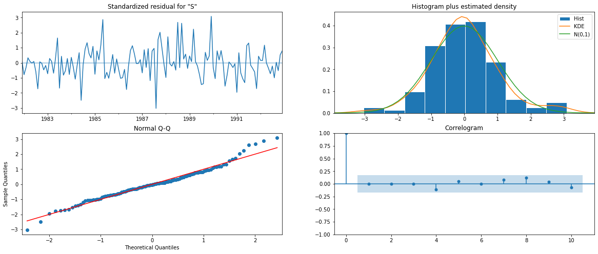
    


```python
predicted_auto_SARIMA = results_auto_SARIMA.get_forecast(steps=len(test))
```


```python
predicted_auto_SARIMA.summary_frame(alpha=0.05).head()
```


<div>
<style scoped>
    .dataframe tbody tr th:only-of-type {
        vertical-align: middle;
    }

    .dataframe tbody tr th {
        vertical-align: top;
    }

    .dataframe thead th {
        text-align: right;
    }
</style>
<table border="1" class="dataframe">
  <thead>
    <tr style="text-align: right;">
      <th>SoftDrinkProduction</th>
      <th>mean</th>
      <th>mean_se</th>
      <th>mean_ci_lower</th>
      <th>mean_ci_upper</th>
    </tr>
  </thead>
  <tbody>
    <tr>
      <th>1993-01-01</th>
      <td>2364.822492</td>
      <td>293.903582</td>
      <td>1788.782056</td>
      <td>2940.862928</td>
    </tr>
    <tr>
      <th>1993-02-01</th>
      <td>3183.738896</td>
      <td>297.390810</td>
      <td>2600.863619</td>
      <td>3766.614174</td>
    </tr>
    <tr>
      <th>1993-03-01</th>
      <td>3456.414668</td>
      <td>299.349625</td>
      <td>2869.700184</td>
      <td>4043.129153</td>
    </tr>
    <tr>
      <th>1993-04-01</th>
      <td>2914.336703</td>
      <td>309.533731</td>
      <td>2307.661738</td>
      <td>3521.011668</td>
    </tr>
    <tr>
      <th>1993-05-01</th>
      <td>3022.912788</td>
      <td>317.156678</td>
      <td>2401.297121</td>
      <td>3644.528455</td>
    </tr>
  </tbody>
</table>
</div>


```python
rmse1 = mean_squared_error(test['SoftDrinkProduction'],predicted_auto_SARIMA.predicted_mean,squared=False)
print('RMSE:',rmse1)
```

    RMSE: 601.7657096065248


```python
plot_acf(df2['SoftDrinkProduction'].diff().dropna(),lags=50,title='Differenced Data Autocorrelation')
plot_pacf(df2['SoftDrinkProduction'].diff().dropna(),lags=50,title='Differenced Data Patial Autocorrelation')
plt.show()
```

    /Users/swanandmarathe/opt/anaconda3/lib/python3.9/site-packages/statsmodels/graphics/tsaplots.py:348: FutureWarning: The default method 'yw' can produce PACF values outside of the [-1,1] interval. After 0.13, the default will change tounadjusted Yule-Walker ('ywm'). You can use this method now by setting method='ywm'.
      warnings.warn(


    

    


    
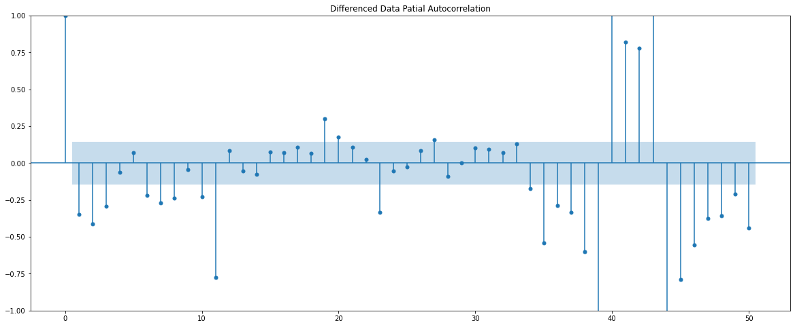
    


```python
df2.plot()
plt.grid();
```


    

    


```python
(df2['SoftDrinkProduction'].diff(6)).plot()
plt.grid();
```


    
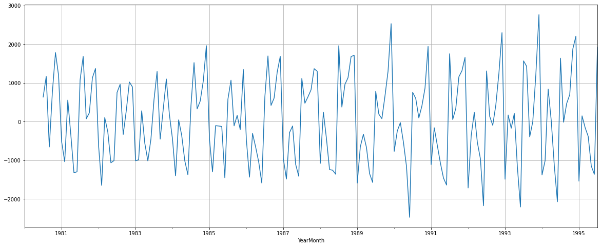
    


```python
test_stationarity((train['SoftDrinkProduction'].diff(6).dropna()).diff(1).dropna())
```


    
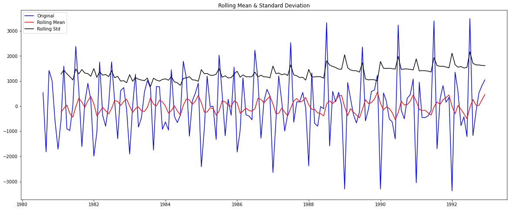
    


    Results of Dickey-Fuller Test:
    Test Statistic                -7.980548e+00
    p-value                        2.630576e-12
    #Lags Used                     1.200000e+01
    Number of Observations Used    1.360000e+02
    Critical Value (1%)           -3.479372e+00
    Critical Value (5%)           -2.883037e+00
    Critical Value (10%)          -2.578234e+00
    dtype: float64 
    


```python
plot_acf((df2['SoftDrinkProduction'].diff(6).dropna()).diff(1).dropna(),lags=30)
plot_pacf((df2['SoftDrinkProduction'].diff(6).dropna()).diff(1).dropna(),lags=30);
```

    /Users/swanandmarathe/opt/anaconda3/lib/python3.9/site-packages/statsmodels/graphics/tsaplots.py:348: FutureWarning: The default method 'yw' can produce PACF values outside of the [-1,1] interval. After 0.13, the default will change tounadjusted Yule-Walker ('ywm'). You can use this method now by setting method='ywm'.
      warnings.warn(


    
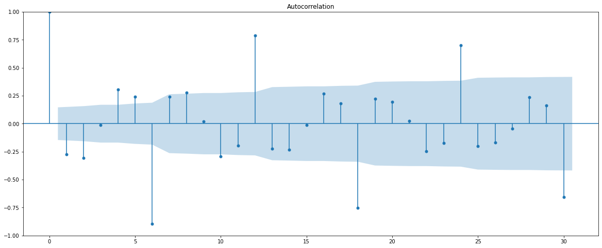
    


    
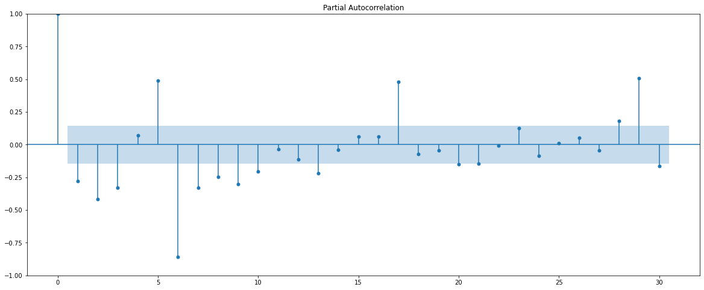
    


```python
import statsmodels.api as sm

manual_SARIMA_6 = sm.tsa.statespace.SARIMAX(train['SoftDrinkProduction'].values,
                                order=(0, 1, 0),
                                seasonal_order=(1, 1, 3, 6),
                                enforce_stationarity=False,
                                enforce_invertibility=False)
results_manual_SARIMA_6 = manual_SARIMA_6.fit(maxiter=1000)
print(results_manual_SARIMA_6.summary())
```

     This problem is unconstrained.


    RUNNING THE L-BFGS-B CODE
    
               * * *
    
    Machine precision = 2.220D-16
     N =            5     M =           10
    
    At X0         0 variables are exactly at the bounds
    
    At iterate    0    f=  6.22838D+00    |proj g|=  1.33466D-01
    
    At iterate    5    f=  6.21028D+00    |proj g|=  4.97916D-02
    
    At iterate   10    f=  6.20979D+00    |proj g|=  3.79790D-04
    
    At iterate   15    f=  6.20977D+00    |proj g|=  3.97956D-03
    
    At iterate   20    f=  6.20718D+00    |proj g|=  7.99633D-02
    
    At iterate   25    f=  6.19914D+00    |proj g|=  1.65276D-02
    
    At iterate   30    f=  6.19906D+00    |proj g|=  7.52811D-06
    
               * * *
    
    Tit   = total number of iterations
    Tnf   = total number of function evaluations
    Tnint = total number of segments explored during Cauchy searches
    Skip  = number of BFGS updates skipped
    Nact  = number of active bounds at final generalized Cauchy point
    Projg = norm of the final projected gradient
    F     = final function value
    
               * * *
    
       N    Tit     Tnf  Tnint  Skip  Nact     Projg        F
        5     30     35      1     0     0   7.528D-06   6.199D+00
      F =   6.1990641600362659     
    
    CONVERGENCE: NORM_OF_PROJECTED_GRADIENT_<=_PGTOL            
                                             SARIMAX Results                                         
    =================================================================================================
    Dep. Variable:                                         y   No. Observations:                  156
    Model:             SARIMAX(0, 1, 0)x(1, 1, [1, 2, 3], 6)   Log Likelihood                -967.054
    Date:                                   Sun, 09 Apr 2023   AIC                           1944.108
    Time:                                           18:15:44   BIC                           1958.446
    Sample:                                                0   HQIC                          1949.934
                                                       - 156                                         
    Covariance Type:                                     opg                                         
    ==============================================================================
                     coef    std err          z      P>|z|      [0.025      0.975]
    ------------------------------------------------------------------------------
    ar.S.L6       -0.9978      0.020    -49.380      0.000      -1.037      -0.958
    ma.S.L6       -0.1314      0.089     -1.474      0.140      -0.306       0.043
    ma.S.L12      -0.5606      0.076     -7.374      0.000      -0.710      -0.412
    ma.S.L18       0.0010      0.091      0.011      0.991      -0.178       0.180
    sigma2      1.665e+05   1.85e+04      9.023      0.000     1.3e+05    2.03e+05
    ===================================================================================
    Ljung-Box (L1) (Q):                  21.81   Jarque-Bera (JB):                 2.23
    Prob(Q):                              0.00   Prob(JB):                         0.33
    Heteroskedasticity (H):               0.99   Skew:                             0.03
    Prob(H) (two-sided):                  0.96   Kurtosis:                         3.64
    ===================================================================================
    
    Warnings:
    [1] Covariance matrix calculated using the outer product of gradients (complex-step).


```python
results_manual_SARIMA_6.plot_diagnostics()
plt.show()
```


    
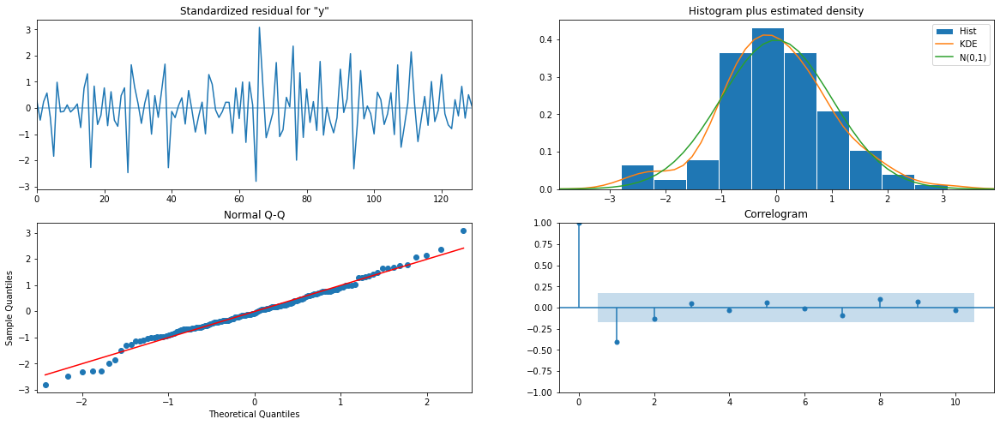
    


```python
predicted_manual_SARIMA_6 = results_manual_SARIMA_6.get_forecast(steps=len(test))
```


```python
predicted_manual_SARIMA_6.summary_frame(alpha=0.05).head()
```


<div>
<style scoped>
    .dataframe tbody tr th:only-of-type {
        vertical-align: middle;
    }

    .dataframe tbody tr th {
        vertical-align: top;
    }

    .dataframe thead th {
        text-align: right;
    }
</style>
<table border="1" class="dataframe">
  <thead>
    <tr style="text-align: right;">
      <th>y</th>
      <th>mean</th>
      <th>mean_se</th>
      <th>mean_ci_lower</th>
      <th>mean_ci_upper</th>
    </tr>
  </thead>
  <tbody>
    <tr>
      <th>0</th>
      <td>2486.695776</td>
      <td>408.080437</td>
      <td>1686.872816</td>
      <td>3286.518736</td>
    </tr>
    <tr>
      <th>1</th>
      <td>3221.206941</td>
      <td>577.111973</td>
      <td>2090.088259</td>
      <td>4352.325623</td>
    </tr>
    <tr>
      <th>2</th>
      <td>3504.701177</td>
      <td>706.814555</td>
      <td>2119.370106</td>
      <td>4890.032249</td>
    </tr>
    <tr>
      <th>3</th>
      <td>3053.061316</td>
      <td>816.158931</td>
      <td>1453.419204</td>
      <td>4652.703427</td>
    </tr>
    <tr>
      <th>4</th>
      <td>3187.055486</td>
      <td>912.493281</td>
      <td>1398.601519</td>
      <td>4975.509452</td>
    </tr>
  </tbody>
</table>
</div>


```python
rmse2 = mean_squared_error(test['SoftDrinkProduction'],predicted_manual_SARIMA_6.predicted_mean,squared=False)
print(rmse2)
```

    521.358228356771


```python
resultsDf = pd.DataFrame({'RMSE': [rmse1]}
                           ,index=['SARIMA(3,1,3)(2,0,3,6)'])

resultsDf
```


<div>
<style scoped>
    .dataframe tbody tr th:only-of-type {
        vertical-align: middle;
    }

    .dataframe tbody tr th {
        vertical-align: top;
    }

    .dataframe thead th {
        text-align: right;
    }
</style>
<table border="1" class="dataframe">
  <thead>
    <tr style="text-align: right;">
      <th></th>
      <th>RMSE</th>
    </tr>
  </thead>
  <tbody>
    <tr>
      <th>SARIMA(3,1,3)(2,0,3,6)</th>
      <td>601.76571</td>
    </tr>
  </tbody>
</table>
</div>


```python
resultsDf2 = pd.DataFrame({'RMSE': [rmse2]}
                           ,index=['SARIMA2(1,0,1)(1,1,3,6)'])

resultsDf = pd.concat([resultsDf,resultsDf2])

resultsDf
```


<div>
<style scoped>
    .dataframe tbody tr th:only-of-type {
        vertical-align: middle;
    }

    .dataframe tbody tr th {
        vertical-align: top;
    }

    .dataframe thead th {
        text-align: right;
    }
</style>
<table border="1" class="dataframe">
  <thead>
    <tr style="text-align: right;">
      <th></th>
      <th>RMSE</th>
    </tr>
  </thead>
  <tbody>
    <tr>
      <th>SARIMA(3,1,3)(2,0,3,6)</th>
      <td>601.765710</td>
    </tr>
    <tr>
      <th>SARIMA2(1,0,1)(1,1,3,6)</th>
      <td>521.358228</td>
    </tr>
  </tbody>
</table>
</div>


```python
predicted_manual_SARIMA_6_full_data = results_manual_SARIMA_6.get_forecast(steps=12)
```


```python
predicted_manual_SARIMA_6_full_data.summary_frame(alpha=0.05).head()
```


<div>
<style scoped>
    .dataframe tbody tr th:only-of-type {
        vertical-align: middle;
    }

    .dataframe tbody tr th {
        vertical-align: top;
    }

    .dataframe thead th {
        text-align: right;
    }
</style>
<table border="1" class="dataframe">
  <thead>
    <tr style="text-align: right;">
      <th>y</th>
      <th>mean</th>
      <th>mean_se</th>
      <th>mean_ci_lower</th>
      <th>mean_ci_upper</th>
    </tr>
  </thead>
  <tbody>
    <tr>
      <th>0</th>
      <td>2486.695776</td>
      <td>408.080437</td>
      <td>1686.872816</td>
      <td>3286.518736</td>
    </tr>
    <tr>
      <th>1</th>
      <td>3221.206941</td>
      <td>577.111973</td>
      <td>2090.088259</td>
      <td>4352.325623</td>
    </tr>
    <tr>
      <th>2</th>
      <td>3504.701177</td>
      <td>706.814555</td>
      <td>2119.370106</td>
      <td>4890.032249</td>
    </tr>
    <tr>
      <th>3</th>
      <td>3053.061316</td>
      <td>816.158931</td>
      <td>1453.419204</td>
      <td>4652.703427</td>
    </tr>
    <tr>
      <th>4</th>
      <td>3187.055486</td>
      <td>912.493281</td>
      <td>1398.601519</td>
      <td>4975.509452</td>
    </tr>
  </tbody>
</table>
</div>


```python

```


```python
pred_full_manual_SARIMA_date = predicted_manual_SARIMA_6_full_data.summary_frame(alpha=0.05).set_index(pd.date_range(start='1995-08-01',end='1996-07-31', freq='M'))
```


```python
# plot the forecast along with the confidence band

axis = df2['SoftDrinkProduction'].plot(label='Observed')
pred_full_manual_SARIMA_date['mean'].plot(ax=axis, label='Forecast', alpha=0.7)
axis.fill_between(pred_full_manual_SARIMA_date.index, pred_full_manual_SARIMA_date['mean_ci_lower'], 
                  pred_full_manual_SARIMA_date['mean_ci_upper'], color='k', alpha=.15)
axis.set_xlabel('Year-Months')
axis.set_ylabel('SoftDrinkProduction')
plt.legend(loc='best')
plt.show()
```


    
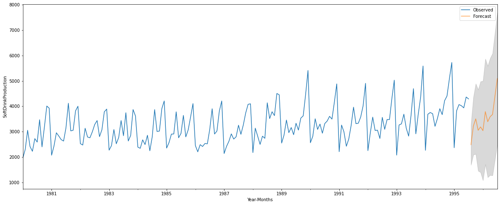
    


```python

```
